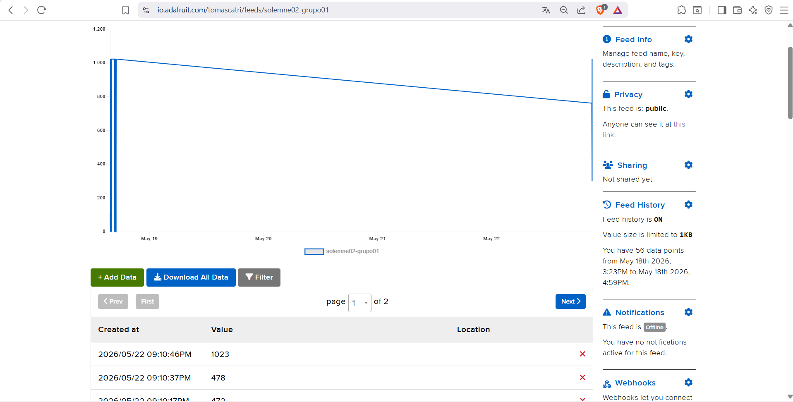

# solemne-02

## Integrantes

- Antonella Aguilar / antokiaraa
- Tomas Catrileo / tomascatri
- Angel Sabogal / angel-udp

## Descripción textual del proyecto

Nuestro proyecto consiste en enviar información entre 2 microcontroladores a través de WiFi, estando separados físicamente. 

Para esto usamos una Raspberry Pi Pico 2 W como la placa emisora y un Arduino Uno R4 WiFi como placa receptora. 
La Raspberry lee los valores de un potenciómetro conectado mediante una protoboard y sube esa información a la nube utilizando Adafruit IO. 
Por otro lado el Arduino lee el feed de datos creado en la nube y según el valor que reciba, mueve un servomotor en distintos ángulos. 

Para poder controlar el envío de información y no saturar la nube, cuenta con un botón pulsador conectado a la Raspberry permitiendo que solo se envíen los datos pulsando brevemente el botón, Arduino lo recibe y mueve el servomotor al último dato enviado.

A la Raspberry le sumamos una pantalla OLED de 128x64 px para poder ver los datos que vamos enviando en tiempo real, en la pantalla se muestran los cambios que se realizan con el potenciometro, tambien se añadio la medición que va de 0 a 180 en base a los ángulos, se añadió de referencia a un gato espacial que se mueve con el potenciómetro.

## Materiales usados

- Protoboard
- Arduino Uno R4 WIFI
- Raspberry Pi Pico 2 W
- Cable USB a Micro-USB
- Cable USB a tipo C
- Cables dupont
- Potenciómetro 100K
- Pantalla OLED 128x84 px
- Botón pulsador
- Servomotor

## Sensor usado

- Potenciómetro (100K): Resistencia variable que cambia su valor interno cuando giramos la perilla.
  - Lo utilizamos para captar la posición en la que queremos mover el servomotor, envía los  datos mediante la Raspberry hacia Adafruit IO.

## Actuador usado

- Servomotor: Motor pequeño que puede moverse y quedarse fijo en un ángulo entre 0° y 180°.
  - Utilizado en el Arduino Uno para realizar un movimiento en un ángulo exacto dependiendo del valor recibido desde Adafruit IO.

- Pantalla OLED 128x64 px: Pantalla pequeña que sirve para mostrar textos, números o gráficos simples programados desde el microcontrolador. 
  - Es el monitor del proyecto, utilizada para mostrar la información recibida del potenciómetro y el ángulo en el que moveremos el servo que se enviará a través de Adafruit IO, permitiendo saber en tiempo real los datos que vamos enviando a la nube. 

## Proceso y errores

En el proceso es importante tener cuidado en los pequeños detalles ya que si no se les da la importancia necesaria puede no funcionar el proyecto, como en nuestro caso que tuvimos un fallo al conectar mal los jumpers con los pines de la Raspberry Pi Pico 2 W y eso daba un error desconocido en la pantalla del código que, con la ayuda de la IA y fijándonos mejor dónde debía conectarse cada cable, pudimos solucionar esto en la parte de la protoboard que tiene las conexiones del sensor.

Durante el desarrollo del proyecto alimentamos el circuito utilizando los mismos computadores al conectar los microcontroladores mediante USB. Uno de los puntos importantes fue el uso de WiFi compartido desde un celular, ya que gracias a eso pudimos mantener conectadas ambas placas a la nube.

Era importante no alejarse demasiado del circuito para evitar perder señal y que la información pudiera seguir enviándose correctamente.


Uno de los detalles que encontramos fue que el servomotor no realizaba una vuelta completa y, para apreciar mejor el recorrido, era necesario girar la perilla del potenciómetro desde un extremo hasta el otro completamente.

Pensamos que la velocidad en la que se movía dependía del potenciómetro y cambiamos el de 10k por uno de 100k. El cambio no generó una gran diferencia en el movimiento del servomotor, pero sí ayudó a mantener una conexión más firme y cómoda, ya que el nuevo potenciómetro se ajustaba mejor a la protoboard (no bailaba el potenciómetro).

La comunicación entre los microcontroladores funcionó en tiempo real después de pulsar el botón, aunque existía un pequeño retraso mecánico en la reacción del servomotor. Además, para que la información se enviara correctamente y se generara el movimiento, era necesario mantener el botón presionado durante el envío de datos.

La pantalla OLED muestra en tiempo real la información de hacia dónde se mueve el servomotor, además de indicar la posición a la que acaba de girar. También tiene una imagen que acompaña visualmente la dirección del movimiento realizado, mostrando lo que ocurre al hacer el giro de perilla.

En caso de que el internet se desconecte o la nube deje de responder, el sistema deja de registrar datos, por lo que no se producen movimientos en el servomotor ni actualizaciones en la pantalla OLED.

Para el proceso del código se usó VS Code, para simulaciones de cómo se vería el gato rotando. En el camino descubrimos que existen 2 formas de poner una imagen en la pantalla usando el rasberry, la primera sería ponerlo en la placa directamente como archivo .bmp el cual es un formato de bits o de 0 y 1, también hay un formato llamado Bytearray, el cual es una secuencia modificables de bytes, se usan valores de 0 y 255 o en otras palabras, ceros y unos, se uso esta pagina para convertir la imagen <https://javl.github.io/image2cpp/>

Tras investigar y probar cual era la mejor opción, usamos el segundo ya que si queríamos que rotará de manera mas fluida necesitamos que estuviera dentro del codigo, asi cada vez que rotaba no tenía que llamar al archivo dentro de la raíz del raspberry, para realizar la rotación, para esto le pedimos a la ia que nos ayudará para que hiciera los cálculos y el código, para hacerlo se le pidió que tomara de punto base el ángulo 0 y que en este el gato este acostado hacia la izquierda, para derecha lo contrario, 180 y acostado a la derecha, está hecho de manera que en 90, el gatito se encuentre parado también se aplico que su punto de rotación estuviera en el centro.  

Debido a que el gato se veía con bajos FPS (frames por segundo o "va pegado"), se usó un lienzo de 54x54 en donde se realizaría todo este movimiento. A su vez, creó un caché local para que no busque tan repetitivamente por la RAM, la RAM en un almacenamiento aparte que se usa en tiempo real. En nuestro caso, lo usamos para guardar la imagen ahí y llamarla cada que se haga el cálculo de rotación.

Para el Arduino también se usó IA para el código, pero tomando de referencia el trabajo hecho por el profesor con el servo, se usó para el recibimiento de la información del feed. En este caso no tuvimos problemas graves, solo nos faltó descargar la biblioteca Adafruit MQTT Library.

## Código usado para enviar

```cpp 
# Código hecho usando de base el código de Mateo y del profesor, con ayuda de Gemini para implementar componentes y uso de pantalla OLED.
# Se usó un archivo diferente para los codigo y acceso al WiFi

import time
import os
import board
import digitalio
import analogio
import bitbangio
import math
import wifi
import socketpool
import ssl
import adafruit_ssd1306
import adafruit_minimqtt.adafruit_minimqtt as MQTT
from adafruit_io.adafruit_io import IO_MQTT

FEED_KEY = "solemne02-grupo01"

# Configuración de la Pantalla OLED
i2c = bitbangio.I2C(board.GP27, board.GP26)
oled = adafruit_ssd1306.SSD1306_I2C(128, 64, i2c)

# Configuración de Componentes Físicos
button = digitalio.DigitalInOut(board.GP15)
button.direction = digitalio.Direction.INPUT
button.pull = digitalio.Pull.UP

pot = analogio.AnalogIn(board.GP28)

# Indicador LED de la placa para mostrar actividad de envío MQTT.
led = digitalio.DigitalInOut(board.LED)
led.direction = digitalio.Direction.OUTPUT

# Escribe en la consola para confirmar que el programa ha arrancado y que esté conectándose al WiFi.
print("Conectando a WiFi...")

# Si se conecta a la red WiFi, imprime "WiFi conectado" en la consola. Si no, muestra un error y termina el programa.
wifi.radio.connect(os.getenv("CIRCUITPY_WIFI_SSID"), os.getenv("CIRCUITPY_WIFI_PASSWORD"))
print("WiFi conectado")

# Configuración de MQTT para Adafruit IO
pool = socketpool.SocketPool(wifi.radio)
mqtt_client = MQTT.MQTT(
    broker="io.adafruit.com",
    username=os.getenv("ADAFRUIT_AIO_USERNAME"),
    password=os.getenv("ADAFRUIT_AIO_KEY"),
    socket_pool=pool,
    ssl_context=ssl.create_default_context(),
)
io = IO_MQTT(mqtt_client)
print("Conectando a Adafruit IO...")
io.connect()
print("Conectado a Adafruit IO")

# Foto del gato convertida en bytearray
WIDTH_GATO = 33
HEIGHT_GATO = 41
ROW_BYTES = 5  

GATO_BYTES = bytearray([
    0x00, 0x00, 0x07, 0xe0, 0x00, 0x00, 0x00, 0x1c, 0x3c, 0x00, 0x00, 0x00,
    0x30, 0x06, 0x00, 0x00, 0x00, 0xe0, 0x03, 0x00, 0x00, 0x00, 0x80, 0x01,
    0x00, 0x00, 0x00, 0x90, 0x81, 0x80, 0x00, 0x01, 0x98, 0xc0, 0x80, 0x00,
    0x01, 0x1c, 0xe0, 0x80, 0x00, 0x01, 0x1f, 0xf0, 0x80, 0x00, 0x01, 0x3f,
    0xf0, 0x80, 0x00, 0x01, 0x3b, 0xb8, 0x80, 0x00, 0x01, 0xbb, 0xb8, 0x80,
    0x00, 0x00, 0xbe, 0xf9, 0x80, 0x00, 0x00, 0xbd, 0x79, 0x00, 0x00, 0x01,
    0xbf, 0xf3, 0x00, 0x00, 0x03, 0xdf, 0xe6, 0x00, 0x00, 0x03, 0xe7, 0x1c,
    0x00, 0x00, 0x07, 0xf0, 0xf0, 0x00, 0x00, 0x0f, 0xdf, 0x80, 0x00, 0x00,
    0x0f, 0xef, 0xe0, 0x00, 0x00, 0x1e, 0xf7, 0xf0, 0x00, 0x00, 0x1e, 0x76,
    0x70, 0x00, 0x00, 0x1f, 0xb6, 0x70, 0x00, 0x00, 0x1f, 0xb7, 0x60, 0x00,
    0x00, 0x1f, 0xcf, 0x00, 0x00, 0x00, 0x1f, 0xff, 0x00, 0x00, 0x7c, 0x1f,
    0xff, 0x80, 0x00, 0x7e, 0x1f, 0xff, 0xc0, 0x00, 0xfe, 0x0f, 0xff, 0xc0,
    0x00, 0xf6, 0x0f, 0xff, 0xc0, 0x00, 0xe0, 0x0f, 0xff, 0xc0, 0x00, 0xe0,
    0x1f, 0xfb, 0xc0, 0x00, 0xf0, 0x1f, 0xfb, 0xf0, 0x00, 0x78, 0x3f, 0xf9,
    0xf0, 0x00, 0x7f, 0xf9, 0xf8, 0x00, 0x00, 0x3f, 0xf1, 0xf8, 0x00, 0x00,
    0x0f, 0xe0, 0xf8, 0x00, 0x00, 0x00, 0x00, 0x78, 0x00, 0x00, 0x00, 0x00,
    0x38, 0x00, 0x00, 0x00, 0x00, 0x1c, 0x00, 0x00, 0x00, 0x00, 0x0c, 0x00,
    0x00
])

# Función que rota la imagen del gato y la dibuja en la pantalla OLED
def rotar_y_dibujar_gato(angulo_servo, x_destino, y_destino):
    t = 90 - angulo_servo
    angulo_rad = math.radians(t)
    cos_a = math.cos(angulo_rad)
    sin_a = math.sin(angulo_rad)
    
    cx_orig = WIDTH_GATO / 2
    cy_orig = HEIGHT_GATO / 2

    # Reducción del tamaño a 54x54
    DEST_SIZE = 54
    cx_dest = DEST_SIZE / 2
    cy_dest = DEST_SIZE / 2
    
    # Caché local de la función (Evita búsquedas repetitivas en RAM)
    pintar_pixel = oled.pixel
    
    for yd in range(DEST_SIZE):
        ty = yd - cy_dest
        # Precalculamos la parte de la ecuación que depende solo de Y para liberar el bucle interno
        ys_part = ty * cos_a + cy_orig
        xs_part = ty * sin_a + cx_orig
        
        for xd in range(DEST_SIZE):
            tx = xd - cx_dest
            
            xs = int(tx * cos_a + xs_part)
            ys = int(-tx * sin_a + ys_part)
            
            if 0 <= xs < WIDTH_GATO and 0 <= ys < HEIGHT_GATO:
                byte_idx = ys * ROW_BYTES + (xs // 8)
                bit_idx = 7 - (xs % 8)
                
                if (GATO_BYTES[byte_idx] >> bit_idx) & 1:
                    pintar_pixel(xd + x_destino, yd + y_destino, 1)

def actualizar_pantalla(val_pot, angulo, transmitiendo=False):
    oled.fill(0)
    
    # Desplazamos levemente el lienzo de 54x54 para que no tape los textos
    rotar_y_dibujar_gato(angulo, 4, 5)
    
    oled.text(f"POT: {val_pot}", 68, 4, 1)
    oled.text(f"ANG: {angulo}", 68, 16, 1)
    
    if transmitiendo:
        oled.text("ENVIADO!", 68, 32, 1)
        
    oled.show()

last_button_state = True
ultimo_angulo = -1  # Para comparar cambios

while True:
    try:
        io.loop()
    except (OSError, Exception):
        try:
            io.connect()
        except Exception:
            pass

    val_pot = pot.value * 1023 // 65535
    angulo_servo = val_pot * 180 // 1023

    current_state = button.value

    # Control del botón e indicador físico
    if last_button_state == True and current_state == False:
        print(f"MQTT Activo: {val_pot}")
        actualizar_pantalla(val_pot, angulo_servo, transmitiendo=True)

        try:
            io.publish(FEED_KEY, str(val_pot))
        except Exception:
            pass

        led.value = True
        time.sleep(0.2)
        led.value = False
        time.sleep(0.3)
    else:
        # Renderizar solo si el potenciómetro realmente se movió
        if angulo_servo != ultimo_angulo:
            actualizar_pantalla(val_pot, angulo_servo, transmitiendo=False)
            ultimo_angulo = angulo_servo

    last_button_state = current_state
    time.sleep(0.005)  # Tiempo de espera reducido para una respuesta táctil más veloz
```

## Código usado para recibir

```cpp
// Código inspirado en el de mateo que hizo con el botón para arduino

// -------------------------
// Importar bibliotecas
// -------------------------

#include <WiFiS3.h>               // Biblioteca nativa para el módulo WiFi del Arduino UNO R4
#include "Adafruit_MQTT.h"        // Biblioteca base de Adafruit para el protocolo MQTT
#include "Adafruit_MQTT_Client.h" // Cliente que gestiona la conexión de datos con el servidor
#include <Servo.h>                // Biblioteca para el control del servo motor SG90


// -------------------------
// Datos de configuración (WiFi y Adafruit IO)
// -------------------------

// Nombre de tu red WiFi local
#define WLAN_SSID       "wenakiara"

// Contraseña de tu red WiFi
#define WLAN_PASS       "tomas123"

// Servidor MQTT de la plataforma Adafruit IO
#define AIO_SERVER      "io.adafruit.com"

// Puerto estándar para conexiones MQTT inseguras
#define AIO_SERVERPORT  1883

// Tu nombre de usuario de Adafruit IO
#define AIO_USERNAME    "tomascatri"

// Tu clave secreta AIO KEY de Adafruit IO
#define AIO_KEY         "blep"


// -------------------------
// Creación de objetos y suscripciones
// -------------------------

// Instancia del cliente WiFi nativo
WiFiClient client;

// Configuración del cliente MQTT amarrado al cliente WiFi y los datos del servidor
Adafruit_MQTT_Client mqtt(&client, AIO_SERVER, AIO_SERVERPORT, AIO_USERNAME, AIO_KEY);

// Configuración de la suscripción al feed específico (Ruta: usuario/feeds/nombre-del-feed)
// Este feed debe llamarse EXACTAMENTE igual al definido en la Raspberry Pi Pico
Adafruit_MQTT_Subscribe grupo_feed = Adafruit_MQTT_Subscribe(&mqtt, AIO_USERNAME "/feeds/solemne02-grupo01");

// Instancia para controlar el servo motor físico
Servo myservo;

// Pin digital con soporte PWM donde se conecta el cable naranja de señal del servo
const int servoPin = 9;


// -------------------------
// Declaración de funciones
// -------------------------

// Avisamos al compilador que abajo existe la función encargada de conectar/reconectar MQTT
void MQTT_connect();


// -------------------------
// Setup: Configuración inicial (se ejecuta una sola vez)
// -------------------------

void setup() {
  // Iniciar la comunicación con el monitor serial a 115200 baudios
  Serial.begin(115200);
  
  // Asociar el objeto del servo al pin físico número 9
  myservo.attach(servoPin);

  // --- Proceso de conexión a la red WiFi ---
  Serial.print("Conectando a WiFi...");
  WiFi.begin(WLAN_SSID, WLAN_PASS);
  
  // Bucle de espera: se mantiene aquí hasta que el estado del WiFi sea "conectado"
  while (WiFi.status() != WL_CONNECTED) {
    delay(500);
    Serial.print("."); // Imprime puntos suspensivos mientras conecta
  }
  Serial.println(" ¡Conectado!");

  // Activar la escucha de datos registrando la suscripción en el cliente MQTT
  mqtt.subscribe(&grupo_feed);
}


// -------------------------
// Loop principal: Ejecución continua
// -------------------------

void loop() {
  // Verificar que la conexión a MQTT siga viva; si se cayó, se reconecta automáticamente
  MQTT_connect();

  // Crear un puntero para almacenar de forma temporal la suscripción entrante
  Adafruit_MQTT_Subscribe *subscription; 
  
  // Leer si llegó algún mensaje en un rango de 5 segundos (5000ms)
  while ((subscription = mqtt.readSubscription(5000))) {
    
    // Si el mensaje que llegó pertenece específicamente a nuestro feed del grupo
    if (subscription == &grupo_feed) {
      
      // Imprimir el mensaje crudo en texto que mandó la Pico W
      Serial.print(F("Dato recibido de la Pico: "));
      Serial.println((char *)grupo_feed.lastread);
      
      // OPTIMIZACIÓN Y CONVERSIÓN:
      // Convertir el arreglo de caracteres de texto a un número entero funcional (rango 0 - 1023)
      int potValue = atoi((char *)grupo_feed.lastread);
      
      // MAPEO MATEMÁTICO:
      // Transforma proporcionalmente el valor del potenciómetro (0-1023) al arco del servo (0-180 grados)
      int angulo = map(potValue, 0, 1023, 0, 180);
      
      // Mover físicamente los engranajes del servo motor al ángulo calculado
      myservo.write(angulo);
      
      // Confirmar la acción en el monitor serial para depuración
      Serial.print("Servo movido a: ");
      Serial.println(angulo);
    }
  }
}


// -------------------------
// Función de conexión y resiliencia MQTT
// -------------------------

void MQTT_connect() {
  int8_t ret;

  // Si el cliente ya se encuentra conectado con éxito, salir de la función de inmediato
  if (mqtt.connected()) return;

  Serial.print("Conectando a MQTT... ");
  
  // Bucle de reintento en caso de fallas de red
  while ((ret = mqtt.connect()) != 0) {
       // Mostrar el error específico en la consola de Arduino
       Serial.println(mqtt.connectErrorString(ret));
       Serial.println("Reintentando conexión en 5 segundos...");
       
       mqtt.disconnect(); // Desconectar de forma limpia antes de volver a intentar
       delay(5000);       // Pausa de seguridad para evitar saturar el servidor
  }
  
  Serial.println("¡MQTT Conectado!");
}
```

## Imágenes del proyecto




## Animaciones del proyecto


### gif's proceso


## Bibliografía

- Adafruit Learning System: Monochrome OLED breakouts. (s.f.). Adafruit Industries. <https://learn.adafruit.com/monochrome-oled-breakouts>
- Adafruit MQTT Library for Arduino. (2026). Arduino Reference Documentation. <https://docs.arduino.cc/libraries/adafruit-mqtt-library/>
- Arduino Documentation: Analog input. (s.f.). Arduino. <https://www.arduino.cc/en/Tutorial/AnalogInput>
- Javl (Github Community): image2cpp.  (s.f.). An open-source tool to change images into byte arrays for monochrome OLED displays. GitHub. <https://javl.github.io/image2cpp/>
- Microsoft: Visual Studio Code (VS Code. (2026). Code editing. Redefined. Microsoft Corporation. <https://code.visualstudio.com/>
- PuTTY Official Website. (s.f.). SSH and telnet client. Simon Tatham. <https://www.chiark.greenend.org.uk/~sgtatham/putty/latest.html>
- Raspberry Pi Documentation: Pico series. (s.f.). Raspberry Pi Ltd. <https://www.raspberrypi.com/documentation/microcontrollers/raspberry-pi-pico.html>
- Raspberry Pi Projects: Physical computing. (s.f.). Raspberry Pi Foundation. <https://projects.raspberrypi.org/>
