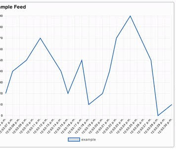
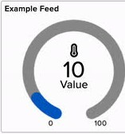
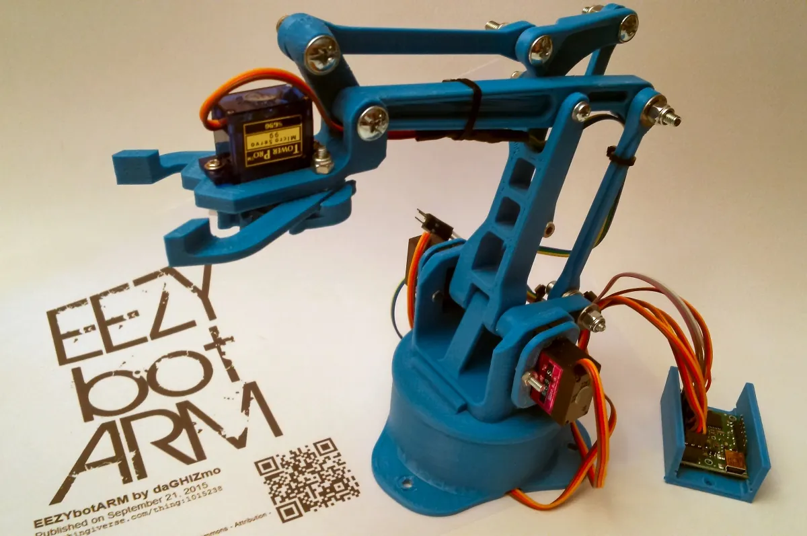

# investigaciones individuales

Antonella Aguilar / antokiaraa

## Sensor

### Sensor Ultrasónico de Distancia

Este sensor funciona mediante la ecolocalización, también se le llama "tiempo de vuelo" ya que se basa en medir cuánto tiempo tarda un sonido en viajar hacia un objeto y volver. El sensor tiene dos partes: un emisor (Trigger) que manda un pulso de sonido a 40 kHz y un receptor (Echo) que capta el eco.

kHz: kilohercios, la frecuencia que emite el ultrasónico es tan alta que el oído humano no la puede escuchar, nosotros podemos captar una vibración de hasta aproximadamente 20.000 veces por segundo (20kHz).

El microcontrolador cuenta en milisegundos lo que tardó la señal en ir y volver, y calcula la distancia exacta en centímetros.

### Problemas y filtrado de información

Un problema común es que el sonido puede rebotar mal y generar lecturas falsas, para evitar esto y que esta información que no sirve no sea enviada a la nube (Adafruit IO), se debe limpiar el dato prográmandolo dentro del código. Existen bibliotecas especializadas, para este sensor podemos usar NewPing que incluye una función llamada ping_median(5) la cual se encarga de tomar 5 lecturas rápidas, descarta los valores exageradamente altos o bajos y se queda solo con el valor del medio, logrando una medición mucho más estable.

### Visualización de datos

Para ver la información de la medición de distancias en Adafruit IO se puede usar un gráfico de líneas para ir viendo cómo cambia la distancia en el tiempo.

### Empresa que utiliza el sensor

El uso industrial de este sensor son los sistemas para estacionamientos desarrollados por empresas tecnológicas como ParkHelp. Ellos instalan su producto en el techo que cuenta con un sensor ultrasónico hacia el suelo de cada sitio de estacionamiento.
El sensor emite pulsos de sonido constantemente por lo que si el eco tarda mucho en volver, deduce que el sonido rebotó en el piso y enciende una luz LED verde para indicar que el estacionamiento está disponible, pero si el eco vuelve más rápido significa que rebotó en el techo de un auto que ingresó por lo que actualiza su estado y cambia la luz a rojo para indicar ocupado.

## Actuador

### Servomotor

Funciona mediante el control de posición, está diseñado para moverse hacia un ángulo específico entre 0° y 180°, y quedarse fijo en esa posición. En su interior tiene un pequeño motor y un circuito que lee las instrucciones.

El microcontrolador procesa los datos y envía una señal PWM.

PWM: Modulación por Ancho de Pulso. 

Es la técnica eléctrica que usa el microcontrolador para comunicarse con el servomotor. Consiste en enviar pulsos de electricidad, y la duración o ancho de ese pulso es lo que le indica al motor a qué ángulo debe moverse.

### Problemas y filtrado de información

Un problema es que ela información enviada desde el sensor no siempre coincide con los límites físicos del motor, para solucionar esto en el código se usa la biblioteca Servo.h y la función matemática map() que toma ese rango de valor y lo transforma proporcionalmente para que encaje en el rango del servo que es de 0 a 180 grados. 

### Visualización de datos

Para ver la información de la posición del motor en Adafruit IO se puede usar un bloque de medidor (gauge) que funciona visualmente como el velocímetro.

Al configurarlo, le podemos indicar que el valor mínimo es 0 y el máximo es 180, así a medida que el motor recibe la información y gira físicamente, podemos ver cómo se llena la barra indicando en tiempo real el grado exacto de rotación en el que se encuentra el servo.

### Proyecto que utiliza el actuador

Existe un proyecto de la comunidad tecnológica que me llamó la atención: el EEZYbotARM, es un brazo robot impreso en 3D de código abiertlo, el proyecto usa varios servomotores puestos en las uniones de las piezas para que hagan de articulaciones, funcionando como si fueran los hombros, los codos y la pinza del robot. El microcontrolador le manda las señales a cada motor para que cambien sus ángulos de forma coordinada. 

## Bibliografía

- Adafruit Industries. (s. f.). Adafruit IO Documentation. Adafruit Learning Systems. <https://learn.adafruit.com/adafruit-io>
- Arduino. (s. f.). Servo Library. Arduino Reference. <https://www.arduino.cc/reference/en/libraries/servo/>
- Eckel, T. (s. f.). NewPing Library for Arduino. Bitbucket. <https://bitbucket.org/teckel12/arduino-new-ping/wiki/Home>
- ParkHelp Technologies. (s. f.). Ultrasonic Parking Sensors. ParkHelp. <https://parkhelp.com/>
- Franciscone, C. (s. f.). EEZYbotARM. EEZYrobots. <http://www.eezyrobots.it/eba_01.html>

