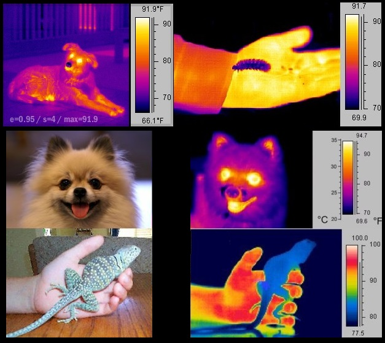
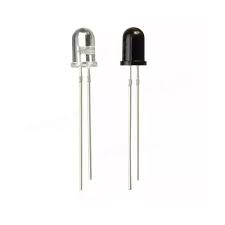
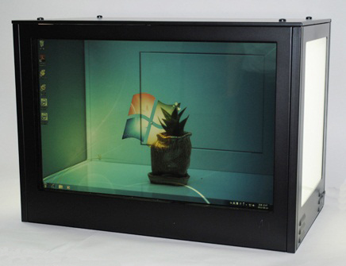
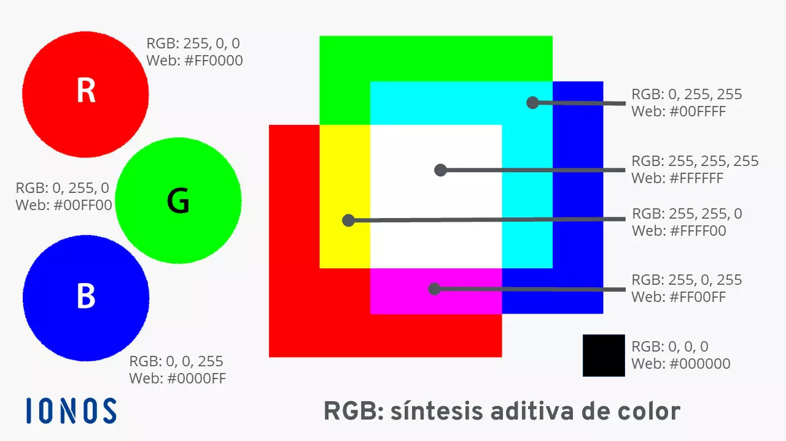

# investigaciones individuales

Tomas Catrileo / tomascatri

## Sensor
Para empezar, diciendo que este sensor lo tengo en la mira desde que empezamos haciendo sintetizadores en el taller de máquinas, siempre me llamó la atención cómo, sin nada de cables y nada visible al ojo humano, puede cambiar variables en el circuito al que esté conectado.

### Sobre lo que aprendí
Para empezar, diciendo que este sensor lo tengo en la mira desde que empezamos haciendo sintetizadores en el taller de máquinas, siempre me llamó la atención cómo, sin nada de cables y nada visible al ojo humano, puede cambiar variables en el circuito al que esté conectado.

### Sobre lo que aprendí
El sensor infrarrojo reacciona a la radiación de luz que está más allá del espectro visible humano, con eso me refería a nada visible (qué bacán). Existen 2 principales:
* Pasivos = Detectan el calor proveniente de los cuerpos que estén en movimiento.
* Activos = Reflectivos o de proximidad, tienen un led emisor y un fotodiodo (componente capaz de convertir la luz en corriente eléctrica) de receptor. Funciona de manera que el emisor dispara luz IR (radiación electromagnética que es invisible y que la percibimos con calor) y, si hay un objeto en frente, la luz rebota, haciendo que el receptor lo detecte.

### Filtrado de información
La luz solar y luces muy fuertes pueden afectar a la medición de este, es por eso que son de un color oscuro, así bloqueando la luz visible y dejando pasar solo la luz infrarroja.

Otra manera sería un filtrado por software, en donde el emisor parpadea a una frecuencia específica y el receptor está programado para ignorar cualquier luz que no parpadee a esa velocidad exacta.

### Visualización de datos
Los datos pueden variar de 2 formas: 
* De 0 a 1: ejemplo: 1 = OBJETO DETECTADO / 0 = NADA DETECTADO
* 0 a 1023: Mide la intensidad del rebote y, gracias a la gran cantidad de datos, se puede crear una gráfica más precisa.

### Problemas del sensor
* Se vuelve loco bajo el sol, ya que la luz solar satura el receptor, aunque se puede solucionar poniéndole, por así decirlo, algo que le dé sombra.
* No detecta objetos negros, ya que el negro absorbe todo tipo de luz en vez de reflejarla.

### Referente
El sistema o tecnología LIDAR (Detección y medición de luz) se usa mucho para escanear objetos para volverlos 3D, es un sistema que calcula cuánto tarda la luz en llegar y regresar a un objeto y con ello hace para mapear lo que tenga delante.

---

## Actuador
Siempre me gustó la idea de poder ver a través de las pantallas, como si fueran transparentes, los Meta Quest y toda la realidad virtual que deja ver el mundo real a través de lo virtual, simulan eso, entiendo que le llaman passthrough. Pero con una pantalla LCD transparente se puede hacer eso en la vida real y de manera óptica real.

### Sobre lo que aprendí
Para entender cómo funcionan las pantallas LCD y simplificando de alguna manera, se necesitan 3 cosas fundamentales para que funcionen, las cuales serían una corriente, la pantalla LCD y una luz que le dé por detrás para iluminar los cristales líquidos que, dependiendo de si necesitan más luz, dejan pasar esta a través de sí. Al aplicar voltaje, cambia la orientación para dejar pasar luz de fondo o atraparla por completo, si la atrapan completamente, no le llega luz y se vuelve negro. 

Ahora, esto aplicando al color funciona de manera RGB, por lo tanto, si se llama por el voltaje al píxel rojo, se abre su cristal y, si se llama al azul, pasa lo mismo, y así también con el verde, por lo que, ya teniendo a los 3 principales, se puede acceder a toda la gama de colores que ve un ser humano. Usualmente se desmontan monitores viejos para esto, ya que solo se necesita la lámina que filtra y modula los colores y no lo que le da luz.

### Filtrado de información
Dado que es una pantalla LCD, la información que maneja es RGB, con valores digitales para cada canal que van del 0 al 255. Por ejemplo, al enviar la señal RGB (0, 255, 0), se ordena que solo la compuerta del sub-píxel verde se abra por completo, mostrando ese color. En este sistema, el 0 representa el bloqueo total (negro) y el 255 la apertura máxima de color. En un LCD transparente, enviar la señal máxima en todos los canales RGB (255, 255, 255) generaría el color blanco en una pantalla común, sin embargo, al no tener la luz blanca fija detrás, el cristal simplemente se abre por completo, produciendo el efecto de transparencia pura.

### Visualización de datos
La visualización es de manera óptica y espacial, por lo que se pueden llegar a mostrar todo tipo de gráficas para esto, pero tomando en cuenta la transparencia que genera y cómo lo hace.

### Problemas del actuador
Usualmente, el problema que más enfrenta es la falta de luz de fondo, ya que esto, al depender de la luz, se puede ver muy tenue si no se llega a alimentar bien de luz. Se debe encontrar un balance entre lo que se percibe de fondo y la intensidad de la luz a poner.

### Referente

Un estudio creativo de San Francisco, California, diseñó una instalación interactiva utilizando pantallas transparentes, las cuales pusieron en una vidriera, que, al proyectar luz natural del día como fuente de iluminación para la pantalla, permite que sea visible. También integran sensores de movimiento, el sistema se convierte en una interfaz interactiva donde la pantalla puede reaccionar dinámicamente y genera animaciones basándose en la posición del espectador, la luminosidad del sol y el movimiento del entorno urbano.

[Ver el video en Vimeo](https://vimeo.com/241977160?fl=pl&fe=ti)

---

## Bibliografía

Choi, H., Kim, J. W., & Kim, Y. J. (2014). Transparent LCD display development and its application to smart showcases. *Journal of the Society for Information Display*, 22(4), 201-208.

HTC VIVE Blog. (2023). *What is VR Passthrough? Mixed Reality’s Secret Sauce*. http://blog.vive.com/us/what-is-vr-passthrough-mixed-realitys-secret-sauce/

IONOS Digital Guide. (2023). *¿Qué es el modelo de color RGB y cómo funciona en medios digitales?* https://www.ionos.com/es-us/digitalguide/paginas-web/diseno-web/colores-rgb/

MOM Design. (s.f.). *Interactive Architecture and Digital Windows Portfolio*. https://www.mom.design/

NASA / IPAC. (s.f.). *Infrared dog* [Termograma]. Cool Cosmos Image Galleries. Wikipedia.

Novatronic. (s.f.). *Led IR Infrarrojos Receptor Transmisor* [Fotografía]. Novatronic Ecuador.

Proyecto IDIS (Investigación en Diseño de Imagen y Sonido). (s.f.). *Transparent LCD*. Facultad de Arquitectura, Diseño y Urbanismo, Universidad de Buenos Aires. https://proyectoidis.org/transparent-lcd/
