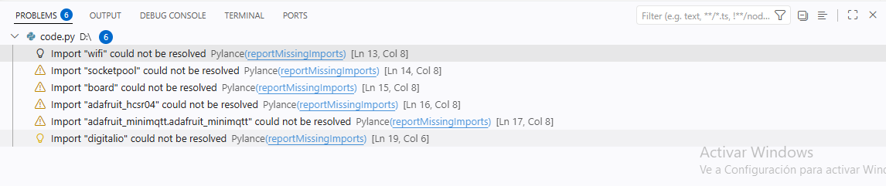
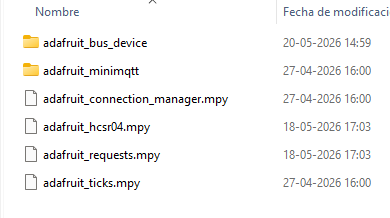
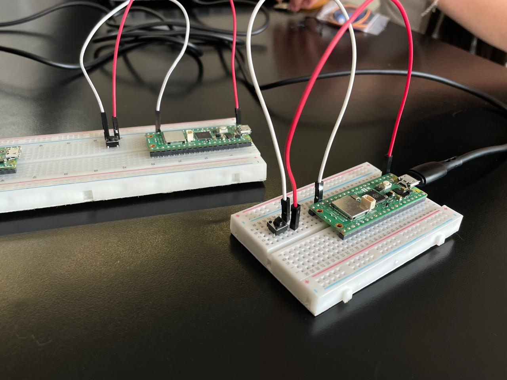
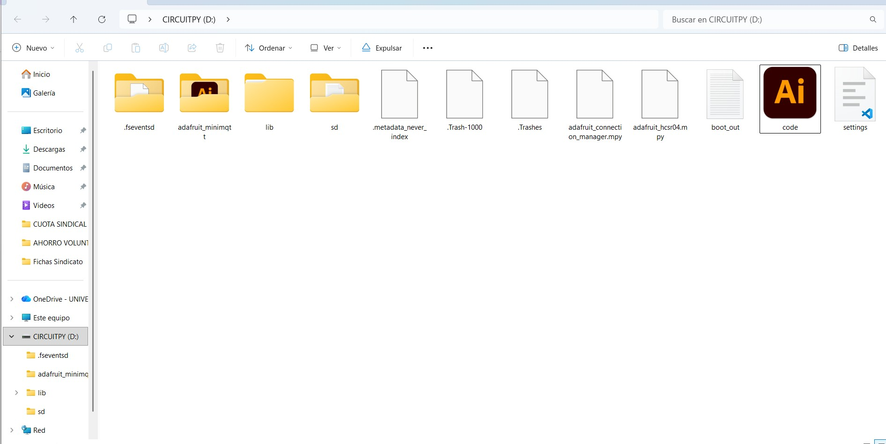
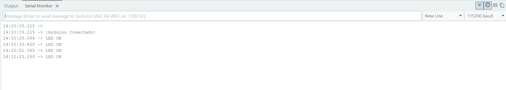
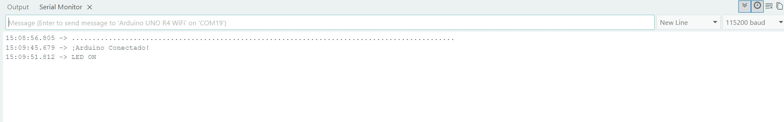
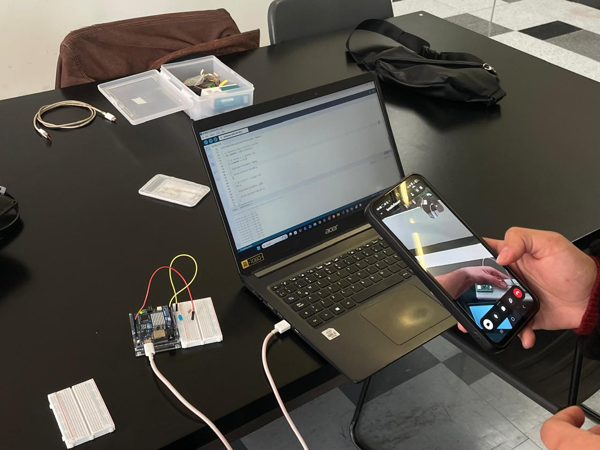

# solemne-02

## Integrantes
- Braulio Figueroa / github: [brauliofigueroa2001](https://github.com/brauliofigueroa2001)
- Luisa Toro / github: [Luisaatoro9](https://github.com/Luisaatoro9)
- Marlén Soto / github: [marlensoto-lab](https://github.com/marlensoto-lab)
- Marcela Zúñiga / github: [marcezm](https://github.com/marcezm)


## Descripción textual del proyecto Trabajo en clases 
Inicialmente, nuestro proyecto consistía en desarrollar un sistema IoT distribuido utilizando una Raspberry Pi, un Arduino UNO R4 WiFi, un sensor ultrasónico HC-SR04 y un micro servo motor SG90, conectados mediante la plataforma Adafruit IO utilizando el protocolo MQTT.

La Raspberry Pi tendría la función de controlar el sensor ultrasónico HC-SR04, medir la distancia de un objeto y enviar periódicamente los datos obtenidos hacia Adafruit IO a través de internet. Posteriormente, el Arduino UNO R4 WiFi consultaría la información almacenada en la plataforma y, según la distancia recibida, controlaría el movimiento del servo motor SG90.

El objetivo principal del proyecto era demostrar la comunicación inalámbrica entre distintos dispositivos mediante tecnologías IoT, integrando la adquisición de datos físicos, la transmisión en la nube y el control remoto de actuadores en tiempo real. Además, para evitar saturar el servicio gratuito de Adafruit IO, el sistema incorporaría intervalos de tiempo entre cada envío de datos.

## Proceso realizado en clases

Durante el desarrollo del proyecto comenzamos realizando el cableado de la Raspberry Pi junto con el sensor de distancia. Debido a que no teníamos experiencia previa trabajando con este tipo de sensores ni con la Raspberry Pi, fue necesario investigar profundamente el funcionamiento del hardware y sus conexiones, proceso que nos tomó aproximadamente una hora.

Posteriormente, trabajamos en la programación del sensor y del botón, pero surgieron diversas dificultades relacionadas con librerías necesarias para el funcionamiento del sistema y múltiples errores en el código. Intentamos resolver estos problemas durante otra hora adicional, investigando posibles soluciones y realizando distintas pruebas, pero no logramos que el sistema funcionara correctamente dentro del tiempo disponible.

Finalmente, debido a la falta de tiempo para continuar avanzando con nuestro proyecto inicial, tuvimos que incorporarnos al Grupo 10, integrado por Braulio Figuerio y Luisa Toro, con el fin de continuar el trabajo práctico de la clase.

## Materiales usados en clases 
| Material | Cantidad | Precio aproximado (CLP) |
|---|---:|---:|
| Raspberry Pi Pico 2W | 1 | $15.990 |
| Arduino UNO R4 WiFi | 1 | $34.990 |
| HC-SR04 Ultrasonic Sensor | 1 | $3.290 |
| SG90 Micro Servo Motor | 1 | $1.830 |
| Protoboard | 1 | $2.590 |
| Cables Dupont | 1 pack | $1.990 |
| Cable USB | 1 | $3.000 |
| Fuente de alimentación USB | 1 | $8.000 |

# Problemas encontrados en el proyecto inicial

Durante el desarrollo inicial de nuestro proyecto, uno de los principales problemas se presentó en la Raspberry Pi Pico 2W, ya que el código utilizado para controlar el sensor ultrasónico HC-SR04 arrojaba múltiples errores relacionados con bibliotecas faltantes.

Visual Studio Code mostraba mensajes de error indicando que módulos como:

```python
import wifi
import socketpool
import board
import adafruit_hcsr04
import adafruit_minimqtt.adafruit_minimqtt as MQTT
import digitalio
```


Estos errores aparecían debido a que CircuitPython requiere librerías específicas instaladas manualmente dentro de la carpeta `lib` de la unidad `CIRCUITPY`.

## Bibliotecas faltantes

| Biblioteca |
|---|
| adafruit_minimqtt |
| adafruit_requests.mpy |
| adafruit_connection_manager.mpy |
| adafruit_bus_device |
| adafruit_ticks.mpy |
| adafruit_hcsr04.mpy |

## Librerías instaladas



Luego de investigar el funcionamiento de CircuitPython y agregar las bibliotecas necesarias, logramos avanzar parcialmente en el proyecto.

## Descripción textual del proyecto

## Sensor usado
### Botón pulsador de 4 pines

El sensor utilizado en esta etapa del proyecto fue un botón pulsador de 4 pines, empleado como entrada digital para activar o desactivar el envío de datos hacia Adafruit IO.

Su función principal dentro del sistema es actuar como una “puerta de control”, permitiendo decidir cuándo la Raspberry Pi Pico 2W puede enviar información a la nube. De esta manera, se evita la saturación del servidor gratuito de Adafruit IO y se optimiza la comunicación entre los dispositivos IoT.

## Actuador usado
### Luz LED

El actuador utilizado en el proyecto fue una luz LED, empleada para representar visualmente la recepción de datos enviados desde la Raspberry Pi Pico 2W hacia el Arduino UNO R4 WiFi mediante Adafruit IO.

Su función principal dentro del sistema es encenderse o apagarse dependiendo del estado del botón conectado a la Raspberry Pi Pico 2W, permitiendo demostrar la comunicación inalámbrica y el control remoto de actuadores en tiempo real mediante tecnologías IoT.
## Actuador usado - Led

**Paso 1: Validar el hardware primero:**
Montamos el LED con su resistencia de **220Ω** en la protoboard. Primero hicimos una prueba de alimentación directa a 5V para confirmar que el LED encendía, y después una prueba de control con un código de parpadeo en el **pin 13**. Ver que el LED respondía bien fue la señal para avanzar a la parte inalámbrica con confianza.

<p align="center">
  
</p>

<p align="center">
  <em>
    Esta imagen muestra la conexión del positivo del LED al pin 5V del Arduino para corroborar el correcto encendido del LED.
  </em>
</p>

<p align="center">
  
  
  
</p>

<p align="center">
  <em>
    Estas imágenes muestran el proceso de conexión del LED al pin de la placa.
  </em>
</p>

### Código utilizado para la prueba de encendido y apagado en el pin 13 reflejándolo en un led
```cpp
void setup() {

  Serial.begin(115200);

  pinMode(13, OUTPUT);
}

void loop() {

  digitalWrite(13, HIGH);

  Serial.println("LED ENCENDIDO");

  delay(500);

  digitalWrite(13, LOW);

  Serial.println("LED APAGADO");

  delay(500);
}
```
<div align="center"> <video src="https://github.com/user-attachments/assets/24d8ffe0-9134-476e-ae22-cc474dfec71e" width="315" autoplay loop muted playsinline></video> <p><em>Este GIF muestra la prueba realizada en el pin 13, enviando un código de encendido y apagado para corroborar tanto el correcto funcionamiento de la conexión del LED como la recepción del código enviado desde Arduino al pin 13.</em></p> </div> 

## Código usado para recibir - Arduino Uno R4 WiFi
```cpp
#include "AdafruitIO_WiFi.h"

#define IO_USERNAME "TU_USUARIO"
#define IO_KEY "TU_KEY"

#define WIFI_SSID "TU_WIFI"
#define WIFI_PASS "TU_PASSWORD"

AdafruitIO_WiFi io(IO_USERNAME, IO_KEY, WIFI_SSID, WIFI_PASS);

const int ledPin = 13;

AdafruitIO_Feed *botonFeed = io.feed("boton-prueba-grupo10");

void setup() {

  pinMode(ledPin, OUTPUT);

  Serial.begin(115200);

  Serial.print("Conectando a Adafruit IO...");

  io.connect();

  botonFeed->onMessage(handleMessage);

  while(io.status() < AIO_CONNECTED) {

    delay(500);
    Serial.print(".");
  }

  Serial.println();
  Serial.println("¡Arduino Conectado!");
}

void loop() {

  io.run();
}

void handleMessage(AdafruitIO_Data *data) {

  int comando = data->toInt();

  if (comando == 1) {

    digitalWrite(ledPin, HIGH);

    Serial.println("LED ON");
  }

  else {

    digitalWrite(ledPin, LOW);

    Serial.println("LED OFF");
  }
}
```


## Materiales usados

| Cantidad | Componente / Recurso | Función en esta Etapa |
| --- | --- | --- |
| 1 | Arduino UNO R4 WiFi | Placa para recibir mensajes. |
| 1 | Raspberry Pi Pico 2w | Placa para enviar mensajes
| 1 | Cable USB-C | Conexión física para cargar el código desde el PC en Arduino. |
| 1 | Cable USB-A Micro USB | Conexión física para cargar el código desde PC a Raspberry Pi Pico 2. |
| 1 | Arduino IDE (Software) | Instalado en el PC para programar la placa Arduino. |
| 1 | Visual Studio Code (Software) | Instalado en el PC para programar en Python hacia Raspberry. |
| 1 | Cuenta Adafruit IO | Registro en la plataforma para recibir los primeros datos. |
| 1 | Hotspot Móvil / WiFi | Red de 2.4 GHz necesaria para la salida a internet. |
| 1 | LED 5 MM | Encenderse y apagarse en base al pulso del botón. | 
| 2 | Protoboard pequeña | sirve para conectar placas, LED, resistencia y botón. |
| 1 | Resistencia 220K | Limitar la corriente que entra al LED. |
| 1 | Push Button 4 pines | Envía mensaje a través de una pulsación. |
| 4 | Cables Dupont | Encargados de establecer las conexiones de Hardware. |

## Código usado para enviar
```
import time
import board
import digitalio
import wifi
import socketpool
import adafruit_minimqtt.adafruit_minimqtt as MQTT

print("Iniciando programa...")

# -------------------------
# WiFi
# -------------------------
SSID = "auxilio"
PASSWORD = "cabal123"

print("Conectando WiFi...")

try:
    wifi.radio.connect(SSID, PASSWORD)
    print("WiFi conectado")
    print("IP:", wifi.radio.ipv4_address)

except Exception as e:
    print("Error WiFi:")
    print(e)
    while True:
        pass

# -------------------------
# Adafruit IO
# -------------------------
AIO_USERNAME = "udpmontoyamoraga"
AIO_KEY = "clavecredencial"

FEED_BOTON = AIO_USERNAME + "/feeds/boton-prueba-grupo10"

print("Creando conexión MQTT...")

pool = socketpool.SocketPool(wifi.radio)

mqtt = MQTT.MQTT(
    broker="io.adafruit.com",
    username=AIO_USERNAME,
    password=AIO_KEY,
    socket_pool=pool,
)

print("Conectando a Adafruit IO...")

try:
    mqtt.connect()
    print("Conectado a Adafruit IO")

except Exception as e:
    print("Error MQTT:")
    print(e)
    while True:
        pass

# -------------------------
# Botón GP0
# -------------------------
boton = digitalio.DigitalInOut(board.GP0)
boton.direction = digitalio.Direction.INPUT
boton.pull = digitalio.Pull.UP

estado_anterior = True

print("Sistema listo")

# -------------------------
# Loop principal
# -------------------------
while True:
    try:
        mqtt.loop()
        estado_actual = boton.value

        # presionado -> envía 1
        if estado_anterior and not estado_actual:
            print("Botón presionado")
            mqtt.publish(FEED_BOTON, "1")
            print("Enviado: 1")
            time.sleep(0.25)  # anti-rebote

        # soltado -> envía 0
        if not estado_anterior and estado_actual:
            print("Botón soltado")
            mqtt.publish(FEED_BOTON, "0")
            print("Enviado: 0")
            time.sleep(0.25)  # anti-rebote

        estado_anterior = estado_actual

    except Exception as e:
        print("Error, reconectando:", e)
        try:
            mqtt.reconnect()
        except:
            pass

    time.sleep(0.02)
```
### Proceso
Durante las primeras pruebas realizamos la ejecución del código inicial, pero el sistema no funcionó correctamente, ya que la luz LED no lograba encenderse. Debido a esto, fue necesario revisar y modificar el código para identificar el problema.


Con ayuda de nuestro compañero, nos dimos cuenta de que nuestra Raspberry Pi Pico 2W no contaba con algunas librerías necesarias para el correcto funcionamiento del programa, por lo que procedimos a instalarlas y configurar nuevamente el entorno de trabajo.

Además, observamos que la visualización del proyecto en Visual Studio Code aparecía con el ícono de Adobe Illustrator, lo que inicialmente nos generó confusión respecto al tipo de archivo y su configuración dentro del programa. Luego de revisar esto, continuamos realizando ajustes hasta lograr avanzar correctamente con el desarrollo del proyecto.

## Código usado para recibir 
```
/*************************************************************
   PROYECTO: RECEPTOR ARDUINO (ESPEJO DE BOTÓN)
*************************************************************/
#include "AdafruitIO_WiFi.h"

// ==========================================
// CREDENCIALES
// ==========================================
#define IO_USERNAME  "udpmontoyamoraga"
#define IO_KEY       "clavecredencial"
#define WIFI_SSID    "marce"
#define WIFI_PASS    "marce1234"

// ==========================================
// CONFIGURACIÓN
// ==========================================

// Instancia Adafruit IO
AdafruitIO_WiFi io(IO_USERNAME, IO_KEY, WIFI_SSID, WIFI_PASS);

// Pin del LED
const int ledPin = 13;

// Feed (debe ser el mismo que usa la Raspberry)
AdafruitIO_Feed *botonFeed = io.feed("boton-prueba-grupo10");

// ==========================================
// SETUP
// ==========================================
void setup() {
  pinMode(ledPin, OUTPUT);
  Serial.begin(115200);

  Serial.print("Conectando a Adafruit IO...");
  io.connect();

  // Función que reaccionará a los datos
  botonFeed->onMessage(handleMessage);

  // Esperar conexión
  while(io.status() < AIO_CONNECTED) {
    delay(500);
    Serial.print(".");
  }

  Serial.println();
  Serial.println("¡Arduino Conectado!");
}

// ==========================================
// LOOP
// ==========================================
void loop() {
  // Mantener conexión activa
  io.run();
}

// ==========================================
// FUNCIÓN QUE RECIBE DATOS
// ==========================================
void handleMessage(AdafruitIO_Data *data) {
  // Convertir dato recibido a entero
  int comando = data->toInt();

  // Si recibe 1 -> prender LED
  if (comando == 1) {
    digitalWrite(ledPin, HIGH);
    Serial.println("LED ON");
  }
  // Si recibe 0 -> apagar LED
  else {
    digitalWrite(ledPin, LOW);
    Serial.println("LED OFF");
  }
}
```
### Proceso
Al inicio de la sesión, realizamos una prueba utilizando un código desarrollado previamente por nuestra compañera, el cual ya había sido verificado y funcionaba correctamente. Posteriormente, decidimos desarrollar el proceso por nuestra cuenta, lo que derivó en una serie de errores, principalmente relacionados con el cableado.

El primer inconveniente fue la conexión de alimentación: el cable estaba conectado a 5V, cuando lo correcto era utilizar 13V, ya que la conexión inicial solo permitía verificar el funcionamiento del LED, pero no era la adecuada para el comportamiento esperado del sistema.

Una vez corregido ese punto, nos encontramos con un segundo problema: el LED no lograba apagarse correctamente. Para resolverlo, desarrollamos dos códigos adicionales, modificando distintas secciones de la programación y realizando múltiples pruebas. Sin embargo, ninguna de las modificaciones solucionó el inconveniente.


Finalmente, determinamos que el problema no estaba en el código, sino en la configuración interna de la Raspberry Pi Pico 2W. El dispositivo había sido modificado previamente y solo mantenía activa la señal de encendido del LED (valor `1`), mientras que la señal de apagado (valor `0`) no funcionaba correctamente. Al identificar este origen, volvimos al código inicial y pudimos continuar con el desarrollo del proyecto.

Como parte adicional de la práctica, quisimos comprobar si el sistema funcionaba a larga distancia. Para ello, fue necesario conectarnos a una red distinta, ya que al alejarnos del punto de acceso original la señal se debilitaba al punto de desconectarse. Al cambiar de red logramos mantener una conexión estable y verificar que el sistema respondía correctamente incluso a mayor distancia.




## Imágenes del proyecto
Pruebas realizas de larga distancia

## Animaciones del proyecto
<div align="center"> <video src="https://github.com/user-attachments/assets/f28bb838-175e-4d0b-ac70-f5c7eef1f5f3" width="315" autoplay loop muted playsinline></video> </div>
  
- *El desafío de la red móvil:* Al intentar alejarnos más, la conexión se perdió. Identificamos que el problema era la fuente del WiFi: cuando el emisor de la señal (Hotspot móvil) se alejaba demasiado de una de las placas, esta quedaba fuera de la red.
  
- *Solución:* Tuvimos que independizar la red y asegurar que ambos nodos tuvieran cobertura constante, entendiendo que el IoT depende críticamente de la infraestructura de red.
  
- *Prueba de 15 Metros:* Con una red estable, logramos una respuesta instantánea a 15 metros de distancia lineal.

<div align="center"> <video src="https://github.com/user-attachments/assets/8f455e6f-69a0-4889-9f7d-e224874dedad" width="315" autoplay loop muted playsinline></video> </div>

- *Prueba de Altura (Piso 3 vs Piso 1):* La prueba definitiva fue vertical. Ubicamos el Arduino (receptor) en el tercer piso y la Raspberry (emisor) en el primer piso. Al presionar el botón desde abajo, el LED en el tercer piso encendió sin retraso perceptible.

<div align="center"> <video src="https://github.com/user-attachments/assets/65c58277-9847-4ca5-b7d3-566cec492208" width="315" autoplay loop muted playsinline></video> </div
## Bibliografía

1. Arduino. *Arduino UNO R4 WiFi Documentation*.  
https://docs.arduino.cc/hardware/uno-r4-wifi/

2. Raspberry Pi Foundation. *Raspberry Pi Pico Documentation*.  
https://www.raspberrypi.com/documentation/microcontrollers/

3. Adafruit IO. *Official Documentation*.  
https://io.adafruit.com/

4. CircuitPython. *Official Documentation*.  
https://circuitpython.org/

5. Microsoft. *Visual Studio Code Documentation*.  
https://code.visualstudio.com/docs
