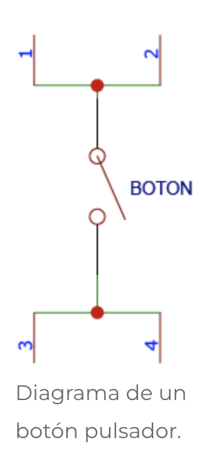
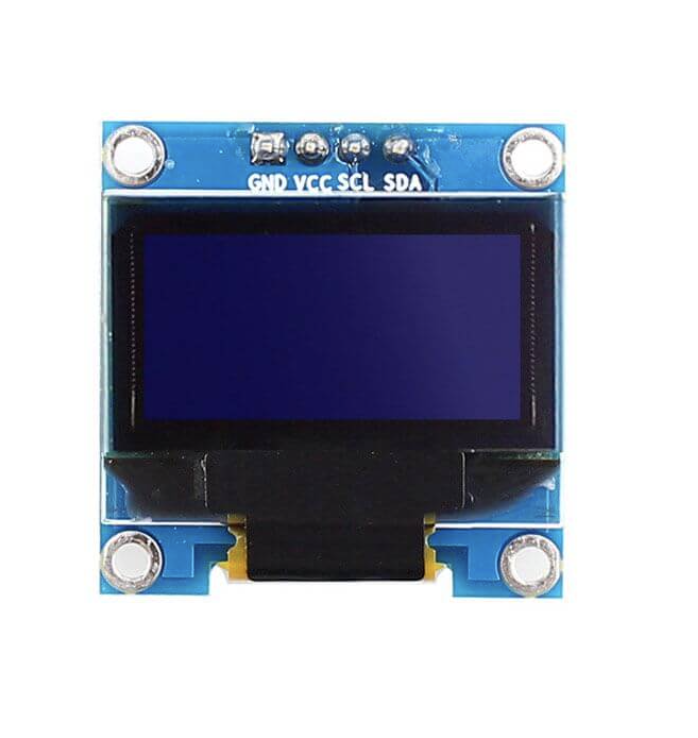
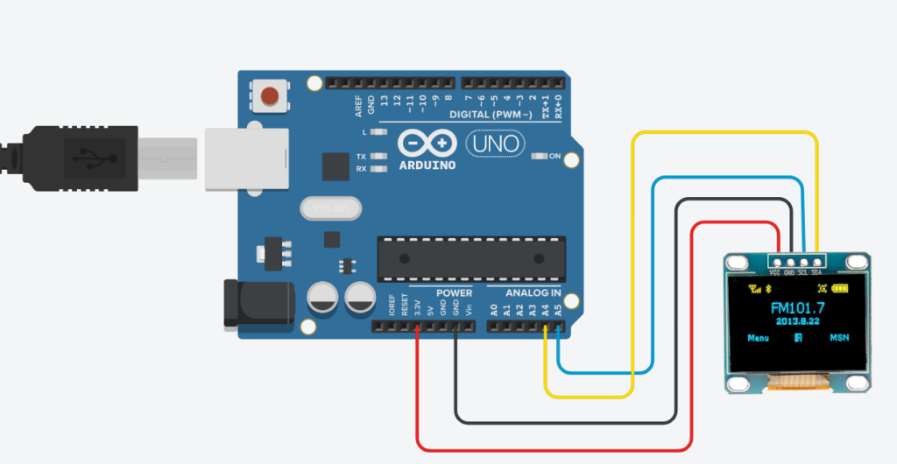
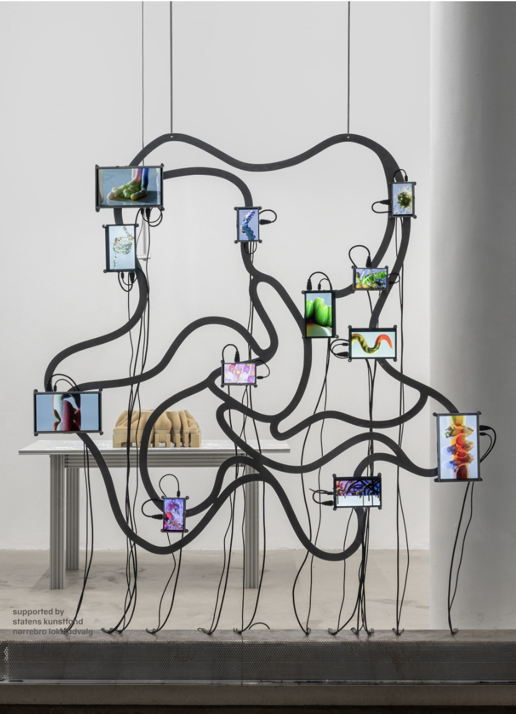
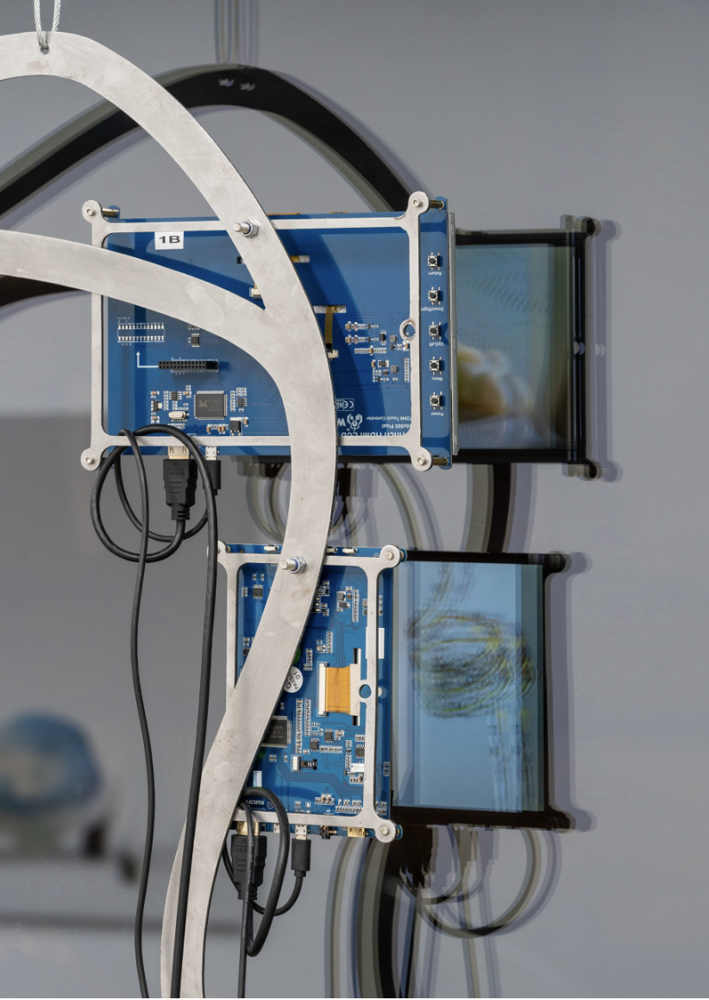

# investigaciones individuales

Magdalena Balart / magdalenabalart

## Sensor
### sensor botón / pulsador

Para esta investigación trabajé con el botón o pulsador que es uno de los sensores más simples dentro de la electrónica. Su función principal es detectar si está siendo presionado o no, por lo que solo entrega dos estados posibles: 0 o 1, apagado o encendido, abierto o cerrado. Por esto se considera un sensor digital, ya que no mide valores intermedios, sino que responde a una acción puntual.
A pesar de ser un componente muy simple, el botón es una de las formas más directas de interacción entre una persona y un sistema electrónico. Al presionarlo, el usuario entrega una instrucción clara al circuito, como encender una luz, activar un sonido, enviar un mensaje o iniciar una acción dentro de un programa. En ese sentido, **el botón funciona como un puente entre una acción física humana y una respuesta digital.** 

 
 
**<ins>Funcionamiento<ins>**

El botón funciona abriendo y cerrando un circuito. Cuando no está presionado, los contactos internos están separados y cuando se presiona, estos contactos se juntan. Ese cambio es lo que después puede leer el Arduino como una señal. 

 

En Arduino esto se trabaja con los pines digitales, que leen dos estados:

**HIGH**: cuando llega una señal entre 2.6V y 5V.  
**LOW**: cuando llega una señal entre 0V y 2.5V.

Se usan esos estados como una orden para el Arduino, si el botón está presionado puede pasar una cosa y si no está presionado, puede pasar otra.

También hay que tener cuidado con el voltaje. **Los pines de entrada no deberían recibir más de 5V, porque se puede dañar la placa**. Si se quiere usar una señal más alta, hay que bajarla antes con un **divisor de tensión**.

Para que el botón funcione bien, la señal no puede queda indefinida. Por eso se usan resistencias **pull-up o pull-down**, que ayudan a dejar claro qué valor tiene el pin cuando el botón no se está presionando. Si el pin queda indefinido Arduino puede leer cualquier cosa aunque no estemos tocando el botón.

Hay dos formas comunes de conectarlo:

**Pull-up**: cuando el botón no se presiona, el pin queda en HIGH / 5V. Al presionarlo, cambia a LOW / 0V.   
**Pull-down**: cuando el botón no se presiona, el pin queda en LOW / 0V. Al presionarlo, cambia a HIGH / 5V.

La resistencia puede ser de distintos valores, pero normalmente se usan entre 1KΩ y 10KΩ. Arduino también tiene resistencias internas que se pueden activar desde el código, pero usar una resistencia externa ayuda a entender mejor el circuito y evitar errores.
```
*  Como utilizar un botón con arduino
 *  
 *  EJEMPLO 01
 *  
 *  Ejemplo para encender y apagar un LED con un botón.
 *  
 */

// Crear variables para el manejo de los pines
int pinLED = 9;
int pinBoton = 2;

// Crear variable para estado del botón
bool boton = LOW;

void setup() {
  // Configuración de los pines de entrada y salida
  pinMode(pinLED,OUTPUT); // Salida digital para el LED
  pinMode(pinBoton,INPUT); // Entrada digital para el botón
}

void loop() {
  // Leer el estado del botón y encender o apagar el LED
  boton = digitalRead(pinBoton);

  if(boton == HIGH){            // Si el botón está pulsado
    digitalWrite(pinLED,HIGH);  // Enciende el LED
  }
  else{                         // Si no
    digitalWrite(pinLED,LOW);   // Apaga el LED
  }
}
 ```

> Código e imágenes recopiladas de: *Automatización para Todos, (2019), Utilizar Push Button con Arduino*.


**<ins>Problemas que pueden aparecer<ins>**

Uno de los problemas más comunes al trabajar con botones es el rebote. Esto pasa porque al presionar el botón, los contactos internos no se juntan de manera completamente limpia, sino que generan pequeñas vibraciones durante unos milisegundos. Aunque para nosotros sea una sola presión, la placa puede leerlo como varias pulsaciones seguidas.
Para solucionar esto se usa el **debounce**, que básicamente sirve para evitar que el sistema registre muchas lecturas falsas. Se puede hacer desde el código dejando un pequeño tiempo de espera después de detectar una presión, o también desde el circuito, agregando componentes que ayuden a estabilizar la señal.

La idea del debounce es esta: cuando Arduino detecta que el botón cambió de estado, espera unos milisegundos antes de aceptar la lectura como válida.
 
```
ejemplo: 

const int botonPin = 2;
const int ledPin = 13;

int estadoBoton = HIGH;
int ultimaLectura = HIGH;

unsigned long ultimoCambio = 0;
unsigned long tiempoDebounce = 50; // milisegundos

void setup() {
  pinMode(botonPin, INPUT_PULLUP);
  pinMode(ledPin, OUTPUT);
}

void loop() {
  int lectura = digitalRead(botonPin);

  // Si la lectura cambió, reiniciamos el tiempo
  if (lectura != ultimaLectura) {
    ultimoCambio = millis();
  }

  // Si ya pasó suficiente tiempo, aceptamos la lectura como real
  if ((millis() - ultimoCambio) > tiempoDebounce) {
    if (lectura != estadoBoton) {
      estadoBoton = lectura;

      // Como usamos INPUT_PULLUP, presionado es LOW
      if (estadoBoton == LOW) {
        digitalWrite(ledPin, HIGH);
      } else {
        digitalWrite(ledPin, LOW);
      }
    }
  }

  ultimaLectura = lectura;
}
```
   
 Esto significa que Arduino espera 50 milisegundos antes de aceptar el cambio del botón.
   
```
unsigned long tiempoDebounce = 50;
```

Si el botón cambia, Arduino guarda el momento en que ocurrió ese cambio. 
 
```
if ((millis() - ultimoCambio) > tiempoDebounce) {
```
Después revisa si ya pasó el tiempo suficiente. Si pasó, considera que la señal ya está estable. 

```
if ((millis() - ultimoCambio) > tiempoDebounce) {
```
Como el código usa:
 
```
pinMode(botonPin, INPUT_PULLUP);
```
el botón funciona “al revés”:

**No presionado** = HIGH  
**Presionado** = LOW

Entonces el debounce evita que una sola presión se cuente como varias.

También pueden aparecer problemas más simples, pero igual de importantes, como cables mal conectados, pines equivocados o conexiones flojas en la protoboard. Por eso, antes de pensar que el código está malo, es importante revisar bien el montaje físico.
 
**<ins>Visualización de datos<ins>**
 
Como el botón solo entrega dos estados, su visualización es bastante fácil de entender. Por ejemplo, se puede prender un LED cada vez que el botón se presiona, o mostrar en pantalla si el valor está en 0 o 1. También se puede hacer un contador de pulsaciones, donde cada presión aumente un número.
Además, se pueden definir distintos mensajes según el orden de pulsación del botón. Por ejemplo, la primera vez que se presiona puede enviar el mensaje “botón 01”, la segunda vez “botón 02” y la tercera vez “botón 03”. De esta manera, una acción simple como presionar un botón puede transformarse en un sistema numérico o secuencial, donde cada pulsación tiene un significado distinto dentro del proyecto.
Otra forma de visualizarlo es como una señal que cambia en el tiempo: cuando el botón no está presionado se mantiene en un estado, y cuando se presiona cambia al otro. Esto permite ver de manera simple cómo una acción manual se transforma en un dato que el sistema puede interpretar.

**<ins>Ejemplo de uso<ins>**
 
El botón funciona como entrada: cada vez que se presiona, envia una señal o un mensaje según el orden de pulsación. Luego, esa información puede ser recibida por otro dispositivo para activar una respuesta física. En este caso, un servo motor puede moverse a distintas posiciones dependiendo del mensaje recibido.

Por ejemplo:

Pulsación del botón	Mensaje enviado	Acción del actuador
**Primera pulsación**	botón 01	El servo se mueve a 0°   
**Segunda pulsación**	botón 02	El servo se mueve a 90°
**Tercera pulsación**	botón 03	El servo se mueve a 180°  

Así, el botón no solo activa una acción, sino que permite generar una secuencia de instrucciones. El actuador, en este caso el servo, transforma esa información digital en un movimiento físico. Esto muestra cómo una interacción simple, como presionar un botón, puede producir una respuesta visible dentro del sistema. 

### Referente: <ins>Karri Messenger 01<ins>

Como referente estoy tomando el Karri Messenger 1, también llamado Karri Classic, un dispositivo de comunicación creado por Pete Clifford, fundador de Karri. La idea del proyecto nace desde una preocupación cotidiana: cómo permitir que un niño pueda comunicarse con sus padres o cuidadores sin tener que entregarle un celular completo a una edad temprana.

  

Me interesa este referente porque utiliza un sensor muy simple, **el botón**, para responder a una problemática actual: la comunicación en niños. Hoy gran parte de la comunicación cotidiana ocurre a través del celular, pero entregar un celular a niños pequeños también significa abrirles acceso a redes sociales, internet, aplicaciones, notificaciones y otros espacios que pueden ser difíciles de controlar. Karri propone una solución intermedia: permite que el niño pueda comunicarse y moverse con mayor independencia, pero sin entrar completamente en la lógica del smartphone. En este caso, el botón funciona como la entrada principal del sistema, a través de una acción física simple, como presionar, el niño puede grabar o enviar un mensaje de voz. Esto me parece importante porque demuestra que no siempre se necesita una interfaz compleja para resolver una necesidad. Una interacción básica puede ser suficiente si está bien pensada y responde claramente al contexto de uso.

La lógica del botón en Karri no es solo activar algo, sino transformar una pulsación en una acción comunicativa. Al apretar el botón, el niño puede decir que llegó bien, pedir ayuda, responder un mensaje o mantenerse en contacto con su familia. Es una tecnología simple, pero con una función emocional y práctica muy clara: dar independencia sin dejar de lado el cuidado.

La salida del sistema es una respuesta comunicacional: el niño utiliza el dispositivo como un medio para comunicarse y aprender a mantenerse en contacto, mientras que los adultos pueden acompañar su recorrido desde la aplicación. Esto muestra cómo un botón puede funcionar como puente entre una acción mínima y una respuesta mucho más compleja.

## Actuador 

Esta vez utilizamos como actuador una pantalla OLED, que funciona como una salida visual dentro del sistema. A diferencia de un sensor, que recibe información del entorno, la pantalla permite mostrar una respuesta: texto, símbolos, números, mensajes o pequeñas animaciones. 
 
   
 
En nuestro caso, la pantalla OLED nos sirve para que el sistema pueda “responder” de una forma visible. Por ejemplo, si un botón envía una señal o si llega un dato desde Adafruit IO, la pantalla puede mostrar un mensaje específico. Esto permite transformar una acción física o digital en una respuesta visual que una persona puede leer e interpretar.

Aunque técnicamente una pantalla no genera movimiento como un servo motor, sí funciona como un actuador en el sentido de que entrega una salida del sistema: **recibe una instrucción desde la placa y la convierte en información visible**.  
 
**<ins>Funcionamiento<ins>**

La pantalla OLED que utilizamos funciona como una salida visual del sistema. En este caso, permite mostrar mensajes, números, símbolos o pequeñas respuestas gráficas según lo que le indique la placa.

    
 
La pantalla usada tiene conexión I2C, por eso solo necesita cuatro pines:

**GND**: tierra.    
**VCC**: alimentación de la pantalla.  
**SCL**: línea de reloj, que coordina la comunicación.  
**SDA**: línea de datos, por donde viaja la información.  

En la imagen se puede ver el orden de los pines: GND, VCC, SCL y SDA. Esto es importante porque si uno de estos cables queda mal conectado, la pantalla puede encender pero no mostrar nada, o simplemente no responder.

La pantalla funciona con una matriz de píxeles. se puede trabajar como una matriz de 128 columnas y 64 filas, donde cada píxel puede encenderse o apagarse. A partir de esa combinación de puntos se forman letras, números, íconos o pequeñas animaciones. Aunque técnicamente se podría controlar píxel por píxel, en la práctica usamos librerías de Arduino, como Adafruit SSD1306 y Adafruit GFX, que permiten escribir texto, cambiar el tamaño, limpiar la pantalla y actualizar lo que aparece. Así, la pantalla puede mostrar mensajes como “Hola mundo”, estados de conexión o respuestas recibidas desde otro dispositivo. 

ejemplo codigo: 

```
#include <Wire.h>
#include <Adafruit_GFX.h>
#include <Adafruit_SSD1306.h>

// Creamos la pantalla OLED indicando su tamaño: 128 columnas x 64 filas
Adafruit_SSD1306 display(128, 64, &Wire, -1);

void setup() {
  // Iniciamos comunicación con el computador
  Serial.begin(9600);

  // Iniciamos la pantalla OLED
  // 0x3C es la dirección más común de estas pantallas
  display.begin(SSD1306_SWITCHCAPVCC, 0x3C);

  // Limpiamos la pantalla antes de escribir
  display.clearDisplay();

  // Elegimos el tamaño del texto
  display.setTextSize(1);

  // Elegimos el color del texto
  // En estas pantallas normalmente es blanco o encendido
  display.setTextColor(SSD1306_WHITE);

  // Elegimos desde dónde empieza el texto
  // Primer número = posición horizontal
  // Segundo número = posición vertical
  display.setCursor(10, 20);

  // Escribimos el mensaje
  display.println("Hola mundo");

  // Mostramos en la pantalla lo que escribimos
  display.display();
}

void loop() {
  // No ponemos nada acá porque solo queremos mostrar un mensaje fijo
}

```
 
define dónde va a aparecer el texto.
```
display.setCursor(10, 20);
```
escribe el mensaje.
```
display.println("Hola mundo");
``` 
recién con este lo muestra en la pantalla
``` 
display.display();
```
 
**<ins>Problemas que pueden aparecer<ins>**
  
Uno de los problemas más comunes al trabajar con pantallas OLED es que no aparezca nada en pantalla, esto puede pasar por varias razones: cables mal conectados, alimentación incorrecta, dirección I2C equivocada o falta de alguna librería. También puede pasar que la pantalla prenda, pero no muestre el contenido esperado. En ese caso, el problema puede estar en el código, por ejemplo, si no se limpia la pantalla antes de escribir un nuevo mensaje o si no se actualiza con display.display(). 
  
Otro problema común es el tamaño del texto. Si el texto está muy grande, puede salirse de la pantalla o cortarse. Por eso es importante ajustar el tamaño según el tipo de mensaje que se quiere mostrar. Para mensajes largos conviene usar texto pequeño o dividir la información en varias líneas. También hay que revisar bien los cables, porque las pantallas OLED suelen depender de conexiones bastante específicas. Si SDA y SCL están invertidos, o si algún cable no hace buen contacto, la pantalla simplemente no responde. 

**<ins>Visualización de datos<ins>** 

La pantalla OLED permite visualizar datos de una forma directa, porque transforma la información que recibe la placa en texto, números o pequeños gráficos. Por ejemplo, puede mostrar mensajes simples como:

“Conectado”  
“Mensaje recibido”  
“Botón 01”  
“Esperando señal”  
“Hola mundo”  

También se puede usar para mostrar valores de sensores, como un contador de pulsaciones, el estado de un botón o la información que llega desde otro dispositivo. En vez de revisar todo desde el monitor serial del computador, la pantalla permite que el objeto muestre por sí mismo lo que está pasando.  

### Referente: <ins>Wang & Söderström<ins> 

Como referente para la pantalla OLED tomo el trabajo de Wang & Söderström, un estudio multidisciplinario fundado por Anny Wang y Tim Söderström. Su trabajo mezcla diseño, arte digital, escultura, animación e instalación, explorando cómo lo digital puede relacionarse con lo físico de una forma más sensible y menos fría.

> “The digital world becomes animal, soft, and peculiarly sensual.”

  

Me interesa su exposición *Royal Chambers Home as Host*, *Host as Home*, realizada en Copenhague. En este proyecto investigan la relación entre lo digital, lo natural y lo doméstico, pensando el concepto de “hogar” no solo como un espacio humano, sino como un ecosistema donde también existen vidas no humanas, datos, tecnologías, virus, parásitos, estructuras invisibles y formas de conexión. Dentro de la exposición aparecen obras como Wh331 0f 1!f3, que muestra la vulnerabilidad de nuestra presencia digital a través de virus computacionales, y Nest of You, una instalación interactiva que compara el poder de las grandes empresas tecnológicas con el de las hormigas reina, pensando cómo nuestros hábitos y rutinas alimentan sistemas mucho más grandes que nosotros. 

En sus obras la tecnología no aparece solo como una herramienta técnica, sino como una presencia viva dentro del espacio. Las pantallas, imágenes y dispositivos digitales no solo muestran información: construyen una atmósfera, generan una sensación y ayudan a pensar cómo lo digital también habita con nosotros. Esto me sirve para pensar la pantalla OLED como una pequeña presencia dentro del objeto. En nuestro proyecto, la OLED puede mostrar mensajes, estados de conexión o información recibida desde Adafruit IO, pero también puede darle una especie de voz al sistema. Puede hacer visible algo que normalmente estaría escondido en el código o en la comunicación entre dispositivos.

   
 
Por otro lado, Wang & Söderström hacen que lo digital se sienta más orgánico, más blando y más cercano. Sus obras muestran que la tecnología también puede hablar de cuidado, hogar, vínculo y dependencia. En ese sentido, una pantalla pequeña como la OLED puede funcionar como un espacio mínimo de comunicación: un lugar donde el objeto responde, avisa, espera o muestra que algo está ocurriendo.

## Bibliografía
https://cursos.mcielectronics.cl/2024/10/22/explicando-el-modo-arduino-input_pullup-pinmode/ 
https://www.automatizacionparatodos.com/push-button-con-arduino/ 
https://karri.io/products/karri-classic?variant=55926510420341 
https://programarfacil.com/blog/arduino-blog/ssd1306-pantalla-oled-con-arduino/   
https://www.ignant.com/2023/01/30/wang-soderstrom-on-broadening-the-aesthetics-and-meanings-of-the-digital/ 

