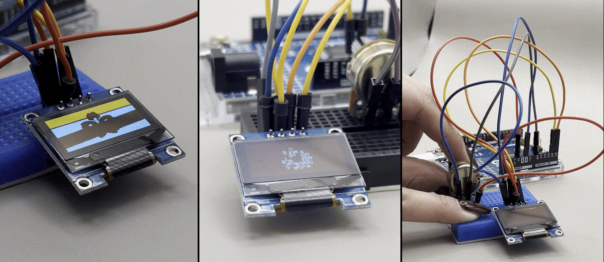
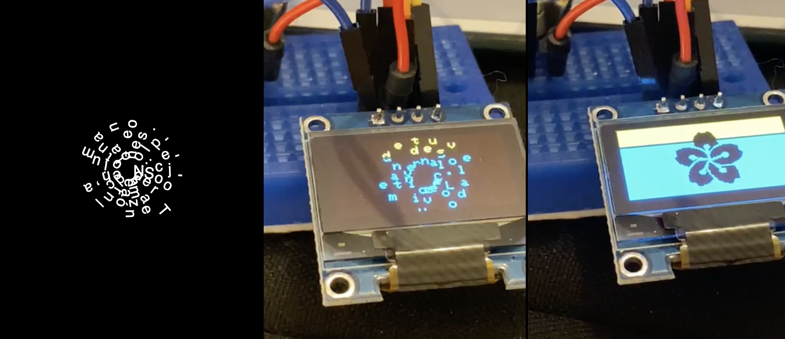
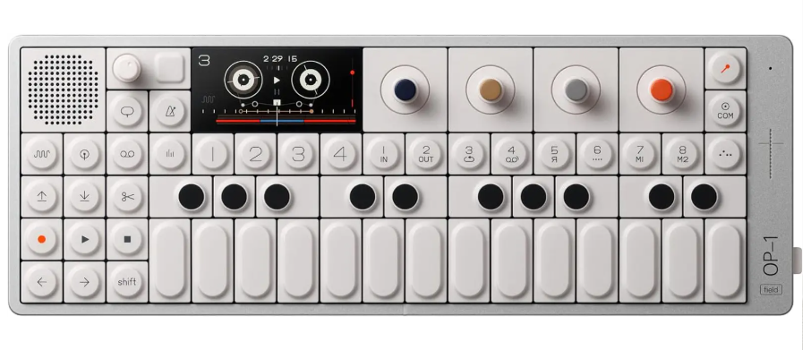
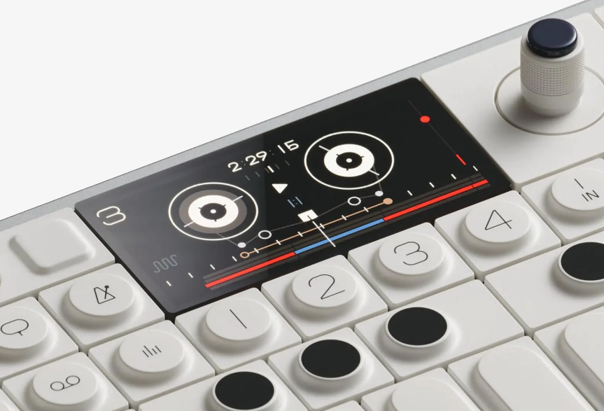
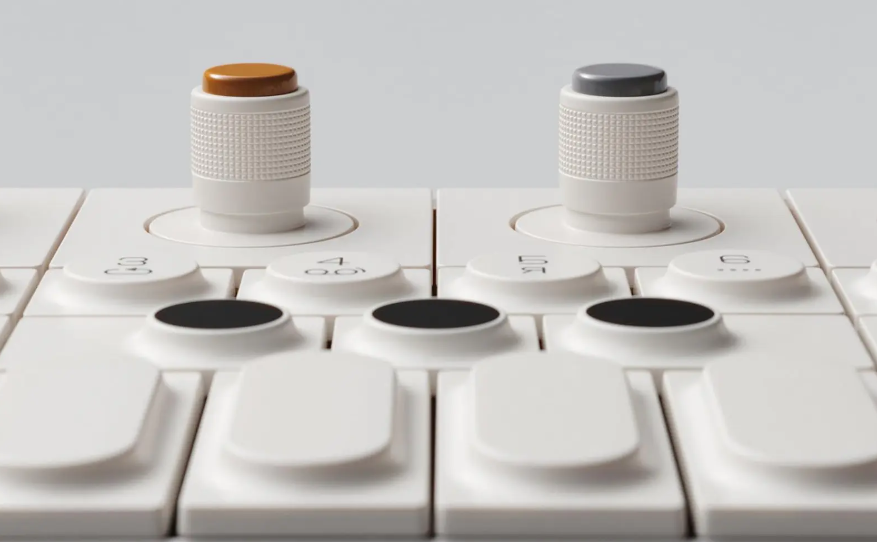

# investigaciones individuales

Jesús Miranda / https://github.com/jesumirandaa 

## Sensor — Botón / Pulsador (Push Button)

Personalmente este proyecto fue bastante desafiante, y siendo muy honesto, hubo momentos en que no sabía si iba a poder terminarlo. La electrónica y la programación de microcontroladores no son áreas donde me desenvuelvo con facilidad, así que cada parte requirió esfuerzo real. Comenzando por el sensor: elegimos un botón pensando que sería lo más accesible del sistema, pero al momento de implementarlo entendí que hay bastante más detrás de un pulsador que simplemente "presionar y listo".

Un botón es un **sensor de entrada digital**: su única función es reportar uno de dos estados posibles, presionado (`LOW` / `0`) o no presionado (`HIGH` / `1`). Físicamente es un interruptor momentáneo que cierra un circuito eléctrico mientras se mantiene oprimido y lo abre en cuanto se suelta.

En nuestro caso, el botón fue conectado al pin **GP0** de la Raspberry Pi Pico 2W, con resistencia de **pull-up interna** activada por software usando `Pull.UP`. Esto significa que cuando el botón no está presionado, el pin se mantiene "jalado" hacia 3.3V y lee `True`. Al presionar, el pin se conecta a GND y lee `False`. Sin esta resistencia, el pin quedaría "flotando" entre valores y la lectura sería completamente impredecible.

|3.3V|sistema|GND|
|---|---|---|
|R pull-up interna|-|-|
|GPO|lectura del microcontrolador|botón|-|

### Detección por flanco

Algo que aprendí en la práctica es que no basta con saber si el botón está presionado: hay que detectar el **momento exacto en que se presiona**, no el tiempo que se mantiene apretado. A esto se le llama detección por **flanco de bajada** (la transición de `True` a `False`). Si en vez de eso se detectara el nivel (es decir, "está presionado ahora mismo"), el código enviaría mensajes continuamente mientras el dedo está sobre el botón, saturando el feed de Adafruit IO al instante.


### Filtrado — Debounce

El mayor problema técnico que enfrentamos fue el **rebote mecánico** (*bouncing*). Cuando los contactos metálicos del botón se juntan físicamente, no hacen contacto limpio de una vez: vibran durante unos pocos milisegundos antes de estabilizarse. En ese tiempo pueden generarse 5, 10 o más transiciones falsas, lo que haría que un solo toque enviara múltiples mensajes a Adafruit IO.

La solución que implementamos fue **debounce por software**: después de detectar la primera presión, se espera 300ms antes de aceptar otra lectura, y además se espera a que el botón sea soltado completamente:

| Técnica | Descripción |
|--------|-------------|
| Debounce por tiempo *(el que usamos)* | Ignorar señales por X ms tras la primera detección |
| Debounce por hardware | Agregar un condensador cerámico de ~100nF en paralelo al botón |
| Máquina de estados | Confirmar N lecturas consecutivas iguales antes de aceptar el estado |
| Biblioteca `Bounce2` (Arduino) | Librería que maneja el debounce automáticamente |

### Visualización de datos

Al ser un sensor binario, la visualización no es un gráfico continuo sino un **registro de eventos**. En Adafruit IO, cada presión queda guardada en el feed `prueba05` con su timestamp, creando un historial visible en el dashboard. También se puede visualizar mediante un LED indicador conectado al microcontrolador, o en el monitor serial, donde imprimimos cada acción con `print()` para depurar durante el desarrollo.

Indirectamente, la visualización final de cada presión es el texto que aparece en la pantalla OLED del receptor, que es la forma más clara de confirmar que el sistema funcionó de punta a punta.

### Problemas comunes

| Problema | Causa | Solución |
|----------|-------|----------|
| Múltiples mensajes por una sola presión | Rebote mecánico sin debounce | Implementar debounce por software o hardware |
| El pin no detecta nada | Pull-up o pull-down no configurado | Activar `Pull.UP` en CircuitPython |
| Comportamiento errático intermitente | Cable suelto en la protoboard | Revisar y asegurar todas las conexiones |
| El botón se "pega" y sigue enviando | El loop no espera que se suelte | Agregar `while boton.value == False` |
| Lecturas falsas sin presionar | Ruido electromagnético en cables largos | Acortar cables, agregar condensador 100nF |

### Proyecto referencia — "sPIral" (Valentina Ruz, Sofía Cartes, Antonia Fuentealba, Sofía Pérez, Estudiantes UDP)

Uno de los referentes que revisé fue sPIral, un proyecto realizado por compañeras de la carrera. Lo conocí porque mi amigas Valentina y Sofía, integrantes del grupo, me lo mostraron mientras estábamos revisando distintos proyectos relacionados con pantallas y visualización de información. Lo que más me llamó la atención fue cómo utilizan una pantalla OLED para presentar poemas de una forma interactiva y visualmente atractiva, alejándose de la idea de mostrar únicamente texto o datos. Me pareció un buen ejemplo de cómo la programación y la electrónica pueden aportar valor a una propuesta de diseño, transformando una pantalla en una experiencia de interacción. Además, me hizo pensar en las posibilidades creativas que tienen este tipo de actuadores cuando se utilizan más allá de su función técnica básica.




---

## Actuador — Pantalla OLED SSD1306

El actuador que usamos es una pantalla **OLED** de 0.96 pulgadas con el controlador **SSD1306**, conectada al Arduino R4 WiFi mediante protocolo I2C. Su función en el proyecto fue mostrar los mensajes recibidos desde Adafruit IO, haciendo visible la comunicación inalámbrica.

Las pantallas OLED tienen una ventaja frente a las LCD tradicionales: **cada píxel emite su propia luz**, por lo que no necesitan retroiluminación. Esto las hace más delgadas, con mayor contraste y menor consumo energético, especialmente cuando se muestran fondos negros (los píxeles apagados no consumen energía).

**Especificaciones técnicas del SSD1306:**

| Parámetro | Valor |
|-----------|-------|
| Resolución | 128 × 64 píxeles |
| Protocolo de comunicación | I2C (también existe en SPI) |
| Dirección I2C | `0x3C` (o `0x3D` según modelo) |
| Voltaje de operación | 3.3V – 5V |
| Consumo típico | 20mA |
| Tamaño diagonal | 0.96 pulgadas |

### Uso en el proyecto

Cuando el Arduino recibe un mensaje desde el feed de Adafruit IO, ejecuta automáticamente la función `handleMessage()`, que pasa el contenido a `mostrarPantalla()`:

```cpp
void mostrarPantalla(String linea1, String linea2) {
  display.clearDisplay();           // Limpia el buffer anterior
  display.setTextColor(SSD1306_WHITE);
  display.setTextSize(1);
  display.setCursor(0, 0);
  display.println(linea1);
  display.setCursor(0, 25);
  display.println(linea2);
  display.display();                // Envía el buffer a la pantalla física
}
```

### Filtrado y procesamiento de la información

Antes de mostrarse, la información pasa por algunas transformaciones:

1. **Adafruit IO como intermediario:** el feed almacena el último valor publicado. Si hay una caída momentánea de WiFi, el mensaje no se pierde porque el Arduino puede recuperarlo con `botonFeed->get()` al reconectarse.
2. **`data->toString()`:** el objeto `AdafruitIO_Data` puede contener distintos tipos de datos. La conversión a `String` lo normaliza para usarlo directamente con la librería de la pantalla.
3. **Límite físico de caracteres:** con `setTextSize(1)`, cada carácter ocupa 6×8 píxeles, lo que permite aproximadamente **21 caracteres por línea** y hasta 8 líneas en pantalla. Mensajes más largos se cortan. En nuestro caso los mensajes eran cortos a propósito, pero en un sistema real habría que agregar lógica de truncado o scroll.

### Capacidades gráficas de la librería

Durante la investigación descubrí que `Adafruit_SSD1306` junto con `Adafruit_GFX` van mucho más allá del texto:

```cpp
display.setTextSize(2);                                     // Texto más grande
display.drawRect(x, y, ancho, alto, SSD1306_WHITE);         // Rectángulo
display.fillCircle(x, y, radio, SSD1306_WHITE);             // Círculo relleno
display.drawLine(x0, y0, x1, y1, SSD1306_WHITE);            // Línea
display.drawBitmap(x, y, datos_bitmap, w, h, SSD1306_WHITE);// Imagen personalizada
display.invertDisplay(true);                                // Invertir colores
```

Esto abre la posibilidad de mostrar gráficos de barras con datos en tiempo real, íconos personalizados o indicadores visuales más expresivos que solo texto plano.

### Problemas comunes

| Problema | Causa | Solución |
|----------|-------|----------|
| Pantalla no inicia | Dirección I2C incorrecta | Correr un scanner I2C para verificar si es `0x3C` o `0x3D` |
| Pantalla en blanco aunque el código corre | `display.display()` olvidado | Siempre terminar con `display.display()` después de dibujar |
| Texto o gráficos superpuestos | `clearDisplay()` no se llama antes | Limpiar siempre antes de escribir contenido nuevo |
| Caracteres extraños o ruido visual | Velocidad I2C demasiado alta | Reducir con `Wire.setClock(100000)` |
| Pantalla deja de responder | El `loop()` se bloquea y no ejecuta `io.run()` | Evitar `delay()` largos, usar tiempos no bloqueantes |
| Píxeles quemados con el tiempo | Mismo píxel encendido por horas continuas | Agregar screensaver o rotar el contenido periódicamente |

### Empresa de referencia — Teenage Engineering (Suecia)

Teenage Engineering es una empresa sueca de diseño de instrumentos musicales electrónicos. Sus productos más conocidos, como el **OP-1 Field** y la serie **Pocket Operator**, usan pantallas OLED como parte central de su interfaz. Lo que me interesó al investigarlos es que no usan la pantalla solo como display de estado, sino que la convierten en parte de la **experiencia expresiva del instrumento**. Las formas de onda, los parámetros de síntesis y las animaciones se muestran en tiempo real, y el usuario aprende a leer la pantalla como parte de tocar el instrumento.

Eso me hizo reflexionar sobre el rol de la pantalla en nuestro proyecto. En una escala mucho más pequeña, la OLED hace lo mismo: convierte algo invisible (un mensaje viajando por WiFi desde otra habitación) en algo concreto y legible. Sin el actuador, el sistema existe pero no se percibe.





🔗 [Teenage Engineering](https://teenage.engineering)

---

## Bibliografía

Adafruit Industries. (s.f.). Adafruit CircuitPython MiniMQTT library. GitHub. https://github.com/adafruit/Adafruit_CircuitPython_MiniMQTT

Adafruit Industries. (s.f.). Adafruit IO Arduino library. GitHub. https://github.com/adafruit/Adafruit_IO_Arduino

Adafruit Industries. (s.f.). Adafruit SSD1306 library. GitHub. https://github.com/adafruit/Adafruit_SSD1306

Adafruit Industries. (s.f.). Adafruit GFX library. GitHub. https://github.com/adafruit/Adafruit-GFX-Library

Arduino. (s.f.). Arduino UNO R4 WiFi documentation. https://docs.arduino.cc/hardware/uno-r4-wifi/

Raspberry Pi Ltd. (s.f.). Raspberry Pi Pico 2W datasheet. https://datasheets.raspberrypi.com/picow/pico-2-w-datasheet.pdf

Teenage Engineering. (s.f.). Products. https://teenage.engineering

Williams, E. (2015, 9 de diciembre). Debouncing buttons and switches, part I. Hackaday. https://hackaday.com/2015/12/09/embed-with-elliot-debounce-your-noisy-buttons-part-i/
