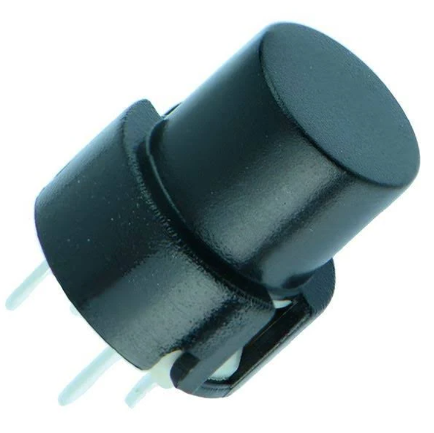
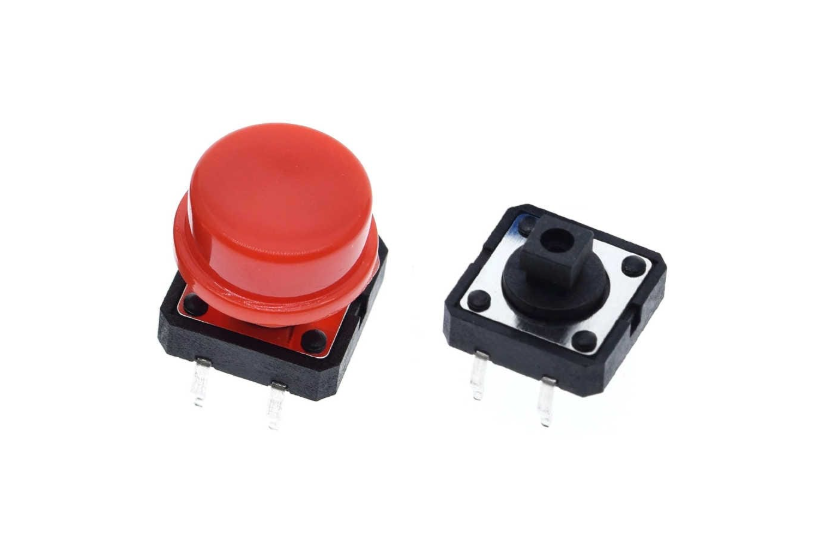
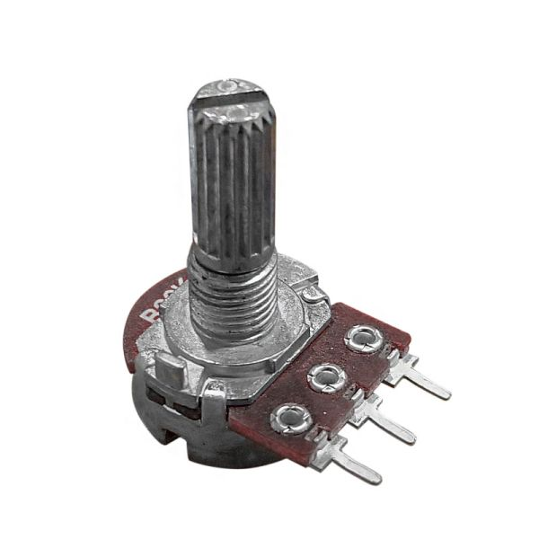

# Solemne 2 - Interacciones Inalámbricas

## Integrantes

- Renata De Los Ángeles Arévalo Urra / [arevalourra](<https://github.com/nicolasvaldesgreve/dis9079-2026-1/tree/main/06-arevalourra>)
- Isidora Andrea Pérez Maulén / [isipm08](<https://github.com/nicolasvaldesgreve/dis9079-2026-1/tree/main/21-isipm08>)
- Nicolás Elías Valdés Greve / [nicolasvaldesgreve](<https://github.com/nicolasvaldesgreve/dis9079-2026-1/tree/main/29-nicolasvaldesgreve>)

## Descripción textual del proyecto

Como proyecto para la segunda solemne del curso se nos indicó el, al igual que la vez pasada, lograr una comunicación inalámbrica utilizando códigos en dos microcontroladores los cuales serán una placa Arduino R4 WiFi y una Raspberry Pi Pico 2 W. En nuestro caso, se utilizará la Raspberry Pi Pico 2 W para poder enviar información hacia el Arduino UNO R4 WiFi, lo cual se hará de la siguiente manera:

#### Raspberry Pi Pico 2 W

En este microcontrolador estarán conectados los siguientes componentes:

1. Potenciómetro B20K
2. Push button 4 pins
3. Diodo LED
4. Resistencia 220 Ω

El potenciómetro estará conectado de la siguiente manera: el pin izquierdo del potenciómetro estará conectado al pin 13 ``GND`` de la Raspberry, el pin de en medio está conectado al pin 36 ``3V3 (out)``, y el pin derecho está conectado al pin 31 ``ADC0``.

El push button está conectado al pin 28 ``GND`` de la Raspberry y al pin 1 ``GP0``.

El LED está conectado mediante una resistencia de 220 Ω al pin 2 ``GP1``, el cual llega al pin positivo del LED. El pin negativo del LED va conectado al pin 18 ``GND``.

#### Arduino UNO R4 WiFi

En este microcontrolador solo va conectado el Micro Servo Motor SG90 9g, el cual se conecta de la siguiente manera: El cable de color rojo va al pin ``5V`` el cual está ubicado en la sección ``POWER`` del Arduino, el cable de color café va en el pin ``GND`` que está ubicado en la sección ``POWER`` o ``DIGITAL`` y el cable de color amarillo va conectado en el pin ``9~`` ubicado en la sección ``DIGITAL`` de la placa.

---

Una vez tengamos todos los componentes conectados a sus respectivos microcontroladores, podremos empezar a comunicarnos entre ellos utilizando los códigos que se mencionan más abajo, los cuales fueron creados con ayuda de las inteligencias artificiales _Claude_ y _Chat GPT_. La manera en la que funciona esto es que, cuando mantenemos presionado el push button que está ubicado en la Raspberry, se empezarán a enviar los datos numéricos que podemos modificar moviendo el potenciómetro, el cual dependiendo del valor que se envíe el Motor Servo se moverá. Mientras todo esto sucede, el LED nos indicará cuándo estamos manteniendo presionado el push button, ya que cuando lo presionamos se encenderá la luz, y cuando no estemos ejerciendo ninguna presión, se mantendrá apagado.

Todos los datos del potenciómetro se pueden visualizar en tiempo real en este link:

<https://io.adafruit.com/udpmontoyamoraga/feeds/potenciometro-05>

## Materiales usados

| Componente | Valor Unidad | Cantidad | Link |
| --- | --- | --- | --- |
| Raspberry Pi Pico 2 W | $14.990 | 1 | <https://raspberrypi.cl/products/raspberry-pi-pico-2-w-con-headers> |
| Arduino UNO R4 WiFi | $38.990 | 1 | <https://arduino.cl/producto/arduino-uno-r4-wifi/?srsltid=AfmBOopyyargcSiTQeFlT3cTN5ide380bxZlQXRZVP4u_op0O-qJcENB> |
| Protoboard 400 puntos | $2.100 | 2 | <https://prodelab.cl/productos/didacticos/nivel-superior-y-ensenanza-media/robotica-y-programacion/accesorios-robotica-y-programacion/protoboard-breadboard-400-pines/> |
| Potenciómetro B20K | $495 | 1 | <https://altronics.cl/potenciometro-lineal-20k-b20k> |
| Cables Dupont (Pack 40 unidades) | $2.590 | 1 | <https://mcielectronics.cl/shop/product/cable-dupont-macho-macho-20cm-pack-40-unidades/> |
| Micro Servo Motor SG90 9g | $3.290 | 1 | <https://arduino.cl/producto/micro-servo-motor-sg90-9g/?srsltid=AfmBOoqZlsZtwx6MP23bWquVf5u5zZnS9a5CEJFEFpIcFrlUZCnyhxc5> |
| Botón Pulsador 4 pines | $290 | 1 | <https://www.mechatronicstore.cl/boton-pulsador-switch-cuadrado-de-4-pines/?srsltid=AfmBOorQc-HPtgc1jR5UZV55YYAmrYJEa9owIDDo8S3CvOdJ3fsjV8JZ> |
| Diodo LED | $70 | 1 | <https://afel.cl/products/diodo-led-5mm-ultrabrillante-azul?pr_prod_strat=jac&pr_rec_id=1cd69e264&pr_rec_pid=8382019502232&pr_ref_pid=8382019600536&pr_seq=uniform> |
| Resistencia 220 | $413 | 1 | <https://altronics.cl/pack-10-resistencias-220ohm-025watt-1porciento> |

---

## Problemas, errores y aprendizajes

En nuestro caso el primer intento que tuvimos no se pudo comprobar si el código de recibir realmente funcionaba ya que no estaba con mis compañeras y el único computador que hay en mi casa es el mío, por lo que solo pude probar el código para enviar información. Para iniciar el proceso utilicé el ejemplo que usamos en clase para probar enviar información con solo un potenciómetro al Adafruit IO para comprobar que estuviese bien conectado el potenciómetro a la Raspberry Pi Pico 2 W.

Cuando ya se logró verificar que, si se enviaba la información al Adafruit, decidí buscar una manera de filtrar la información que enviamos al Adafruit para que no hayan problemas con la plataforma al momento de presentar, razón por la que empecé a buscar tutoriales de cómo conectar un push button a una Raspberry y encontré 
el siguiente video: <https://www.youtube.com/watch?v=d_odoKbEjgg&t=120s> en donde nos enseña cómo poner un botón ya sea para utilizarlo como "push up" o "push down" lo cual era lo que estábamos buscando ya que en nuestro caso necesitábamos utilizar el push button como "push down", es decir, que solo funcione cuando lo mantenemos presionado y que cuando no se esté ejerciendo ningún tipo de fuerza no envíe nada de información. Como anteriormente ya habíamos comprobado que funcionaba el potenciómetro, decidimos agregar la variante del botón al código de manera manual, pero fallamos, razón por la que decidimos pedirle ayuda a la inteligencia artificial _Claude_, teniendo así mi primer chat con una inteligencia artificial del cual aprendí lo siguiente:


Como se puede observar en la imagen, mi primer error fue el no saber cómo enviarle el código en el mismo mensaje donde le doy la información que necesito, razón por la cual la IA me tuvo que pedir en un mensaje aparte que le envíe el código lo cual fue toda una experiencia. Como segundo error es algo que en ese momento aún no me daba cuanta y es que le menciono que el botón va en el pin ``3V3`` y ``GP0``, cosa que más tarde Aarón me corrigió y me di cuenta de que no debería ir en ``3V3`` sino en ``GND``.

Luego de que la IA generase el código, se probó y funcionó a medias ya que al momento de correr el código si no presionábamos el botón, en efecto, no se enviaba la información, pero cuando se presionaba el botón una vez empezaba a mandar información y no paraba a pesar de que ya no se le estaba ejerciendo ninguna fuerza a éste, por lo que nos dimos cuenta de que no estaba funcionando como push button sino que como un toggle. Como no se podía controlar el cuándo dejar de mandar información, se tenía que parar de correr el código desde PuTTY presionando las teclas ``Ctrl + C``, cosa que le comentamos a Aarón en la clase que tuvimos el 18 de mayo y nos dijo que solucionemos el que funcione como push button con el sistema push down, y el resto del proceso de veía después y que nos apoyemos en la ayuda de Mateo para poder lograr todo esto. Cuando llegó mateo, leyó el código y nos dimos cuenta de muchos errores dentro del código original, por lo que lo corregimos, lo corrimos y nos dimos cuenta de que no se estaba mandando nada de información cosa que pasó reiteradas veces y decidimos probar con otra Raspberry para revisar si era nuestro microcontrolador el problema, por lo que le pedimos prestada la Raspberry al grupo 09 compuesto por Josefa Araya, Débora Soto y Cristobal Vergara, los cuales muy amablemente nos prestaron su microcontrolador en donde probamos nuestro código y si funcionaba, cosa que le comenté a Mateo y me recomendó reiniciar la Raspberry y volver a hacer el proceso de transformarla e inyectarle bibliotecas, por lo que tuvimos que seguir los siguientes pasos:

1. Desconectar la Raspberry del computador
2. Mantener presionado el botón que se encuentra en la placa de la Raspberry por unos segundos
3. Mientras se mantiene presionado el botón, conectarlo al computador
4. Soltar el botón

Una vez ya completados esos pasos, ya tendremos la Raspbery reiniciada. Notaremos que se nos abre una ventana que es la carpeta del microcontrolador, en donde tendremos que insertar el archivo llamado ``adafruit-circuitpython-raspberry_pi_pico2_w-es-10.2.1.uf2`` que se puede descargar en el siguiente link: <https://circuitpython.org/board/raspberry_pi_pico2_w/>. Luego de meter el archivo en la carpeta, notaremos que se cerrará la ventana del microcontrolador, volverá a aparecer con otro nombre y notaremos que dentro de ella hay una carpeta nombrada ``lib``, en donde tendremos que agregar las siguientes bibliotecas:


Para poder descargar estas bibliotecas, nos tenemos que dirigir a el siguiente link: <https://circuitpython.org/libraries>, en donde tendremos que bajar hasta la sección llamada "Bundles", en donde tendremos que descargar el bundle para la versión "10.X".


Luego de hacer todo este proceso le avisamos a Mateo y nos recomendó probar un código que envió por el server de discord para comprobar si un botón está realmente funcionando o no, el cual es el siguiente:

```cpp
import time
import board
import digitalio
import wifi
import socketpool
import adafruit_minimqtt.adafruit_minimqtt as MQTT

print("Iniciando programa...")

# -------------------------
# WiFi
# -------------------------
SSID = "wifi"
PASSWORD = "contraseñawifi"

print("Conectando WiFi...")

try:
    wifi.radio.connect(SSID, PASSWORD)
    print("WiFi conectado")
    print("IP:", wifi.radio.ipv4_address)

except Exception as e:
    print("Error WiFi:")
    print(e)

    while True:
        pass


# -------------------------
# Adafruit IO
# -------------------------
AIO_USERNAME = "udpmontoyamoraga"
AIO_KEY = "keydeaarón"

FEED_BOTON = AIO_USERNAME + "/feeds/potenciometro-05"

print("Creando conexión MQTT...")

pool = socketpool.SocketPool(wifi.radio)

mqtt = MQTT.MQTT(
    broker="io.adafruit.com",
    username=AIO_USERNAME,
    password=AIO_KEY,
    socket_pool=pool,
)

print("Conectando a Adafruit IO...")

try:
    mqtt.connect()
    print("Conectado a Adafruit IO")

except Exception as e:
    print("Error MQTT:")
    print(e)

    while True:
        pass


# -------------------------
# Botón GP0
# -------------------------
boton = digitalio.DigitalInOut(board.GP0)
boton.direction = digitalio.Direction.INPUT
boton.pull = digitalio.Pull.UP

estado_anterior = True

print("Sistema listo")

# -------------------------
# Loop principal
# -------------------------
while True:

    try:
        mqtt.loop()

        estado_actual = boton.value

        # Detecta transición:
        # sin presionar -> presionado
        if estado_anterior and not estado_actual:

            print("Botón presionado")
            print("Enviando impulso...")

            mqtt.publish(FEED_BOTON, "1")

            print("Impulso enviado")

            # anti-rebote
            time.sleep(0.25)

        estado_anterior = estado_actual

    except Exception as e:
        print("Error:")
        print(e)

    time.sleep(0.02)
```

Luego de hacer correr el código nos dimos cuenta de que no estaba respondiendo el botón, por lo que decidimos cambiarlo por otro y éste tampoco funcionó hasta que llegó Aarón e hizo bien la conexión, cambiando el pin que estaba conectado a ``3V3`` a ``GND`` en donde finalmente empezó a reaccionar como queríamos.

---

## Sensor usado

Para este proyecto se utilizó un potenciómetro y un push button como sensor. El push button cumple la función de decidir cuándo enviar información que genera el potenciómetro la cual va cambiando cada vez que uno lo mueve.

#### Push button

Al inicio, el push button que estábamos utilizando era el siguiente:



Este botón se utilizó desde la primera prueba del código hasta el día en el cual tuvimos clases presenciales, en donde nos dejó de responder y Mateo nos recomendó cambiar el botón debido a que los de este tipo suelen soltarse solos de la protoboard, lo cual nos podía arruinar las cosas sin siquiera darnos cuenta. Como se nos recomendó hacer un cambio, empezamos a probar con el siguiente botón:


Cuando hicimos el cambio a éste push button, fue cuando ya habíamos logrado correr el código en donde el botón cumplía su función de filtrar la información con el sistema "push down", por lo cual lo utilizamos durante todo lo que restaba de clase, pero cuando volvimos a probarlo un día después nos dimos cuenta de que ya no respondía el botón. Como no nos funcionaba el botón, decidimos probar con el código que nos dio Mateo para ver si había algún problema con la conexión, pero cuando lo probamos nos dimos cuenta de que en realidad el problema era el botón, razón por la cual decidimos volver a cambiar el botón por el siguiente, que es el actual de nuestro proyecto:



Todos los push buttons que utilizamos en este proyecto son botones de 4 pines, los cuales como menciona su nombre funcionan como botones pulsadores, es decir, que estos solo responden mientras uno los mantiene presionados (así como funcionan los timbres de las casas).

#### Potenciómetro

El potenciómetro B20K que se utilizó en este proyecto no se cambió en ningún momento ya que no causó ningún problema. Como lo menciona en su nombre, este potenciómetro tiene una resistencia de 20.000 ohmios, lo cual se va ajustando a medida que interactuamos con él y va controlando el paso del voltaje o de la corriente.



Este potenciómetro tiene 3 pines, los cuales cumplen la siguiente función:

- Pin 1 -> Terminal de entrada (Vcc), es en donde se alimenta del voltaje.
- Pin 2 -> Terminal de salida, es en donde se entrega la señal según la posición del eje.
- Pin 3 -> Terminal a tierra (GND), es en donde se conecta a tierra.

## Actuador usado

Los actuadores utilizados en este proyecto son el **Micro Servo Motor SG90 9g** y un **LED**. El LED cumple la función de indicar visualmente cuándo el botón se encuentra presionado, señalando que el sistema está habilitado para enviar información. Por otro lado, el Micro Servo Motor SG90 recibe los datos enviados desde el potenciómetro y responde mediante un movimiento angular, modificando su posición según los valores recibidos. De esta forma, ambos actuadores permiten representar visual y físicamente el funcionamiento del sistema.

## Código usado para enviar

```cpp
import time
import board
import analogio
import digitalio
import wifi
import socketpool
import adafruit_minimqtt.adafruit_minimqtt as MQTT

# conexión a wifi
SSID = "si"
PASSWORD = "mailo6192."

print("Conectando WiFi...")
wifi.radio.connect(
    SSID,
    PASSWORD
)
print("WiFi conectado")

# conexión mqtt
pool = socketpool.SocketPool(wifi.radio)
mqtt = MQTT.MQTT(
    broker="io.adafruit.com",
    username="udpmontoyamoraga",
    password="keydeaarón",
    socket_pool=pool
)
mqtt.connect()
print("MQTT conectado")

# potenciómetro
pot = analogio.AnalogIn(board.A0)

# se configura pin gp0 como entrada digital del botón
button = digitalio.DigitalInOut(board.GP0)
button.direction = digitalio.Direction.INPUT
button.pull = digitalio.Pull.UP # resistencia interna pull-up

# pin gp1 como salida digital para controlar el led
led = digitalio.DigitalInOut(board.GP1)
led.direction = digitalio.Direction.OUTPUT

ultimo_valor = -1 # empieza en -1 para asegurar que siempre suceda el primer envío

while True:
    if not button.value:
        led.value = True # se enciende el LED cuando el botón se presiona

        valor = pot.value * 1023 // 65535 # de valor crudo a escala de 0 a 1023
        if abs(valor - ultimo_valor) > 5: # manda datos cuando el valor cambia por 5 unidades y así no se satura el adafruit
            print("Enviando:", valor)
            mqtt.publish(
                "udpmontoyamoraga/feeds/potenciometro-05",
                str(valor)
            )
            ultimo_valor = valor
        time.sleep(0.2) # descanso pequeño para que no lea taaaan rápido
    else:
        # se apaga el led al soltar el botón
        led.value = False
        time.sleep(0.01)
```

## Código usado para recibir

```cpp
#include <WiFiS3.h>
#include <Servo.h>
#include "Adafruit_MQTT.h"
#include "Adafruit_MQTT_Client.h"

// conexión a wifi
#define WLAN_SSID "si"
#define WLAN_PASS "mailo6192."

// conexión al adafruit io
#define AIO_SERVER     "io.adafruit.com"
#define AIO_SERVERPORT 1883
#define AIO_USERNAME   "udpmontoyamoraga"
#define AIO_KEY        "keydeaarón"
#define LED_PIN 13

WiFiClient client;
Adafruit_MQTT_Client mqtt(
  &client,
  AIO_SERVER,
  AIO_SERVERPORT,
  AIO_USERNAME,
  AIO_KEY
);

// se suscribe al feed que es de donde recibe la información
Adafruit_MQTT_Subscribe potenciometro =
Adafruit_MQTT_Subscribe(
  &mqtt,
  AIO_USERNAME "/feeds/potenciometro-05"
);

Servo miServo;
void MQTT_connect();

void setup() {
  Serial.begin(115200); // ver si monitor serial está a 115200, de no ser así, cambiarlo
  miServo.attach(9); // servo en pin ~9

  pinMode(LED_PIN, OUTPUT);
  digitalWrite(LED_PIN, LOW);

  Serial.println("Conectando WiFi"); // aquí se inicia la conexión al wifi
  WiFi.begin(WLAN_SSID, WLAN_PASS);
  while (WiFi.status() != WL_CONNECTED) {
    Serial.print("."); // puntitos hasta que lo logre
    delay(500);
  }
  Serial.println();
  Serial.println("WiFi conectado"); // yey!!

  mqtt.subscribe(&potenciometro);
}

void loop() {
  MQTT_connect();

  Adafruit_MQTT_Subscribe *subscription;
  while ((subscription = mqtt.readSubscription(1000))) {
    if (subscription == &potenciometro) {
      int valorPot = atoi(
        (char*)potenciometro.lastread
      );
      Serial.print("Recibido: ");
      Serial.println(valorPot);

      digitalWrite(LED_PIN, HIGH);
      delay(200); 
      digitalWrite(LED_PIN, LOW);

// aquí convierte la escala del potenciómetro de
// 0 - 1023 a ángulos del servo (de 0 - 180°)
      int angulo = map(valorPot, 0, 1023, 0, 180);
      angulo = constrain(angulo, 0, 180);

      Serial.print("Ángulo: ");
      Serial.println(angulo);
      miServo.write(angulo);
    }
  }
}

void MQTT_connect() {
  int8_t ret;
  if (mqtt.connected()) { 
    return;
  }
  Serial.print("Conectando MQTT...");
  while ((ret = mqtt.connect()) != 0) { // se intenta reconectar en caso de que suceda algo
    Serial.println(mqtt.connectErrorString(ret)); // si no logra hacerlo, imprime error y
    mqtt.disconnect(); // se desconecta
    delay(5000);  // pero vuelve a intentarlo luego de un reposo de 5 seg
  }
  Serial.println(" conectado"); // logrado!! yey
}
```

## Imagenes del proyecto

### PRIMERAS CONEXIONES 

**ENVIAR**


**RECIBIR**


**CONJUNTO**


### CONEXIONES FINALES


## Animaciones del proyecto


---

## Bibliografía

+ <https://www.youtube.com/watch?v=d_odoKbEjgg&t=120s>, en donde nos enseñan cómo conectar un push button a una raspberry.
+ <https://www.instructables.com/Control-LED-From-Internet-Using-Raspberry-Pi-Pico-/>, en donde nos enseñan cómo conectar un LED a una raspberry.
+ <https://www.sameskydevices.com/blog/push-button-switches-101>, en donde se nos habla de los botones pulsadores y de los interruptores. 
