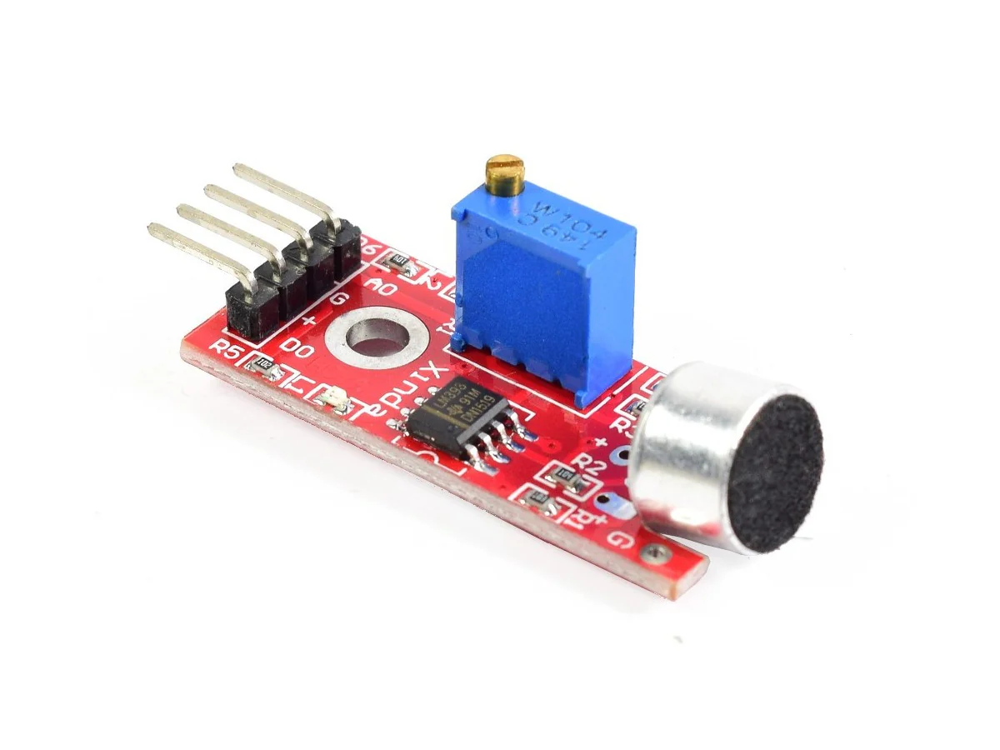
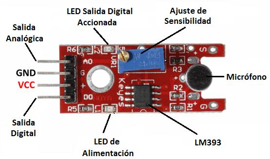
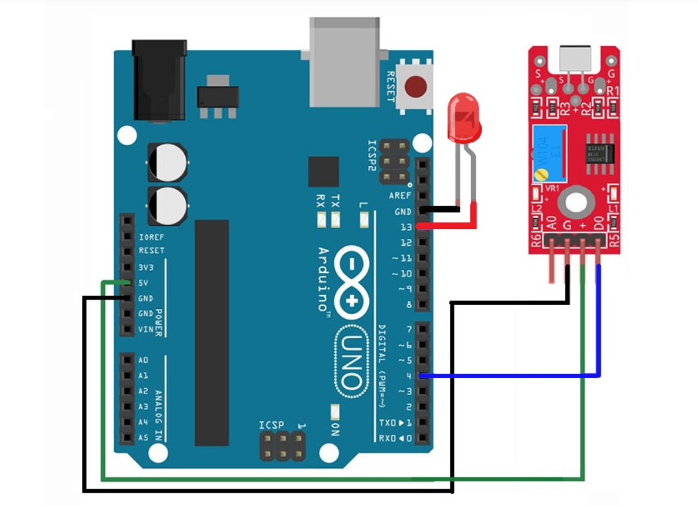
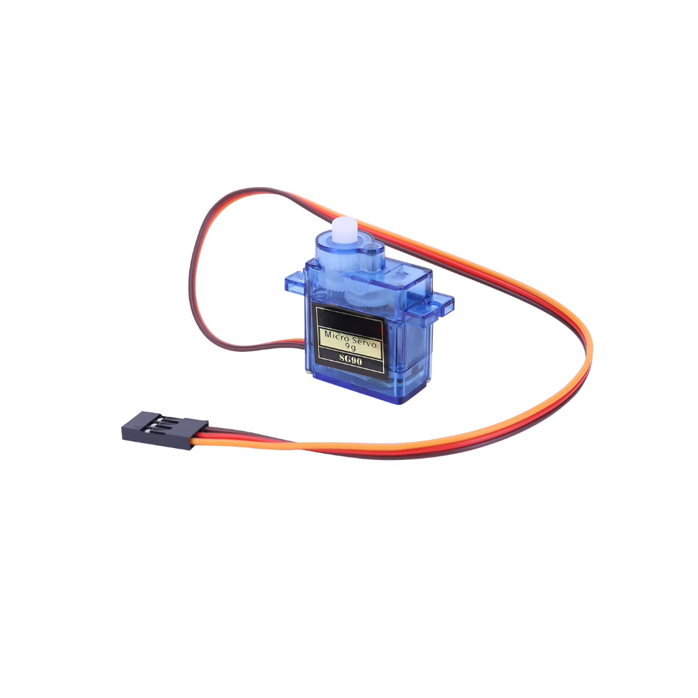
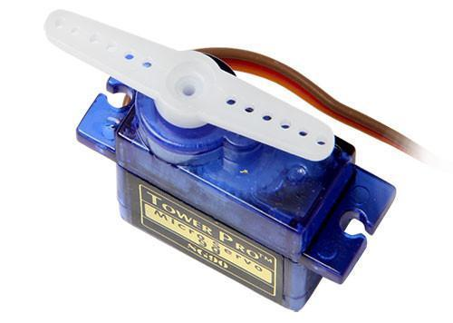
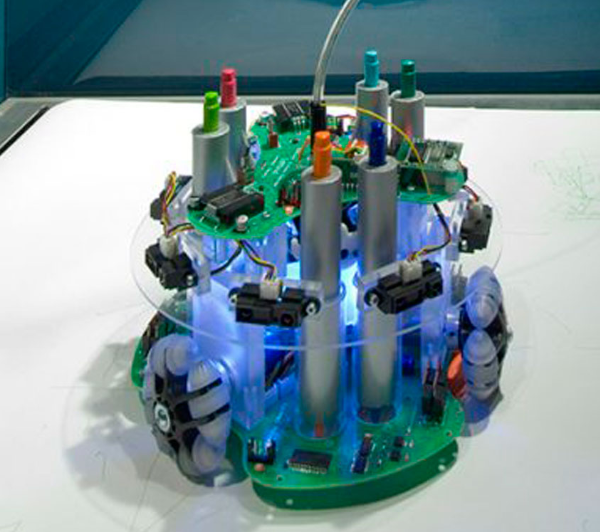
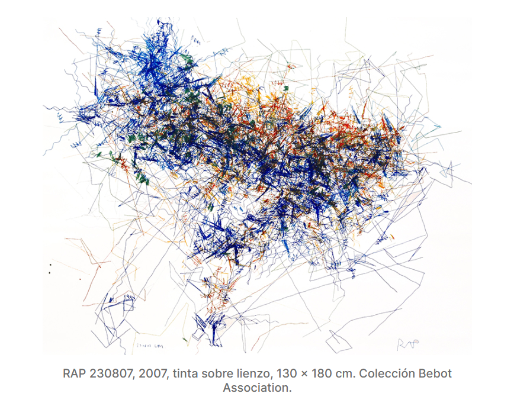
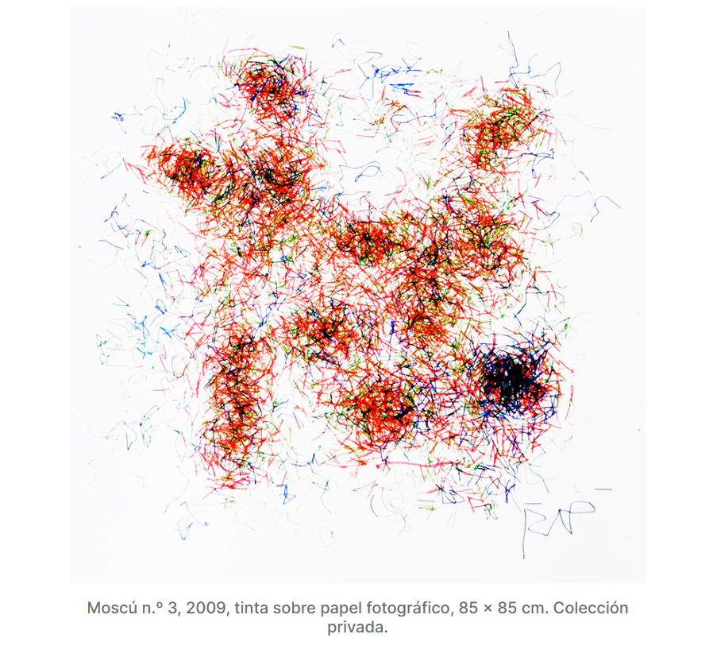

# investigaciones individuales

Isidora Andrea Pérez Maulén /  [isipm08](<https://github.com/nicolasvaldesgreve/dis9079-2026-1/tree/main/21-isipm08>)

# Sensor
## Sensor de sonido tipo KY-038 / LM393

### **¿Qué es?**
+ El sensor de sonido KY-038 es un dispositivo electrónico diseñado para **detectar ondas sonoras** o **variaciones acústicas** del entorno y convertirlas en señales eléctricas, en donde el sonido es capaz de "viajar por el aire" en forma de vibraciones. El sensor capta estas vibraciones mediante un micrófono de condensador.
+ Estas señales pueden ser interpretadas por un circuito, un microcontrolador o una computadora.
+ Utilizado en proyectos de robótica, domótica, instalaciones interactivas, instrumentos musicales electrónicos, sistemas de seguridad y arte multimedia.
+ Es compatible con varias placas, por ejemplo: Arduino UNO, Arduino Nano, Arduino Mega, ESP32, ESP8266 y Raspberry Pi, lo que facilita su integración en múltiples plataformas.



*Créditos Imagen:* https://www.teslaelectronicla.com/producto/sensor-de-sonido-ky-038/

### **Componentes**
- Micrófono
  + Captura vibraciones del aire.
  + Convierte sonido en pequeñas variaciones eléctricas.
    
- Amplificador
  + Aumenta señal del micrófono para poder procesarla.
    
- Comparador/Procesador
  + Determina si el sonido supera cierto umbral.
  + También se puede ajustar la sensibilidad con un potenciómetro (algunos sensores).
    
- Salida
  + Analógica: Entrega valores variables según intensidad del sonido detectado.
  + Digital: Se activa cuando el nivel de sonido supera cierto umbral que es previamente ajustado con un potenciómetro.



*Créditos Imagen:* https://destecmex.com/producto/modulo-sensor-de-sonido-ky-038/

### **Aplicaciones más comunes**
- Estos son algunos de los ejemplos en los cuales se puede aplicar un sensor de sonido:
  + Detectar aplausos.
  + Activar luces o motores.
  + Medir contaminación acústica.
  + Crear visualizaciones musicales.
  + Controlar robots por voz.
  + Generar experiencias interactivas en el arte digital.


### **Visualización de datos**
- Un claro y fácil ejemplo para visualizar datos es a través de un LED.
  + A mayor sonido el LED se enciende.
  + Se realizan este tipo de conexiones (sirve tanto para el sensor de sonido KY-037 y KY-038)
  + Luego entraremos a Arduino, lo conectaremos y pondremos este código referencial (adjuntado más abajo).
  + En el Monitor Serial visualizaremos el comportamiento del módulo cuando se efectúe un sonido, donde el contador varía según intensidad del sonido. (considerar en el sensor de sonido KY-038 se aumenta sensibilidad). Observando así que con un menor sonido el LED de igual forma es encendido por su mayor sensibilidad.
  
> Tinkercad y código sacados de esta página: https://blog.uelectronics.com/tarjetas-desarrollo/uso-de-los-sensores-de-sonido-ky-038-ky-037-para-controlar-el-encendido-de-un-foco/ 



```cpp
//Nota: Ajustar la sensibilidad del micrófono con el trimpot

int led = 13;    //Colocaremos un Led en el Pin 13 del Arduino para saber cuando sea activado el Sensor de Sonido
int KY037= 4;    //Pin 4 para la salida digital del KY
int flanco= 0;   //Variable de apoyo para saber la lectura del sensor

void setup()
{
  Serial.begin(9600);      //Inicialización del puerto serial a 9600 baudios
  pinMode( led, OUTPUT) ;  //pin 13/led como pin de salida
  pinMode( KY037, INPUT) ; //pin del KY como entrada de datos
}

void loop()
{
  if (digitalRead(KY037)==HIGH )          //Si se detecta un sonido el KY(dependiente a la sensibilidad determinada por el usuario)
  {
    flanco= flanco + 1;                  // Se realiza un contador +1 por cada vez que el sensor detecte un flanco ALTO
    Serial.print("Número de Flancos: "); // Escribe el número de flancos detectados dependiendo el sonido censado...
    Serial.println(flanco, DEC) ;        // escribiendo el valor en forma decimal

if (flanco == 4) {                      //Si el contador llega a 4, que es el valor anteriormente calibrado a nuestro sistema
      Serial.println(flanco);          //Escribe el valor del flanco=4 y...
      digitalWrite(led, HIGH);         //...enciende el led 

    } else if (flanco== 8) {          //El contador esperara un nuevo sonido para desactivar el led y eso es cuando se llega al valor de flanco=8
      Serial.println(flanco);         //Escribe el valor del flanco=8 y... 
      digitalWrite(led, LOW);         //...se apagará el led y ..
      flanco= 0;                      //Se reiniciara el valor del flanco para que no se quede ningún valor guardad en flanco                  
      }
   }
}
```

## Fuentes Sensor
- https://uelectronics.com/producto/sensor-microfono-ky-038/
- https://blog.uelectronics.com/tarjetas-desarrollo/uso-de-los-sensores-de-sonido-ky-038-ky-037-para-controlar-el-encendido-de-un-foco/

# **Referente**
## Golan Levin
> Buscando artistas u obras con este sensor de sonido no pude encontrar nada):, ya que era muy específico. De igual forma hice búsqueda de un artista que me sugirió el profe a través de Discord, que me pareció interesante.

+ Artista, ingeniero e investigador, interesado en las nuevas intersecciones entre el código máquina, la cultura visual y la creación crítica.
+ Aplica giros creativos a las tecnologías digitales, resaltando nuestra relación que tenemos con las máquinas, despertando nuestro potencial como agentes creativos.
+ Aborda temáticas como:
  - Robótica gestual interactiva
  - El potencial táctico de la fabricación digital personal
  - Nuevas estéticas de la interacción no verbal
  - Visualización de la información como modo de indagación crítica.
+ Nombrado dentro de los 50 diseñadores que dan forma al futuro.
+ Levin escribe: «Me interesa el medio de respuesta y las condiciones que permiten a las personas experimentar una retroalimentación creativa con sistemas reactivos. Me atrae el potencial crítico y revelador de la visualización, ya sea aplicada a un solo participante o al mundo de datos que habitamos. Me dedico al uso de la computación generativa para descifrar principios, tanto nuevos como atemporales, de la forma expresiva. Y me fascina cómo la abstracción puede conectarnos con una realidad más allá del lenguaje, y las maneras en que nuestros gestos y huellas, así abstraídos, pueden revelar las improntas únicas de nuestro espíritu».
+ Es capaz de hacer visibles nuestros medios de interacción con el otro, explorando la intersección de la comunicación no verbal y la interactividad.


*Créditos Imagen:* https://art.cmu.edu/news/faculty-news/professor-golan-levin-presents-at-instint-new-orleans/

## Fuentes Artista
https://art.cmu.edu/people/golan-levin/
https://art.cmu.edu/news/faculty-news/professor-golan-levin-presents-at-instint-new-orleans/
https://www.medialab-matadero.es/personal/golan-levin

# Actuador
## Servo Motor SG90
+ Micro Servo de alta calidad y tamaño compacto, ideal para proyectos de robótica, aeromodelismo y automatización.
+ Controla su eje con alta precisión entre 0°-180°.
+ A diferencia de los motores de corriente continua comunes,  este no realizo giros libres e infinitos. Si no que utiliza un potenciómetro interno y un circuito de retroalimentación, los cuales le permite saber en dónde está ubicado. El ángulo depende de pulsos eléctricos enviados por un microcontrolador.
+ Tiene un cable que contiene 3 pines, los cuales se conectan directamente a microcontroladores:
  - Café/negro: GND (tierra).
  - Rojo: Alimentación.
  - Naranjo/amarillo: Señal de control PWM.
+ Se controla fácilmente variando el ancho del pulso (PWM).
+ Compatible con varias placas, tales como: Arduino, Raspberry Pi.
+ El funcionamiento del servomotor se manifiesta plenamente al interactuar con el controlador, permitendo la programación mediante software, lo que garantiza una precisión excepcional. 



*Créditos Imagen:* https://mcielectronics.cl/shop/product/micro-servo-motor-sg90-9g-25775/?srsltid=AfmBOopOwBcw43GT__U8gPDvup1nePRPPHFrLhf2eHR1N_dAoJGTcbEG



*Créditos Imagen:* https://www.mechatronicstore.cl/servomotor-sg90-servo/?srsltid=AfmBOoqoxx4S3O6xZGYtZVSZaHq5K_hhOXyZZgfUYYdLD6VOY-JIUflF

## Fuentes Actuador 
+ https://www.mechatronicstore.cl/servomotor-sg90-servo/?srsltid=AfmBOoqioJJqba9pXQ_UDFDqN1D07AGT_tbGoK7cSRmNqJRbo8fIdAun
+ https://afel.cl/products/micro-servomotor-sg90?srsltid=AfmBOoqzmevTYPvffbajPIuIVEk9C6xvu0bHG8dbm975DSZgRr9QYnIr
+ https://mcielectronics.cl/shop/product/micro-servo-motor-sg90-9g-25775/?srsltid=AfmBOoqcoCWKpuXIRG_AUTkl31uXB7YM6FYL8z7GYUkFM8_9IuzjbVdw
+ https://arduino.cl/producto/micro-servo-motor-sg90-9g/?srsltid=AfmBOorsky-vurRn_iqydIRZvPij49k3cGvWbmNPa4pu2Gqq0HFKgWP6
+ https://www.baumueller.com/en/insights/basics/servomotor-how-it-works-properties-areas-of-use#how-a-servo-motor-works
+ https://docs.arduino.cc/learn/electronics/servo-motors/
  
# **Referente**
## Leonel Moura
+ Artista Portugués nacido en 1948 - Lisboa.
+ Artista conceptual, cuyo trabajo pasó de la fotografía a el arte robótico y de inteligencia artificial. Creando arte generativo utilizando robots, en donde sus obras se sitúan en el campo de la pintura, pero cuestionando el propio papel del artista en su obra.
+ Imagina *arte simbiótico*, el hombre y la máquina trabajan como un conjunto para abandonar el dominio del campo del arte por percepciones humanas arbitrarias.
+ Plantea su idea como el arte no tripulado que depende de la capacidad de crear "organismos" mecánicos que sean capaces de producir su propio arte. Construyendo así dispositivos con algún tipo de conciencia ambiental y que ejecuten algoritmos basados en reglas simples. Presentando obras desde la aleatoriedad y en donde presenciar la construcción de una pintura por robots autónomos representa para el espectador humano una experiencia de conciencia global. 


*Créditos Imagen:* https://www.dn.pt/cultura/leonel-moura-os-museus-portugueses-n%C3%A3o-querem-a-minha-arte-felizmente-existe-o-mundo

## RAP [Robotic Action Painter]
+ Creado en 2006.
+  Es un robot autónomo capaz de producir pinturas y dibujos por sí mismo, tomando decisiones durante el proceso creativo. Contiene nuevas habilidades que Moura no había implementado en sus obras anteriores tales como: determinar la longitud y forma de cada trazo, la capacidad de decidir, de forma no lineal, el momento de parar y la habilidad de firmar.
+  Su funcionamiento es a través de bolígrafos de seis colores, en el cual los sensores RGB están dispuestos en una cuadrícula de 3×3, la cual permite detectar patrones locales y no solo colores.
+  Dentro de su sistema es posible visualizar el uso de un Servo Motor (no se encuentra detallado en ninguna documentación), pero es muy probable que haga uso de este, deduciendo el tipo de movimientos que realiza el robot, permitiendo controlar dentro de este la posición, velocidad, dirección y su precisión en los movimientos. Cumpliendo así un rol fundamental, no solamente como función mecánica, si no que también un rol conceptual dentro de la obra. En donde sin este sistema de movimiento controlado el robot no sería capaz de poder representar y plasmar su comportamiento creativo.



*Créditos Imagen:* https://creacionhibrida.net/leonel-moura-pionero-del-arte-basado-en-la-creatividad-de-las-maquinas/



*Créditos Imagen:* https://creacionhibrida.net/leonel-moura-pionero-del-arte-basado-en-la-creatividad-de-las-maquinas/



*Créditos Imagen:* https://creacionhibrida.net/leonel-moura-pionero-del-arte-basado-en-la-creatividad-de-las-maquinas/

## Fuentes Artista
- https://creacionhibrida.net/leonel-moura-pionero-del-arte-basado-en-la-creatividad-de-las-maquinas/
- https://www.leonelmoura.com/rap-2/
