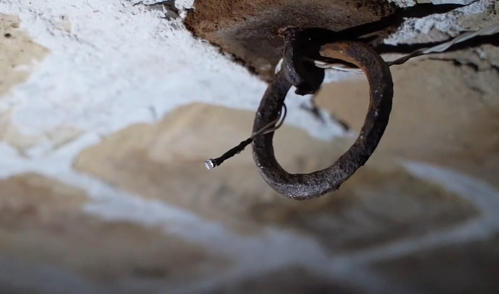
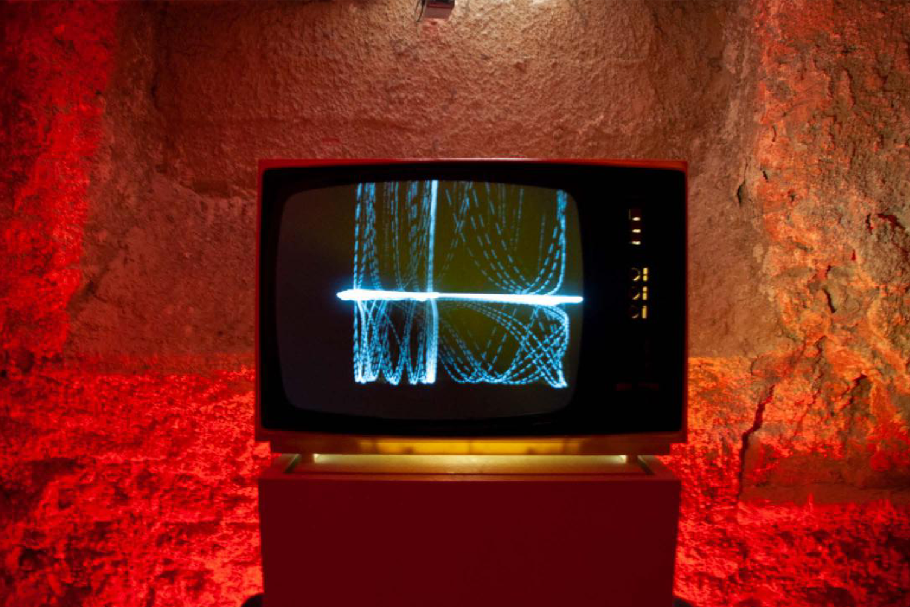

# investigaciones individuales

Nicolás Elías Valdés Greve / [nicolasvaldesgreve](<https://github.com/nicolasvaldesgreve/dis9079-2026-1/tree/main/29-nicolasvaldesgreve>)

## Sensor LDR

El sensor LDR (Light Dependent Resistor) o también llamado fotorresistencia, como lo dice su nombre, es un resistor el cual dependiendo de la intensidad de la luz va a ir cambiando su valor de resistencia, todo ésto es gracias a que está fabricado con un material semiconductor de sulfuro de cadmio (CdS), el cual le permite reaccionar a la luz visible ya que cuando caen los fotones sobre el LDR los electrones de la banda de valencia del material semiconductor son trasladados a la banda de conducción. Los cambios en el valor de su resistencia varían de la siguiente manera:

+ Mientras más iluminación haya, la resistencia disminuye.
+ Mientras menos iluminación haya, la resistencia aumenta.

Dentro de un esquemático el símbolo del LDR es el mismo que el de una resistencia, pero éste tiene dos flechas que caen sobre él para demostrar el cómo entra la luz.

uso del sensor
filtrado de información
visualización de datos
problemas comunes

+ <https://www.mechatronicstore.cl/sensor-de-deteccion-de-luz-fotosensible-digital/?srsltid=AfmBOooyaVFpS7vgsjQ7xQU6gjCxzt0Uxd_LYXZL8HfRX2tP1_rhH5VT>
+ <https://tecnosalva.com/que-es-y-como-funciona-una-ldr/>
+ 

## Sonitus Lucis - Arturo Yelo

> Ninguna de las imagenes presentadas en esta investigación me pertenecen, todas fueron rescatadas de la página del Museo Cristóbal Gabarrón en donde se muestra toda la documentación de la exposición de la obra.

Arturo Yelo es un artista sonoro nacido en el año 1989 en Abarán, ubicado en la Región de Murcia, España. Estudió en el Conservatorio Profesional de Murcia y desarrolló su carrera como saxofonista durante 8 años en la Agrupación Musical de Abarán y otros grupos musicales de rock en donde Mez-K es la que tuvo más éxito, en el cual participó durante el Viña Rock 2017.

En el año 2024 Arturo inicia su carrera como artista sonoro con la instalación "1984" la cual se ubicó en Cárcel Vieja de Murcia, pero no trabajó de manera solitaria en este proyecto, sino que fue ideado por él y desarrollado en colaboración con Juan Jesús Yelo, el cual es el actual secretario de la Asociación Murciana de Arte Sonoro y Música Experimental "Intonarumori" mientras que a la vez imparte talleres para la construcción de micrófonos de contacto y sintetizadores foto sensibles.

La instalación "Sonitus Lucis" forma parte del programa "Espacio La Bodega", el cual es dedicado a proyectos que exploran nuevas formas de diálogo entre el arte, el espacio y la materia en el cual Sonitus Lucis llega como una propuesta que explora la relación entre la luz, el sonido y la tecnología, invitando así al público a convertirse en parte de esta obra.

Arturo mencionó que la manera en la que nació Sonitus Lucis fue mediante una mezcla de emoción y una idea, lo cual da fruto a una inquietud propia y lo lleva a tener la necesidad de expresarlo, pero se pueden preguntar: ¿por qué mediante un sintetizador? pues durante una entrevista Arturo nos cuenta que lo que lo introdujo al área en el que está trabajando actualmente fue su interés por los sintetizadores de los años 80' de Vangelis (1943 - 2022), lo cual lo llevó a investigar sobre sintetizadores en donde se dio cuenta de que todos son capaces de poder crear su propio sintetizador, razón por la cual se dedicó a eso para poder comunicar sus inquietudes mediante sus creaciones.

Para Arturo, él considera que el oído es una herramienta que nos sirve para darnos cuenta de que todos podemos llegar a crear arte o algo nuevo que conmueva, razón por la que hizo esta instalación sonora e interactiva. Lo que permite que ésta obra sea interactiva y el público pueda intervenir cómo quiera el sonido, son los sintetizadores de onda cuadrada que incluyen un componente fotosensible, el cual es un LDR (Light Dependent Resistor) o fotorresistencia que se encuentran en el techo del espacio el cual es el que controla la tonalidad de la frecuencia, es decir, que cuando el público se acerca al LDR con una luz, va a ir aumentando la frecuencia hasta que estés muy cerca del LDR y llegues a su exposición máxima en donde vas a empezar a escuchar la configuración real del sintetizador.

Como mencioné anteriormente, la obra está hecha para que el público sea parte de ésta misma al ser interactiva mediante la luz, por lo cual todo fue montado en una sala oscurecida para que así las personas que estuvieran dentro pudieran utilizar las linternas de sus celulares, así activando el sonido mediante los sensores fotosensibles del LDR los cuales modifican en tiempo real el sonido del sintetizador.

Tanto la intensidad como el movimiento de la luz influyen en la composición sonora lo cual genera un paisaje auditivo cambiante e irrepetible, todo siendo demostrado de manera visual en el fondo del espacio, lugar en donde se encuentra el sintetizador con controles manuales el cual permite intervenir de manera directa y se conecta a una tv de tubo catódico el cual permite visualizar la onda sonora producida, mostrando así la conexión entre lo sonoro y lo visual

Esta obra fue inspirada en el pensamiento de Martin Heidegger (1889 - 1976) sobre la tecnología como una forma de revelación y en el concepto del Deep Listening, desarrollado por Pauline Oliveros (1932 - 2016), por lo que la obra replantea la relación entre el ser humano y la máquina. El público pasa de ser un receptor pasivo a convertirse en co-creador de la obra.

### Fuentes Artista

+ <https://museo.gabarron.org/Exposiciones/Sonitus-lucis-Arturo-Yelo>
+ <https://es.linkedin.com/in/arturo-yelo-4992b917b>
+ <https://abarandiaadia.com/art/13150/la-luz-se-convierte-en-sonido-en-la-nueva-instalacion-del-abaranero-arturo-yelo>
+ <https://in-sonora.org/ficha-artista/juan-jesus-yelo/>
+ <https://www.youtube.com/watch?v=anugJX3VaFA>
+ <https://www.youtube.com/watch?v=1Ssg4_gnPkY>

---

## Sensor

## Actuador

## Bibliografía
