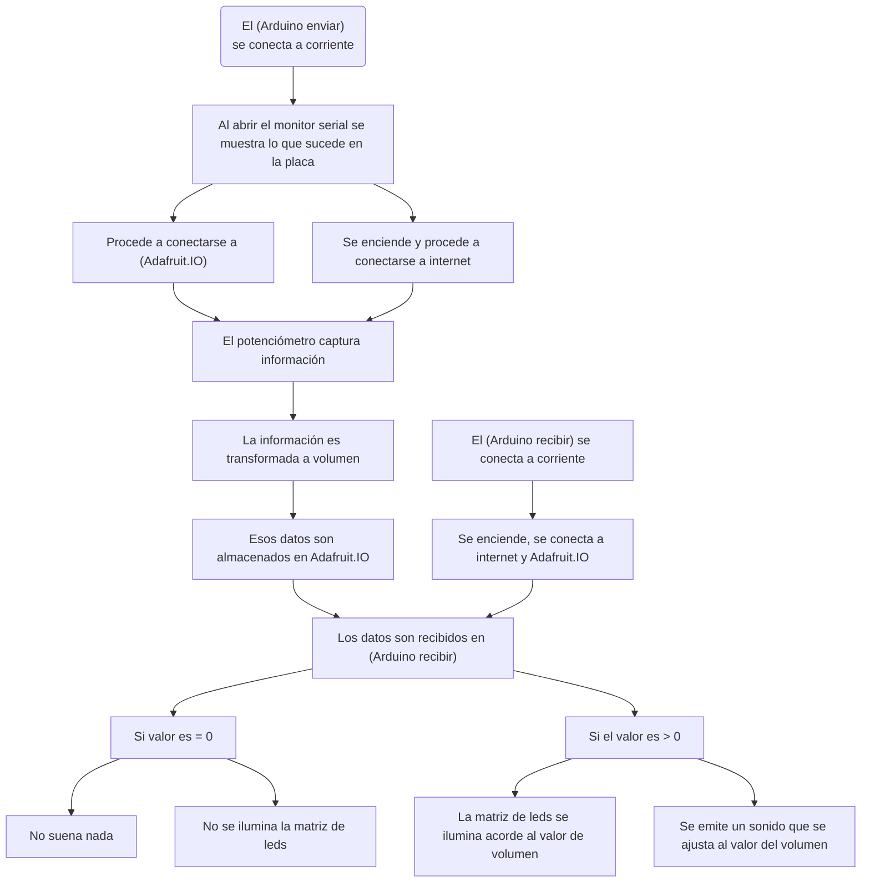

# solemne-02

# ⋆⭒˚.⋆ └[∵┌] - Grupo 06 - Soniloide - [┐∵]┘ ⋆.˚⭒⋆

Lunes 18 Mayo 2026

***

## Integrantes

* [Camila Parada](https://github.com/Camila-Parada): 
* [Vania Paredes](https://github.com/paredesvania): 

## Descripción del proyecto

 "Soniloide" es un dispositivo que produce sonido a distancia.
Inspirados en los instrumentos musicales de la empresa [“Maywa Denki”](https://www.maywadenki.com/) es que surge este nuevo artefacto. 

[](https://www.youtube.com/watch?v=fI1Mr4SIES4&t=1s)

▼ _Video de “Chan: cómo armar el Kit” (チャン　工作キットのつくり方)_

Mediante mecanismos, botones, un solenoide, placas programáticas con wifi y otros componentes es que se emiten ruidos mediante el envío y recepción de datos a través de [Adafruit IO](https://io.adafruit.com/welcome).

De forma más detallada el proyecto consta de enviar señales inalámbricamente. Para ello, tras conectar la RaspBerry Pi Pico 2W, el usuario puede observar la información en tiempo real del estado de la placa. Tras ello debe presionar un botón que permite el funcionamiento de un potenciómetro, el cual al girarlo envía un porcentaje (dato) a un Arduino R4 Wifi conectado a un solenoide. Dicha comunicación permite que el motor (solenoide) impulse los bracitos de “Soniloide” de forma rítmica, lo que produce un sonido por los platillos que este tiene anclado en sus extremos.

## Video en Funcionamiento

[](https://youtu.be/oNwlt8zLPlE?si=q5KmNvolMyJ7Z7kM)

▼ _Video funcionamiento piezas del proyecto (falta incluir carcasa)_


## Bill of materials

| Componentes         | Tipo  | Cantidad | Precio  | Enlace            |
| ------------------- | ----- | -------- | ------- | ----------------  |
| Arduino UNO R4 WiFi | Placa de desarrollo | 1   | $38.990 | <https://mcielectronics.cl/shop/product/43402/> |
| Raspberry Pi Pico 2 W | Placa de desarrollo | 1   | $14.990 | <https://mcielectronics.cl/shop/product/74358//> |
| Mini Protoboard 400 Puntos | Placa prototipado | 1  | $1.500 | <https://afel.cl/products/mini-protoboard-400-puntos> |
| Kit 200 Botones Pulsadores | Componente | 1 | $4.500 | <https://afel.cl/products/kit-200-botones-pulsadores-distintos-tamanos/> |
| Cable Dupont Macho Macho 10cm | Cable | Pack 40 | $2.590 | <https://mcielectronics.cl/shop/product/cable-dupont-macho-macho-20cm-pack-40-unidades/> |
| Mini Solenoide DC 5V | Componente | 1 | $ 3.980 | <https://hubot.cl/producto/mini-solenoide%C2%82-dc-5v/> |
| Relé de 01 Canal | Componente | 1 | $1.300 | <https://afel.cl/products/rele-de-01-canal> |
| Transformador Cargador Fuente De Alimentación 5V 2A | Fuente de poder | 1 | $ 3.490 | <https://www.mechatronicstore.cl/transformador-cargador-fuente-de-alimentacion-5v-2a/> |
| Adaptador jack DC hembra | Componente | 1 | $ 790 | <https://www.mechatronicstore.cl/adaptador-jack-dc-hembra/> |
| Potenciometro B100K | Componente | 1 | $495 | <https://altronics.cl/potenciometro-lineal-100k-b100k> |
| Pantalla LCD OLED 0,96 | Componente | 1 | $4.500 | <https://afel.cl/products/pantalla-lcd-oled-azul-y-amarillo-0-96> |

## Input: Raspberry pi pico 2w con Sensor

La primera pieza a crear es el circuito con el emisor. Para ello he de usar la placa previamente mencionada con un botón conectado. A continuación se desarrolla el código en VS Code para poder realizar las lecturas de un botón y un potenciómetro para enviarlas a Adafruit IO. Cabe mencionar que la información mostrada en la terminal aparece en un OLED conectado al circuito.

### Código para enviar

```cpp
# ============================================================
# Raspberry Pi Pico 2W — Potenciómetro + botón switch + OLED
# Envío de datos a Adafruit IO con pantalla de estado
# ============================================================
# CONEXIONES:
#   Botón:        un extremo → GP14, otro extremo → GND
#   Potenciómetro: señal → GP26 (ADC0), patas → 3V3 y GND
#   OLED SSD1306:  VCC → 3V3, GND → GND, SDA → GP4, SCL → GP5
# ============================================================

import time
import board
import digitalio
import analogio
import busio
import wifi
import socketpool
import adafruit_minimqtt.adafruit_minimqtt as MQTT

import displayio
import i2cdisplaybus
import terminalio
from adafruit_display_text import label
import adafruit_displayio_ssd1306

# ------------------------------------------------------------
# CONFIGURACIÓN
# ------------------------------------------------------------
WIFI_SSID     = "WiFi_Mesh-075408"
WIFI_PASSWORD = "y3Fk6ush"

AIO_USERNAME  = "Camila_Parada"
AIO_KEY       = ""

FEED          = f"{AIO_USERNAME}/feeds/papa-prueba"

PIN_BOTON     = board.GP14
PIN_POT       = board.GP26
PIN_SDA       = board.GP4
PIN_SCL       = board.GP5

DEBOUNCE_MS   = 50
ENVIO_MS      = 250
UMBRAL_CAMBIO = 500
MQTT_LOOP_INTERVAL_MS = 500
# ------------------------------------------------------------

# --- Inicializar pantalla OLED ---
displayio.release_displays()
i2c = busio.I2C(PIN_SCL, PIN_SDA)
display_bus = i2cdisplaybus.I2CDisplayBus(i2c, device_address=0x3C)
oled = adafruit_displayio_ssd1306.SSD1306(display_bus, width=128, height=64)

# Grupo de elementos en pantalla
splash = displayio.Group()
oled.root_group = splash

# Tres líneas de texto reutilizables
linea_titulo = label.Label(terminalio.FONT, text="", x=0, y=8)
linea_estado = label.Label(terminalio.FONT, text="", x=0, y=30)
linea_valor  = label.Label(terminalio.FONT, text="", x=0, y=52)
splash.append(linea_titulo)
splash.append(linea_estado)
splash.append(linea_valor)

def mostrar(titulo=None, estado=None, valor=None):
    if titulo is not None:
        linea_titulo.text = titulo
    if estado is not None:
        linea_estado.text = estado
    if valor is not None:
        linea_valor.text = valor

mostrar("Iniciando...", "", "")

# --- Botón ---
boton = digitalio.DigitalInOut(PIN_BOTON)
boton.direction = digitalio.Direction.INPUT
boton.pull = digitalio.Pull.UP

# --- Potenciómetro ---
pot = analogio.AnalogIn(PIN_POT)

# --- WiFi ---
def conectar_wifi():
    while True:
        try:
            mostrar("Conectando WiFi", "", "")
            print("Conectando a WiFi...")
            wifi.radio.connect(WIFI_SSID, WIFI_PASSWORD)
            print(f"Conectado! IP: {wifi.radio.ipv4_address}")
            return
        except Exception as e:
            print(f"Fallo WiFi ({e}). Reintento en 5s...")
            mostrar("Error WiFi", "Reintentando...", "")
            time.sleep(5)

conectar_wifi()

pool = socketpool.SocketPool(wifi.radio)
mqtt = MQTT.MQTT(
    broker="io.adafruit.com",
    port=1883,
    username=AIO_USERNAME,
    password=AIO_KEY,
    socket_pool=pool,
    socket_timeout=1,
    connect_retries=2,
    keep_alive=60,
)

def conectar_mqtt():
    intentos = 0
    while True:
        try:
            if not wifi.radio.connected:
                conectar_wifi()
            mostrar("Conectando", "Adafruit IO...", "")
            print("Conectando a Adafruit IO...")
            mqtt.connect()
            print("¡Conectado a Adafruit IO!")
            return
        except Exception as e:
            intentos += 1
            espera = min(3 * intentos, 30)
            print(f"Fallo al conectar ({e}). Reintento en {espera}s...")
            mostrar("Error conexion", f"Reintento {espera}s", "")
            time.sleep(espera)

def publicar(valor):
    try:
        mqtt.publish(FEED, valor)
        print(f"   ✓ Publicado: {valor}")
    except Exception as e:
        print(f"Error al publicar ({e}). Reconectando...")
        try:
            mqtt.disconnect()
        except:
            pass
        conectar_mqtt()
        try:
            mqtt.publish(FEED, valor)
        except Exception as e2:
            print(f"Error tras reconexión: {e2}")

conectar_mqtt()

def leer_pot_porcentaje():
    return int((pot.value / 65535) * 100)

# --- Variables de estado ---
encendido        = False
estado_boton_ant = True
ultimo_cambio_b  = 0
ultimo_envio     = 0
ultima_lectura   = -9999
ultimo_loop_mqtt = 0

# Pantalla inicial: instrucción al usuario
mostrar("Listo!", "Presiona y gira", "Estado: APAGADO")
print("=== Listo ===")
print("Presiona el botón para ENCENDER el envío del potenciómetro")
print()

while True:
    ahora = time.monotonic_ns() // 1_000_000

    # ----- BOTÓN: toggle -----
    presionado = not boton.value
    if presionado != (not estado_boton_ant):
        if (ahora - ultimo_cambio_b) > DEBOUNCE_MS:
            ultimo_cambio_b = ahora
            estado_boton_ant = boton.value
            if presionado:
                encendido = not encendido
                if encendido:
                    print(">>> ENCENDIDO")
                    mostrar("ENCENDIDO", "Gira el pot", "Pot: ---")
                else:
                    print(">>> APAGADO")
                   mostrar("APAGADO", "Presiona y gira", "Estado: OFF")
                    publicar("0")

    # ----- POTENCIÓMETRO: solo si está encendido -----
    if encendido and (ahora - ultimo_envio) > ENVIO_MS:
        lectura_cruda = pot.value
        if abs(lectura_cruda - ultima_lectura) > UMBRAL_CAMBIO:
            ultima_lectura = lectura_cruda
            ultimo_envio = ahora
            valor = leer_pot_porcentaje()
            print(f"    Pot = {valor}%")
            mostrar("ENCENDIDO", "Gira el pot", f"Pot: {valor}%")
            publicar(str(valor))

    # ----- Mantener viva la conexión MQTT -----
    if (ahora - ultimo_loop_mqtt) > MQTT_LOOP_INTERVAL_MS:
        ultimo_loop_mqtt = ahora
        try:
            mqtt.loop(timeout=1)
        except Exception as e:
            print(f"Conexión perdida ({e}). Reconectando...")
            try:
                mqtt.disconnect()
            except:
                pass
            conectar_mqtt()
```

## Output: Arduino UNO R4 Wifi con Solenoide

Para la recepción de la información y activación del solenoide fue necesaria la construcción de un circuito que impique conectar el arduino a dicho motor. Este último a su vez se encuentra cableado a un relé de 1 canal cuya alimentación se debe una fuente de poder de 5V y 2A (corriente eléctrica). Para su funcionamiento requiere si o si de tener energía tanto para la placa como para el relé. Ya con todo conectado, es necesaria la recepción de los datos desde Adafruit IO para el movimiento del solenoide.

### Código para recibir

```cpp
// ============================================================
// Arduino UNO R4 WiFi — Receptor MQTT → Relé → Solenoide
// El potenciómetro controla la FRECUENCIA de golpes
//
// LIBRERÍAS (Library Manager):
//   "Adafruit MQTT Library" by Adafruit
//   "WiFiS3" viene con el soporte del R4
//
// PROTOCOLO (feed: papa-prueba):
//   "0"        → detener (sin golpes)
//   "1".."100" → frecuencia de golpes (mayor = más rápido)
//
// NOTA: el ZHO-0420S es pull-type y golpea al DESACTIVARSE.
// ============================================================

#include <WiFiS3.h>
#include <Adafruit_MQTT.h>
#include <Adafruit_MQTT_Client.h>

// ---- CONFIGURACIÓN ----------------------------------------
const char* WIFI_SSID     = "WiFi_Mesh-075408";
const char* WIFI_PASSWORD = "y3Fk6ush";

const char* AIO_SERVER    = "io.adafruit.com";
const int   AIO_PORT      = 1883;
const char* AIO_USERNAME  = "Camila_Parada";
const char* AIO_KEY       = "";

const char* AIO_FEED      = "Camila_Parada/feeds/papa-prueba";

const int   RELE_PIN      = 7;
const int   PULSO_MS      = 60;   // duración energizado de cada golpe

// Rango de frecuencia (en ms entre golpes)
const long  INTERVALO_MIN = 200;   // a 100% → golpe cada 200ms (~5/seg)
const long  INTERVALO_MAX = 2000;  // a 1%   → golpe cada 2000ms (1 cada 2s)
// -----------------------------------------------------------

WiFiClient wifiClient;
Adafruit_MQTT_Client mqtt(&wifiClient, AIO_SERVER, AIO_PORT,
                          AIO_USERNAME, AIO_KEY);

Adafruit_MQTT_Subscribe feed =
    Adafruit_MQTT_Subscribe(&mqtt, AIO_FEED);

int  nivelActual      = 0;       // 0-100, controla la frecuencia
long intervaloGolpe   = 0;       // ms entre golpes (0 = detenido)
unsigned long ultimoGolpe = 0;

// ============================================================
void setup() {
  Serial.begin(115200);
  delay(1000);

  pinMode(RELE_PIN, OUTPUT);
  digitalWrite(RELE_PIN, LOW);

  Serial.println("=== Receptor MQTT — Solenoide por frecuencia ===");

  Serial.print("Conectando a WiFi");
  WiFi.begin(WIFI_SSID, WIFI_PASSWORD);
  while (WiFi.status() != WL_CONNECTED) {
    delay(500);
    Serial.print(".");
  }
  Serial.println();

  Serial.print("Esperando IP");
  while (WiFi.localIP() == IPAddress(0, 0, 0, 0)) {
    delay(300);
    Serial.print(".");
  }
  Serial.println();
  Serial.print("Conectado! IP: ");
  Serial.println(WiFi.localIP());
  delay(500);

  mqtt.subscribe(&feed);
  conectarMQTT();
  Serial.println("Esperando datos del potenciometro...");
}

// ============================================================
void loop() {
  if (!mqtt.connected()) conectarMQTT();
  mqtt.processPackets(50);

  // --- Leer mensajes entrantes ---
  Adafruit_MQTT_Subscribe* sub;
  while ((sub = mqtt.readSubscription(50))) {
    if (sub == &feed) {
      String msg = String((char*)feed.lastread);
      int valor = msg.toInt();   // convierte a número
      nivelActual = valor;

      Serial.print("Recibido: ");
      Serial.print(valor);
      Serial.print("% -> ");

      if (valor <= 0) {
        intervaloGolpe = 0;  // detenido
        Serial.println("DETENIDO");
      } else {
        // Mapear 1-100% a intervalo (mayor % = menor intervalo = más rápido)
        intervaloGolpe = map(valor, 1, 100, INTERVALO_MAX, INTERVALO_MIN);
        Serial.print("golpe cada ");
        Serial.print(intervaloGolpe);
        Serial.println(" ms");
      }
    }
  }

  // --- Generar golpes según la frecuencia ---
  if (intervaloGolpe > 0) {
    unsigned long ahora = millis();
    if (ahora - ultimoGolpe >= intervaloGolpe) {
      ultimoGolpe = ahora;
      dispararSolenoide();
    }
  }
}

// ============================================================
void dispararSolenoide() {
  Serial.println(">>> GOLPE");
  digitalWrite(RELE_PIN, HIGH);  // energiza (retrae el émbolo)
  delay(PULSO_MS);
  digitalWrite(RELE_PIN, LOW);   // suelta → golpe al final
}

// ============================================================
void conectarMQTT() {
  Serial.print("Conectando a Adafruit IO");
  int8_t ret;
  uint8_t intentos = 0;
  while ((ret = mqtt.connect()) != 0) {
    Serial.print(".");
    Serial.println(mqtt.connectErrorString(ret));
    mqtt.disconnect();
    delay(3000);
    intentos++;
    if (intentos > 5) {
      Serial.println("Reseteando WiFi...");
      WiFi.begin(WIFI_SSID, WIFI_PASSWORD);
      intentos = 0;
    }
  }
  Serial.println(" Conectado!");
}
```

* Los archivos tipo "config.h" fueron modificados en las credenciales de la "cuenta de adafruit" y se utilizó el internet del lid para su funcionamiento.

## Mapa de flujo



## Modelado de carcasa e impresión 3D

Para esta parte Felix nos ayudó con el modelado de la carcasa, dado problemas previos con las tolerancias y el mecanismo. El modelado fue impreso en PLA transparente en la impresora Bambu  x1c.


 

  
  

## Animaciones del proyecto


## Investigaciones individuales

Aportes, información y exploraciones personales compartidas con el equipo.

- [Camila Parada.md](./persona-01.md) 

- [Vania Paredes.md](./persona-02.md)

## Bibliografía

* <https://learn.adafruit.com/series/adafruit-io-basics>
* <https://github.com/adafruit/Adafruit_IO_Arduino>
* <https://github.com/adafruit/Adafruit_IO_Arduino/blob/master/examples/adafruitio_01_subscribe/adafruitio_01_subscribe.ino>
* <https://docs.arduino.cc/tutorials/uno-r4-wifi/wifi-examples/#wi-fi-udp-send-receive-string>
* <https://pip-assets.raspberrypi.com/categories/1088-raspberry-pi-pico-2-w/documents/RP-008305-DS-1-pico-2-w-pinout.pdf>
* <https://www.youtube.com/watch?v=nwVRMU9grSI&t=501s>
* <https://youtu.be/fI1Mr4SIES4?si=58ErEgpNSsdA2vBf>
* <https://www.youtube.com/watch?v=RfrDtAEQ95c&t=6s>
* <https://www.youtube.com/watch?v=O7uXMCD8bZM>
* <http://www.zonhen.com/solenoid/ZHO-0420-en.html>
