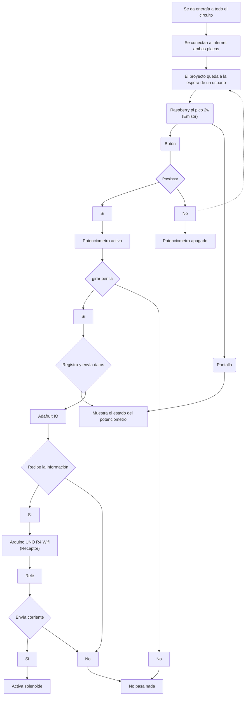
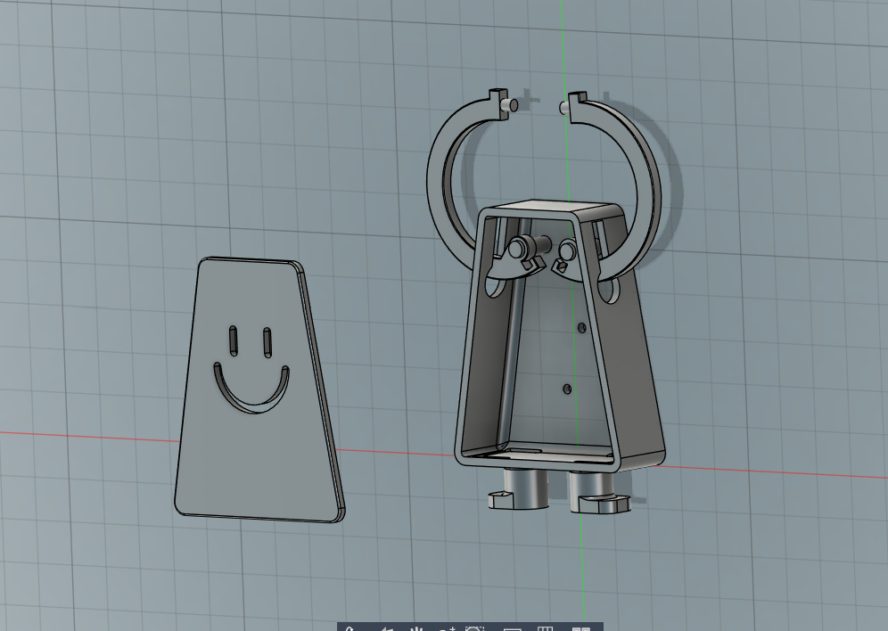
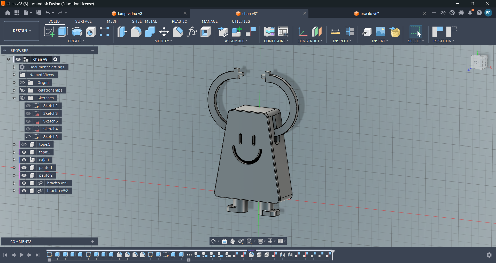
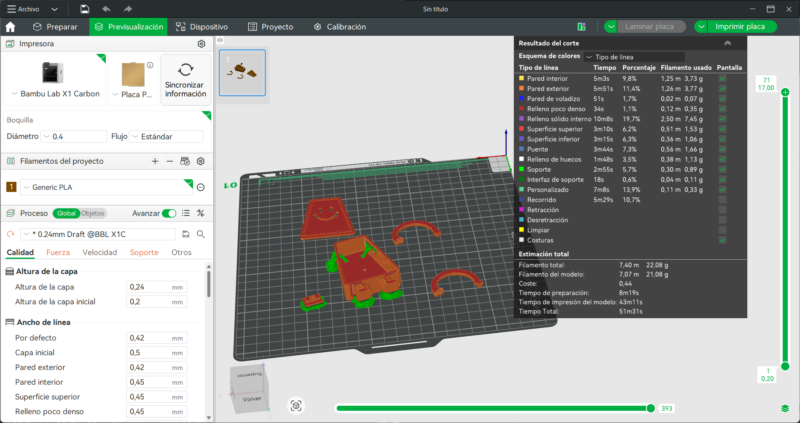
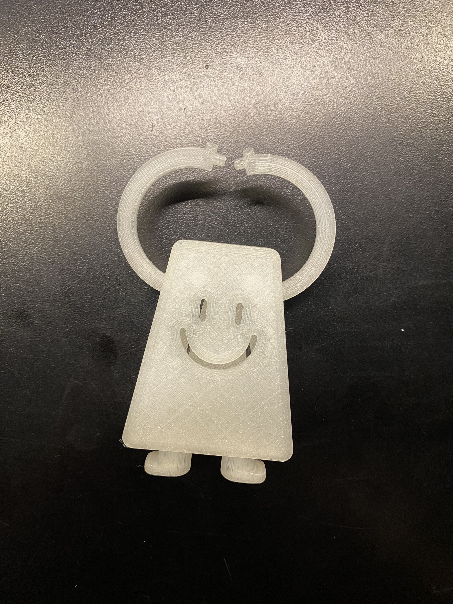
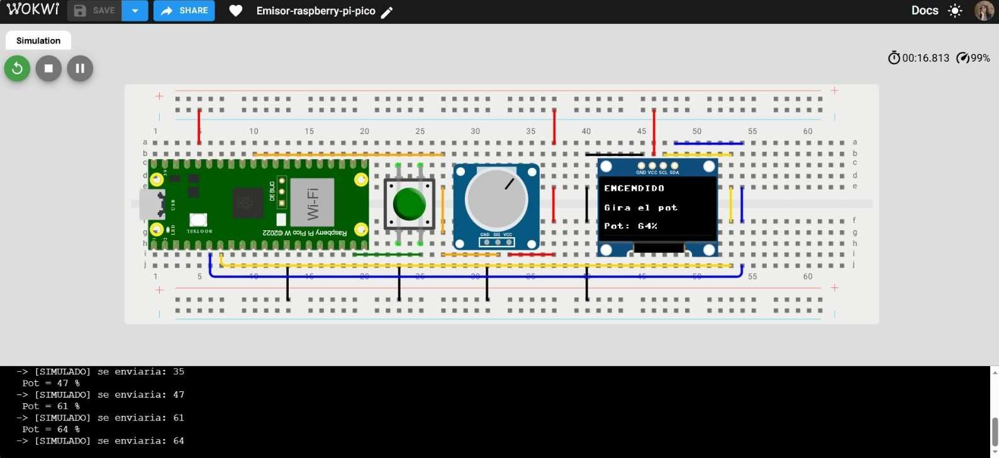
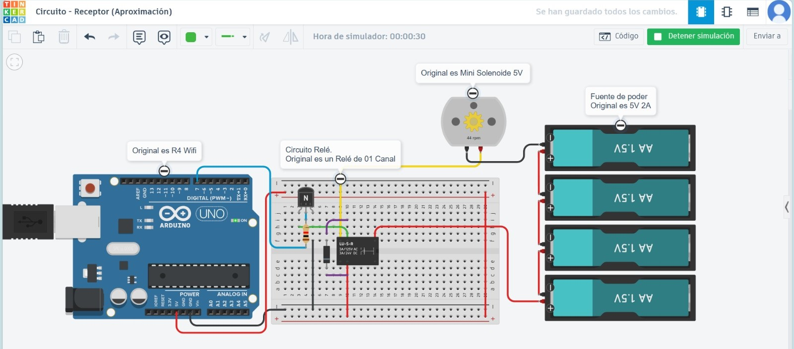

# solemne-02

# ⋆⭒˚.⋆ └[∵┌] - Grupo 06 - Soniloide - [┐∵]┘ ⋆.˚⭒⋆

Lunes 18 Mayo 2026

***

## Integrantes

* [Camila Parada](https://github.com/Camila-Parada): Código, circuito, investigación e ideas
* [Vania Paredes](https://github.com/paredesvania): Código, modelado e impresión 3D, registro

## Descripción del proyecto

_**"Soniloide"**_ es un dispositivo que produce sonido a distancia.
Inspirados en los instrumentos musicales de la empresa [“Maywa Denki”](https://www.maywadenki.com/) es que surge este nuevo artefacto. 

▼ _Video de “Chan: cómo armar el Kit” (チャン　工作キットのつくり方)_

[](https://www.youtube.com/watch?v=fI1Mr4SIES4&t=1s)

El proyecto consiste en un sistema de comunicación inalámbrica capaz de controlar una acción física a distancia. A través de la plataforma [Adafruit IO](https://io.adafruit.com/welcome), una Raspberry Pi Pico 2W envía datos en tiempo real a un Arduino R4 WiFi, el cual activa un solenoide que da vida al artefacto.

El flujo de funcionamiento es el siguiente: el usuario conecta la Raspberry Pi Pico 2W y puede monitorear en tiempo real el estado de la placa. Al presionar un botón, se habilita un potenciómetro que, al girarse, envía un valor porcentual a través de Adafruit IO hacia el Arduino R4 WiFi. Este último, al recibir la señal, acciona el solenoide, el cual mueve rítmicamente los brazos de "Soniloide". Cada oscilación hace que los platillos ubicados en los extremos de esos brazos golpeen entre sí, generando sonido.

En síntesis, "Soniloide" traduce el giro de un potenciómetro en movimiento mecánico y, finalmente, en música.

## Primer acercamiento en clases


## Video en Funcionamiento

[](https://youtu.be/oNwlt8zLPlE?si=q5KmNvolMyJ7Z7kM)

▼ _Video funcionamiento piezas del proyecto (falta incluir carcasa)_


## Bill of materials

| Componentes         | Tipo  | Cantidad | Precio  | Enlace            |
| ------------------- | ----- | -------- | ------- | ----------------  |
| Arduino UNO R4 WiFi | Placa de desarrollo | 1   | $38.990 | <https://mcielectronics.cl/shop/product/43402/> |
| Raspberry Pi Pico 2 W | Placa de desarrollo | 1   | $14.990 | <https://mcielectronics.cl/shop/product/74358//> |
| Mini Protoboard 400 Puntos | Placa prototipado | 1  | $1.500 | <https://afel.cl/products/mini-protoboard-400-puntos> |
| Kit 200 Botones Pulsadores | Componente | 1 | $4.500 | <https://afel.cl/products/kit-200-botones-pulsadores-distintos-tamanos/> |
| Cable Dupont Macho Macho 10cm | Cable | Pack 40 | $2.590 | <https://mcielectronics.cl/shop/product/cable-dupont-macho-macho-20cm-pack-40-unidades/> |
| Mini Solenoide DC 5V | Componente | 1 | $ 3.980 | <https://hubot.cl/producto/mini-solenoide%C2%82-dc-5v/> |
| Relé de 01 Canal | Componente | 1 | $1.300 | <https://afel.cl/products/rele-de-01-canal> |
| Transformador Cargador Fuente De Alimentación 5V 2A | Fuente de poder | 1 | $ 3.490 | <https://www.mechatronicstore.cl/transformador-cargador-fuente-de-alimentacion-5v-2a/> |
| Adaptador jack DC hembra | Componente | 1 | $ 790 | <https://www.mechatronicstore.cl/adaptador-jack-dc-hembra/> |
| Potenciometro B100K | Componente | 1 | $495 | <https://altronics.cl/potenciometro-lineal-100k-b100k> |
| Pantalla LCD OLED 0,96 | Componente | 1 | $4.500 | <https://afel.cl/products/pantalla-lcd-oled-azul-y-amarillo-0-96> |

## Input: Raspberry pi pico 2w con Sensor

El circuito emisor se construye en torno a la Raspberry Pi Pico 2W, a la que se conectan un botón y un potenciómetro como elementos de entrada. El botón actúa como habilitador: al presionarlo, permite que el giro del potenciómetro sea leído y procesado. El valor resultante, expresado como un porcentaje, se transmite de forma inalámbrica hacia Adafruit IO.

El código se desarrolla en VS Code y gestiona la lectura simultánea de ambos componentes, así como el envío del dato a la plataforma. Adicionalmente, la información que normalmente se imprimiría en la terminal se redirige a una pantalla OLED conectada al circuito, lo que permite monitorear el estado del dispositivo en tiempo real.

### Código para enviar

```cpp
# ============================================================
# Raspberry Pi Pico 2W — Potenciómetro + botón switch + OLED
# Envío de datos a Adafruit IO con pantalla de estado
# ============================================================
# CONEXIONES:
#   Botón:        un extremo → GP14, otro extremo → GND
#   Potenciómetro: señal → GP26 (ADC0), patas → 3V3 y GND
#   OLED SSD1306:  VCC → 3V3, GND → GND, SDA → GP4, SCL → GP5
# ============================================================

import time
import board
import digitalio
import analogio
import busio
import wifi
import socketpool
import adafruit_minimqtt.adafruit_minimqtt as MQTT

import displayio
import i2cdisplaybus
import terminalio
from adafruit_display_text import label
import adafruit_displayio_ssd1306

# ------------------------------------------------------------
# CONFIGURACIÓN
# ------------------------------------------------------------
WIFI_SSID     = "iPhone-cs"
WIFI_PASSWORD = "lasagna342"

AIO_USERNAME  = "Camila_Parada"
AIO_KEY       = "Clave-io"

FEED          = f"{AIO_USERNAME}/feeds/papa-prueba"

PIN_BOTON     = board.GP14
PIN_POT       = board.GP26
PIN_SDA       = board.GP4
PIN_SCL       = board.GP5

DEBOUNCE_MS   = 50
ENVIO_MS      = 250
UMBRAL_CAMBIO = 500
MQTT_LOOP_INTERVAL_MS = 500
# ------------------------------------------------------------

# --- Inicializar pantalla OLED ---
displayio.release_displays()
i2c = busio.I2C(PIN_SCL, PIN_SDA)
display_bus = i2cdisplaybus.I2CDisplayBus(i2c, device_address=0x3C)
oled = adafruit_displayio_ssd1306.SSD1306(display_bus, width=128, height=64)

# Grupo de elementos en pantalla
splash = displayio.Group()
oled.root_group = splash

# Tres líneas de texto reutilizables
linea_titulo = label.Label(terminalio.FONT, text="", x=0, y=8)
linea_estado = label.Label(terminalio.FONT, text="", x=0, y=30)
linea_valor  = label.Label(terminalio.FONT, text="", x=0, y=52)
splash.append(linea_titulo)
splash.append(linea_estado)
splash.append(linea_valor)

def mostrar(titulo=None, estado=None, valor=None):
    if titulo is not None:
        linea_titulo.text = titulo
    if estado is not None:
        linea_estado.text = estado
    if valor is not None:
        linea_valor.text = valor

mostrar("Iniciando...", "", "")

# --- Botón ---
boton = digitalio.DigitalInOut(PIN_BOTON)
boton.direction = digitalio.Direction.INPUT
boton.pull = digitalio.Pull.UP

# --- Potenciómetro ---
pot = analogio.AnalogIn(PIN_POT)

# --- WiFi ---
def conectar_wifi():
    while True:
        try:
            mostrar("Conectando WiFi", "", "")
            print("Conectando a WiFi...")
            wifi.radio.connect(WIFI_SSID, WIFI_PASSWORD)
            print(f"Conectado! IP: {wifi.radio.ipv4_address}")
            return
        except Exception as e:
            print(f"Fallo WiFi ({e}). Reintento en 5s...")
            mostrar("Error WiFi", "Reintentando...", "")
            time.sleep(5)

conectar_wifi()

pool = socketpool.SocketPool(wifi.radio)
mqtt = MQTT.MQTT(
    broker="io.adafruit.com",
    port=1883,
    username=AIO_USERNAME,
    password=AIO_KEY,
    socket_pool=pool,
    socket_timeout=1,
    connect_retries=2,
    keep_alive=60,
)

def conectar_mqtt():
    intentos = 0
    while True:
        try:
            if not wifi.radio.connected:
                conectar_wifi()
            mostrar("Conectando", "Adafruit IO...", "")
            print("Conectando a Adafruit IO...")
            mqtt.connect()
            print("¡Conectado a Adafruit IO!")
            return
        except Exception as e:
            intentos += 1
            espera = min(3 * intentos, 30)
            print(f"Fallo al conectar ({e}). Reintento en {espera}s...")
            mostrar("Error conexion", f"Reintento {espera}s", "")
            time.sleep(espera)

def publicar(valor):
    try:
        mqtt.publish(FEED, valor)
        print(f"   ✓ Publicado: {valor}")
    except Exception as e:
        print(f"Error al publicar ({e}). Reconectando...")
        try:
            mqtt.disconnect()
        except:
            pass
        conectar_mqtt()
        try:
            mqtt.publish(FEED, valor)
        except Exception as e2:
            print(f"Error tras reconexión: {e2}")

conectar_mqtt()

def leer_pot_porcentaje():
    return int((pot.value / 65535) * 100)

# --- Variables de estado ---
encendido        = False
estado_boton_ant = True
ultimo_cambio_b  = 0
ultimo_envio     = 0
ultima_lectura   = -9999
ultimo_loop_mqtt = 0

# Pantalla inicial: instrucción al usuario
mostrar("Listo!", "Presiona y gira", "Estado: APAGADO")
print("=== Listo ===")
print("Presiona el botón para ENCENDER el envío del potenciómetro")
print()

while True:
    ahora = time.monotonic_ns() // 1_000_000

    # ----- BOTÓN: toggle -----
    presionado = not boton.value
    if presionado != (not estado_boton_ant):
        if (ahora - ultimo_cambio_b) > DEBOUNCE_MS:
            ultimo_cambio_b = ahora
            estado_boton_ant = boton.value
            if presionado:
                encendido = not encendido
                if encendido:
                    print(">>> ENCENDIDO")
                    mostrar("ENCENDIDO", "Gira el pot", "Pot: ---")
                else:
                    print(">>> APAGADO")
                   mostrar("APAGADO", "Presiona y gira", "Estado: OFF")
                    publicar("0")

    # ----- POTENCIÓMETRO: solo si está encendido -----
    if encendido and (ahora - ultimo_envio) > ENVIO_MS:
        lectura_cruda = pot.value
        if abs(lectura_cruda - ultima_lectura) > UMBRAL_CAMBIO:
            ultima_lectura = lectura_cruda
            ultimo_envio = ahora
            valor = leer_pot_porcentaje()
            print(f"    Pot = {valor}%")
            mostrar("ENCENDIDO", "Gira el pot", f"Pot: {valor}%")
            publicar(str(valor))

    # ----- Mantener viva la conexión MQTT -----
    if (ahora - ultimo_loop_mqtt) > MQTT_LOOP_INTERVAL_MS:
        ultimo_loop_mqtt = ahora
        try:
            mqtt.loop(timeout=1)
        except Exception as e:
            print(f"Conexión perdida ({e}). Reconectando...")
            try:
                mqtt.disconnect()
            except:
                pass
            conectar_mqtt()
```

## Output: Arduino UNO R4 Wifi con Solenoide

El circuito receptor se construye en torno al Arduino UNO R4 WiFi, encargado de recibir los datos desde Adafruit IO y traducirlos en una acción física. Para controlar el solenoide, un motor que requiere mayor corriente de la que la placa puede entregar directamente, se incorpora un relé de 1 canal como elemento intermediario.

El sistema requiere una doble alimentación: la placa opera con su fuente habitual, mientras que el relé y el solenoide se alimentan desde una fuente de poder externa de 5V y 2A. Esta separación es indispensable para el correcto funcionamiento del conjunto, ya que sin energía suficiente en ambos circuitos el solenoide no puede accionarse.

Una vez que todo el circuito está conectado y energizado, el Arduino se mantiene a la escucha de los valores publicados en Adafruit IO. Al recibir un dato, activa o desactiva el relé según corresponda, lo que produce el movimiento del solenoide.

### Código para recibir

```cpp
// ============================================================
// Arduino UNO R4 WiFi — Receptor MQTT → Relé → Solenoide
// El potenciómetro controla la FRECUENCIA de golpes
//
// LIBRERÍAS (Library Manager):
//   "Adafruit MQTT Library" by Adafruit
//   "WiFiS3" viene con el soporte del R4
//
// PROTOCOLO (feed: papa-prueba):
//   "0"        → detener (sin golpes)
//   "1".."100" → frecuencia de golpes (mayor = más rápido)
//
// NOTA: el ZHO-0420S es pull-type y golpea al DESACTIVARSE.
// ============================================================

#include <WiFiS3.h>
#include <Adafruit_MQTT.h>
#include <Adafruit_MQTT_Client.h>

// ---- CONFIGURACIÓN ----------------------------------------
const char* WIFI_SSID     = "iPhone-cs";
const char* WIFI_PASSWORD = "lasagna342";

const char* AIO_SERVER    = "io.adafruit.com";
const int   AIO_PORT      = 1883;
const char* AIO_USERNAME  = "Camila_Parada";
const char* AIO_KEY       = "Clave-io";

const char* AIO_FEED      = "Camila_Parada/feeds/papa-prueba";

const int   RELE_PIN      = 7;
const int   PULSO_MS      = 60;   // duración energizado de cada golpe

// Rango de frecuencia (en ms entre golpes)
const long  INTERVALO_MIN = 200;   // a 100% → golpe cada 200ms (~5/seg)
const long  INTERVALO_MAX = 2000;  // a 1%   → golpe cada 2000ms (1 cada 2s)
// -----------------------------------------------------------

WiFiClient wifiClient;
Adafruit_MQTT_Client mqtt(&wifiClient, AIO_SERVER, AIO_PORT,
                          AIO_USERNAME, AIO_KEY);

Adafruit_MQTT_Subscribe feed =
    Adafruit_MQTT_Subscribe(&mqtt, AIO_FEED);

int  nivelActual      = 0;       // 0-100, controla la frecuencia
long intervaloGolpe   = 0;       // ms entre golpes (0 = detenido)
unsigned long ultimoGolpe = 0;

// ============================================================
void setup() {
  Serial.begin(115200);
  delay(1000);

  pinMode(RELE_PIN, OUTPUT);
  digitalWrite(RELE_PIN, LOW);

  Serial.println("=== Receptor MQTT — Solenoide por frecuencia ===");

  Serial.print("Conectando a WiFi");
  WiFi.begin(WIFI_SSID, WIFI_PASSWORD);
  while (WiFi.status() != WL_CONNECTED) {
    delay(500);
    Serial.print(".");
  }
  Serial.println();

  Serial.print("Esperando IP");
  while (WiFi.localIP() == IPAddress(0, 0, 0, 0)) {
    delay(300);
    Serial.print(".");
  }
  Serial.println();
  Serial.print("Conectado! IP: ");
  Serial.println(WiFi.localIP());
  delay(500);

  mqtt.subscribe(&feed);
  conectarMQTT();
  Serial.println("Esperando datos del potenciometro...");
}

// ============================================================
void loop() {
  if (!mqtt.connected()) conectarMQTT();
  mqtt.processPackets(50);

  // --- Leer mensajes entrantes ---
  Adafruit_MQTT_Subscribe* sub;
  while ((sub = mqtt.readSubscription(50))) {
    if (sub == &feed) {
      String msg = String((char*)feed.lastread);
      int valor = msg.toInt();   // convierte a número
      nivelActual = valor;

      Serial.print("Recibido: ");
      Serial.print(valor);
      Serial.print("% -> ");

      if (valor <= 0) {
        intervaloGolpe = 0;  // detenido
        Serial.println("DETENIDO");
      } else {
        // Mapear 1-100% a intervalo (mayor % = menor intervalo = más rápido)
        intervaloGolpe = map(valor, 1, 100, INTERVALO_MAX, INTERVALO_MIN);
        Serial.print("golpe cada ");
        Serial.print(intervaloGolpe);
        Serial.println(" ms");
      }
    }
  }

  // --- Generar golpes según la frecuencia ---
  if (intervaloGolpe > 0) {
    unsigned long ahora = millis();
    if (ahora - ultimoGolpe >= intervaloGolpe) {
      ultimoGolpe = ahora;
      dispararSolenoide();
    }
  }
}

// ============================================================
void dispararSolenoide() {
  Serial.println(">>> GOLPE");
  digitalWrite(RELE_PIN, HIGH);  // energiza (retrae el émbolo)
  delay(PULSO_MS);
  digitalWrite(RELE_PIN, LOW);   // suelta → golpe al final
}

// ============================================================
void conectarMQTT() {
  Serial.print("Conectando a Adafruit IO");
  int8_t ret;
  uint8_t intentos = 0;
  while ((ret = mqtt.connect()) != 0) {
    Serial.print(".");
    Serial.println(mqtt.connectErrorString(ret));
    mqtt.disconnect();
    delay(3000);
    intentos++;
    if (intentos > 5) {
      Serial.println("Reseteando WiFi...");
      WiFi.begin(WIFI_SSID, WIFI_PASSWORD);
      intentos = 0;
    }
  }
  Serial.println(" Conectado!");
}
```

* Los archivos tipo "config.h" fueron modificados en las credenciales de la "cuenta de adafruit" y se utilizó el internet del lid para su funcionamiento.

## Mapa de flujo



## Modelado de carcasa e impresión 3D

Para esta parte Felix nos ayudó con el modelado de la carcasa, dado problemas previos con las tolerancias y el mecanismo. El modelado fue impreso en PLA transparente en la impresora Bambu x1c. Para otros detalles de construcción, ocupamos gomas para el pelo y un palo de coyac.


 

  
  

## Animaciones del proyecto


## Simulaciones

En este apartado se incluyen unas simulaciones virtuales de cada parte del circuito. Puesto que no existen simuladores online que permitan la comunicación entre una placa y adafruit io, además de los componentes usados, es que se emulan algunos de los comportamientos que tiene cada módulo de forma independiente.

:warning: Cabe aclarar que ambas simulaciones demuestran ideas aproximadas del proyecto en si, teniendo modificaciones en sus códigos y circuitos. Los resultados mostrados en el monitor serial son similares a los del proyecto final.

### a) [Circuito enviar](https://wokwi.com/projects/464855266213787649)

Dados las limitaciones anteriormente mencionadas, es que se escoge a wokwi como el simulador base a utilizar dado que posee todos los elementos necesarios. En este, el circuito permite activar un potenciómetro y generar lecturas que son mostradas tanto en el monitor serial como en la pantalla OLED. 

 

### b) [Circuito recibir](https://www.tinkercad.com/things/elThxO0w4nK-circuito-receptor-aproximacion)

Pese a que wokwi no posee el solenoide (ni otro motor similar), es que cambié de simulador a Tinkercad. Este tampoco cuenta con la pieza, pero si tiene un reemplazo: el motor cc. Otra parte inexistente es un [relé de un canal](https://afel.cl/products/rele-de-01-canal), pero este módulo se replica a través de un circuito hecho sobre una protoboard. El código muestra el comportamiento de la otra parte del circuito, el cual envía datos en forma de porcentaje que se traducen en señales que aceleran por un tiempo al motor cc. Tras un rato cambia de estado a apagado y viceversa.

 

## Investigaciones individuales

Aportes, información y exploraciones personales compartidas con el equipo.

- [Camila Parada.md](./persona-01.md) 

- [Vania Paredes.md](./persona-02.md)

## Bibliografía

* <https://learn.adafruit.com/series/adafruit-io-basics>
* <https://github.com/adafruit/Adafruit_IO_Arduino>
* <https://github.com/adafruit/Adafruit_IO_Arduino/blob/master/examples/adafruitio_01_subscribe/adafruitio_01_subscribe.ino>
* <https://docs.arduino.cc/tutorials/uno-r4-wifi/wifi-examples/#wi-fi-udp-send-receive-string>
* <https://pip-assets.raspberrypi.com/categories/1088-raspberry-pi-pico-2-w/documents/RP-008305-DS-1-pico-2-w-pinout.pdf>
* <https://www.youtube.com/watch?v=nwVRMU9grSI&t=501s>
* <https://youtu.be/fI1Mr4SIES4?si=58ErEgpNSsdA2vBf>
* <https://www.youtube.com/watch?v=RfrDtAEQ95c&t=6s>
* <https://www.youtube.com/watch?v=O7uXMCD8bZM>
* <http://www.zonhen.com/solenoid/ZHO-0420-en.html>
