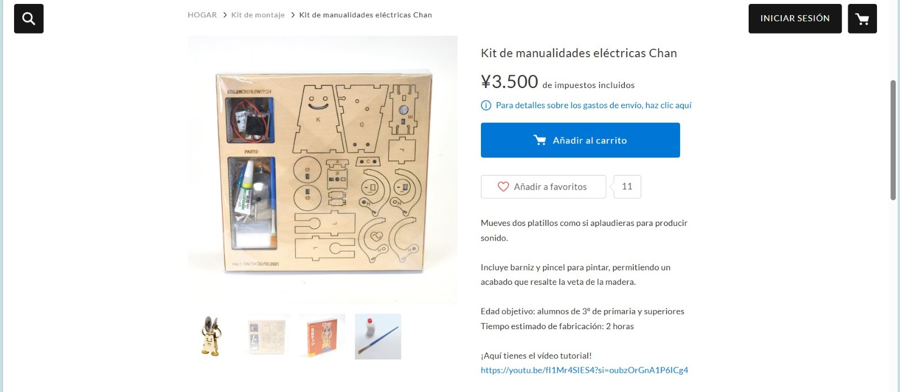
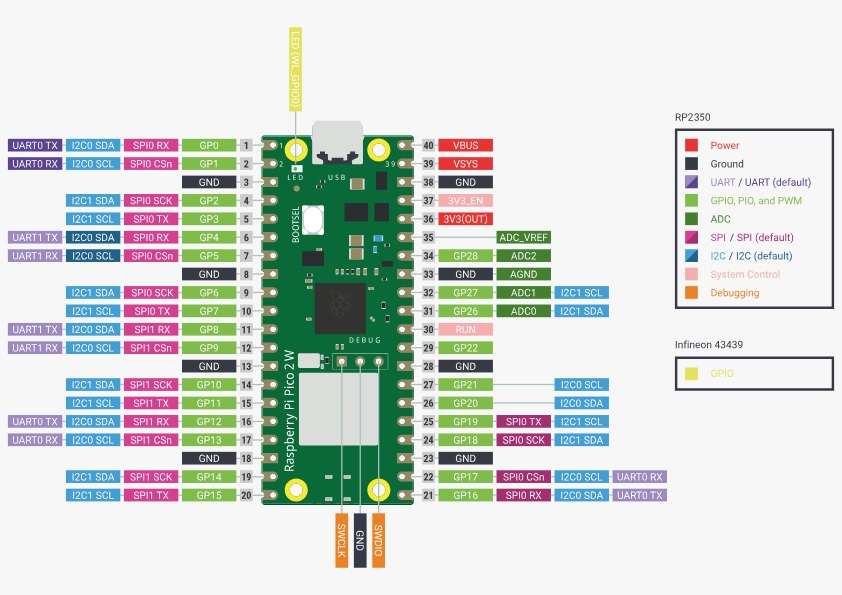
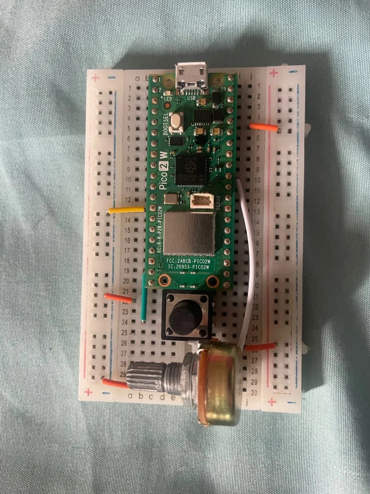
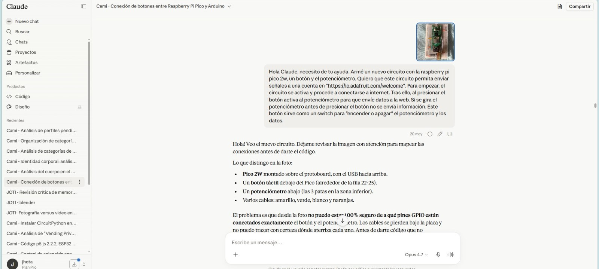
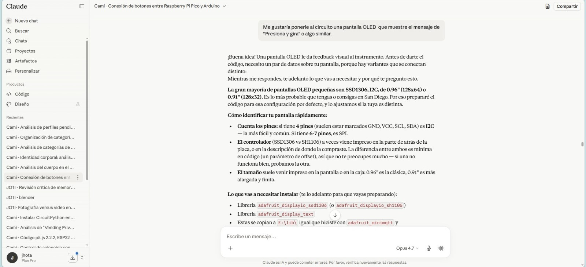
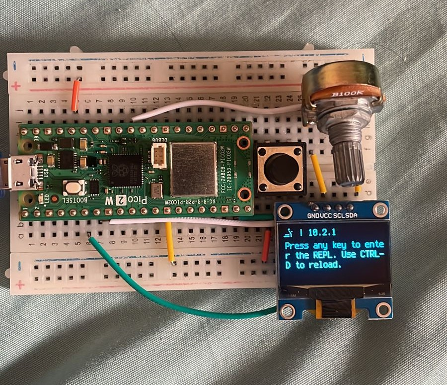
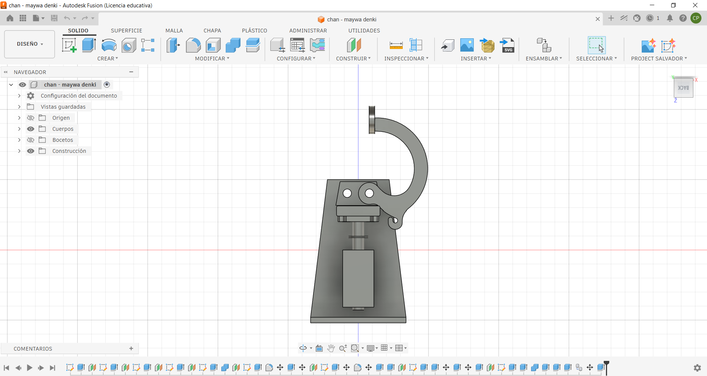

# ‧₊˚✧ Investigaciones individuales ✧˚₊‧

Lunes 25 Mayo 2026 - [Camila Parada](https://github.com/Camila-Parada)

## Introducción

Estas son las investigaciones para el proyecto en común.
Como contexto, todo surge por mi lado querer imitar y aprender sobre la construcción de los instrumentos de [Maywa Denki]( https://www.maywadenki.com/), específicamente aquellos kits armables. 
Para este proyecto el referente directo es una máquina llamada [“Chan”]( https://maywadenki.stores.jp/items/607048cb1e746b2a3a5bdaef), un personaje que permite mover sus brazos y hacer sonar unos platillos presionando un botón.

Para poder estudiar el objeto es que utilicé la información presente en la tienda web y un video que muestra el montaje de las piezas.

Es ahí donde se puede apreciar los elementos de construcción: una plancha de madera con corte láser, broches de tipo mariposa, cola fría, elásticos, tornillos, platillos metálicos, un motor solenoide, y un circuito eléctrico.

Para poder replicarlo es que el proyecto giró en 2 ejes: la parte eléctrica y la carcasa conjunto con los mecanismos que permiten el movimiento.
El primer paso fue indagar sobre los componentes específicos y el circuito que dan la vida. Este es el punto de conexión directa con el encargo de esta solemne, puesto que se busca trabajar con sensores y actuadores que mediante wifi funcionen a distancia.

## Sensor

Al momento de seleccionar el sensor es que, con Vania, tuvimos la idea inicial de utilizar 2 botones: Uno “NC” (Normalmente cerrado) y un pulsador (Normalmente abierto).
El botón “NC” al ser presionado una vez permite el paso de corriente, o en este caso envía una señal para activar del segundo botón. Este segundo requiere de mantenerlo presionado para que entregar la “orden” digital que queda registrada en el feed.
Esta decisión fue tomada al considerar la posibilidad de tráfico continuo de datos en Adafruit IO, evitando una posible saturación información.

Más adelante, tras el avance hecho por parte de Vania la clase previa a la muestra (18 de mayo) es que decidí experimentar por mi cuenta creando un nuevo circuito que incluyera la raspberry pi pico 2w (previamente utilizado), el botón “NC”, un potenciómetro que tenía a la mano y una pantalla OLED.

Tras realizar las conexiones del circuito (usando como guía el pinout de la página de adafruit) le pedí ayuda a Claude con el código para poder traspasar la información del botón y el potenciómetro a la pantalla.

## Actuador

Esta es la parte más importante de mi aprendizaje. Por mi lado nunca antes había trabajado con este tipo de motores (previamente con motores DC y servo), por lo que mi primer impulso fue adquirir uno (en realidad dos). 
El que escogí fue un [“Mini Solenoide DC 5V”]( https://hubot.cl/producto/mini-solenoide%C2%82-dc-5v/), un motor de pequeñas dimensiones. Mi primer error fue asumir que podría funcionar sólo con Arduino y sin ningún otro componente. 
Graso error. Tras ver videos de proyectos que trabajan con ambas piezas pude ver que la gran mayoría requieren elementos externos como mosfets, diodos, transistores y entre otros. Dado que no he utilizado mucho los componentes anteriormente mencionados, es que terminé por recurrir nuevamente a una "ia" (claude) para saber si tenía algun material que me sirviera. Ante ello descubrí que el Relé de 1 canal podría simplificar la tarea a corto plazo, puesto que ello haría que el solenoide se calentaría con el pasar del tiempo. 

A la par, para poder saber más es que encontré la [página web del fabricante](http://www.zonhen.com/solenoid/ZHO-0420-en.html).

Pese intentar conseguir las piezas que me sugirió la ia, es que opté por utilizar el Relé, armando un circuito que conectara el solenoide con el Relé, y el Relé a una fuente de poder (similar a un cargador) de 5V y 2A para evitar saturar de corriente el arduino y el motor.

Pese a la ambición del proyecto, siento que pudimos llegar a buen puerto gracias a la ayuda de felix con el modelado.

## Posdata

Aproveché este proyecto para aprender a modelar de forma un poco más profesional. Usando un caliper (pie de metro) de la universidad, es que tomé medidas del solenoide, e intenté replicar las piezas pertenecientes a "Chan".

## Bibliografía

* https://claude.ai/chat/8b59cd4f-fcfa-40b5-87a8-d0deee276905
* https://www.youtube.com/watch?v=pBgVsvhCzFM
* https://youtu.be/RfrDtAEQ95c?si=C8Z7HYLrV8dPEH1J
* https://youtu.be/jLawY3uC_Ww?si=TjQj7vcfiNNzT9IQ

<!-- Perdón. No me he estado sintiendo bien últimamente (de salud mental). No se si es la estación, el nivel de exigencia académico o que, pero se me dificulta seguir el ritmo de las entregas y avances... Espero me pueda disculpar por la demora... quería sacarme otro 7, pero puede que por el tiempo en contra no pueda...-->
