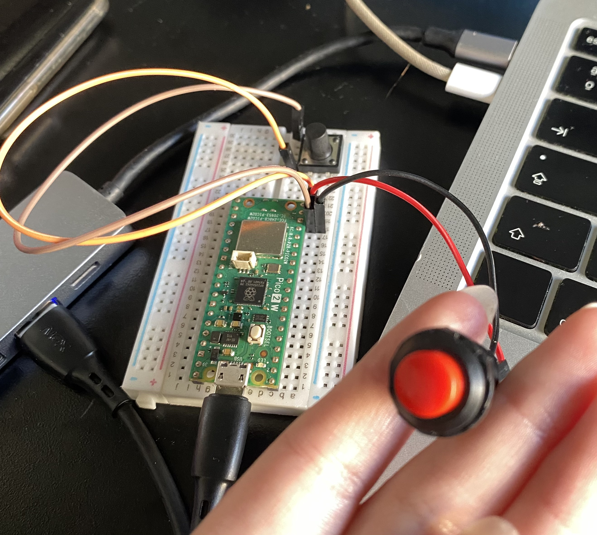
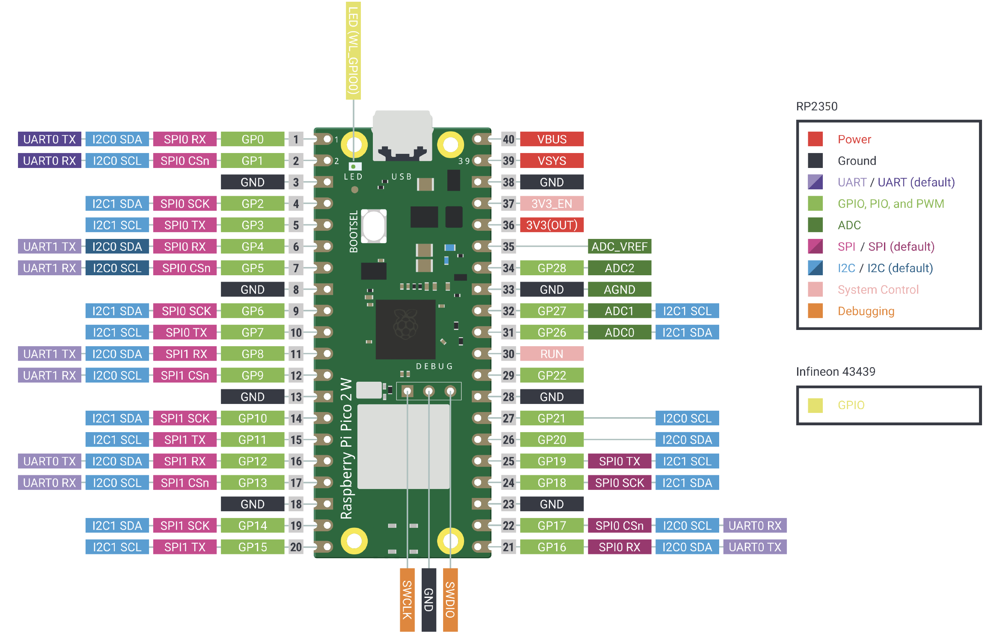
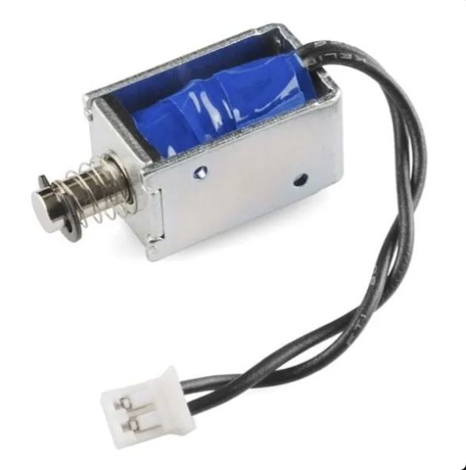

# Investigaciones individuales

[Vania Lorena Paredes Miranda](https://github.com/paredesvania)

---

## Sensor: Botón (Push Button)

### Aprendizajes y contexto del proyecto

Estamos usando un **botón conectado a la Raspberry Pi Pico 2W** como sensor de entrada. Llegamos a esta decisión después de investigar y compartir ideas entre nosotras. Cami me contó que hace tiempo tenía un proyecto personal inspirado en la empresa japonesa **Maywa Denki**, conocida por crear instrumentos musicales medio excéntricos y mecánicos, entre los que destaca el Otamatone, ya que Cami me comentó que le llamaban especialmente la atención estos mini instrumentos diseñados para armar uno mismo (kits), que incluyen un mini circuito, un solenoide y piezas con planos para construirlos.

Me encantó su idea y seguí investigando. Decidimos recrear el ([**"Chan"**](https://youtu.be/fI1Mr4SIES4?si=58ErEgpNSsdA2vBf)), porque era el diseño que más se adaptaba al solenoide que teníamos: el nuestro es pequeño y genera poca fuerza, menos que el solenoide que ocupan estos artefactos, que es grande y con mayor impulso, el Chan justamente requería menos fuerza por cómo está construido, comparado con los otros que vimos, algunos de estos fueron:

[](https://youtu.be/fI1Mr4SIES4?si=58ErEgpNSsdA2vBf)

[](https://www.youtube.com/watch?v=5rXG8iA09sw&t=7s)

[](https://youtu.be/NYIhn89GJy8?si=_blEaUTn0a1khALR)

[](https://youtu.be/NfBHkGlSQpM?si=JNze8Ddbt5FgPme9)

Lo que hace el solenoide en este instrumento es empujar los bracitos para que se cierren y golpeen los platillos.


Estas son las piezas de la figura:


### Proceso de desarrollo del código

Me encargué principalmente de investigar y desarrollar el código de la Raspberry Pi.
Pasamos por tres versiones hasta llegar a una que funcionó bien.

### Cómo funciona el botón como sensor

Un botón es un **sensor digital**: solo entrega dos valores posibles, encendido (1) o apagado (0). En nuestro caso lo usamos como disparador de eventos: cada vez que se presiona, envía un pulso a Adafruit IO.

Para conectarlo correctamente a la Raspberry Pi Pico 2W, usé la configuración de **resistencia pull-up interna**, para la que nos ayudó claude, que dijo lo siguiente: Esto significa que cuando el botón no está presionado, el pin lee `HIGH` (1), y cuando se presiona y conecta el pin a GND, lee `LOW` (0). Sin esta resistencia, el pin quedaría "flotando", es decir, sin un valor definido, lo que haría que la placa leyera valores aleatorios sin que nadie lo esté tocando.

Un problema clásico de los botones mecánicos es el **rebote** (*bounce*): cuando uno presiona un botón físico, los contactos metálicos internos no se cierran de forma limpia, sino que rebotan varias veces en milisegundos antes de estabilizarse. Eso hace que la placa pueda registrar múltiples pulsaciones cuando en realidad hubo una sola.

Para evitar esto usamos **debounce por software**: en el código definimos una variable `DEBOUNCE_MS = 50`, que hace que la placa ignore cualquier cambio de estado que ocurra antes de 50 milisegundos del último cambio registrado. Así filtramos esos falsos rebotes y nos aseguramos de que cada presión del botón cuente como un único evento.

```python
if presionado != estado_anterior and (ahora - ultimo_cambio) > DEBOUNCE_MS:
    ultimo_cambio = ahora
    estado_anterior = presionado
    if presionado:
        publicar("1")
```
### Conexión del botón a la Raspberry Pi Pico 2W

La conexión fue súper simple: el botón tiene dos pines. Uno va conectado al **GP14**
de la Pico 2W, y el otro va directo a **GND**. 

Quedó algo así:



Ocupé este mapa de pines que ocupamos unas clases atrás para saber cuál pin es cuál en la Raspberry:



#### Código v1

La idea de este código era que mientras un botón (el A) esté presionado, se manden datos a
Adafruit IO, así cuando presionamos el botón A y el B (el que envía el pulso al arduino), el solenoide se mueve, así no está enviando información todo el tiempo, y el feed de Adafruit no colapsa.

```python
# ============================================================
# Raspberry Pi Pico W — Emisor de botón a Adafruit IO
# Instrumento Maywa Denki / Chan
# ============================================================
# CONEXIÓN DEL BOTÓN:
#   - Un extremo del botón → GP15
#   - Otro extremo del botón → GND
# ============================================================

import time
import board
import digitalio
import wifi
import socketpool
import adafruit_minimqtt.adafruit_minimqtt as MQTT

# ------------------------------------------------------------
# CONFIGURACIÓN — edita solo esta sección
# ------------------------------------------------------------
WIFI_SSID     = "pixel9"
WIFI_PASSWORD = "mateo123"

AIO_USERNAME  = "udpmontoyamoraga"
AIO_KEY       = ""
AIO_FEED      = f"{AIO_USERNAME}/feeds/solenoide-chan"

BOTON_PIN     = board.GP15
DEBOUNCE_MS   = 50
# ------------------------------------------------------------

boton = digitalio.DigitalInOut(BOTON_PIN)
boton.direction = digitalio.Direction.INPUT
boton.pull = digitalio.Pull.UP

print("Conectando a WiFi...")
wifi.radio.connect(WIFI_SSID, WIFI_PASSWORD)
print(f"Conectado! IP: {wifi.radio.ipv4_address}")

pool = socketpool.SocketPool(wifi.radio)
mqtt = MQTT.MQTT(
    broker="io.adafruit.com",
    username=AIO_USERNAME,
    password=AIO_KEY,
    socket_pool=pool,
)

def conectar_mqtt():
    print("Conectando a Adafruit IO...")
    mqtt.connect()
    print("Conectado a Adafruit IO!")

conectar_mqtt()

estado_anterior = None
ultimo_cambio  = 0

print("=== Listo. Presiona el botón para activar el solenoide ===")

while True:
    ahora = time.monotonic_ns() // 1_000_000
    presionado = not boton.value

    if presionado != estado_anterior and (ahora - ultimo_cambio) > DEBOUNCE_MS:
        ultimo_cambio = ahora
        estado_anterior = presionado

        if presionado:
            print(">>> Botón PRESIONADO — enviando '1' al feed")
            try:
                mqtt.publish(AIO_FEED, "1")
            except Exception as e:
                print(f"Error al publicar, reconectando... ({e})")
                conectar_mqtt()
                mqtt.publish(AIO_FEED, "1")
        else:
            print("    Botón LIBERADO  — enviando '0' al feed")
            try:
                mqtt.publish(AIO_FEED, "0")
            except Exception as e:
                print(f"Error al publicar, reconectando... ({e})")
                conectar_mqtt()
                mqtt.publish(AIO_FEED, "0")

    try:
        mqtt.loop(timeout=0.01)
    except Exception as e:
        print(f"Conexión perdida, reconectando... ({e})")
        conectar_mqtt()
```

- **Atao unu:** No se conectaba. Resultó ser que teníamos el nombre de la red WiFi mal
(era el hotspot del celular de Aaron).

Después de corregir el WiFi seguía sin conectarse a Adafruit, y Aaron nos explicó que
probablemente era porque todos en el curso estaban enviando datos al mismo tiempo a su
feed y Adafruit colapsó. Lo solucionamos cambiando al feed de mi cuenta. Para eso creé un feed llamado "papa" (PAredes-PArada, funny)

---

#### Código v2: 

Para la segunda versión arreglamos lo ataos que detectamos en la versión anterior:

```python
# ============================================================
# Raspberry Pi Pico 2W — Emisor de 2 botones a Adafruit IO
# Instrumento Maywa Denki / Chan
# ============================================================
# PROTOCOLO (feed: papa):
#   "0" → A liberado
#   "1" → A presionado
#   "2" → B presionado (pulso)
# ============================================================

import time
import board
import digitalio
import wifi
import socketpool
import adafruit_minimqtt.adafruit_minimqtt as MQTT

# ------------------------------------------------------------
WIFI_SSID     = "iPhone de Vania"
WIFI_PASSWORD = "dilt1234"

AIO_USERNAME  = "paredesvania"
AIO_KEY       = ""

FEED          = f"{AIO_USERNAME}/feeds/papa"

PIN_BOTON_A   = board.GP15
PIN_BOTON_B   = board.GP14
DEBOUNCE_MS   = 50
MQTT_LOOP_INTERVAL_MS = 2000
# ------------------------------------------------------------

def init_boton(pin):
    b = digitalio.DigitalInOut(pin)
    b.direction = digitalio.Direction.INPUT
    b.pull = digitalio.Pull.UP
    return b

boton_a = init_boton(PIN_BOTON_A)
boton_b = init_boton(PIN_BOTON_B)

def conectar_wifi():
    while True:
        try:
            print("Conectando a WiFi...")
            wifi.radio.connect(WIFI_SSID, WIFI_PASSWORD)
            print(f"Conectado! IP: {wifi.radio.ipv4_address}")
            return
        except Exception as e:
            print(f"Fallo WiFi ({e}). Reintento en 5s...")
            time.sleep(5)

conectar_wifi()

pool = socketpool.SocketPool(wifi.radio)
mqtt = MQTT.MQTT(
    broker="io.adafruit.com",
    port=1883,
    username=AIO_USERNAME,
    password=AIO_KEY,
    socket_pool=pool,
    socket_timeout=1,
    connect_retries=2,
    keep_alive=60,
)

def conectar_mqtt():
    intentos = 0
    while True:
        try:
            if not wifi.radio.connected:
                print("WiFi caído, reconectando...")
                conectar_wifi()
            print("Conectando a Adafruit IO...")
            mqtt.connect()
            print("¡Conectado a Adafruit IO!")
            return
        except Exception as e:
            intentos += 1
            espera = min(3 * intentos, 30)
            print(f"Fallo al conectar ({e}). Reintento en {espera}s... (intento {intentos})")
            time.sleep(espera)

def publicar(valor):
    try:
        mqtt.publish(FEED, valor)
        print(f"   ✓ Publicado: {valor}")
    except Exception as e:
        print(f"Error al publicar ({e}). Reconectando...")
        try:
            mqtt.disconnect()
        except:
            pass
        conectar_mqtt()
        try:
            mqtt.publish(FEED, valor)
            print(f"   ✓ Publicado tras reconexión: {valor}")
        except Exception as e2:
            print(f"Error tras reconexión: {e2}")

conectar_mqtt()

estado_a_anterior = False
estado_b_anterior = False
ultimo_cambio_a   = 0
ultimo_cambio_b   = 0
ultimo_loop_mqtt  = 0

publicar("0")

print("=== Listo. Reportando al feed papa ===")

while True:
    ahora = time.monotonic_ns() // 1_000_000

    a_presionado = not boton_a.value
    b_presionado = not boton_b.value

    if a_presionado != estado_a_anterior and (ahora - ultimo_cambio_a) > DEBOUNCE_MS:
        ultimo_cambio_a = ahora
        estado_a_anterior = a_presionado
        if a_presionado:
            print(">>> A PRESIONADO — enviando '1'")
            publicar("1")
        else:
            print("    A LIBERADO  — enviando '0'")
            publicar("0")

    if b_presionado != estado_b_anterior and (ahora - ultimo_cambio_b) > DEBOUNCE_MS:
        ultimo_cambio_b = ahora
        estado_b_anterior = b_presionado
        if b_presionado:
            print(">>> B PRESIONADO — enviando '2'")
            publicar("2")

    if (ahora - ultimo_loop_mqtt) > MQTT_LOOP_INTERVAL_MS:
        ultimo_loop_mqtt = ahora
        try:
            mqtt.loop(timeout=1)
        except Exception as e:
            print(f"Conexión perdida ({e}). Reconectando...")
            try:
                mqtt.disconnect()
            except:
                pass
            conectar_mqtt()
```

Creamos el feed `papa` en mi cuenta de Adafruit IO. Esta vez sí se conectaba, como se
ve en el monitor serial:

```
Auto-reload is on. Simply save files over USB to run them or enter REPL to disable.
code.py output:
Conectando a WiFi...
Fallo WiFi (No network with that ssid). Reintento en 5s...
Conectando a WiFi...
Conectado! IP: 172.20.10.2
Conectando a Adafruit IO...
¡Conectado a Adafruit IO!
✓ Publicado: 0
=== Listo. Reportando al feed papa ===
A PRESIONADO — enviando '1'
✓ Publicado: 1
```

**Atao:** El botón A (el que habilitaba el envío mientras estuviera presionado) no
funcionaba bien. El botón B en cambio sí enviaba el pulso al solenoide de todas formas.
Mateo nos dijo que saquemos el botón A derechamente, porque como nuestro proyecto solo
envía pulsos individuales (un golpe cada vez que se presiona), no tenía sentido tener un
botón habilitador.

---

#### Código v3: versión final con un solo botón

```python
# ============================================================
# Raspberry Pi Pico 2W — Emisor de 1 botón a Adafruit IO
# Instrumento Maywa Denki / Chan
# ============================================================
# CONEXIONES:
#   Botón: un extremo → GP14, otro extremo → GND
#
# PROTOCOLO (feed: papa):
#   "1" → botón presionado (dispara un golpe)
#   (soltar el botón no envía nada)
# ============================================================

import time
import board
import digitalio
import wifi
import socketpool
import adafruit_minimqtt.adafruit_minimqtt as MQTT

# ------------------------------------------------------------
WIFI_SSID     = "iPhone de Vania"
WIFI_PASSWORD = "dilt1234"

AIO_USERNAME  = "paredesvania"
AIO_KEY       = ""

FEED          = f"{AIO_USERNAME}/feeds/papa"

PIN_BOTON     = board.GP14
DEBOUNCE_MS   = 50
MQTT_LOOP_INTERVAL_MS = 1000
# ------------------------------------------------------------

boton = digitalio.DigitalInOut(PIN_BOTON)
boton.direction = digitalio.Direction.INPUT
boton.pull = digitalio.Pull.UP

def conectar_wifi():
    while True:
        try:
            print("Conectando a WiFi...")
            wifi.radio.connect(WIFI_SSID, WIFI_PASSWORD)
            print(f"Conectado! IP: {wifi.radio.ipv4_address}")
            return
        except Exception as e:
            print(f"Fallo WiFi ({e}). Reintento en 5s...")
            time.sleep(5)

conectar_wifi()

pool = socketpool.SocketPool(wifi.radio)
mqtt = MQTT.MQTT(
    broker="io.adafruit.com",
    port=1883,
    username=AIO_USERNAME,
    password=AIO_KEY,
    socket_pool=pool,
    socket_timeout=1,
    connect_retries=2,
    keep_alive=60,
)

def conectar_mqtt():
    intentos = 0
    while True:
        try:
            if not wifi.radio.connected:
                print("WiFi caído, reconectando...")
                conectar_wifi()
            print("Conectando a Adafruit IO...")
            mqtt.connect()
            print("¡Conectado a Adafruit IO!")
            return
        except Exception as e:
            intentos += 1
            espera = min(3 * intentos, 30)
            print(f"Fallo al conectar ({e}). Reintento en {espera}s...")
            time.sleep(espera)

def publicar(valor):
    try:
        mqtt.publish(FEED, valor)
        print(f"   ✓ Publicado: {valor}")
    except Exception as e:
        print(f"Error al publicar ({e}). Reconectando...")
        try:
            mqtt.disconnect()
        except:
            pass
        conectar_mqtt()
        try:
            mqtt.publish(FEED, valor)
        except Exception as e2:
            print(f"Error tras reconexión: {e2}")

conectar_mqtt()

estado_anterior = False
ultimo_cambio   = 0
ultimo_loop_mqtt = 0

print("=== Listo. Presiona el botón para disparar ===")

while True:
    ahora = time.monotonic_ns() // 1_000_000
    presionado = not boton.value

    if presionado != estado_anterior and (ahora - ultimo_cambio) > DEBOUNCE_MS:
        ultimo_cambio = ahora
        estado_anterior = presionado
        if presionado:
            print(">>> BOTÓN PRESIONADO — enviando '1'")
            publicar("1")

    if (ahora - ultimo_loop_mqtt) > MQTT_LOOP_INTERVAL_MS:
        ultimo_loop_mqtt = ahora
        try:
            mqtt.loop(timeout=1)
        except Exception as e:
            print(f"Conexión perdida ({e}). Reconectando...")
            try:
                mqtt.disconnect()
            except:
                pass
            conectar_mqtt()
```

Con esta versión todo funcionó: al presionar el botón se envía un `"1"` al feed `papa`
en Adafruit IO, el Arduino del otro lado lo recibe y activa el solenoide por un instante,
produciendo el golpe del Soniloide.

### Observación
Cuando presionamos el botón, se demora bastante en actuar el solenoide, le comentamos a Mateo o Aarón, (no recuerdo) y nos dijo que era normal, estaban pasando muchas cosas entre que presionábamos el botón y se movía el solenoide, así que calma.

GIF de lo que logramos en clase:


---

### Referencia artística: Maywa Denki

**Maywa Denki** es una empresa artística japonesa fundada por Nobumichi Tosa en 1993, crean productos artísticos que funcionan como instrumentos musicales, mecánicos y absurdos.

Algunos de sus productos más conocidos son el **Otamatone** (instrumento que se toca apretando su cuerpo) y el **Naki** (un micrófono que simula llorar). Sus kits de armado, como el **Chan**, están pensados para que cualquier persona pueda construirlos en casa con componentes simples, incluyendo solenoides.

El semestre anterior Aarón me prestó la colección de tipo catálogo de productos que tenía de esta empresa, que se llamaba "Nonsense Machines", desde ahí siempre me pareció súper interesante su trabajo, por lo mismo, me encantó la idea de Cami cuando me la propuso. Mi máquina favorita era la "Tomatan" una máquina que te daba de comer tomates mientras corres.

- Sitio oficial: <https://www.maywadenki.com/>

---

## Actuador: Solenoide (Mini Solenoide DC 5V)

### Aprendizajes

Para el actuador, yo no conocía el solenoide antes de este proyecto, así que tuve que
investigarlo desde cero. Cami me explicó cómo funcionaba y también me vi algunos videos
en YouTube.

El solenoide que usamos es este: [Mini Solenoide DC 5V – Hubot](https://hubot.cl/producto/mini-solenoide%C2%82-dc-5v/)



### Cómo funciona el solenoide

Un solenoide es un **actuador electromagnético lineal**: convierte energía eléctrica en movimiento mecánico. Está compuesto por una bobina de cobre enrollada alrededor de un núcleo de hierro y un émbolo (*plunger*) metálico que se mueve hacia adentro cuando la corriente pasa por la bobina. Cuando se aplica corriente, la bobina genera un campo magnético que atrae el émbolo hacia el interior; cuando se corta la corriente, un resorte interno lo devuelve a su posición original.

En nuestro caso el solenoide actúa en modo **push/pull**: empuja los bracitos de _**Soniloide**_ cuando se activa, y el resorte los regresa cuando se desactiva. Ese movimiento rítmico es el que golpea los platillos y genera el sonido.

### Por qué necesita un relé

El solenoide requiere más corriente de la que el Arduino puede entregar directamente por sus pines. Por eso se usa un **relé de 1 canal** como intermediario: el Arduino le envía una señal de baja potencia al relé, y el relé conmuta el circuito de mayor potencia que alimenta al solenoide (5V 2A desde una fuente externa). Sin el relé, el pin del Arduino podría dañarse o simplemente no tener corriente suficiente para activar el solenoide.

### Problemas 

- **El solenoide no puede estar activado de forma continua**: genera calor al mantener la corriente. Por eso enviamos pulsos cortos en lugar de mantenerlo encendido. (ya nos ha pasado lo de sentir olor a plástico quemado)
- **El ruido eléctrico al apagarse**: cuando un solenoide se apaga, genera un pico de voltaje inverso (*back-EMF*). En proyectos más elaborados se usa un diodo de protección, pero para nuestra escala no fue un problema grave.

### Referencia artística: Trimpin y Conlon in Purple

Buscando ejemplos de solenoides en proyectos creativos fue que llegué a **Trimpin** (Gerhard Trimpin, 1951), un escultor cinético y artista sonoro alemán que lleva décadas construyendo máquinas musicales.


El proyecto suyo que más me llamó la atención fue **"Conlon in purple"** (1997): una instalación de escala enorme donde el público literalmente entra adentro del instrumento. Es un xilófono de cinco octavas hecho de barras de madera y metal, con trompetas moradas rojizas colgando del techo, y cada barra es golpeada por un pequeño émbolo electromagnético, básicamente un solenoide, que se activa por señal eléctrica. La instalación mezcla secuencias preprogramadas con los sonidos que genera el público al moverse dentro de ella.

Según Gemini: Conlon in Purple (1997) es una escultura sonora cinética creada por el artista e inventor alemán Trimpin. Rinde homenaje al compositor Conlon Nancarrow y destaca por su innovador sistema electromecánico.

* ¿Cómo funcionaba?: La instalación automatiza la percusión mediante un sistema robótico y de control muy singular
* Elementos resonadores: Consiste en una gran instalación de barras de metal y madera afinadas y suspendidas en el espacio 
* Macillos electromecánicos: Las barras son golpeadas por un sistema de **pequeños martillos controlados por solenoides** (electroimanes)


---

## Bibliografía

- Maywa Denki - Sitio oficial: <https://www.maywadenki.com/>
- Video "Chan: cómo armar el Kit": <https://youtu.be/fI1Mr4SIES4?si=58ErEgpNSsdA2vBf>
- Mini Solenoide DC 5V - Hubot: <https://hubot.cl/producto/mini-solenoide%C2%82-dc-5v/>
- Trimpin - MacArthur Foundation: <https://www.macfound.org/fellows/class-of-1997/trimpin>
- Trimpin - Wikipedia: <https://en.wikipedia.org/wiki/Trimpin>
- Debouncing explicado - Hackaday: <https://hackaday.com/2015/12/09/embed-with-elliot-debounce-your-noisy-buttons-part-i/>
- Pull-up resistors - Zbotic: <https://zbotic.in/pull-up-and-pull-down-resistors-when-and-why-to-use-them/>
- Solenoid (engineering) - Wikipedia: <https://en.wikipedia.org/wiki/Solenoid_(engineering)>
- History of Robotic Musical Instruments, Kapur et al. (ICMC 2005): <https://www.mistic.ece.uvic.ca/publications/2005_icmc_robot.pdf>
- Adafruit IO: <https://io.adafruit.com/>
- Video como funciona un solenoide: <https://www.youtube.com/shorts/H9k8D5eJ9uc>
- Daily pilot - Sculptures of sound habla de la obra Conlon in purple <https://www.latimes.com/socal/daily-pilot/news/tn-dpt-xpm-2001-10-06-export44533-story.html>

