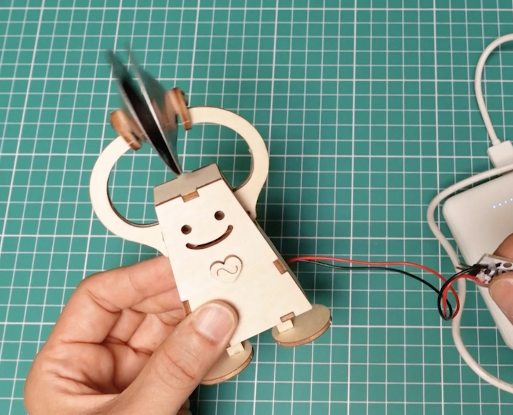
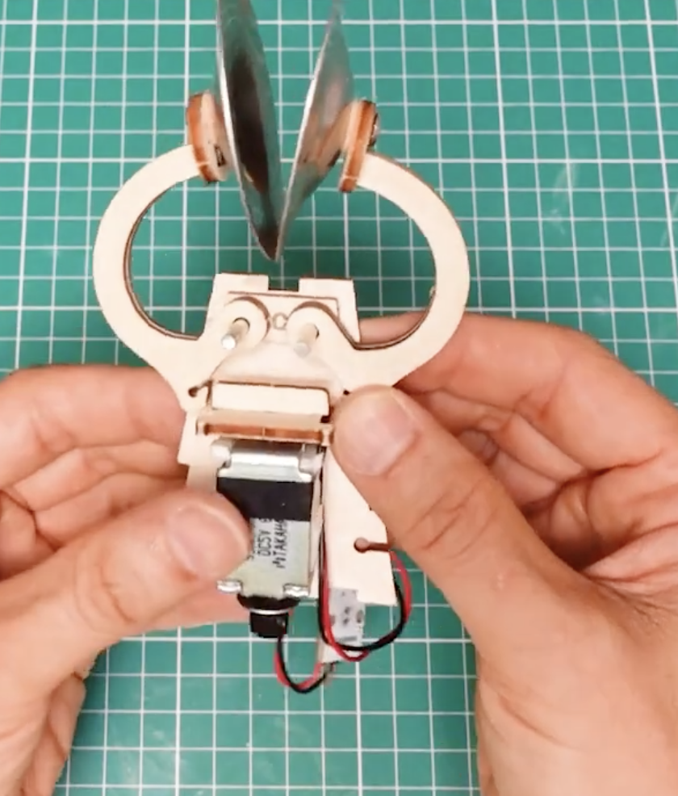
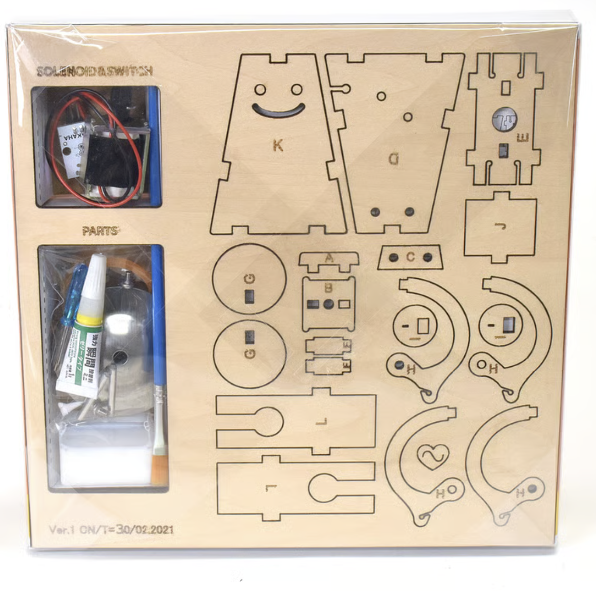

# investigaciones individuales

[Vania Lorena Paredes Miranda](https://github.com/paredesvania)

Estamos ocupando un botón conectado a la Raspberry Pi Pico 2W. 

Llegamos a ocupar este, despues de investigar y compartir ideas sobre lo que podríamos hacer, Cami me dijo que ella hace tiempo tenía un proyecto personal que eran de la empresa japonesa "Maywa Denki", quienes han creado varios instrumentos musicales de los que se destaca el Otomatone. 

Me comentó que estaba especialmente interesada en unos mini instrumentos que son creados parta armarlos uno mismo los cuales dentro del kit tienen un mini circuito, un solenoide y alguna que otra pieza junto con el plano para armar. 

Me encantó su idea así que seguí investigando, decidimos que vamos a armar el "Chan": <https://youtu.be/fI1Mr4SIES4?si=58ErEgpNSsdA2vBf>, porque se acomodaba más al solenoide que teníamos, ya que el que tenemos es mas pequeño, por lo tanto menos fuerte, y este diseño era el que necesitaba menos fuerza del solenoide por como esta construido.



Lo que hace el solenoide es empujar los bracitos y así estos se cierran.


Y estas son las piezas de la figura:


## Sensor
Decidimos ocupar un botón para enviar el pulso al solenoide, tuvimos varios problemas con el código pero bien simples, yo me encargué mas que nada en investigar sobre el código de la raspberry pi:

Este fue el primero
```
# ============================================================
# Raspberry Pi Pico W — Emisor de botón a Adafruit IO
# Instrumento Maywa Denki / Chan
# ============================================================
# CONEXIÓN DEL BOTÓN:
#   - Un extremo del botón → GP15
#   - Otro extremo del botón → GND
# ============================================================

import time
import board
import digitalio
import wifi
import socketpool
import adafruit_minimqtt.adafruit_minimqtt as MQTT

# ------------------------------------------------------------
# CONFIGURACIÓN — edita solo esta sección
# ------------------------------------------------------------
WIFI_SSID     = "pixel9"
WIFI_PASSWORD = "mateo123"

AIO_USERNAME  = "udpmontoyamoraga"
AIO_KEY       = ""
AIO_FEED      = f"{AIO_USERNAME}/feeds/solenoide-chan"  # feed a crear en Adafruit IO

BOTON_PIN     = board.GP15   # cambia si usas otro pin
DEBOUNCE_MS   = 50           # ms para evitar rebotes
# ------------------------------------------------------------

# --- Configurar botón con pull-up interno ---
boton = digitalio.DigitalInOut(BOTON_PIN)
boton.direction = digitalio.Direction.INPUT
boton.pull = digitalio.Pull.UP
# Nota: con pull-up, el botón lee False cuando está PRESIONADO

# --- Conectar WiFi ---
print("Conectando a WiFi...")
wifi.radio.connect(WIFI_SSID, WIFI_PASSWORD)
print(f"Conectado! IP: {wifi.radio.ipv4_address}")

# --- Configurar MQTT ---
pool = socketpool.SocketPool(wifi.radio)
mqtt = MQTT.MQTT(
    broker="io.adafruit.com",
    username=AIO_USERNAME,
    password=AIO_KEY,
    socket_pool=pool,
)

def conectar_mqtt():
    print("Conectando a Adafruit IO...")
    mqtt.connect()
    print("Conectado a Adafruit IO!")

conectar_mqtt()

# --- Variables de estado ---
estado_anterior = None   # None = desconocido al inicio
ultimo_cambio  = 0       # para debounce

print("=== Listo. Presiona el botón para activar el solenoide ===")
print()

# --- Loop principal ---
while True:
    ahora = time.monotonic_ns() // 1_000_000  # tiempo en ms

    # Leer botón (False = presionado con pull-up)
    presionado = not boton.value

    # Solo actuar si cambió el estado y pasó el debounce
    if presionado != estado_anterior and (ahora - ultimo_cambio) > DEBOUNCE_MS:
        ultimo_cambio = ahora
        estado_anterior = presionado

        if presionado:
            print(">>> Botón PRESIONADO — enviando '1' al feed")
            try:
                mqtt.publish(AIO_FEED, "1")
            except Exception as e:
                print(f"Error al publicar, reconectando... ({e})")
                conectar_mqtt()
                mqtt.publish(AIO_FEED, "1")
        else:
            print("    Botón LIBERADO  — enviando '0' al feed")
            try:
                mqtt.publish(AIO_FEED, "0")
            except Exception as e:
                print(f"Error al publicar, reconectando... ({e})")
                conectar_mqtt()
                mqtt.publish(AIO_FEED, "0")

    # Mantener conexión MQTT activa (ping)
    try:
        mqtt.loop(timeout=0.01)
    except Exception as e:
        print(f"Conexión perdida, reconectando... ({e})")
        conectar_mqtt()
```

- Con este no se conectaba, era porque se nos habia olvidado cambiar el internet, la idea de este código era usar dos botones, uno que mientras esté presionado, mande los datos y la señal a Adafruit, asi no está enviando información todo el tiempo.

- Luego cambiamos los datos del internet, pero seguía sin conectarse a AdaFruit, Aaron dijo que podía ser problema de que estababn todos enviando la mismo tiempo a su Feed entonces colapsó su Adafruit, por lo que lo cambiamos al mío.

Segundo Código:

```
# ============================================================
# Raspberry Pi Pico 2W — Emisor de 2 botones a Adafruit IO
# Instrumento Maywa Denki / Chan
# ============================================================
# PROTOCOLO (feed: papa):
#   "0" → A liberado
#   "1" → A presionado
#   "2" → B presionado (pulso)
# ============================================================

import time
import board
import digitalio
import wifi
import socketpool
import adafruit_minimqtt.adafruit_minimqtt as MQTT

# ------------------------------------------------------------
WIFI_SSID     = "iPhone de Vania"
WIFI_PASSWORD = "dilt1234"

AIO_USERNAME  = "paredesvania"
AIO_KEY       = ""

FEED          = f"{AIO_USERNAME}/feeds/papa"

PIN_BOTON_A   = board.GP15
PIN_BOTON_B   = board.GP14
DEBOUNCE_MS   = 50

# Intervalo entre llamadas a mqtt.loop() para mantener viva la conexión
MQTT_LOOP_INTERVAL_MS = 2000
# ------------------------------------------------------------

def init_boton(pin):
    b = digitalio.DigitalInOut(pin)
    b.direction = digitalio.Direction.INPUT
    b.pull = digitalio.Pull.UP
    return b

boton_a = init_boton(PIN_BOTON_A)
boton_b = init_boton(PIN_BOTON_B)

# --- Conectar WiFi con reintentos ---
def conectar_wifi():
    while True:
        try:
            print("Conectando a WiFi...")
            wifi.radio.connect(WIFI_SSID, WIFI_PASSWORD)
            print(f"Conectado! IP: {wifi.radio.ipv4_address}")
            return
        except Exception as e:
            print(f"Fallo WiFi ({e}). Reintento en 5s...")
            time.sleep(5)

conectar_wifi()

pool = socketpool.SocketPool(wifi.radio)
mqtt = MQTT.MQTT(
    broker="io.adafruit.com",
    port=1883,
    username=AIO_USERNAME,
    password=AIO_KEY,
    socket_pool=pool,
    socket_timeout=1,
    connect_retries=2,
    keep_alive=60,
)

def conectar_mqtt():
    intentos = 0
    while True:
        try:
            # Verificar WiFi antes de intentar MQTT
            if not wifi.radio.connected:
                print("WiFi caído, reconectando...")
                conectar_wifi()

            print("Conectando a Adafruit IO...")
            mqtt.connect()
            print("¡Conectado a Adafruit IO!")
            return
        except Exception as e:
            intentos += 1
            espera = min(3 * intentos, 30)   # backoff: 3s, 6s, 9s... max 30s
            print(f"Fallo al conectar ({e}). Reintento en {espera}s... (intento {intentos})")
            time.sleep(espera)

def publicar(valor):
    try:
        mqtt.publish(FEED, valor)
        print(f"   ✓ Publicado: {valor}")
    except Exception as e:
        print(f"Error al publicar ({e}). Reconectando...")
        try:
            mqtt.disconnect()
        except:
            pass
        conectar_mqtt()
        try:
            mqtt.publish(FEED, valor)
            print(f"   ✓ Publicado tras reconexión: {valor}")
        except Exception as e2:
            print(f"Error tras reconexión: {e2}")

conectar_mqtt()

estado_a_anterior = False
estado_b_anterior = False
ultimo_cambio_a   = 0
ultimo_cambio_b   = 0
ultimo_loop_mqtt  = 0

publicar("0")

print("=== Listo. Reportando al feed papa ===")
print()

while True:
    ahora = time.monotonic_ns() // 1_000_000

    a_presionado = not boton_a.value
    b_presionado = not boton_b.value

    # ----- BOTÓN A -----
    if a_presionado != estado_a_anterior and (ahora - ultimo_cambio_a) > DEBOUNCE_MS:
        ultimo_cambio_a = ahora
        estado_a_anterior = a_presionado
        if a_presionado:
            print(">>> A PRESIONADO — enviando '1'")
            publicar("1")
        else:
            print("    A LIBERADO  — enviando '0'")
            publicar("0")

    # ----- BOTÓN B -----
    if b_presionado != estado_b_anterior and (ahora - ultimo_cambio_b) > DEBOUNCE_MS:
        ultimo_cambio_b = ahora
        estado_b_anterior = b_presionado
        if b_presionado:
            print(">>> B PRESIONADO — enviando '2'")
            publicar("2")

    # ----- Mantener viva la conexión MQTT (cada 2 segundos) -----
    if (ahora - ultimo_loop_mqtt) > MQTT_LOOP_INTERVAL_MS:
        ultimo_loop_mqtt = ahora
        try:
            mqtt.loop(timeout=1)
        except Exception as e:
            print(f"Conexión perdida ({e}). Reconectando...")
            try:
                mqtt.disconnect()
            except:
                pass
            conectar_mqtt()
```
- Creamos un feed llamado "papa" para que llegara la info de este, funcionaba bien, se conectaba, pero el botón 1, el que permite enviar la info al Adafruit mientras está presionado, no funcionaba, el botón 2, enviaba el pulso al solenoide de todas maneras.

```
Auto-reload is on. Simply save files over USB to run them or enter REPL to disable.
code.py output:
Conectando a WiFi...
Fallo WiFi (No network with that ssid). Reintento en 5s...
Conectando a WiFi...
Conectado! IP: 172.20.10.2
Conectando a Adafruit IO...
¡Conectado a Adafruit IO!
   ✓ Publicado: 0
=== Listo. Reportando al feed papa ===

A PRESIONADO — enviando '1'
   ✓ Publicado: 1
```

- Mateo nos dijo que saquemos ese botón, porque como nuestro proyecto solo enviaba pulsos, un pulso cada vez que se presionaba el botón 2, asi que no era necesario el botón 1, por lo que lo sacamos y nos quedó el codigo funcionando así:

```
# ============================================================
# Raspberry Pi Pico 2W — Emisor de 1 botón a Adafruit IO
# Instrumento Maywa Denki / Chan
# ============================================================
# CONEXIONES:
#   Botón: un extremo → GP14, otro extremo → GND
#
# PROTOCOLO (feed: papa):
#   "1" → botón presionado (dispara un golpe)
#   (soltar el botón no envía nada)
# ============================================================

import time
import board
import digitalio
import wifi
import socketpool
import adafruit_minimqtt.adafruit_minimqtt as MQTT

# ------------------------------------------------------------
WIFI_SSID     = "iPhone de Vania"
WIFI_PASSWORD = "dilt1234"

AIO_USERNAME  = "paredesvania"
AIO_KEY       = ""

FEED          = f"{AIO_USERNAME}/feeds/papa"

PIN_BOTON     = board.GP14
DEBOUNCE_MS   = 50
MQTT_LOOP_INTERVAL_MS = 1000
# ------------------------------------------------------------

boton = digitalio.DigitalInOut(PIN_BOTON)
boton.direction = digitalio.Direction.INPUT
boton.pull = digitalio.Pull.UP

def conectar_wifi():
    while True:
        try:
            print("Conectando a WiFi...")
            wifi.radio.connect(WIFI_SSID, WIFI_PASSWORD)
            print(f"Conectado! IP: {wifi.radio.ipv4_address}")
            return
        except Exception as e:
            print(f"Fallo WiFi ({e}). Reintento en 5s...")
            time.sleep(5)

conectar_wifi()

pool = socketpool.SocketPool(wifi.radio)
mqtt = MQTT.MQTT(
    broker="io.adafruit.com",
    port=1883,
    username=AIO_USERNAME,
    password=AIO_KEY,
    socket_pool=pool,
    socket_timeout=1,
    connect_retries=2,
    keep_alive=60,
)

def conectar_mqtt():
    intentos = 0
    while True:
        try:
            if not wifi.radio.connected:
                print("WiFi caído, reconectando...")
                conectar_wifi()
            print("Conectando a Adafruit IO...")
            mqtt.connect()
            print("¡Conectado a Adafruit IO!")
            return
        except Exception as e:
            intentos += 1
            espera = min(3 * intentos, 30)
            print(f"Fallo al conectar ({e}). Reintento en {espera}s...")
            time.sleep(espera)

def publicar(valor):
    try:
        mqtt.publish(FEED, valor)
        print(f"   ✓ Publicado: {valor}")
    except Exception as e:
        print(f"Error al publicar ({e}). Reconectando...")
        try:
            mqtt.disconnect()
        except:
            pass
        conectar_mqtt()
        try:
            mqtt.publish(FEED, valor)
        except Exception as e2:
            print(f"Error tras reconexión: {e2}")

conectar_mqtt()

estado_anterior = False
ultimo_cambio   = 0
ultimo_loop_mqtt = 0

print("=== Listo. Presiona el botón para disparar ===")
print()

while True:
    ahora = time.monotonic_ns() // 1_000_000

    presionado = not boton.value

    # ----- BOTÓN: envía "1" solo al presionar -----
    if presionado != estado_anterior and (ahora - ultimo_cambio) > DEBOUNCE_MS:
        ultimo_cambio = ahora
        estado_anterior = presionado
        if presionado:
            print(">>> BOTÓN PRESIONADO — enviando '1'")
            publicar("1")

    # ----- Mantener viva la conexión MQTT -----
    if (ahora - ultimo_loop_mqtt) > MQTT_LOOP_INTERVAL_MS:
        ultimo_loop_mqtt = ahora
        try:
            mqtt.loop(timeout=1)
        except Exception as e:
            print(f"Conexión perdida ({e}). Reconectando...")
            try:
                mqtt.disconnect()
            except:
                pass
            conectar_mqtt()
```

  
## Actuador

## Bibliografía
