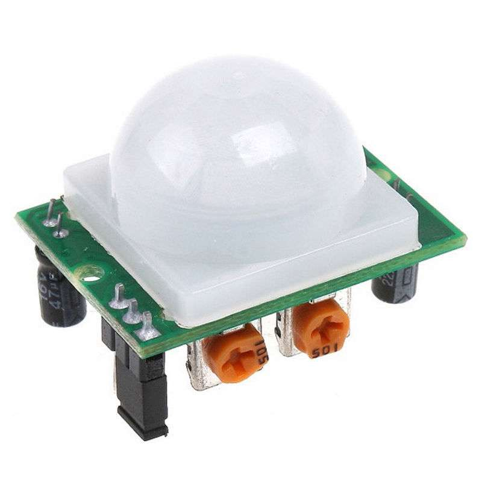
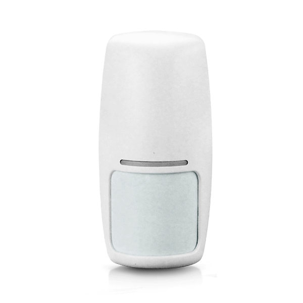
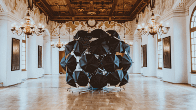
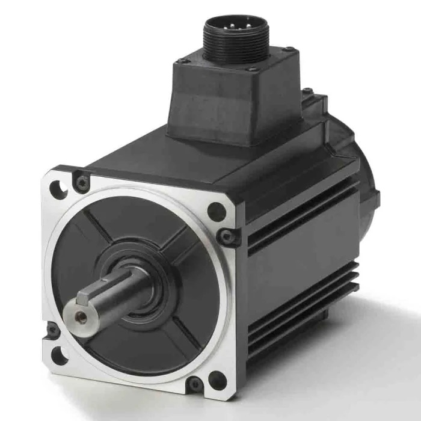
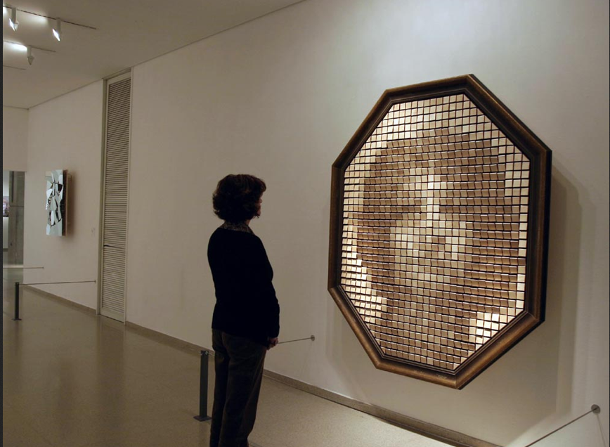
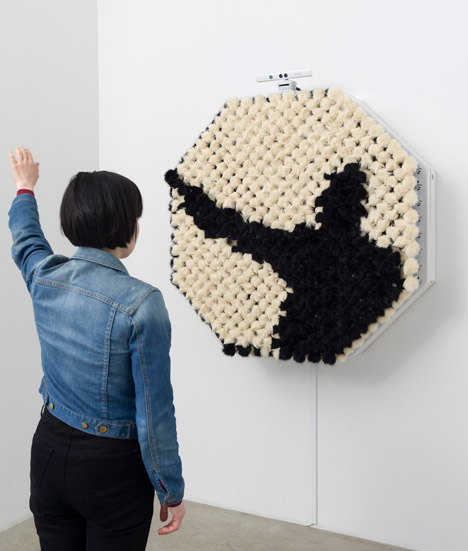

# investigaciones individuales

Benjamín Alvarez Pavez / [benjaminalvarez21](https://github.com/benjaminalvarez21)

## Sensor

## Sensor PIR (sensor infrarrojo pasivo)

Un sensor es un dispositivo que detecta cambios en el entorno, como temperatura, presión, vibraciones o corriente. Esta información se convierte en una señal que se puede medir, registrar o utilizar para activar una acción. Escogí investigar el sensor PIR.

Foto sacada de [MechatronicStore](https://www.mechatronicstore.cl/wp-content/uploads/2015/08/2.jpg).

Foto sacada de [Electroline](https://cdnx.jumpseller.com/electronline/image/12725377/sensor-IR200B.jpg?1657044911).

El sensor PIR es un sensor electrónico que mide la luz infrarroja irradiada por los objetos situados en su campo de visión. Se usa principalmente en detectores de movimiento. No emite radiación, sino que detecta el calor emitido por personas, animales u objetos.

Estos sensores de movimiento funcionan detectando una alteración en su zona de cobertura. Se puede cambiar la forma en que perciben la variación y el tipo de señal que se usa para interpretar el movimiento. El sensor detecta las variaciones de calor que existen entre el ambiente y el cuerpo. Hay distintos factores que pueden afectar el rendimiento del sensor, como la temperatura del ambiente, corrientes de aire, humedad o polvo. Algunos de estos sensores tienen reguladores físicos que controlan la sensibilidad y también el tiempo durante el cual detectan la señal.

Los problemas comunes generalmente son causados por todos los factores que afectan el rendimiento. Estos pueden provocar falsas activaciones constantes debido a que la sensibilidad es demasiado alta.

A veces, estos sensores vienen con luces LED integradas. Estas luces pueden afectar a algunos sensores, generalmente a los más antiguos, porque algunas luces LED consumen poca energía y eso genera problemas con sensores que necesitan una carga mínima para funcionar correctamente. Otra falla muy común ocurre por una mala instalación, problemas de cableado, mantenimiento deficiente o porque los sensores están muy sucios.

## Surface X de Picaroon
Rebecca Gischel, o su nombre artístico Picaroon, es una artista alemana que lleva creando instalaciones interactivas desde 2013. Estudió Diseño de Interacciones en Edimburgo. Fue invitada a exponer su instalación Global Sounds en el Ars Electronica de 2013 y ahí tomó la decisión de dedicarse al arte de las instalaciones interactivas y fundó Picaroon ese mismo año. Picaroon trabaja con música, luz y elementos cinéticos. Sus instalaciones cobran vida solo con la presencia e interacción del público.

.

Foto sacada de [Ars Electronica](https://ars.electronica.art/aeblog/files/2013/08/R_Gischel.png).

Surface X es una instalación interactiva artística creada en 2018 y presentada en el Festival Ars Electronica de ese mismo año. Se compone de 35 paraguas. Estos se cierran cuando se detecta presencia. Tiene dos Arduino Mega que funcionan como núcleo. Uno supervisa 20 sensores PIR y el otro controla el comportamiento de los paraguas. Se tardaron 3 años en construir esta estructura y funciona como un sistema neumático.

Foto sacada de[Picaroon](https://picaroon.eu/images/surf-img-1.png).

Foto sacada de [Picaroon](https://picaroon.eu/images/suf-slider-1.jpg).

Esta obra tiene como mensaje reflejar cómo somos las personas cuando nos escondemos en una coraza digital, hasta que nos acercamos a la realidad y se muestra lo que en verdad somos. Los 35 paraguas funcionan como un escudo digital, como cuando en alguna red social nos hacemos una cuenta y mostramos lo más superficial que tenemos, generando esta imagen ficticia de nosotros mismos. Cuando llega el momento de verse en persona con la gente que conoces a través de las redes sociales, se revela nuestra verdadera cara. Por eso, la estructura imponente, al sentir la presencia humana, se cierra y deja ver su verdadero interior: una estructura metálica, cables y sensores.

.

Video sacado del canal de VIRTUTE.

## Actuador

## Servomotor

Un actuador es una máquina que mueve o controla componentes de un sistema. Recibe una entrada de energía y la transforma en movimiento. La energía que llega puede ser por electricidad o por presión de agua o de aire. Pueden producir movimientos lineales o rotatorios. Yo escogí el servomotor para investigar.

Foto sacada de [RS Components](https://res.cloudinary.com/rsc/image/upload/b_rgb:FFFFFF,c_pad,dpr_1.0,f_auto,q_auto,w_700/c_pad,w_700/Y2157614-01).

Los servomotores son un tipo de motor eléctrico diseñado para realizar movimientos precisos y controlados. Es distinto a un motor convencional, ya que no gira libremente, sino que trabaja bajo un sistema de control cerrado, lo que permite conocer y corregir su posición en tiempo real. Cuando recibe datos o información, este se acciona y realiza movimientos. Por ejemplo, si usas un potenciómetro y lo mueves, el servomotor se mueve respondiendo a la información de la energía que le llega.

Algunos problemas comunes que tienen los servomotores pueden ser el sobrecalentamiento por el exceso de carga, vibraciones por interferencia en la señal y el desgaste o rotura de los engranajes internos. Otro podría ser el error de conexión de cables o que esté obsoleto y no reciba la información.

## Daniel Rozin y su Wooden Mirror

Daniel Rozin es un artista especializado en arte digital interactivo. Crea instalaciones y estructuras con la capacidad de transformarse y responder a la presencia y al punto de vista del espectador. En muchas ocasiones, los espectadores se convierten en el contenido de la pieza y, en otras, los invita a tomar un papel activo en la creación de esta.

Foto sacada de [bitforms gallery](https://www.bitforms.art/wp-content/uploads/2024/07/danny_rozin-1.png).

En este caso hablaré de Wooden Mirror. Está conformado por 830 piezas de madera no reflectantes, como si fueran píxeles, controladas por sus respectivos 830 servomotores. Reflejan a las personas y objetos que se ponen en frente de esta, creando una animación en vivo y en directo. Es la primera pieza de la serie Espejos Mecánicos de Daniel. Explora la intersección entre los mundos análogos y digitales, además de las experiencias físicas y virtuales. La versión original tiene forma hexagonal, pero existe otra versión que fue presentada en la exhibición Visual Deception II: Into the Future en Japón, que tiene forma cuadrada.

Foto sacada de [Proyecto IDIS](https://proyectoidis.org/wp-content/uploads/2013/07/Rozin.png).

Video sacado del canal MediaArtTube.

Existen más espejos interactivos conocidos como el PomPom Mirror, que se compone de 928 pompones esféricos de piel sintética con 928 motores que construyen siluetas de los espectadores mediante visión artificial. También existe el Troll Mirror, un espejo compuesto de 968 muñecos y 484 motores. Estos giran para que el troll rosado o azul mire hacia adelante, dando como resultado un colorido reflejo del contorno del espectador.

Foto sacada de [Dezeen](https://static.dezeen.com/uploads/2015/05/Daniel-Rozin_pompom_mirror_dezeen_468_3.jpg).

Video sacado del canal tzikuzi.

## Bibliografía

<https://tractian.com/es/glosario/sensors>

<https://www.tecnoseguro.com/faqs/alarma/que-es-un-detector-de-movimiento-pasivo-o-pir>

<https://blog.demasled.com.ar/fallas-comunes-sensores-movimiento/>

<https://es.wikipedia.org/wiki/Sensor_infrarrojo_pasivo>

<https://picaroon.eu/biography.php>

<https://www.designboom.com/art/picaroon-surface-x-real-face-digital-identity-03-19-2018/>

<https://www.hackster.io/Picaroon/surface-x-811e8c>

<https://tameson.es/pages/actuador>

<https://www.linak.com/products/linear-actuators/what-is-an-actuator/>

<https://kwoco-plc.com/es/servo-motor-common-failures/>

<https://www.exeingenieria.com/que-es-un-servomotor/>

<https://www.bitforms.art/artwork/wooden-mirror-2>

<https://www.bitforms.art/artwork/pompom-mirror>

<https://tisch.nyu.edu/about/directory/itp/95804818>

<https://arquitecturainteractiva.com/wooden-mirror-daniel-rozin/>

<https://www.smoothware.com/danny/trollmirror.html>
