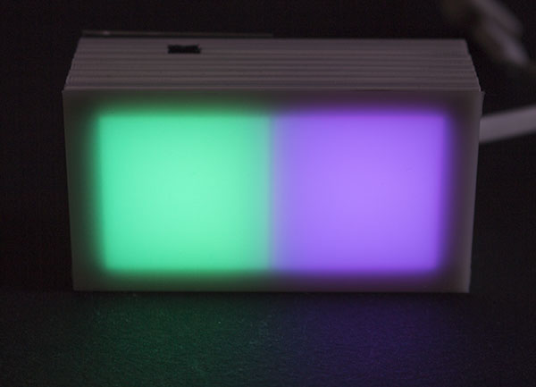
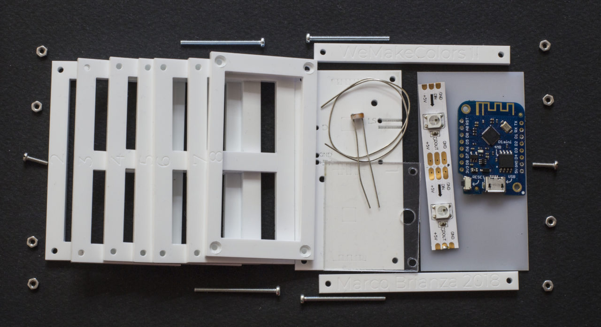
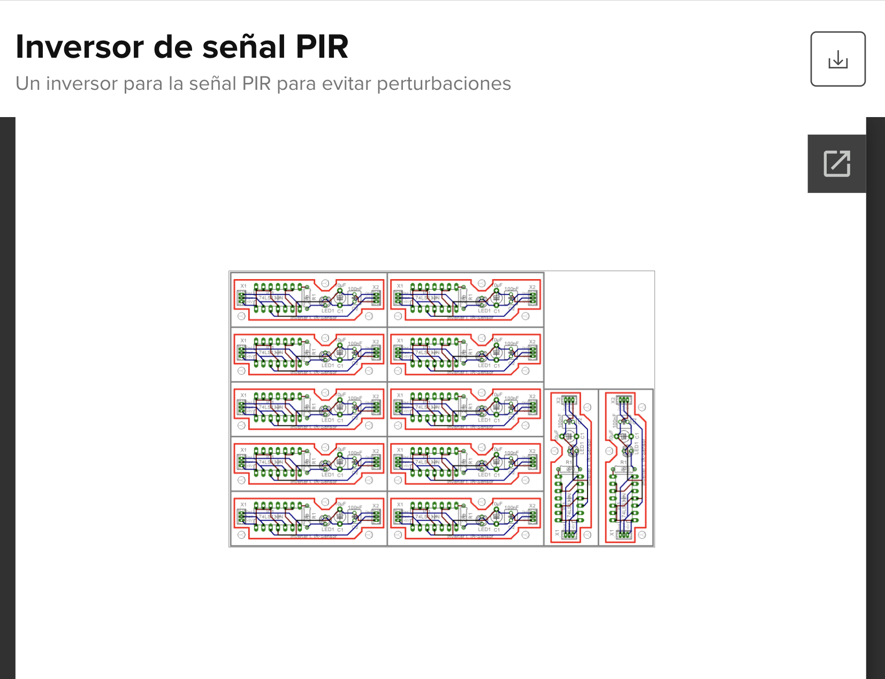
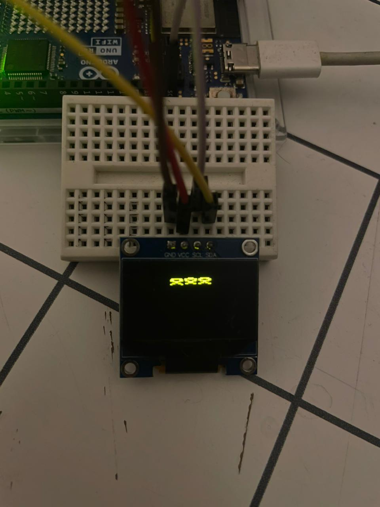

# investigaciones individuales

Agustina Aceituno / [agustinaaceituno](https://github.com/agustinaaceituno)

## Sensor
Un sensor es un dispositivo electrónico capaz de detectar cambios en el entorno físico y convertirlos en señales que pueden ser interpretadas por un microcontrolador, como un Arduino o una Raspberry Pi Pico. Los sensores permiten medir variables como temperatura, luz, distancia, sonido, movimiento, humedad o presión.
## Sensor LDR - aprendido en clase
Se llama así ya que Light Dependent Resistor, significa que es un sensor que cambia su valor dependiendo de la cantidad de luz que recibe. Funciona a base de la fotoconductividad que es la propiedad de ciertos materiales de aumentar su conductividad eléctrica al exponerse a la luz. Esto permite transformar cambios de iluminación en señales eléctricas que pueden ser interpretadas por un microcontrolador.
#### Funcionamiento básico:
* El LDR detecta la luz.
* Arduino lee el valor analógico.
* Responde según la cantidad de luz.
#### Problemas comunes
* Lecturas inestables por cambios rápidos de luz.
* Interferencia de sombras o reflejos.
#### Aprendizajes sobre el uso del sensor
* Relación entre entorno y datos - El sensor depende de lo que está sucediendo en su entorno para pasarlo a información digital. 
* Necesidad de calibración - Cada entorno tiene condiciones lumínicas distintas, por lo que es necesario ajustar rangos y valores.
* Importancia del filtrado - Nunca entregan datos completamente estables, por lo que se aprende a trabajar con ruido e imprecisión.
* Interactividad - Permite generar proyectos reactivos donde el entorno afecta directamente el comportamiento del sistema.
### Referente artístico: WeMakeColors II — Marco Brianza 
La obra consiste en una red de pequeños dispositivos conectados mediante WiFi. Cada módulo posee:

* LEDs.
* Microcontrolador.
* Sensor LDR

Los sensores detectan variaciones de luz en el entorno. Cuando alguien tapa el sensor con la mano o genera una sombra, el sistema interpreta ese cambio lumínico y genera nuevos colores que se transmiten al resto de los dispositivos de la instalación.
La interacción funciona cuando el espectador modifica la luz cercana al sensor, por ejemplo generando una sombra con la mano o cambiando la iluminación del entorno. El sensor de luz detecta esa variación lumínica y envía la información al microcontrolador, que procesa los datos y activa una respuesta visual mediante LEDs que cambian de color. Luego, la información se transmite a otros módulos de la instalación mediante WiFi, haciendo que toda la obra responda colectivamente a la acción del público.
El proyecto demuestra cómo un dato de luz simple puede transformarse en interacción visual, comunicación entre dispositivos, participación del público y una experiencia colectiva.

## Sensor PIR -  utilizado solemne
Su función es detectar movimiento a partir de las variaciones presentes en el entorno, especialmente el calor emitido por el cuerpo humano. El sensor identifica estos cambios térmicos mediante elementos piroeléctricos y los convierte en señales eléctricas que luego pueden ser procesadas e interpretadas por un microcontrolador.
#### Funcionamiento básico:
* El sensor PIR detecta movimiento o presencia.
* Responde cuando detecta cambios en el entorno.
#### Problemas comunes
* Falsas detecciones por cambios bruscos
* Sensibilidad excesiva o mal calibrada.
* Retrasos entre detección y respuesta.

#### Aprendizajes sobre el uso del sensor
* Relación entre entorno y datos - El sensor detecta cambios físicos en el espacio y los transforma en información digital que puede ser interpretada por un sistema electrónico.
* Necesidad de calibración - Dependiendo del tamaño del espacio, distancia y sensibilidad, es necesario ajustar tiempos de activación y rango de detección para evitar errores.
* Importancia del filtrado - El sensor puede generar falsas detecciones por cambios de temperatura, movimiento no deseado o interferencias, por lo que se aprende a trabajar con estabilidad y control de datos.
* Interactividad - Permite desarrollar proyectos reactivos donde el movimiento y presencia del público modifican directamente el comportamiento del sistema.

#### Sobre el proyecto
Se trabajó con un sensor PIR conectado junto a un push button. El sistema funcionaba activando el sensor al apretar el botón. Una vez encendido, el sensor PIR detecta movimiento al acercarse a este y este mismo movimiento se registra en la cuenta de Adafruit donde se registró todo el proceso y los movimientos. Para detener la detección y el envío de datos se volvía a presionar el botón para desactivar el sensor.

### Referente artístico: SURFACE X — Picaroon
Está compuesta por 35 paraguas suspendidos que reaccionan cuando una persona se acerca. El proyecto utiliza:
* 20 sensores PIR.
* 2 Arduino Mega.
* Sistemas neumáticos.
* Iluminación y movimiento mecánico.

El sistema funciona detectando la presencia y movimiento de las personas  mediante sensores PIR. Cuando una persona entra al espacio de detección, los sensores envían información al Arduino principal, que controla el comportamiento de los paraguas. Como respuesta, los paraguas se mueven, vibran o “reaccionan” frente a la cercanía humana, generando una experiencia interactiva e inmersiva.

La interacción ocurre en tiempo real ya que el espectador modifica el comportamiento de la instalación simplemente desplazándose dentro del espacio. El uso del sensor PIR permite detectar presencia sin necesidad de contacto físico, transformando el movimiento corporal en datos digitales capaces de activar respuestas visuales.

## Pantalla OLED 
#### Funcionamiento básico
* El microcontrolador envía información a la pantalla.
* La pantalla interpreta los datos.
* Los píxeles OLED se iluminan para formar texto, imágenes o animaciones.
* La información se actualiza constantemente en tiempo real.
* Mostrar datos de sensores.
* Visualizar animaciones pixel art.
* Mostrar temperatura, luz o movimiento.
* Interfaces interactivas.
#### Problemas comunes
* Pantalla en negro por mala conexión I2C.
* Bajo rendimiento con animaciones muy pesadas.
* Parpadeos o retrasos en actualización.
* Problemas de alimentación o voltaje.
* Resolución limitada para imágenes complejas.
#### Aprendizajes sobre el uso de la pantalla
* Relación entre datos y visualización - La pantalla permite transformar información digital en elementos visuales comprensibles para el usuario.
* Optimización gráfica - Se aprende a trabajar con resolución limitada y gráficos simplificados como pixel art, se recomienda tener en consideración el tamaño de la pantalla
* Interactividad - La pantalla puede reaccionar en tiempo real a sensores, botones o datos recibidos desde internet.
* Manejo de animaciones - Permite comprender cómo funcionan los frames, actualización de píxeles y secuencias visuales.
* Integración con sensores y actuadores - La OLED puede mostrar información proveniente de sensores PIR.
#### Sobre el proyecto 
Se utilizó una pantalla OLED como actuador junto a un push button para controlar la visualización de información. El funcionamiento del sistema consistía en que, al presionar el botón se activaba el envío de datos hacia la pantalla OLED, la cual mostraba la información recibida desde Adafruit IO desde el sensor PIR. El push button funcionaba como un controlador ya que al apretarlo se visualizaban los datos en la pantalla y si no se presionaba esta pantalla no recibía información.

Una dificultad en este momento fue realizar que las animaciones se lograran interpretar en la pantalla ya que al principio teníamos códigos muy largos y la pantalla no los reconoció, gracias a image2CPP vimos bien el tamaño de la pantalla donde descubrimos que el problema de que porque no funcionaba el código anterior era porque era demasiado grande la imagen de los frames, partimos investigando con fuentes que veian pantallas OLED y como se creaban imágenes en Image2CPP.

### Referente artístico: Circoled - Moritz König
Se trata de una pantalla de mensajes desplazables con 8 pequeñas pantallas OLED, dispuestas alrededor de una placa de circuito impreso y controladas por un ESP32.

Lo interesante del proyecto es que transforma varias pantallas pequeñas en una sola superficie continua de visualización de 360°. En vez de usar una pantalla rectangular tradicional, la información rodea completamente el objeto
#### El dispositivo utiliza:
* 8 pantallas OLED pequeñas.
* ESP32 Pico D4.
* PCB circular personalizada.
* Carcasa impresa en 3D.
#### La interfaz permite:
* Escribir mensajes.
* Controlar velocidad de desplazamiento.
* Visualizar temperatura.
* Mostrar batería.

Circoled no utiliza las pantallas OLED únicamente como monitores, sino como parte central de una pieza interactiva. Las ocho pantallas organizadas en forma circular crean un cilindro luminoso que transforma la visualización de datos en una experiencia espacial. De esta manera, la pantalla deja de ser solo un soporte técnico y se convierte en un objeto visual performático y narrativo.

## Bibliografía
* Arduino. Official Website.
https://www.arduino.cc/

* PicoBricks. What is LDR Sensors?
 https://picobricks.com/blogs/info/what-is-ldr-sensors

* Winsen Sensor. Photoconductivity Sensors.
 https://es.winsen-sensor.com/knowledge/photoconductivity-sensors.html

* Adafruit Industries. Photocells.
 https://learn.adafruit.com/photocells

* Marco Brianza. WeMakeColors II.
 https://www.marcobrianza.it/wemakecolors-ii/

* Arduino.cl. Sensor PIR HC-SR501 Detector de Movimiento.
 https://arduino.cl/producto/sensor-pir-hc-sr501-detector-de-movimiento/

* Mechatronic Store. Sensor Detector de Movimiento PIR HC-SR501.
 https://www.mechatronicstore.cl/sensor-detector-de-movimiento-pir-hc-sr501/

* Hackster.io. Surface X Project.
 https://www.hackster.io/Picaroon/surface-x-811e8c

* Javl. Image2cpp. https://javl.github.io/image2cpp/

* Adafruit Industries. Monochrome OLED Breakouts: Arduino Library and Examples. 
https://learn.adafruit.com/monochrome-oled-breakouts/arduino-library-and-examples

* Huy Khoong. gif2cpp. https://github.com/huykhoong/gif2cpp

* Random Nerd Tutorials. ESP32/Arduino OLED Display Guide. 
https://randomnerdtutorials.com/guide-for-oled-display-with-arduino/

* SparkFun Electronics. PIR Motion Sensor Hookup Guide. 
https://learn.sparkfun.com/tutorials/pir-motion-sensor-hookup-guide/all

* Adafruit. (s.f.). Adafruit IO documentation. Adafruit Learning System. 
https://io.adafruit.com/

* Soldered Electronics. (s.f.). SSD1306 OLED display overview. Soldered Documentation.
https://docs.soldered.com/ssd1306/overview/

* Hackster.io. An ESP32 Controls This Cylindrical OLED Display.
 https://www.hackster.io/news/an-esp32-controls-this-cylindrical-oled-display-70f9b999141b

* PCBWay. Circoled – Eight Tiny OLED Displays Arranged in a Circle.
 https://www.pcbway.com/project/shareproject/Circoled___Eight_tiny_OLED_displays_arranged_in_a_circle.html

