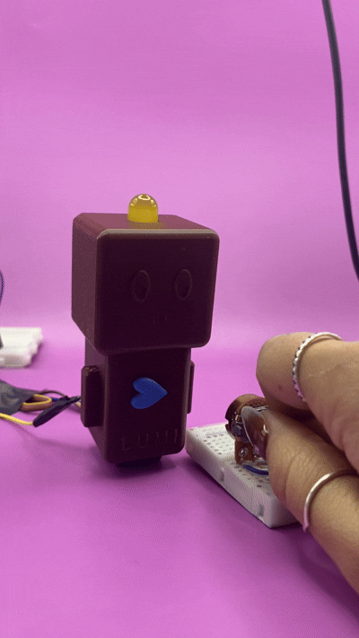

# solemne-02

## Integrantes

- Sofía Cartes Aravena / <https://github.com/sofiacartes>
- Monserrat Paredes / <https://github.com/Monserrat-Paredes>
- Valentina Ruz Pizarro / <https://github.com/vxlentiinaa>

## Descripción textual del proyecto

Este proyecto consiste en un sistema de interacciones inalámbricas entre una Raspberry Pi Pico 2 W y un Arduino UNO R4 WIFI, utilizando la plataforma Adafruit IO como intermediario para la visualización y envío de datos en tiempo real.

El funcionamiento comienza con un potenciómetro conectado a la Raspberry Pi Pico 2 W, el cual envía datos del ángulo al girar la perilla. La Raspberry Pi lee estos valores analógicos y los envía al feed llamado “moluscos” dentro de Adafruit IO utilizando conexión WiFi.

Posteriormente, el Arduino recibe los datos publicados en el feed y los interpreta para controlar un servomotor SG90. Dependiendo del valor enviado por el potenciómetro, el servo cambia su ángulo de rotación. Cuando el servomotor alcanza un ángulo específico (previamente programado), se activa automáticamente una luz LED amarilla, generando una respuesta visual al movimiento.

## Materiales usados

|Componente|Cantidad|Precio|Link|
|---|---|---|---|
|Raspberry Pi Pico 2 W|1|$14.990|<https://raspberrypi.cl/products/raspberry-pi-pico-2-w-con-headers>|
|Arduino UNO R4 WIFI|1|$38.990|<https://mcielectronics.cl/shop/product/arduino-uno-r4-minima>|
|Servomotor SG90|1|$3.290|<https://arduino.cl/producto/micro-servo-motor-sg90-9g/>|
|Potenciómetro B500k|1|$500|<https://afel.cl/products/potenciometro-10k-ohm>|
|LED amarillo 10mm|1|$500|<https://www.mechatronicstore.cl/led-10mm-variedad-de-colores/>|
|Resistencias 200 ohms|1|$413|<https://altronics.cl/pack-10-resistencias-220ohm-025watt-1porciento>|
|Protoboard|1|$1.500|<https://afel.cl/products/mini-protoboard-400-puntos>|
|cables|4|$1.000|<https://afel.cl/products/pack-20-cables-de-conexion-macho-macho>|

## Sensor usado

`Potenciómetro B500K`

El sensor utilizado en este proyecto es un potenciómetro de B500K. Este componente funciona como una resistencia variable que permite modificar manualmente el voltaje entregado a la Raspberry Pi Pico 2 W. En este caso, modificaría el ángulo del servomotor.

La Raspberry Pi interpreta este cambio mediante una entrada analógica ADC, convirtiendo los valores físicos del giro del potenciómetro en datos digitales. Estos datos son enviados posteriormente al feed “moluscos” en Adafruit IO para ser utilizados por el Arduino.

El potenciómetro actúa como interfaz de control principal del sistema, permitiendo manejar el comportamiento del servomotor en tiempo real.

## Actuador usado

`Servomotor SG90`

El actuador principal del proyecto es un servomotor SG90. Este tipo de motor permite controlar con precisión el ángulo de movimiento mediante señales PWM enviadas desde el Arduino.

El servo recibe los datos provenientes del feed “moluscos” y ajusta su posición según los valores entregados por el potenciómetro. Cuando alcanza un ángulo determinado, el sistema activa un LED amarillo como indicador visual del estado alcanzado.

## Pseudocódigo

Entonces, nuestro pseudocódigo sería:

|Raspberry Pi Pico 2 W|Adafruit IO|Arduino UNO R4 wifi|
|---|---|---|
|Potenciómetro|MQTT|Led + servomotor|
|ángulo|Feed: estado|enciende led y mueve servo|

1. Giras el potenciómetro en la Raspberry > va cambiando el ángulo
2. La Raspberry publica el ángulo en el feed de Adafruit IO
3. El Arduino recibe el mensaje y mueve el servomotor, cuando llegue a cierto ángulo se prende el LED.

## Código usado para enviar

**En Raspberry PI Pico 2 W**

Mediante un potenciómetro, define datos de ángulos, para luego mandarlo a Adafruit IO, así visualizamos en el feed los datos.

```cpp
#  LIBRERIA necesaria en /lib:
#    - adafruit_minimqtt
# ============================================================

import time
import board # type: ignore
import analogio # type: ignore
import digitalio # type: ignore
import wifi # type: ignore
import socketpool # type: ignore
import adafruit_minimqtt.adafruit_minimqtt as MQTT # type: ignore

#  cambiar claves wifi
WIFI_SSID     = "blablabla"
WIFI_PASSWORD = "blablabla"

AIO_USERNAME  = "blablabla"
AIO_KEY       = "blablabla"

FEED_ANGULO   = f"{AIO_USERNAME}/feeds/moluscos"

# definir potenciometro + led
potenciometro = analogio.AnalogIn(board.GP27)

led = digitalio.DigitalInOut(board.LED)
led.direction = digitalio.Direction.OUTPUT
led.value = False

# lee los valores en angulo, del potenciometro
def leer_angulo():
    # ADC devuelve 0-65535, convertimos a 0-180
    return int(potenciometro.value * 180 / 65535)

# verificar conexion wifi
print("Conectando a WiFi...")
try:
    wifi.radio.connect(WIFI_SSID, WIFI_PASSWORD)
    print("  ✓ IP:", wifi.radio.ipv4_address)
except Exception as e:
    print("  ✗ Error WiFi:", e)
    while True:
        pass

# verificar conexion mqtt
pool = socketpool.SocketPool(wifi.radio)

mqtt = MQTT.MQTT(
    broker="io.adafruit.com",
    port=1883,
    username=AIO_USERNAME,
    password=AIO_KEY,
    socket_pool=pool,
)

try:
    mqtt.connect()
    print("  ✓ Conectado a Adafruit IO")
    print("  Feed:", FEED_ANGULO)
    print("\nListo. Gira el potenciómetro...\n")
except Exception as e:
    print("  ✗ Error MQTT:", e)
    while True:
        pass

# aqui se define todo 
angulo_anterior = -1

while True:
    try:
        mqtt.loop()

        angulo = leer_angulo()

        # Publica solo si cambi0 mas de 2 grados (filtra ruido del ADC)
        if abs(angulo - angulo_anterior) > 2:
            print("Angulo:", angulo, "° → publicando...")
            mqtt.publish(FEED_ANGULO, str(angulo))
            angulo_anterior = angulo

            # Parpadeo del LED al publicar
            led.value = True
            time.sleep(0.05)
            led.value = False

    except Exception as e:
        print("Error:", e, "— reconectando...")
        try:
            mqtt.reconnect()
        except Exception:
            pass

    time.sleep(0.1)

```

## Código usado para recibir

**En Arduino IDE**

Luego, en el código que recibe. El arduino lee estos valores y procede a mover el servomotor, cuando llegue a un ángulo límite, se prende una luz amarilla.

```cpp
// Grupo 08
// Arduino UNO R4 WiFi — Adafruit IO → Servo SG90 + LED rojo

//  Recibe ángulo (0-180°) desde Adafruit IO
//  → Mueve el servo SG90 a ese ángulo
//  → Si ángulo >= 150°: LED rojo enciende (señal de término)
//  → Si ángulo <  150°: LED rojo apagado
#include <WiFiS3.h>
#include <ArduinoMqttClient.h>
#include <Servo.h>

// configuracion de los datos
const char* WIFI_SSID     = "blablabla";
const char* WIFI_PASSWORD = "blablabla";

const char* AIO_SERVER    = "io.adafruit.com";
const int   AIO_PORT      = 1883;
const char* AIO_USERNAME  = "blablabla";
const char* AIO_KEY       = "blablabla";

const char* FEED_ANGULO   = "blablabla/feeds/moluscos";

// definir pines del servo y led
const int PIN_SERVO    = 9;
const int PIN_LED_ROJO = 3;

// angulo a partir del cual enciende el LED (señal de termino)
const int ANGULO_TERMINO = 125;

// wifi + servo
WiFiClient   wifiClient;
MqttClient   mqttClient(wifiClient);
Servo        miServo;

// se ejecuta al recibir el mensaje
void onMqttMessage(int messageSize) {
  String payload = "";
  while (mqttClient.available()) {
    payload += (char)mqttClient.read();
  }

  int angulo = payload.toInt();
  angulo = constrain(angulo, 0, 180);  // seguridad: limita al rango del servo

  Serial.print("Ángulo recibido: ");
  Serial.print(angulo);
  Serial.println("°");

  // mueve el servo
  miServo.write(angulo);

  // LED rojo: enciende si llego al angulo de termino
  if (angulo >= ANGULO_TERMINO) {
    digitalWrite(PIN_LED_ROJO, HIGH);
    Serial.println("  → LED ROJO encendido ✓ (término alcanzado)");
  } else {
    digitalWrite(PIN_LED_ROJO, LOW);
    Serial.print("  → Servo en ");
    Serial.print(angulo);
    Serial.print("° (falta ");
    Serial.print(ANGULO_TERMINO - angulo);
    Serial.println("° para término)");
  }
}

// setup
void setup() {
  Serial.begin(115200);
  delay(1500);

  // pines
  pinMode(PIN_LED_ROJO, OUTPUT);
  digitalWrite(PIN_LED_ROJO, LOW);

  miServo.attach(PIN_SERVO);
  miServo.write(0);   // posicion inicial: 0°

  Serial.println("=== Arduino UNO R4 WiFi — Servo SG90 + LED ===\n");

  // wifi
  Serial.print("Conectando a WiFi");
  while (WiFi.begin(WIFI_SSID, WIFI_PASSWORD) != WL_CONNECTED) {
    Serial.print(".");
    delay(1000);
  }
  Serial.println();
  Serial.print("  ✓ IP: ");
  Serial.println(WiFi.localIP());

  // mqtt
  mqttClient.setId("ArduinoUNOR4_servo");
  mqttClient.setUsernamePassword(AIO_USERNAME, AIO_KEY);
  mqttClient.onMessage(onMqttMessage);

  Serial.print("Conectando a Adafruit IO...");
  while (!mqttClient.connect(AIO_SERVER, AIO_PORT)) {
    Serial.print(".");
    delay(1000);
  }
  Serial.println();
  Serial.println("  ✓ Conectado a Adafruit IO");

  mqttClient.subscribe(FEED_ANGULO);
  Serial.println("  ✓ Suscrito al feed: moluscos");
  Serial.print("\nEsperando datos... LED enciende al llegar a ");
  Serial.print(ANGULO_TERMINO);
  Serial.println("°\n");

  // parpadeo de confirmacion
  for (int i = 0; i < 3; i++) {
    digitalWrite(PIN_LED_ROJO, HIGH); delay(150);
    digitalWrite(PIN_LED_ROJO, LOW);  delay(150);
  }
}

// loop
void loop() {
  // reconexion automatica
  if (!mqttClient.connected()) {
    Serial.println("[MQTT] Desconectado. Reconectando...");
    digitalWrite(PIN_LED_ROJO, LOW);
    miServo.write(0);

    while (!mqttClient.connect(AIO_SERVER, AIO_PORT)) {
      Serial.print(".");
      delay(2000);
    }
    mqttClient.subscribe(FEED_ANGULO);
    Serial.println("\n  ✓ Reconectado");
  }

  mqttClient.poll();
}

```

## Imágenes del proyecto


## Animaciones del proyecto





## Bibliografía

Arduino.cl. (s.f.). Micro Servo Motor SG90 9g. Arduino.cl. <https://arduino.cl/producto/micro-servo-motor-sg90-9g>
Arduino.cl. (s.f.). Ejemplo análogo con potenciómetro. Arduino.cl. <https://arduino.cl/ejemplo-analogo-con-potenciometro/?srsltid=AfmBOopNZdWYQtTXaZWpSAN4Bjrw3WSeNnmfDP10xmWbFMU7vnoCf1vW>
adafruit.com.(s.f.).adafruit.com. <https://learn.adafruit.com/welcome-to-adafruit-io?view=all>
circuitpython.org.(s.f).raspberry_pi_pico2_w. circuitpython.org <https://circuitpython.org/board/raspberry_pi_pico2_w/>
