# investigaciones individuales

Valentina Ruz / [github](https://github.com/vxlentiinaa)

## Investigación

Lo que queremos realizar en la solemne 2 es que desde la Raspberry pi envíe datos mediante un potenciómetro hacía el Arduino y que este encienda una luz y mueva un servomotor. Los datos enviados se verán reflejados en el feed de Adafruit.

---

Entonces, nuestro pseudocódigo sería:

|Raspberry Pi Pico 2 W|Adafruit IO|Arduino UNO R4 wifi|
|---|---|---|
|Potenciómetro|MQTT|Led + servomotor|
|ángulo|Feed: estado|enciende led y mueve servo|

1. Giras el potenciómetro en la Raspberry > va cambiando el ángulo
2. La Raspberry publica el ángulo en el feed de Adafruit IO
3. El Arduino recibe el mensaje y mueve el servomotor, cuando llegue a cierto ángulo se prende la luz led

### Raspberry Pi Pico 2W

La Raspberry Pi Pico 2 W será utilizada para leer los datos provenientes de un potenciómetro B500K conectado a una entrada analógica.

A medida que el usuario gira el potenciómetro, la Pico interpreta las variaciones de resistencia como valores digitales. Posteriormente, estos datos serán enviados mediante conexión WiFi hacia la plataforma Adafruit IO utilizando protocolo MQTT.

El objetivo de esta etapa es visualizar en tiempo real los cambios del potenciómetro dentro del feed llamado “moluscos”, permitiendo monitorear el comportamiento del sensor desde internet.

### Adafruit IO

La plataforma Adafruit IO funcionará como intermediario de comunicación entre ambas placas.

Los datos enviados desde la Raspberry Pi Pico 2 W serán publicados en el feed “moluscos”, quedando disponibles en tiempo real para ser leídos posteriormente por el Arduino UNO R4 WiFi.

Para Adafruit se visualiza desde el feed moluscos: <https://io.adafruit.com/vxlentiinaa/feeds/moluscos>

### Arduino IDE

El Arduino UNO R4 WiFi se conectará a Adafruit IO para recibir los datos publicados en el feed “moluscos”.

Una vez recibidos los valores del potenciómetro, el Arduino interpretará esta información para controlar el movimiento de un servomotor SG90. Dependiendo de los datos enviados, el servomotor modificará su ángulo de posición.

Cuando el servo alcance un ángulo previamente definido dentro del código, el Arduino activará un LED amarillo como indicador del ángulo alcanzado.

`Recordar!!`

1. TU_NOMBRE_WIFI / TU_CLAVE_WIFI
2. TU_USUARIO_ADAFRUIT / TU_AIO_KEY
3. En el .ino, también reemplaza TU_USUARIO_ADAFRUIT en la línea del feed

## Sensor

**Investigación del sensor: Potenciómetro B500K**

`¿Qué es un potenciómetro?`

Un potenciómetro es un dispositivo electrónico. Se puede usar como resistencia o resistor variable mecánica (con cursor y de al menos tres terminales). El usuario al manipularlo, obtiene entre el terminal central (cursor) y uno de los extremos una fracción de la diferencia de potencial total, se comporta como un divisor de tensión o divisor de voltaje.


`Tipos de resistencia de variación mecánica para su uso como potenciómetros:`

- `Impresas:` realizadas con una pista de carbón o de cermet sobre un soporte duro como papel baquelizado (cartón prespan), fibra de vidrio, baquelita, etcétera. La pista tiene sendos contactos en sus extremos y un cursor conectado a un patín que se desliza por la pista resistiva.
- `Bobinadas:` consistentes en un arrollamiento toroidal de un hilo resistivo (por ejemplo, constantán) con un cursor que mueve un patín sobre el mismo.
- `Potencia:` al igual que las resistencias, los potenciómetros soportarán distintas potencias, por lo general a partir de 1 W. Al reverso específica la potencia en W. Los potenciómetros de mucha potencia reciben el nombre de reóstatos, que ya se utilizan muy poco.

`Existen distintos tipos de potenciómetro, como:`

1. Potenciómetros de mando
2. Potenciómetros de ajuste
3. Variación lineal
4. Variación logarítmica
5. Variación senoidal
6. Variación antilogarítmica
7. Variacion de balance
8. etc...

`En conclusión (como yo lo entendí):`

El potenciómetro es un sensor analógico de resistencia variable que permite modificar manualmente el voltaje dentro de un circuito electrónico. Al girar su eje, cambia la resistencia eléctrica y el microcontrolador puede interpretar distintos valores numéricos. En proyectos interactivos, los potenciómetros son ampliamente utilizados para controlar intensidad, posición, velocidad o sensibilidad de sistemas físicos y digitales.

`Funcionamiento dentro del proyecto`

1. En este proyecto, el potenciómetro B500K se conecta a la Raspberry Pi Pico 2 W mediante una entrada analógica ADC.
2. El sensor entrega valores variables dependiendo de la posición física del giro. La Raspberry pi convierte estos datos analógicos en datos digitales y posteriormente los envía mediante wifi al feed “moluscos” en Adafruit IO.
3. Estos datos son utilizados para controlar el movimiento del servomotor y el comportamiento visual del robot LUMI.

`Filtrado de información`

- Uno de los principales problemas de los sensores analógicos es la inestabilidad de lectura causada por pequeñas variaciones eléctricas o físicas.
- Para evitar movimientos bruscos del servo, realizamos:
  - Mapeo de valores analógicos.
  - Reducción del rango de lectura.
  - Envío de datos cada cierto tiempo.
- El filtrado permite obtener una experiencia más estable y controlada en la interacción física.

En conclusión, los valores se envían con un delay para que el servo no esté inestable, por lo que el brazo del servo se mueve paulatinamente y no "fluido".

`Visualización de datos`

- Los datos del potenciómetro fueron visualizados utilizando Adafruit IO, una plataforma IoT que permite monitorear información en tiempo real mediante dashboards y feeds.
- La visualización permitió observar cómo cambiaban los valores enviados por el sensor dependiendo del ángulo que determine el usuario

`Artista / proyecto / empresa relacionada`

### [Teenage Engineering](https://teenage.engineering)

Son sintetizadores y controladores interactivos.

Muchos proyectos de Teenage Engineering utilizan potenciómetros como parte central de la interacción física entre usuario y dispositivo.

- En sintetizadores como el *OP–1 field*, los potenciómetros permiten controlar variables como:
  - volumen
  - frecuencia
  - velocidad
  - efectos de sonido
  - navegación de interfaces


## Actuador

**Investigación del actuador: Servomotor SG90**

`¿Qué es un actuador?`

Un actuador es un componente capaz de transformar energía eléctrica en movimiento físico. Dentro de sistemas interactivos, los actuadores permiten que los datos digitales produzcan respuestas visibles o mecánicas. En este caso, utilizamos un actuador eléctrico es un dispositivo electromecánico que convierte la energía eléctrica en fuerza y movimiento mecánico. Utiliza un motor eléctrico (como corriente continua, motores paso a paso o servomotores) para generar un movimiento rotativo o lineal, permitiendo abrir, cerrar, posicionar o bloquear objetos. 

`¿Qué es el servomotor SG90?`

Un servomotor es un actuador electromecánico diseñado para controlar con precisión la posición angular, velocidad y movimiento de un eje mediante un sistema de retroalimentación interna. A diferencia de un motor convencional, que gira de manera continua al recibir energía, el servomotor puede posicionarse en ángulos específicos y mantener esa posición de forma controlada.

Los servomotores son ampliamente utilizados en robótica, automatización, diseño interactivo, prótesis, sistemas industriales, modelismo y dispositivos electrónicos debido a su capacidad de realizar movimientos precisos y repetibles.

El SG90 es un micro servomotor controlado mediante señales PWM. Permite mover su eje hacia posiciones angulares específicas, generalmente entre 0° y 180°. Tiene un conector universal tipo “S” que encaja perfectamente en la mayoría de los receptores de radio control. Los cables en el conector están distribuidos de la siguiente forma:

|Rojo|Café|Naranjo|
|--|--|--|
|Alimentación|Tierra|Señal|
|(+)|(-)|PWM|

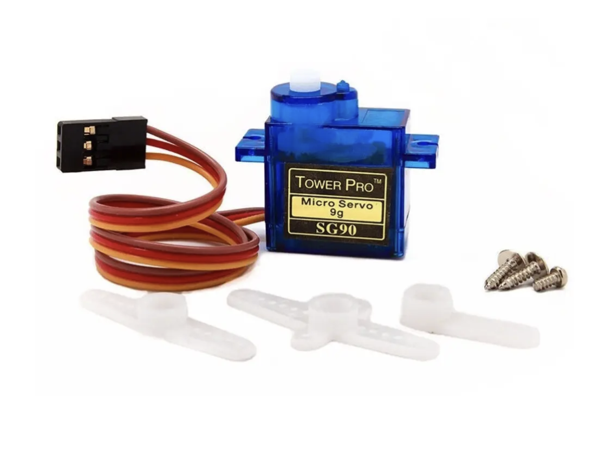

**PWM**

- Los servomotores funcionan principalmente mediante señales PWM.
- La modulación por ancho de pulso consiste en enviar pulsos eléctricos repetitivos donde la duración del pulso determina el ángulo de posición del servo.
- En la mayoría de los servomotores:
  - un pulso cercano a 1 ms corresponde aproximadamente a 0°
  - un pulso de 1.5 ms corresponde a 90°
  - y un pulso de 2 ms corresponde a 180°

Este sistema permite controlar el movimiento angular con alta precisión utilizando únicamente una señal digital desde plataformas como Arduino o Raspberry Pi.

- Es uno de los actuadores más utilizados en proyectos de robótica, diseño interactivo y prototipado debido a:
  - Bajo costo
  - Tamaño compacto
  - Fácil programación
  - Compatibilidad con Arduino y Raspberry Pi
  - Funcionamiento dentro del proyecto
 
**Componentes internos**

- `Motor DC:` Es el componente encargado de generar el movimiento rotacional básico. Generalmente funciona a bajo voltaje y alta velocidad.
- `Caja reductora de engranajes:` Los engranajes reducen la velocidad del motor y aumentan el torque, permitiendo movimientos más controlados y con mayor fuerza mecánica.
- `Potenciómetro interno:` El servomotor incorpora un potenciómetro conectado al eje principal. Este sensor mide constantemente la posición angular del eje y entrega información al circuito de control.

En este proyecto, el Arduino recibe los datos enviados desde Adafruit IO y los utiliza para controlar el ángulo del servomotor SG90. El servo mueve el corazón giratorio del robot LUMI dependiendo de la posición del potenciómetro. Además, cuando alcanza cierto ángulo, se activa un LED amarillo como respuesta visual.

`Filtrado y control de movimiento`

- Para evitar movimientos erráticos del servomotor se realizaron:
  - Definir el máximo del ángulo.
  - Mapeo de datos.
  - Actualización progresiva del movimiento.
  - Control de velocidad mediante delays.

`Problemas comunes`

- Los SG90 pueden presentar pequeños movimientos involuntarios debido al ruido eléctrico o señales inestables.
- Problemas de alimentación
- Definir el límite del ángulo
- El servo no siempre alcanza exactamente los 180° reales.

`Visualización de datos y movimiento`

- Los datos enviados por el sensor se transforman en movimiento mecánico dentro de LUMI, permitiendo visualizar información invisible mediante interacción cinética y luz; girando el corazón y prendiendo la luz.

`Artista / proyecto / empresa relacionada`

### [Robot Araña](https://fselectronics.cl/products/robot-arana-12-dof-arduino-12-servo-sg90)

El Robot Araña 12 DOF es un robot inspirado en el movimiento de las arañas, diseñado para explorar principios de robótica, mecánica e interacción electrónica mediante el uso de Arduino y múltiples servomotores SG90.

`Funcionalidad`

- Cada pata del robot está compuesta por tres articulaciones principales:
  - Coxa: controla la rotación lateral de la pata.
  - Femur: controla la elevación y descenso.
  - Tibia: controla la extensión y apoyo de la pierna.

- La combinación de estos movimientos permite que el robot:
  - camine
  - gire
  - mantenga equilibrio
  - cambie de postura

El sistema es controlado mediante un microcontrolador Arduino, el cual envía señales PWM a los servomotores SG90 para coordinar el desplazamiento del robot.

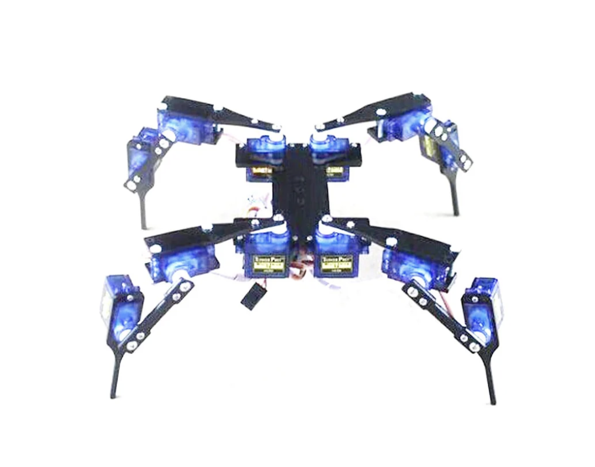


`Diseño`

- La piezas del robot son:
  - piezas acrílicas
  - impresión 3D
  - placas modulares livianas
  - tornillos
 
`Otro proyecto que utiliza Servomotor SG90 es....`

### AND-Y (wujuu!!)


- Robot interactivo que te invita reflexionar de manera lúdica sobre nuestras relaciones con las máquinas
- And-y, nace a partir del siguiente encargo: crear una máquina saludadora. Con eso en mente, diseñamos un robot que genera una experiencia interactiva, donde en cada fase tiene una respuesta diferente. And-y funciona mediante los inputs de sensores ultrasónicos, generando outputs como servo motor, motor joystick y mp3. Cada etapa del proyecto implicó diversas dificultades, aciertos, bocetos, pruebas y prototipos.

`código, clase servo`

```cpp
// controla el brazo servomotor de AND-Y
void SalidaDedo::configurar() {
  servo.attach(patitaServo);
  servo.write(0); // posición inicial: abajo
}

void SalidaDedo::levantar() {
  servo.write(180); // sube el brazo a 180°
}

void SalidaDedo::bajar() {
  servo.write(0); // baja el brazo a 0°
}

int patitaServo = 13; // pin de conexión
```

`Código en el principal`

```cpp
 // controla el brazo
  if (ultrasonico.dondeEsta == 0) dedo.levantar();
  else dedo.bajar();
```

### Código que recibe, en Arduino IDE

Luego, en el código que recibe. El arduino lee estos valores y procede a mover el servomotor, cuando llegue a un ángulo límite, se prende una luz amarilla.

```cpp
// Grupo 08
// Arduino UNO R4 WiFi — Adafruit IO → Servo SG90 + LED rojo

//  Recibe ángulo (0-180°) desde Adafruit IO
//  → Mueve el servo SG90 a ese ángulo
//  → Si ángulo >= 150°: LED rojo enciende (señal de término)
//  → Si ángulo <  150°: LED rojo apagado
#include <WiFiS3.h>
#include <ArduinoMqttClient.h>
#include <Servo.h>

// configuracion de los datos
const char* WIFI_SSID     = "blablabla";
const char* WIFI_PASSWORD = "blablabla";

const char* AIO_SERVER    = "io.adafruit.com";
const int   AIO_PORT      = 1883;
const char* AIO_USERNAME  = "blablabla";
const char* AIO_KEY       = "blablabla";

const char* FEED_ANGULO   = "blablabla/feeds/moluscos";

// definir pines del servo y led
const int PIN_SERVO    = 9;
const int PIN_LED_ROJO = 3;

// angulo a partir del cual enciende el LED (señal de termino)
const int ANGULO_TERMINO = 125;

// wifi + servo
WiFiClient   wifiClient;
MqttClient   mqttClient(wifiClient);
Servo        miServo;

// se ejecuta al recibir el mensaje
void onMqttMessage(int messageSize) {
  String payload = "";
  while (mqttClient.available()) {
    payload += (char)mqttClient.read();
  }

  int angulo = payload.toInt();
  angulo = constrain(angulo, 0, 180);  // seguridad: limita al rango del servo

  Serial.print("Ángulo recibido: ");
  Serial.print(angulo);
  Serial.println("°");

  // mueve el servo
  miServo.write(angulo);

  // LED rojo: enciende si llego al angulo de termino
  if (angulo >= ANGULO_TERMINO) {
    digitalWrite(PIN_LED_ROJO, HIGH);
    Serial.println("  → LED ROJO encendido ✓ (término alcanzado)");
  } else {
    digitalWrite(PIN_LED_ROJO, LOW);
    Serial.print("  → Servo en ");
    Serial.print(angulo);
    Serial.print("° (falta ");
    Serial.print(ANGULO_TERMINO - angulo);
    Serial.println("° para término)");
  }
}

// setup
void setup() {
  Serial.begin(115200);
  delay(1500);

  // pines
  pinMode(PIN_LED_ROJO, OUTPUT);
  digitalWrite(PIN_LED_ROJO, LOW);

  miServo.attach(PIN_SERVO);
  miServo.write(0);   // posicion inicial: 0°

  Serial.println("=== Arduino UNO R4 WiFi — Servo SG90 + LED ===\n");

  // wifi
  Serial.print("Conectando a WiFi");
  while (WiFi.begin(WIFI_SSID, WIFI_PASSWORD) != WL_CONNECTED) {
    Serial.print(".");
    delay(1000);
  }
  Serial.println();
  Serial.print("  ✓ IP: ");
  Serial.println(WiFi.localIP());

  // mqtt
  mqttClient.setId("ArduinoUNOR4_servo");
  mqttClient.setUsernamePassword(AIO_USERNAME, AIO_KEY);
  mqttClient.onMessage(onMqttMessage);

  Serial.print("Conectando a Adafruit IO...");
  while (!mqttClient.connect(AIO_SERVER, AIO_PORT)) {
    Serial.print(".");
    delay(1000);
  }
  Serial.println();
  Serial.println("  ✓ Conectado a Adafruit IO");

  mqttClient.subscribe(FEED_ANGULO);
  Serial.println("  ✓ Suscrito al feed: moluscos");
  Serial.print("\nEsperando datos... LED enciende al llegar a ");
  Serial.print(ANGULO_TERMINO);
  Serial.println("°\n");

  // parpadeo de confirmacion
  for (int i = 0; i < 3; i++) {
    digitalWrite(PIN_LED_ROJO, HIGH); delay(150);
    digitalWrite(PIN_LED_ROJO, LOW);  delay(150);
  }
}

// loop
void loop() {
  // reconexion automatica
  if (!mqttClient.connected()) {
    Serial.println("[MQTT] Desconectado. Reconectando...");
    digitalWrite(PIN_LED_ROJO, LOW);
    miServo.write(0);

    while (!mqttClient.connect(AIO_SERVER, AIO_PORT)) {
      Serial.print(".");
      delay(2000);
    }
    mqttClient.subscribe(FEED_ANGULO);
    Serial.println("\n  ✓ Reconectado");
  }

  mqttClient.poll();
}

```

## Imágenes

1. La función de leer los valores en Arduino, no funcionó

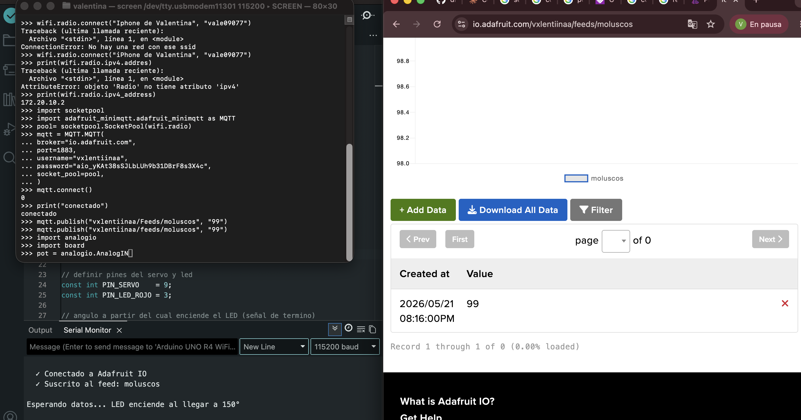

2. No conectaba o no reconocía la Raspberry PI

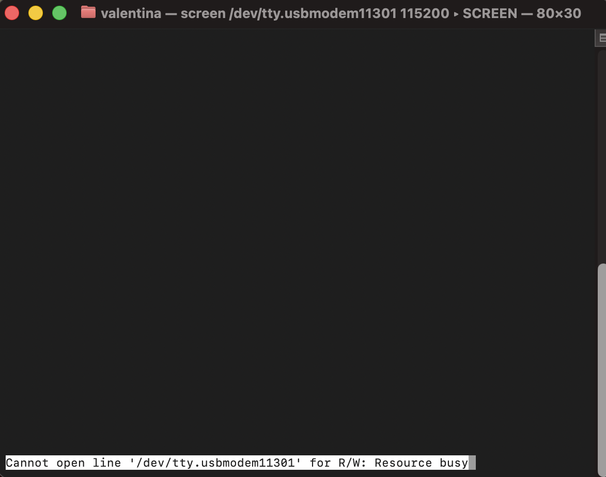

3. Después de muchos intentos (que se me olvidó tomar captura) finalmente funcionó el MQTT

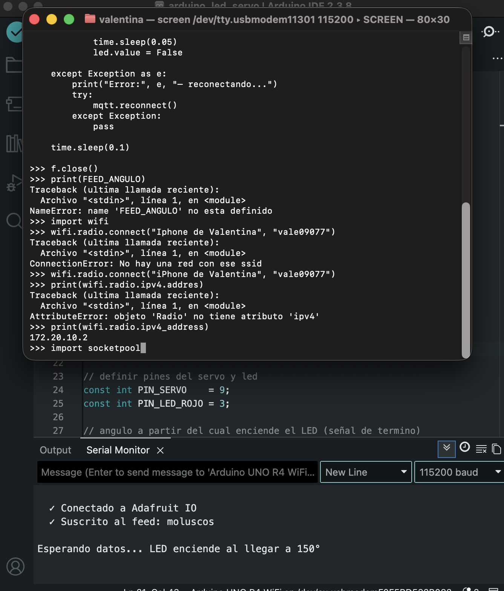

4. Luego de que ya mandara los datos, se ve reflejado en Adafruit IO

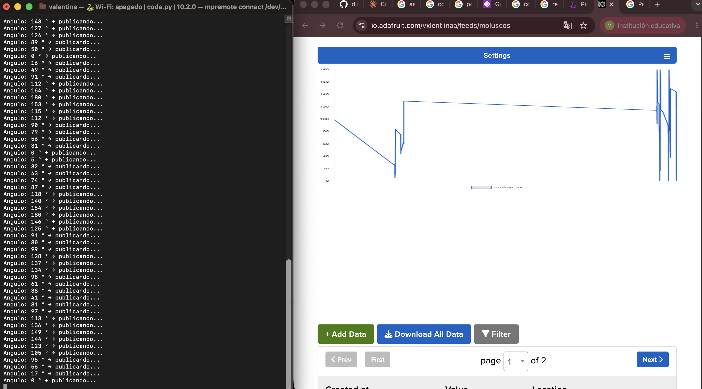

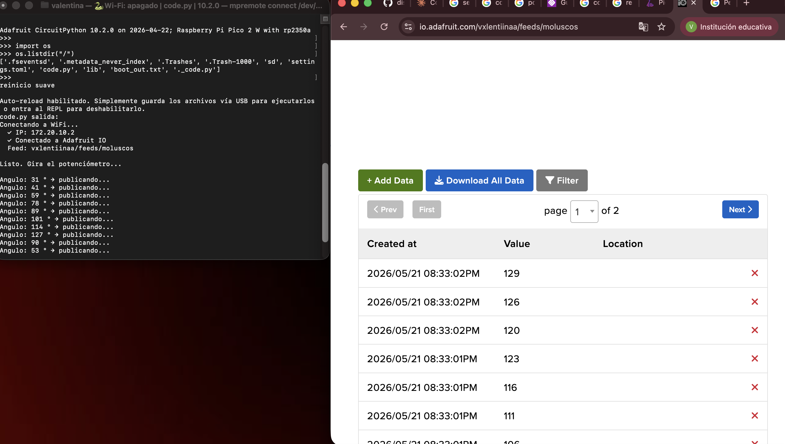

5. Finalmente, funcionó super!!!

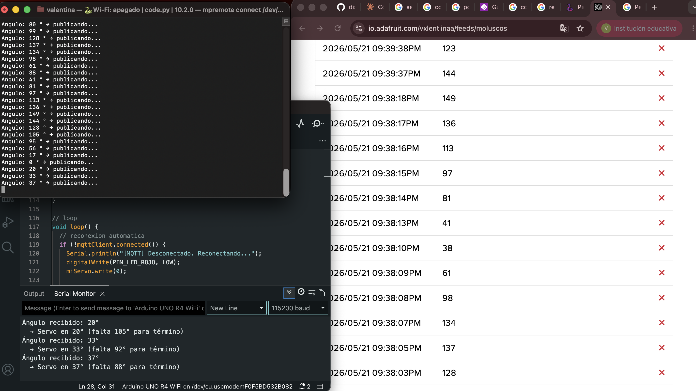

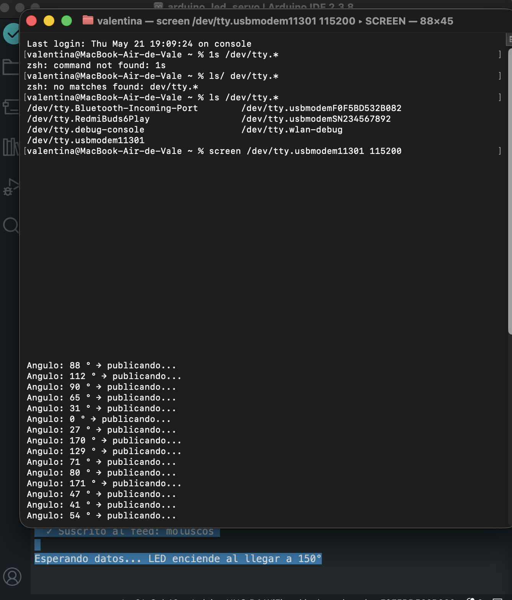

## Fotos del proyecto


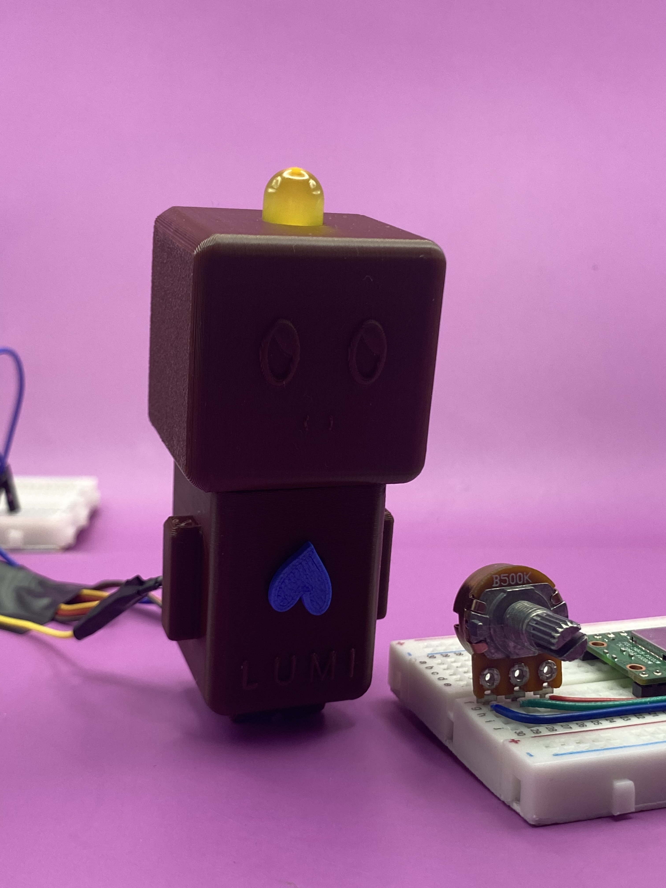

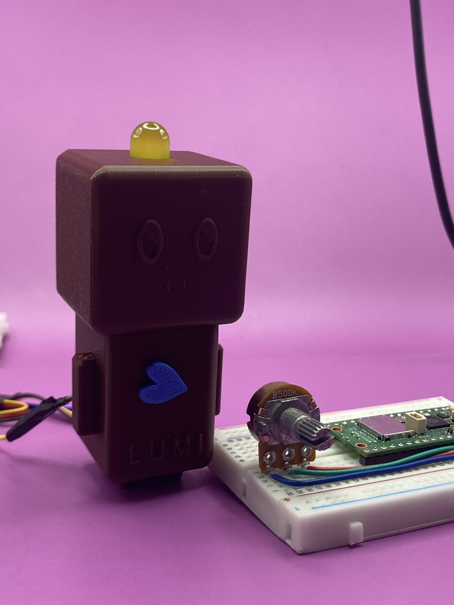


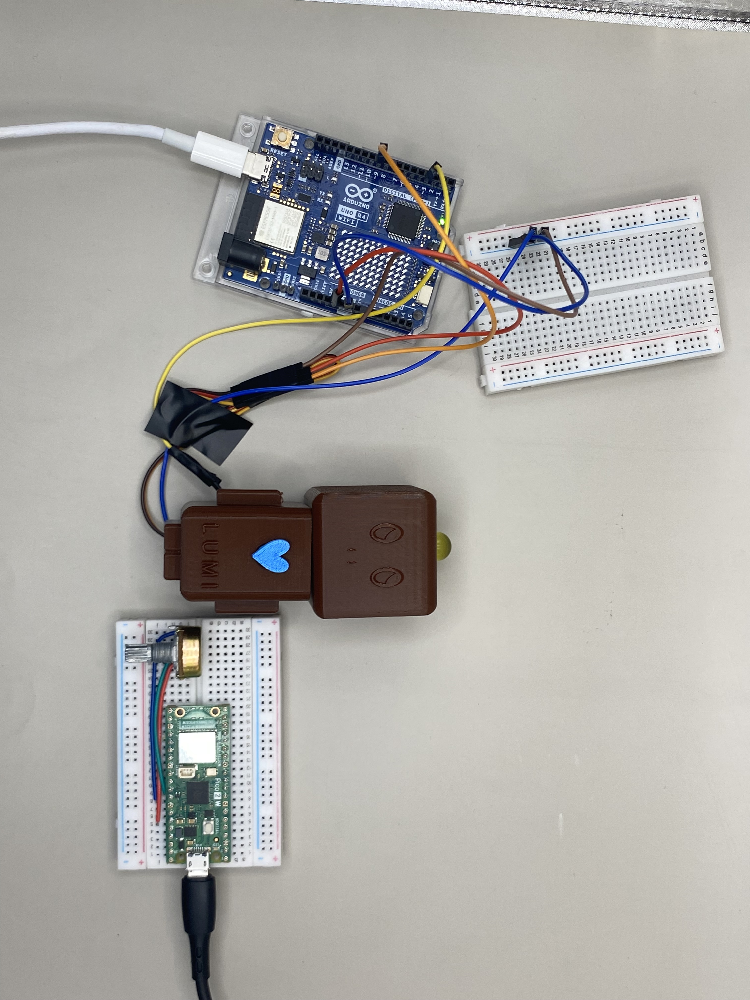


## Bibliografía

Arduino.cl. (s.f.). Micro Servo Motor SG90 9g. Arduino.cl. <https://arduino.cl/producto/micro-servo-motor-sg90-9g>

FSElectronics. (s.f.). Robot Araña 12 Dof Arduino + 12 Servo SG90. FSElectronics. <https://fselectronics.cl/products/robot-arana-12-dof-arduino-12-servo-sg90>

Wikipedia contributors. (s.f.). Potenciómetro. En Wikipedia, la enciclopedia libre. Recuperado el 22 de mayo de 2026. <https://es.wikipedia.org/wiki/Potenci%C3%B3metro>

Teenage Engineering. (s.f.). OP–1 field. Teenage Engineering. <https://teenage.engineering>
