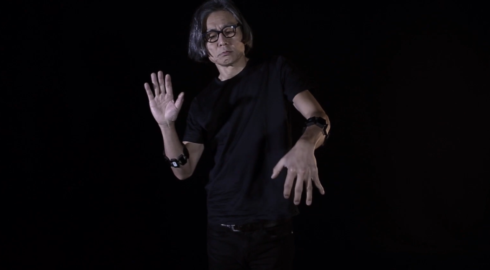
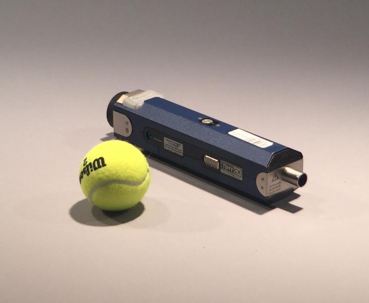

# investigaciones individuales

Josefa Araya Cartes / [josefa-kristina](<https://github.com/josefa-kristina>)

## Sensores en IoT (Internet of Things)

Los sensores IoT o chips electrónicos con un circuito que es compatible con los estándares de comunicación habituales en el mundo de IoT. Este tipo de sensores son
capaces de convertir una magnitud de entrada como la humedad, temperatura, presión, etc., en una señal medible e interpretable por dispositivos electrónicos.

Son como el puente entre lo físico y lo digital.

Los sensores del IoT pasan por tres fases, la captura de datos, depués compartir datos y finalmente el procesamiento de los datos.

## Sensor EMG

Quise investigar sensor EMG (electromiografía) un dispositivo diseñado para detectar y medir la actividad eléctrica de los músculos, cuandoe stos se contraen o se relajan y el sensor captura señales musculares. Se usa principalmente en el campo de la medicina.

Investigando me encontre con el trabajo de Atau Tanaka, un artista e investigador que usa los sensores EMG para transformar el cuerpo, especificamente los músculos en instrumentos musicales. 

Tanaka usa los sensores EMG en los musculos del antebrazo para crear sonidos basados en sus gestos.

La señal EMG capta la actividad eléctrica muscular (±5 mV, 50–150 Hz) mediante electrodos sobre la piel que amplifican la diferencia entre dos puntos del mismo músculo.

Tanaka usa el sistema EAVI-EMG el cual digitaliza la señal cruda con un ADC de 24 bits y hace todo el filtrado en software (STM32F427), simplificando el hardware. Incluye acelerómetro 3D y se conecta vía USB o Bluetooth como dispositivo MIDI estándar.

Las características que extrae son temporales: RMS, filtro de Bayes recursivo, y un vector suma propio que combina amplitud y dirección de fuerza de múltiples electrodos, permitiendo distinguir gestos isométricos con poco movimiento visible.

El mapeo gesto a sonido opera en cuatro niveles, sonificación directa de la señal cruda, mapeo de parámetros, regresión aprendida por demostración (IML), y un agente de aprendizaje por refuerzo (AIML) que propone mapeos y se ajusta según la retroalimentación del músico.

### Myogram de Atau Tanaka
 

[Myogram 2015](<https://youtu.be/G6H1J2k--5I?si=SgvoB-oUE9kfy_j1>)

## Actuador
Los actuadores son dispositivos que pueden causar cambios físicos en el entorno, permiten que las máquinas y los dispositivos interactúen con el mundo físico. 

## Generador de humo Tiny CX 12V/70W

El Tiny CX es un generador de humo compacto el cual normalmente se utiliza en pruebas de filtración de aire. Una de las razones por las cuales este generador es tan apreciado es debido a su mínimo tiempo de calentado, ya que se demora 0.5 segundos en calentarse por completo, por lo que en menos de un segundo ya es capaz de producir humo. Sus medidas son pequeñas comparadas a otros generadores de humo, siendo estas de `25 x 5.3 x 5.5 cm` pesando un total de 630 gr.

Tiny CX:

 

El corazón de este generador es un micro procesador que controla y monitorea todas las funciones importantes, lo cual nos garantiza que este funcione de manera continua y segura.

Para que funcione el generador de humo se utiliza una batería (que por cierto, es perfectamente reemplazable) la cual le entrega `11.1V, la cual es bastante compacta al igual que nuestro generador teniendo unas dimensiones de ``10.5 x 4.4 x 4.1 cm` y esta solo entrega energía cuando realmente se necesita gracias a un sistema de control inteligente, por lo que su tiempo de operación es más alto comparado al de otras máquinas de humo.

Para poder utilizar el generador es bastante simple! solo tenemos que ponerle la batería, llenar el tanque con líquido y listo, solo queda que presiones el botón que se encuentra en la máquina para que empiece a generar humo. Solo con la batería interna ya se puede producir de 10 a 15 minutos de humo continuo, mientras que el "Tiny fluid" se asegura de que el humo denso se produzca con el menor consumo de líquido posible, siendo éste de `23 ml/min`.

Tiny fluid: 

 

### El Smoke Dress de Anouk Wipprecht.

Anouk Wipprecht es una diseñadora holandesa especializada en FashionTech, un campo que cruza moda, robótica e ingeniería.

Anouk Wipprecht:

 

El smoke dress es un vestido interactivo impreso en 3D de poliamida, la inspiración para este diseño viene del mundo natural, el concepto se basa en mecanismos de defensa de la naturaleza, como el calamar que libera tinta para escapar de sus depredadores. Wipprecht trasladó esa lógica al cuerpo humano, si alguien invade tu espacio personal, el vestido reacciona y te "camufla" con humo.

El vestido emite un velo de humo cuando alguien entra en el espacio personal de quien lo usa. Esa reacción es activada por sensores de proximidad embebidos en la prenda. Estos sensores funcionan midiendo distancias constantemente: envían una señal y detectan cuándo algo se acerca por debajo de un umbral determinado. 

Wipprecht usó el dispositivo TINY CX  ya que al ser un sistema de humo inalámbrico le era compatible con algo "ponible".

Smoke dress funcionando:

 

## Bibliografía
Courtney N. Reed, Landon Morrison, Andrew P. McPherson, David Fierro, and Atau Tanaka. 2024. Sonic Entanglements with Electromyography: Between Bodies, Signals, and Representations. In Proceedings of the 2024 ACM Designing Interactive Systems Conference (DIS '24). Association for Computing Machinery, New York, NY, USA, 2691–2707. https://doi.org/10.1145/3643834.3661572

Tanaka, Atau; Visi, Federico; Donato, Balandino Di; Klang, Martin and Zbyszyński, Michael (2023) An End-to-End Musical Instrument System That Translates Electromyogram Biosignals to Synthesized Sound. Computer Music Journal, 47 (1). pp. 64-84. ISSN 0148-9267

Casas, N. (s.f.). *Smoke dress*. Niccolo Casas. https://www.niccolocasas.com/smoke-dress

Digital Art 21. (2016, junio 7). *Smoke dress*. http://www.digiart21.org/art/smoke-dress

Next Nature Network. (2017, septiembre 30). *Designer Anouk Wipprecht combines fashion with robotics*. https://nextnature.org/en/magazine/story/2017/interview-anouk-wipprecht
