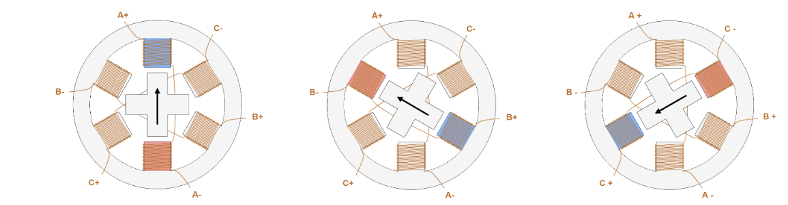

# investigaciones individuales

Cristobal Vergara Silva / cristobalvergarasilva

## Sensor

### Sensores de pulso cardiaco ECG y PPG ###

#### PPG, (Fotopletismografía) ####

El PPG o fotopletismografía funciona emitiendo luz LED sobre la piel y midiendo cuánta luz rebota hacia un fotodetector. Esto ocurre porque cada vez que el corazón late, llega más sangre a los vasos sanguíneos, lo que cambia la cantidad de luz reflejada y genera una variación eléctrica. Contando esas variaciones se obtienen las pulsaciones por minuto (BPM), como es el caso del sensor de PulseSensor.com. 

El sensor más utilizado de este tipo es el MAX30102, fabricado por Maxim Integrated, que además mide el nivel de oxígeno en sangre. Este cuenta con dos LEDs y un fotodetector, incorpora un sensor de temperatura interno y consume poca corriente, lo que facilita el desarrollo de proyectos portátiles.

Entre sus puntos débiles se encuentran su sensibilidad ante estímulos externos como el movimiento brusco y las variaciones de temperatura corporal. Si la medición se realiza en el dedo, puede verse afectada por el uso de esmalte de uñas muy grueso o por presionar demasiado el sensor. Asimismo, se recomienda controlar la luz ambiental para obtener datos más precisos.

A pesar de estas limitaciones, su versatilidad lo ha convertido en una tecnología ampliamente adoptada en dispositivos inteligentes como relojes y monitores de actividad deportiva, permitiendo el monitoreo continuo de la frecuencia cardíaca durante los entrenamientos.

**PulseSensor.png**

**Max30102.png**

### ECG (Electrocardiograma) ###

El ECG es un tipo de lectura que captura las ondas generadas por la contracción del músculo cardíaco durante el ciclo cardíaco. Funciona detectando las células marcapasos naturales del corazón, que se localizan principalmente en los nódulos SA y AV, siendo el nódulo SA el que regula la frecuencia y el ritmo cardíaco. Ese recorrido eléctrico es el que detecta el sensor, a través de la colocación de electrodos en ubicaciones estratégicas del cuerpo mediante un gel adhesivo electrocardiográfico.

Un sensor conocido de este tipo es el AD8232, que está diseñado para extraer, amplificar y filtrar pequeñas señales en presencia de condiciones ruidosas. Este consta de un sensor, tres electrodos conectados por cable y un LED indicador que emite pulsos luminosos al ritmo del bombeo del corazón. Además, puede controlarse con una placa Arduino o una LilyPad para proyectos textiles.

El ECG es una forma de medir el ritmo cardíaco muy poco invasiva y no requiere ningún cuidado especial después de su aplicación. Aun así, uno de sus pocos inconvenientes es que debe detectar la actividad bioeléctrica únicamente a través de ciertas áreas del cuerpo, como las yemas de los dedos, el pecho y las axilas. Asimismo, es necesario retirar los accesorios metálicos y el vello de la piel en la zona de medición. El procesamiento implica amplificación y filtrado para separar la información relevante del ruido eléctrico del entorno.

**AD8232**

### Obra de artista ###

Me llamó la atención *Pulse Room* del artista digital mexicano Rafael Lozano-Hemmer. La obra es una intervención artística compuesta por dos partes: por un lado, una consola que detecta la frecuencia cardíaca, y por el otro, una serie de ampolletas LED que en algunas ocasiones llegaron a ser 300. Estas dos partes dialogan de la siguiente manera: al tocar la consola, el sensor incorporado —específicamente un ECG Vernier Hand-Grip Heart Rate Monitor— registra el ritmo cardíaco y las luces comienzan a encenderse y apagarse imitando las pulsaciones. Esto ocurre de tal forma que el ritmo del último usuario queda impreso en la primera ampolleta, empujando los ritmos de los visitantes anteriores hacia las hileras más lejanas.

¿Cómo funciona el sensor?

Este sensor de Vernier mide la frecuencia cardíaca registrando las señales eléctricas que se transmiten a través de la superficie de la piel cada vez que el corazón se contrae, detectándolas mediante los electrodos de los agarres. La información obtenida se transmite de forma inalámbrica a los dispositivos compatibles mediante Bluetooth.

**Vernier Hand-Grip Heart Rate Monitor**

**Plataforma, Fábrica La Constancia, Puebla, México, 2006**

**Enter Action-Digital Art Now, ARoS Aarhus Kunstmuseum, Aarhus, Denmark, 2009**

## Actuador

### Stepper motor o motor paso a paso ###

Un motor paso a paso es un actuador eléctrico que permite el posicionamiento preciso con facilidad. Son ideales para respuestas rápidas y, por su diseño, mantienen su posición al detenerse de forma muy precisa. Su característica principal es que su eje gira a través de una serie de pasos, tal como dice su nombre; cada "paso" corresponde a una posición distinta del motor, es decir, a un ángulo determinado.
Estos motores constan de dos piezas muy importantes. La pieza principal es un rotor, que es un imán permanente compuesto por dos partes: la copa norte y la copa sur, cada una con una serie de dientes no alineados en su exterior. A su alrededor se encuentra el estátor, que no gira y que cuenta con una serie de bobinas de alambre que rodean al rotor. Al alimentar de energía las distintas bobinas se genera un campo magnético que hace girar el rotor dependiendo de cuál recibe energía, puesto que estas atraen y repelen el campo magnético de las copas norte y sur; en otras palabras, la bobina que se energice hará que el rotor se alinee con el campo magnético que produce.

### Proceso de funcionamiento ###

### Obra de artista ###

La obra que escogí son los espejos mecánicos de Daniel Rozin. La primera de sus obras fue *Wooden Mirror* (1999), por la que me interesé en su trabajo. Esta consiste en una instalación compuesta por 835 piezas de madera de pino con cientos de motores por detrás, y además cuenta con una cámara que procesa en píxeles lo que ve.

Las primeras versiones de sus obras fueron hechas con servomotores, pero según una entrevista del canal WIRED (2018), estos no le servían para mantener una obra funcionando las 24 horas del día porque dejaban de funcionar. Fue entonces cuando comenzó a utilizar motores paso a paso completamente metálicos, los que ayudan a que no se rompan con el uso prolongado. También en sus últimas obras reemplazó las cámaras que transformaban la imagen en píxeles por sensores de movimiento, y con el tiempo fue experimentando con distintos materiales sin reflejo, como basura, abanicos, trolls de dos colores, pompones y pingüinos.

Estos espejos reflejan lo que ven gracias a que el software calcula qué tan oscuro o claro debe ser cada "píxel" y le ordena al motor correspondiente que rote exactamente al ángulo necesario para lograr ese brillo, funcionando como unos y ceros. Lo que hace el motor es rotar para controlar cuánta luz llega al ojo del espectador, como en Wooden Mirror, o en otras obras los motores rotan el objeto para mostrar una cara oscura o una cara clara, generando el contraste de la imagen, como en *Trolls Mirror*.

### Penguins Mirror ### 

### Espejos mecánicos ###

## Bibliografía

### Sensor: ###

Página del artista Lozano Hemmer: https://www.lozano-hemmer.com/pulse_room.php

Teoría del Pulse.sensor: https://pulsesensor.com/pages/pulsesensor-manual

Max30102: https://afel.cl/products/sensor-pulsioximetria-max30102?srsltid=AfmBOooQsCS0TE0x-UjsNl8IM3HjaWYF2Kxkyd0HIkJtS6jv7nIKT0D3

Pulse.Sensor: https://afel.cl/products/sensor-pulso-cardiaco-corazon?srsltid=AfmBOoo6FuucuOXlNX7iixlNmI2xyjE65Wf7BrylaO0yiD9LFT9xGvdn

Teoría completa del ECG: https://www.ncbi.nlm.nih.gov/books/NBK549803/

Que es un electrocardiograma: https://www.hopkinsmedicine.org/health/treatment-tests-and-therapies/electrocardiogram

Texto explicativo con materiales utilizados: https://lozano-hemmer.com/texts/manuals/pulse_room.pdf

Manual del sensor de Vernier: https://www.vernier.com/manuals/hgh-bta/

ECG AD8232: https://afel.cl/products/sensor-de-frecuencia-cardiaca-ecg-ad8232-electrocardiograma?srsltid=AfmBOopYP_7LkrLpaht21A0eqfAAw322Z6hBqR8DJjKYcIm8YedOaLAW

### Actuador 

Entrevista a Daniel Rozin: https://www.youtube.com/watch?v=kV8v2GKC8WA

Explicación de Steppers motors: https://www.monolithicpower.com/en/learning/resources/stepper-motors-basics-types-uses

Video explicativo Steppers motors: https://www.youtube.com/watch?v=b_-PQCjyRRQ

Todas sus obras: https://www.smoothware.com/danny/index.html

Explicando su arte: https://www.youtube.com/watch?v=Rc76x8NYzhU
