# solemne-02

### Integrantes

- Braulio Figueroa / github: [brauliofigueroa2001](https://github.com/brauliofigueroa2001)
- Luisa Toro / github: [Luisaatoro9](https://github.com/Luisaatoro9)
- Marlén Soto / github: [marlensoto-lab](https://github.com/marlensoto-lab)
- Marcela Zúñiga / github: [marcezm](https://github.com/marcezm)

---


### 1. Introducción y Organización

Esta sesión fue el punto de encuentro de todo lo aprendido en el semestre. El objetivo: lograr que una Raspberry Pi Pico 2 W (emisor) controle un LED en un Arduino UNO R4 WiFi (receptor) a través de la nube.

Nos organizamos inicialmente en duplas para asegurar que cada parte funcionara de forma independiente antes de unirlas:

- *Braulio:* Encargado de la lógica de envío, configuración del protocolo MQTT y conexión del sensor en la Raspberry.
- *Luisa:* Encargada de la recepción de datos, el circuito del actuador en Arduino y el debugging de hardware.
- *Marlén y Marcela:* Se integraron al cierre de la sesión para colaborar en las pruebas finales y planificar la escalabilidad del proyecto.

---

### Avance en clases dúo Braulio Figueroa y Luisa Toro

---

### Sensor usado - Botón pulsador de 4 pines

El objetivo es tener un código de enviar desde un Raspberry Pi Pico 2W y un código de recibir en un Arduino Uno R4 Wifi, utilizaremos un botón como primer acercamiento para poder crear una especie de "puerta" que nos dé la opción de activar y desactivar el envío de lecturas de datos hacia Adafruit IO, de esta manera, el servidor de IO no colapsa y evitamos problemas.

Además, queríamos sumar un potenciómetro que enviara valores a Adafruit e interactuara con el led, prendiéndolo y apagándolo, pero no logramos conseguirlo en clases, por lo que la interacción solo fue entre el botón y el led.

**Conexión de botón a Raspberry Pi Pico 2w**

En un comienzo buscamos ejemplos de conexión de un botón a Raspberry Pi Pico 2w pero en las fotos mostraban la conexión mediante una resistencia, le preguntamos a Aarón si esto era necesario pero nos dijo que no porque estos botones vienen con una resistencia interna.

Luego de esta duda, lo que hicimos fue conectar un botón de 4 pines al módulo de Raspberry Pi Pico 2w, para ello seguimos como guía el pinout de la placa visto anteriormente en clases.


**Imagen 01**, *Pinout Raspberry Pi Pico 2w*

**Paso 1: Controlar el envío de datos:**
Se usó un botón físico para decidir cuándo mandar información a Adafruit IO. Así no se satura el canal con datos constantes, el tráfico queda limpio y la conexión se mantiene estable. En el código que nos mandó Mateo, se establece que el botón debe estar conectado al pin GP0, ya que, este pin entiende una lógica de 2 estados, HIGH y LOW, lo cuál sirve para el funcionamiento del botón (presionado, no presionado). La otra conexión que debemos hacer es a GND.

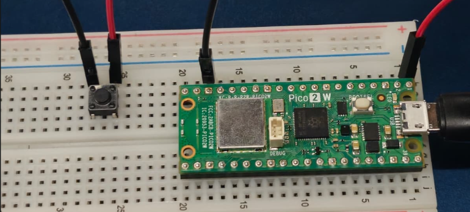

**Imagen 02** *En esta imagen se evidencia la conexión del botón con el Raspberry Pi Pico 2w*

 ### Código usado para enviar, experimentación en clases - Raspberry Pi Pico 2w

```cpp
import time
import board
import digitalio
import wifi
import socketpool
import adafruit_minimqtt.adafruit_minimqtt as MQTT

print("Iniciando programa...")

# -------------------------
# WiFi
# -------------------------
SSID = "auxilio"
PASSWORD = "cabal123"

print("Conectando WiFi...")

try:
    wifi.radio.connect(SSID, PASSWORD)
    print("WiFi conectado")
    print("IP:", wifi.radio.ipv4_address)

except Exception as e:
    print("Error WiFi:")
    print(e)

    while True:
        pass


# -------------------------
# Adafruit IO
# -------------------------
AIO_USERNAME = "udpmontoyamoraga"
AIO_KEY = "clavecredencial"

FEED_BOTON = AIO_USERNAME + "/feeds/boton-prueba-grupo10"

print("Creando conexión MQTT...")

pool = socketpool.SocketPool(wifi.radio)

mqtt = MQTT.MQTT(
    broker="io.adafruit.com",
    username=AIO_USERNAME,
    password=AIO_KEY,
    socket_pool=pool,
)

print("Conectando a Adafruit IO...")

try:
    mqtt.connect()
    print("Conectado a Adafruit IO")

except Exception as e:
    print("Error MQTT:")
    print(e)

    while True:
        pass


# -------------------------
# Botón GP0
# -------------------------
boton = digitalio.DigitalInOut(board.GP0)
boton.direction = digitalio.Direction.INPUT
boton.pull = digitalio.Pull.UP

estado_anterior = True

print("Sistema listo")

# -------------------------
# Loop principal
# -------------------------
while True:

    try:
        mqtt.loop()

        estado_actual = boton.value

        # Detecta transición:
        # sin presionar -> presionado
        if estado_anterior and not estado_actual:

            print("Botón presionado")
            print("Enviando impulso...")

            mqtt.publish(FEED_BOTON, "1")

            print("Impulso enviado")

            # anti-rebote
            time.sleep(0.25)

        estado_anterior = estado_actual

    except Exception as e:
        print("Error:")
        print(e)

    time.sleep(0.02)
```

Este código nos fue facilitado por Mateo, quien nos ayudó durante todo el proceso. Lo que hace en resumen es conectar la Raspberry Pi Pico 2w al wifi y enviar datos al feed asignado de nuestro grupo, estos datos se envían cuando se presiona el botón, envía de 1 a la vez.

Después de varios intentos de intentar conectarse al wifi, finalmente la placa lo pudo lograr, pulsamos el botón y enviaba datos a Adafruit IO y notamos que existía un pequeño delay al enviar el dato.


**Imagen 03**, *datos enviados a Adafruit IO*


**Imagen 04**, *datos enviados a  Adafruit IO con fecha y hora*

- Un error que ocurrió después de enviar constantemente datos es que el led se quedó encendido y no volvió a apagarse.

## Actuador usado - Led

Paso 1: Validar el hardware primero: Montamos el LED con su resistencia de 220Ω en la protoboard. Primero hicimos una prueba de alimentación directa a 5V para confirmar que el LED encendía, y después una prueba de control con un código de parpadeo en el pin 13. Ver que el LED respondía bien fue la señal para avanzar a la parte inalámbrica con confianza.

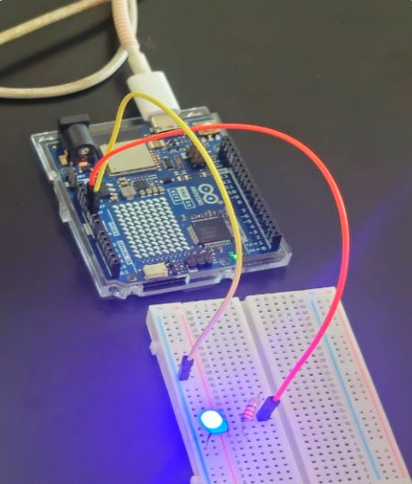

**Imagen 05** *muestra la conexión del positivo del LED al pin 5V del Arduino para corroborar el correcto encendido del LED.*

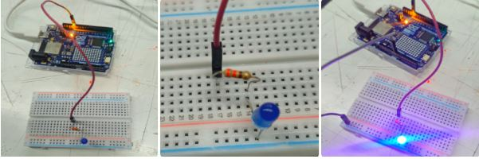

**Imagen 06,07,08** *muestran el proceso de conexión del LED al pin de la placa.*

## Código utilizado para la prueba de encendido y apagado en el pin 13 reflejándolo en un led

```cpp
void setup() {

  Serial.begin(115200);

  pinMode(13, OUTPUT);
}

void loop() {

  digitalWrite(13, HIGH);

  Serial.println("LED ENCENDIDO");

  delay(500);

  digitalWrite(13, LOW);

  Serial.println("LED APAGADO");

  delay(500);
}
```


**Imagen 09** *muestra la prueba realizada en el pin 13, enviando un código de encendido y apagado para corroborar tanto el correcto funcionamiento de la conexión del LED como la recepción del código enviado desde Arduino al pin 13.*

## Código recibir, Experimentación en clases, Arduino UNO R4 Wifi

```cpp
#include "AdafruitIO_WiFi.h"

#define IO_USERNAME "TU_USUARIO"
#define IO_KEY "TU_KEY"

#define WIFI_SSID "TU_WIFI"
#define WIFI_PASS "TU_PASSWORD"

AdafruitIO_WiFi io(IO_USERNAME, IO_KEY, WIFI_SSID, WIFI_PASS);

const int ledPin = 13;

AdafruitIO_Feed *botonFeed = io.feed("boton-prueba-grupo10");

void setup() {

  pinMode(ledPin, OUTPUT);

  Serial.begin(115200);

  Serial.print("Conectando a Adafruit IO...");

  io.connect();

  botonFeed->onMessage(handleMessage);

  while(io.status() < AIO_CONNECTED) {

    delay(500);
    Serial.print(".");
  }

  Serial.println();
  Serial.println("¡Arduino Conectado!");
}

void loop() {

  io.run();
}

void handleMessage(AdafruitIO_Data *data) {

  int comando = data->toInt();

  if (comando == 1) {

    digitalWrite(ledPin, HIGH);

    Serial.println("LED ON");
  }

  else {

    digitalWrite(ledPin, LOW);

    Serial.println("LED OFF");
  }
}
```


## Avance en clases Marlén Soto y Marcela Zúñiga

Inicialmente, nuestro proyecto consistía en desarrollar un sistema IoT distribuido utilizando una Raspberry Pi, un Arduino UNO R4 WiFi, un sensor ultrasónico HC-SR04 y un micro servo motor SG90, conectados mediante la plataforma Adafruit IO utilizando el protocolo MQTT.

La Raspberry Pi tendría la función de controlar el sensor ultrasónico HC-SR04, medir la distancia de un objeto y enviar periódicamente los datos obtenidos hacia Adafruit IO a través de internet. Posteriormente, el Arduino UNO R4 WiFi consultaría la información almacenada en la plataforma y, según la distancia recibida, controlaría el movimiento del servo motor SG90.

El objetivo principal del proyecto era demostrar la comunicación inalámbrica entre distintos dispositivos mediante tecnologías IoT, integrando la adquisición de datos físicos, la transmisión en la nube y el control remoto de actuadores en tiempo real. Además, para evitar saturar el servicio gratuito de Adafruit IO, el sistema incorporaría intervalos de tiempo entre cada envío de datos.

## Proceso realizado en clases

Durante el desarrollo del proyecto comenzamos realizando el cableado de la Raspberry Pi junto con el sensor de distancia. Debido a que no teníamos experiencia previa trabajando con este tipo de sensores ni con la Raspberry Pi, fue necesario investigar profundamente el funcionamiento del hardware y sus conexiones, proceso que nos tomó aproximadamente una hora.

Posteriormente, trabajamos en la programación del sensor y del botón, pero surgieron diversas dificultades relacionadas con librerías necesarias para el funcionamiento del sistema y múltiples errores en el código. Intentamos resolver estos problemas durante otra hora adicional, investigando posibles soluciones y realizando distintas pruebas, pero no logramos que el sistema funcionara correctamente dentro del tiempo disponible.

Finalmente, debido a la falta de tiempo para continuar avanzando con nuestro proyecto inicial, tuvimos que incorporarnos al Grupo 10, integrado por Braulio Figueroay Luisa Toro, con el fin de continuar el trabajo práctico de la clase.

## Descripción del proyecto grupal final

El proyecto consiste en un sistema de comunicación inalámbrica basado en la lógica de enviar y recibir en la plataforma de Adafruit IO. Para enviar datos utiliza una Raspberry Pi Pico 2w y para recibir datos utiliza un Arduino UNO R4 Wifi. El modo de enviar datos es a través de sensor el cuál es un botón pulsador de 4 pines. Cuando el botón es oprimido y sus datos son recibidos, un LED actuador se encenderá y apagará según si el botón esté presionado o suelto.

## Lista de Materiales — Proyecto Interacción Inalámbrica

**Hardware**

| Componente | Cantidad | Función en el proyecto |
|---|---|---|
| Raspberry Pi Pico 2W | 1 | Emisor — envía el dato a Adafruit IO al presionar el botón |
| Arduino Uno R4 WiFi | 1 | Receptor — recibe el dato desde Adafruit IO y enciende el LED |
| Botón pulsador 4 pines | 1 | Sensor — activa o desactiva el envío de datos como "puerta" |
| LED 5 MM | 1 | Actuador — confirma visualmente que el dato llegó con éxito |
| Resistencia 220Ω | 1 | Protege el LED limitando la corriente |
| Protoboard | 2 | Una para cada placa — permite armar el circuito sin soldar |
| Cables jumper | 4 | Conexiones entre componentes en la protoboard |
|Cable USB-C | 1 | Conexión física para cargar el código desde el PC en Arduino. |
| Cable USB-A Micro USB | 1 | Conexión física para cargar el código desde PC a Raspberry Pi Pico 2. |

**Conectividad**

| Elemento | Detalle |
|---|---|
| Red WiFi 2.4GHz | Hotspot generado desde celular — permite alejar las placas entre sí sin perder conexión |
| Celulares | 2 — cada uno genera su propia red para que cada placa se conecte de forma independiente |
| Adafruit IO | Plataforma en la nube que actúa como intermediario (broker MQTT) entre la Raspberry y el Arduino |

**Software**

| Herramienta | Uso |
|---|---|
| CircuitPython | Lenguaje usado para programar la Raspberry Pi Pico 2W |
| Arduino IDE | Entorno usado para programar el Arduino Uno R4 WiFi |
| Adafruit IO | Dashboard y broker MQTT para visualizar y transmitir los datos |
| PuTTY | Monitor serie para ver en tiempo real lo que hace la Raspberry |

## Actuador usado - Led

El actuador utilizado en el proyecto fue una luz LED, empleada para representar visualmente la recepción de datos enviados desde la Raspberry Pi Pico 2W hacia el Arduino UNO R4 WiFi mediante Adafruit IO.

Su función principal dentro del sistema es encenderse o apagarse dependiendo del estado del botón conectado a la Raspberry Pi Pico 2W, permitiendo demostrar la comunicación inalámbrica y el control remoto de actuadores en tiempo real mediante tecnologías IoT.

## Sensor usado

El sensor utilizado en esta etapa del proyecto fue un botón pulsador de 4 pines, empleado como entrada digital para el envío de datos hacia Adafruit IO, estos datos están traducidos en ceros (botón suelto) y unos (botón presionado)

## Código usado para enviar Raspberry Pi Pico 2w

```cpp
import time
import board
import digitalio
import wifi
import socketpool
import adafruit_minimqtt.adafruit_minimqtt as MQTT

print("Iniciando programa...")

# -------------------------
# WiFi
# -------------------------
SSID = "auxilio"
PASSWORD = "cabal123"

print("Conectando WiFi...")

try:
    wifi.radio.connect(SSID, PASSWORD)
    print("WiFi conectado")
    print("IP:", wifi.radio.ipv4_address)

except Exception as e:
    print("Error WiFi:")
    print(e)
    while True:
        pass

# -------------------------
# Adafruit IO
# -------------------------
AIO_USERNAME = "udpmontoyamoraga"
AIO_KEY = "clavecredencial"

FEED_BOTON = AIO_USERNAME + "/feeds/boton-prueba-grupo10"

print("Creando conexión MQTT...")

pool = socketpool.SocketPool(wifi.radio)

mqtt = MQTT.MQTT(
    broker="io.adafruit.com",
    username=AIO_USERNAME,
    password=AIO_KEY,
    socket_pool=pool,
)

print("Conectando a Adafruit IO...")

try:
    mqtt.connect()
    print("Conectado a Adafruit IO")

except Exception as e:
    print("Error MQTT:")
    print(e)
    while True:
        pass

# -------------------------
# Botón GP0
# -------------------------
boton = digitalio.DigitalInOut(board.GP0)
boton.direction = digitalio.Direction.INPUT
boton.pull = digitalio.Pull.UP

estado_anterior = True

print("Sistema listo")

# -------------------------
# Loop principal
# -------------------------
while True:

    try:
        mqtt.loop()

        estado_actual = boton.value

        # presionado -> envía 1
        if estado_anterior and not estado_actual:
            print("Botón presionado")
            mqtt.publish(FEED_BOTON, "1")
            print("Enviado: 1")
            time.sleep(0.25)  # anti-rebote

        # soltado -> envía 0
        if not estado_anterior and estado_actual:
            print("Botón soltado")
            mqtt.publish(FEED_BOTON, "0")
            print("Enviado: 0")
            time.sleep(0.25)  # anti-rebote

        estado_anterior = estado_actual

    except Exception as e:
        print("Error, reconectando:", e)
        try:
            mqtt.reconnect()
        except:
            pass

    time.sleep(0.02)
```
**Explicación breve del código**

- La primera parte del código importa las bibliotecas puestas dentro de nuestra Raspberry Pi, inicia el programa e intenta conectar la placa al WiFi asignado en las líneas "SSID: auxilio" y "PASSWORD: cabal123".

- En la segunda sección del código tenemos todo lo destinado a Adafruit IO, aquí colocamos las credenciales de la cuenta.

- La línea de código "FEED_BOTON = AIO_USERNAME + "/feeds/boton-prueba-grupo10" identifica el canal de conexión MQTT en el cuál se publicarán los mensajes que se reciban. Esta línea establece: ¿de quien es el feed? --> AIO_USERNAME y ¿qué feed es? --> boton-prueba-grupo10.

- La tercera parte del código establece el funcionamiento del botón, lo asigna dentro del pin GP 0 que es donde está conectado y es una entrada digital, esto ocurre con la línea "boton = digitalio.DigitalInOut(board.GP0)".

- "mqtt.loop()" mantiene en todo momento la conexión con Adafruit.

- "estado_actual = boton.value" muestra el valor del botón y lee si es que el botón está presionado o no, en este caso, true --> botón en reposo (no presionado) y false --> botón presionado.

- Cuando se de la condición "if estado_anterior and not estado_actual:" significa que el estado anterior es distinto del estado actual del botón, por ende, detecta que alguien SÍ presionó el botón.

- Cuando estado_anterior = estado_actual, significa que no está presionado el botón porque ambos estados son iguales, por lo que no pasa nada, el botón únicamente activa la lectura cuando el estado actual es distinto del estado anterior.

**Agregamos una nueva parte al código para poder solucionar el error en el que sólo se enviaba "1" hacia Adafruit IO**

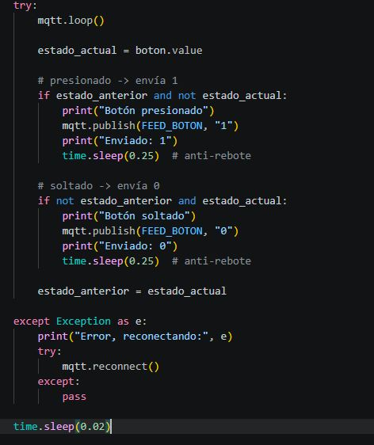

- La línea "if not estado_anterior and estado_actual:" hace lo opuesto a "if estado_anterior and not estado_actual:" , es decir, si anteriormente el botón estaba presionado (false) y ahora ya no lo está (true) entonces significa que alguien soltó el botón, por lo tanto envía 0 a Adafruit.

- La línea "time.sleep(0.25)" en ambos casos (apretar botón y soltar botón) sirve para que el botón registre solamente 1 lectura en 1 pulsada, es un anti-rebote.

- Por último, a diferencia de antes, ahora si es que hay un error intenta reconectarse automáticamente a Adafruit IO. Anteriormente sólo imprimía el mensaje del error.

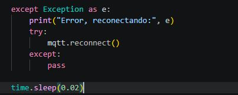

**Imagen 11** *muestra la última parte del código de enviar*

## Errores en Raspberry Pi Pico 2w

Hubo diversos errores durante el proceso, al enfrentarse nuevamente a Raspberry Pi Pico 2w y abrir vscode, enviar el código, aparecía lo siguiente:

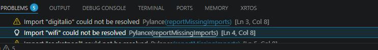

**Imagen 12** *primer error*

Esto sucedía porque estábamos presionando el ícono de flecha en vscode para correr el código, aparecían estos avisos y el código no funcionaba correctamente, la placa no se conectaba a Wifi. 

Le preguntamos a Mateo y nos dijo que sólo era necesario apretar ctrl+s para enviar el código a la Raspberry, lo intentamos, se envió correctamente y la placa se pudo conectar a WiFi. También notamos que al enviarse el código, el LED de la Raspberry siempre se enciende 1 vez rápidamente, esto es un aviso de que recibió el código y no habíamos notado esto hasta ese momento.

Otro error al momento de iniciar vscode era el modo restringido

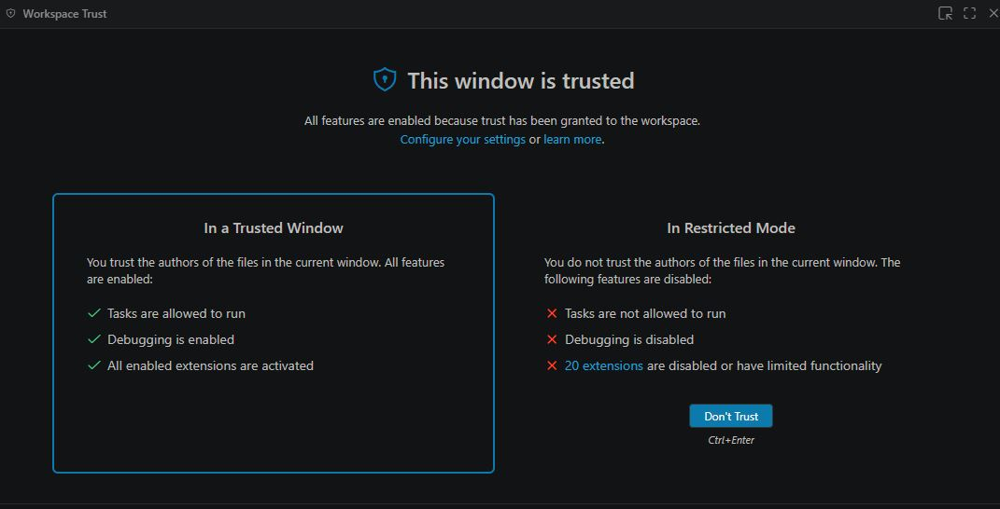

**Imagen 13** *segundo error*

Esto aparecía cada vez que abríamos vscode en un computador, debemos apretar trust para poder seguir adelante. Lo que hacía este error era que de alguna manera restringe a Python y este no puede operar con normalidad, es como si lo "reprimiera". No encontramos la forma de evitar que se abriera esta ventana cada vez que abríamos vscode por lo que siempre teníamos que apretar "trust" para continuar.

Uno de los errores más importantes fue el hecho de que el LED se quedaba encendido tras presionar el botón reiteradas veces. Esto ocurría porque el código en un inicio (lunes) al enviar datos a adafruit, sólo enviaba el valor 1, esto hacía que el LED detectara sólo la opción de encenderse, entonces después de cierto rato presionando el botón repetidamente se bugeaba y dejaba de funcionar correctamente.

Este error se solucionó al agregar esta parte extra al código, la cuál hace que al soltar el botón se envíe un 0, indicando que el led se debe apagar

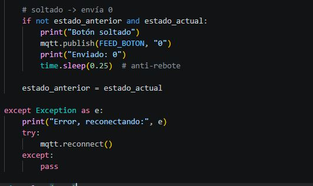

**Imagen 14** *parte extra código*

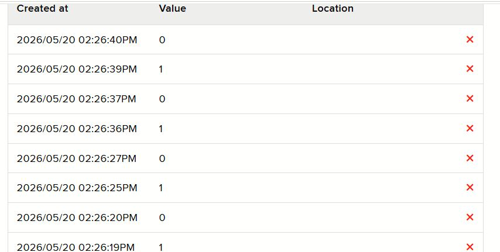

**Imagen 15** *mensajes enviados con Raspi*

De esta manera ahora en los feeds aparecía que se enviaban 0 y 1 respectivamente, lo cuál hace que el led se encienda y se apague sin bugearse, independiente de la cantidad de veces que presionemos el botón.

## Código usado para recibir Arduino UNO R4 Wifi

```cpp
#include "AdafruitIO_WiFi.h"

#define IO_USERNAME "TU_USUARIO"
#define IO_KEY "TU_KEY"

#define WIFI_SSID "TU_WIFI"
#define WIFI_PASS "TU_PASSWORD"

AdafruitIO_WiFi io(IO_USERNAME, IO_KEY, WIFI_SSID, WIFI_PASS);

const int ledPin = 13;

AdafruitIO_Feed *botonFeed = io.feed("boton-prueba-grupo10");

void setup() {

  pinMode(ledPin, OUTPUT);

  Serial.begin(115200);

  Serial.print("Conectando a Adafruit IO...");

  io.connect();

  botonFeed->onMessage(handleMessage);

  while(io.status() < AIO_CONNECTED) {

    delay(500);
    Serial.print(".");
  }

  Serial.println();
  Serial.println("¡Arduino Conectado!");
}

void loop() {

  io.run();
}

void handleMessage(AdafruitIO_Data *data) {

  int comando = data->toInt();

  if (comando == 1) {

    digitalWrite(ledPin, HIGH);

    Serial.println("LED ON");
  }

  else {

    digitalWrite(ledPin, LOW);

    Serial.println("LED OFF");
  }
}
```
**Explicación código**

- Nodo Receptor (Arduino UNO R4 WiFi - C++) El Arduino se mantiene en un estado de escucha activa mediante la función io.run(). Está suscrito específicamente a ese feed compartido.

- Interpretación: Cuando Adafruit IO notifica que llegó un dato, el Arduino activa la función handleMessage.

- Validación y Actuación: El sistema convierte el dato recibido en un entero y pregunta: ¿Es un 1?. Si la respuesta es positiva, se gatilla el comando digitalWrite(13, HIGH).

Para documentar cómo logramos la comunicación entre dispositivos de distinta arquitectura, desarrollamos este diagrama que detalla el camino que recorre la información desde la intención del usuario hasta la respuesta física

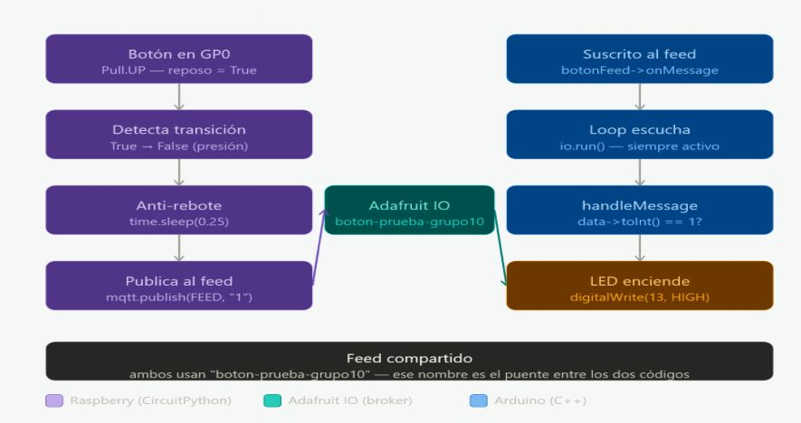

**Imagen 16**

El Puente de Datos (Adafruit IO) El feed compartido, llamado boton-prueba-grupo10, actúa como el punto de encuentro o "puente". Es fundamental entender que la Raspberry y el Arduino no están conectados entre sí, ambos están conectados a este Broker MQTT. El feed recibe el impulso y lo mantiene disponible para cualquier dispositivo que esté escuchando

Conclusión del diagrama: Esta estructura demuestra nuestra capacidad para integrar dos lenguajes de programación distintos (Python y C++) en una sola solución funcional, logrando una interacción con latencia mínima y alta estabilidad gracias al manejo correcto de los eventos y la sincronización de la red.

---

### Colaboración y Pruebas de Campo: Rehacer el proyecto y nuevos errores

Tras la integración de nuestras dos compañeras al grupo, decidimos realizar una jornada de trabajo intensivo en la Facultad de Derecho para asegurar que todo el equipo dominara el sistema. La sesión se dividió en dos etapas: Traspaso de Conocimiento y Pruebas de Alcance Real.

### 1. Mentoría y Armado de Hardware

Para ayudarles a entender lo que hicimos, iniciamos con un taller práctico para replicar y trabajar a la par, esto fue liderado por Braulio y Luisa:

- *Circuito Receptáculo:* Luisa entregó LEDs y resistencias a las nuevas integrantes, explicándoles paso a paso cómo identificar la polaridad del componente y por qué es vital la resistencia de 220Ω para proteger el Arduino.

 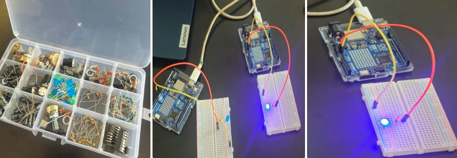

 **Imagen 17**

- *Circuito Emisor:* Braulio lideró la explicación de la Raspberry Pi Pico 2 W, mostrando cómo conectar el botón de 4 pines,recordando la importancia de la configuración Pull-UP interna para evitar el ruido eléctrico y revisando nuevamente si la placa Raspberry Pi Pico 2w tenía todas las bibliotecas necesarias

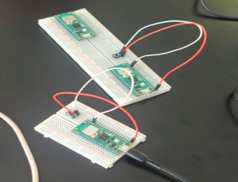

**Imagen 18**

---

Para asegurar que el equipo pudiera replicar el sistema de forma autónoma, le explicamos detalladamente sobre la lógica de programación y la gestión de archivos en ambas plataformas:

1. Entorno de la Raspberry Pi Pico 2 W (MicroPython)

Explicamos que la arquitectura de archivos en MicroPython es distinta a la de un PC. Los puntos clave fueron:

- *Estructura de Carpetas:* Instruímos al equipo en la creación de una carpeta /lib en la raíz de la placa. Es fundamental que las bibliotecas de comunicación (como umqtt.simple) se alojen allí para que el intérprete las encuentre.

- En este punto surgió un error debido a que la otra Raspberry Pi Pico 2w no tenía todas las bibliotecas y archivos necesarios para funcionar bien

 

 **Imagen 19** *en la imagen se muestra la comparativa entre una Raspberry Pi Pico 2w con todas las carpetas y archivos necesarias para funcionar y la otra sin los archivos necesarios para funcionar bien*

 - *Automatización con main.py:* Les enseñamos que para que la Raspberry funcione de forma independiente (sin estar conectada al PC), el archivo debe guardarse obligatoriamente con el nombre main.py. Si se guarda con otro nombre, el programa no se ejecutará al recibir energía.

1. Entorno del Arduino UNO R4 WiFi (C++)

En el caso del Arduino, nos enfocamos en la gestión de dependencias y el flujo del programa:
  
- *Monitor Serial y Debugging:* Les enseñamos a fijarse en el Baud Rate (fijado en 115200) y a interpretar los mensajes de error en el Monitor Serial para saber si el problema es de conexión al router o de autenticación con Adafruit IO.
  
- *Manejo de Tópicos:* Detallamos cómo el nombre del "Feed" en el código debe ser exactamente igual al configurado en la plataforma para que la suscripción de datos funcione.


**Imagen 20, 21 y 22** *En las imágenes se puede demostrar el orden de las carpetas y la correcta configuración del entorno de desarrollo. Se observa cómo la gestión de dependencias y el flujo del programa son clave para que el Arduino UNO R4 WiFi se comunique sin errores con la plataforma Adafruit IO.*
---

### 2. Pruebas de Distancia y Obstáculos (Stress Test)

Una vez que los dos nodos estuvieron operativos, salimos a probar la estabilidad de la conexión inalámbrica bajo distintas condiciones:

- *Prueba de Obstáculos:* Colocamos las placas separadas por una pared de vidrio. A pesar del obstáculo físico, la señal se mantuvo estable gracias a que ambas compartían la misma red WiFi de 2.4GHz.


  
- *El desafío de la red móvil:* Al intentar alejarnos más, la conexión se perdió. Identificamos que el problema era la fuente del WiFi: cuando el emisor de la señal (Hotspot móvil) se alejaba demasiado de una de las placas, esta quedaba fuera de la red.
  
- *Solución:* Tuvimos que independizar la red y asegurar que ambos nodos tuvieran cobertura constante, entendiendo que el IoT depende críticamente de la infraestructura de red.
  
- *Prueba de 15 Metros:* Con una red estable, logramos una respuesta instantánea a 15 metros de distancia lineal.

<div align="center"> <video src="https://github.com/user-attachments/assets/8f455e6f-69a0-4889-9f7d-e224874dedad" width="315" autoplay loop muted playsinline></video> </div>

- *Prueba de Altura (Piso 3 vs Piso 1):* La prueba definitiva fue vertical. Ubicamos el Arduino (receptor) en el tercer piso y la Raspberry (emisor) en el primer piso. Al presionar el botón desde abajo, el LED en el tercer piso encendió sin retraso perceptible.

<div align="center"> <video src="https://github.com/user-attachments/assets/65c58277-9847-4ca5-b7d3-566cec492208" width="315" autoplay loop muted playsinline></video> </div

Conclusión

Estas pruebas nos sirvieron para confirmar que el proyecto no se queda solo en la mesa del laboratorio, el sistema de verdad se la puede atravesando muros y funcionando a distancias largas. Nos dimos cuenta de que las placas tienen potencia de sobra, y que el verdadero reto es qué tan estable es el WiFi, algo clave que aprendimos hoy sobre redes inalámbricas.

Al ser ahora un grupo de cuatro, aprovechamos la jornada para nivelar a todos. No nos quedamos solo en armar el circuito, sino que nos dimos el tiempo de revisar los códigos paso a paso, entender por qué los archivos se guardan con ciertos nombres (como el main.py en la Raspberry) y cómo ordenar las bibliotecas para que nada falle. Terminamos el día con el sistema funcionando impecable y con todo el equipo entendiendo realmente cómo se conecta y se organiza el proyecto.

---

### Animaciones del proyecto

### Bibliografía

- [Introducción a Raspberry Pi Pico 2 W](https://cursos.mcielectronics.cl/2025/08/12/introduccion-a-raspberry-pi-pico-2-y-pico-2-w/)
- [Pinout oficial Raspberry Pi Pico 2 W](https://datasheets.raspberrypi.com/picow/pico-2-w-datasheet.pdf)
- [CircuitPython: Beginner's Guide](https://circuitpython.org/)
- [Adafruit IO con CircuitPython](https://learn.adafruit.com/welcome-to-circuitpython/circuitpython-libraries)
- [Bibliotecas de Adafruit para CircuitPython](https://circuitpython.org/libraries)
- [Arduino y comunicación WiFi con Adafruit IO](https://learn.adafruit.com/adafruit-io-basics-analog-output)
- [Control de LED con Arduino](https://docs.arduino.cc/built-in-examples/basics/Blink/)
- [Configuración de baudios en Arduino IDE](https://docs.arduino.cc/software/ide-v2/tutorials/ide-v2-serial-monitor/)
- [Adafruit IO y MQTT](https://io.adafruit.com/api/docs/mqtt.html)
