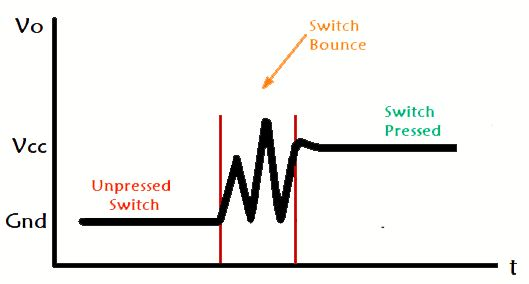
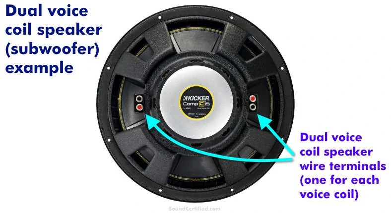
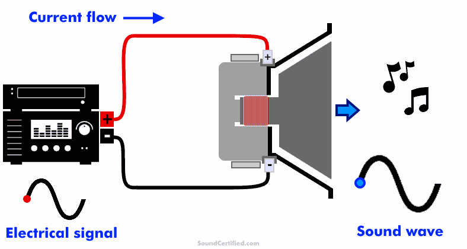
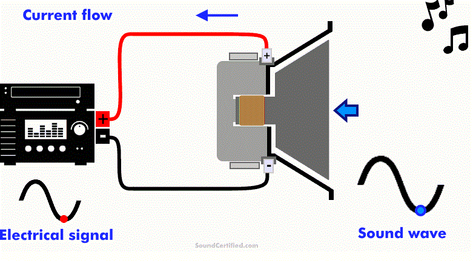
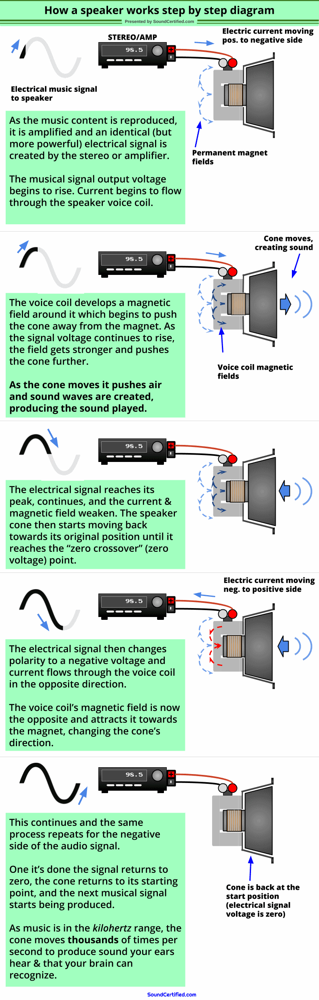
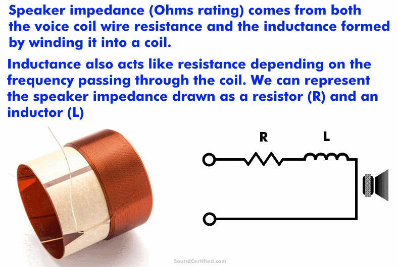
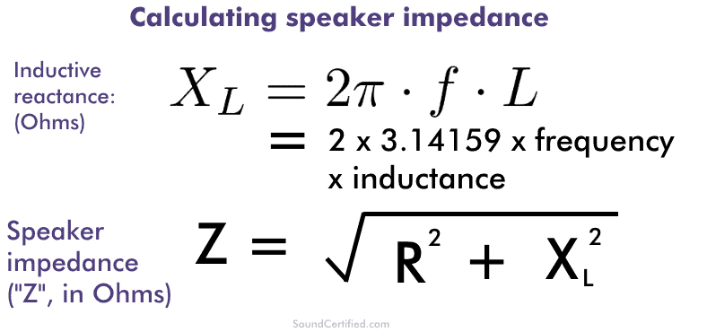
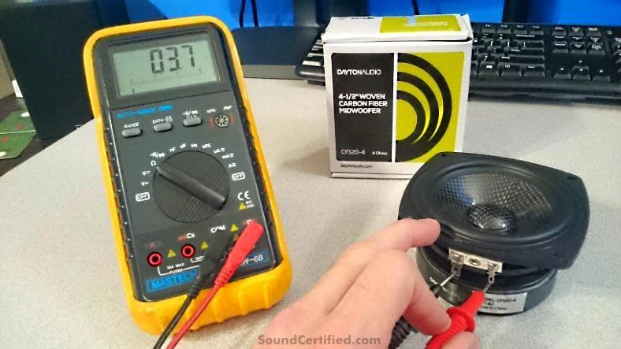
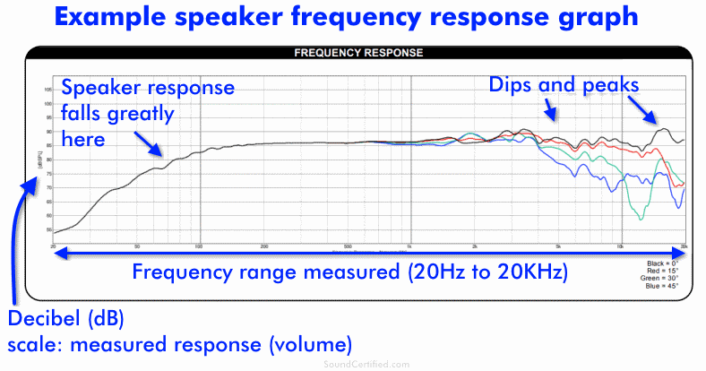
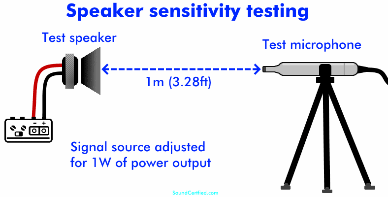

# investigaciones individuales

braulio figueroa vega / github: brauliofigueroa2001

## Sensor

Pushbutton de 4 pines

**Imagen 1** *Pushbutton de 4 pines, fuente: Made in China*

¿Qué es Push Button 4 pines?
Push Button 4 pines también conocido como MicroSwitch, botón o pulsador es un dispositivo táctil que sirve como interruptor ya que puede ser activado, al ser pulsado con el dedo y permiten el flujo de corriente mientras es accionado. Los pulsadores son de diversas formas y tamaños y se encuentran en todo tipo de dispositivos, aunque principalmente en aparatos eléctricos y electrónicos.

¿Para qué sirve? 

Los botones son de propósito general y son utilizados en diversos dispositivos electrónicos. Ideales para realizar practicas de electrónica para armar circuitos en protoboards, así como integrar a placas de circuito impreso PCB.

Especificaciones del Pushbutton de 4 pines

- Rango de temperatura: -20°C  a 70°C
- Voltaje máximo: 24V
- Corriente máxima: 50 mA
- Resistencia de aislamiento: 100MΩ
- Rebote: 5 ms
- Fuerza de operación: 1.57 ± 0.49 N
- Dimensiones: 6mm x 6mm x 4.3 mm

*Info sacada de [unitelectronics](https://uelectronics.com/producto/push-button-4-pines-microswitch/)

Me llamó la atención el concepto de "rebote" ya que lo ví en hartos lados a medida que trabajábamos con el botón, los códigos con botones siempre incorporan un "anti-rebote" y quiero ahondar específicamente en cómo y por qué se produce ese rebote

### Concepto de rebote

**¿Qué es el switch bouncing?**

Cuando presionamos un botón, un interruptor de palanca o un microinterruptor, dos partes metálicas entran en contacto para cortar el suministro. Pero no se conectan instantáneamente, sino que las partes metálicas se conectan y desconectan varias veces antes de que se realice la conexión estable real. Lo mismo sucede al soltar el botón. Esto da como resultado la activación falsa o activación múltiple, como si se presionara el botón varias veces. Es como caer una pelota que rebota desde una altura y sigue rebotando en la superficie, hasta que se detiene.

**Imagen 02** *Diagrama de Switch Bounce*

Simplemente, podemos decir que el rebote del interruptor es el comportamiento no ideal de cualquier interruptor que genera múltiples transiciones de una sola entrada. El rebote del interruptor no es un problema importante cuando nos ocupamos de los circuitos de potencia, pero causa problemas mientras tratamos con los circuitos lógicos o digitales. Por lo tanto, para eliminar el rebote del circuito , se utiliza el circuito de rebote del interruptor.

**El rebote también puede ocurrir en Software, cómo?**

El rebote también ocurre en el software, mientras que los programadores de programación agregan retrasos para eliminar el rebote del software. Agregar un retraso fuerza al controlador a detenerse durante un período de tiempo en particular, pero agregar retrasos no es una buena opción en el programa, ya que pausa el programa y aumenta el tiempo de procesamiento. La mejor forma es utilizar interrupciones en el código para el rebote del software. Arduino tiene un código para evitar que el software rebote.

*Info sacada de [es-amentechnologies](https://es.amen-technologies.com/what-is-switch-bouncing)

## Actuador

**Speaker**

Para mi investigación sobre un actuador, quise buscar información sobre algo distinto a lo que estábamos trabajando como grupo, ya que, desde hace un tiempo que quiero poder hacer algo con sonido y quizá el examen podría ser la oportunidad de realizarlo

**Imagen 3** fuente: [Amazon](https://www.amazon.co.uk/Gikfun-Speaker-Diameter-Arduino-Speakers/dp/B07DJ9X5T6)

### ¿Qué hay dentro de un parlante?

**Imagen 4** *partes de un parlante, fuente: [soundcertified](https://soundcertified.com/how-do-speakers-work/)*

La mayoría de los parlantes están hechos de las siguientes partes que trabajan juntas para crear sonido:

- Imán permanente: se utiliza un imán para proporcionar un campo magnético fijo alrededor de la bobina de voz y hacer posible el movimiento.

- Bobina de voz y carrete (bobbin): el carrete es un tubo redondo unido a la parte inferior del cono. Una bobina de alambre muy larga y estrechamente enrollada, llamada bobina de voz, crea un campo magnético cuando la electricidad fluye a través de ella desde la señal musical proveniente de un amplificador.

- Araña o suspensión (spider): la araña es un material delgado tejido con forma ondulada que sostiene el conjunto del carrete de la bobina de voz y ayuda a empujar el cono de vuelta a su posición mientras se mueve.

- Cono (diafragma) y tapa antipolvo: este es un material rígido con forma de cono que es movido por el imán y la bobina de voz juntos para desplazar aire y crear sonido. La tapa antipolvo es un material delgado (como una “tapa”) que cubre la abertura en el centro para evitar la entrada de polvo y suciedad.

- Canasta del parlante: la canasta es una estructura de metal fundido o estampado a la que se fijan las partes del parlante y mantiene todo alineado. También proporciona una forma de montar el conjunto del parlante en una caja.

- Terminales del parlante y cable trenzado: los terminales del parlante son pestañas o conectores metálicos que conectan el cable del parlante al mismo. Estos se conectan a la bobina de voz mediante un cable trenzado flexible que se mueve junto con el cono.

- Borde o suspensión exterior (surround): este es un material circular flexible y duradero (generalmente goma o algún tipo de espuma) que une el borde superior del cono con la canasta.

### ¿Para qué sirve el cono de un parlante?

**Imagen 5** *partes de un parlante, fuente: [soundcertified](https://soundcertified.com/how-do-speakers-work/)*

Un cono de parlante (también llamado diafragma) es el componente principal del parlante responsable de crear una onda sonora cada vez que mueve aire rápidamente hacia adelante y hacia atrás. Normalmente están hechos de materiales livianos pero rígidos, como papel prensado, plásticos, fibra de carbono o incluso metal delgado.

El nombre “cono” del parlante se refiere a su forma: una forma de cono invertido con una abertura central donde se une el conjunto del carrete y la bobina de voz. Una tapa antipolvo se fija al cono sobre esta abertura en la parte inferior para evitar que entren contaminantes. Ambos son sostenidos en la parte inferior por un material rígido pero flexible, a veces llamado “araña” (spider).

El tipo y diseño dependen del parlante. Por ejemplo, los subwoofers producen ondas de sonido de graves muy grandes y un movimiento de aire considerable, por lo que necesitan un diseño más grueso y rígido.

En cambio, los tweeters utilizan un diseño muy pequeño, liviano y con forma de domo para el rendimiento en frecuencias altas, ya que este rango de sonido utiliza ondas sonoras más pequeñas.

### ¿Qué hace el imán de un parlante?

**Imagen 6**, *partes de un parlante, fuente: [soundcertified](https://soundcertified.com/how-do-speakers-work/)*

Los imanes de los parlantes generalmente son imanes permanentes (normalmente de material magnético cerámico o de neodimio) con una delgada abertura circular en la que se encuentra suspendida la bobina de voz. El imán proporciona un área de campo magnético estable que atrae o repele la bobina de voz.

Debido a que la bobina desarrolla un campo magnético, funciona de cierta manera como un electroimán. Los imanes de neodimio son más fuertes para su tamaño (campos magnéticos más densos), pero los imanes cerámicos, aunque son más grandes, son más económicos. Esa es una de las razones por las que los imanes cerámicos son más populares en el uso de parlantes.

Algunos imanes de parlantes, aunque no todos, tienen un orificio en el centro para ayudar a ventilar la bobina de voz y mantenerla fría.

- Este elemento en particular me trae recuerdos cuando nos pasaron nuestra primera caja de materiales en el taller de máquinas electrónicas el primer semestre del 2025. En esta caja venía un parlante envuelto en cartón y scotch, era pequeño. Cuando mi caja se comenzó a desordenar y las resistencias, condensadores,leds, estaban por todos lados, el imán del parlante hacía que se pegaran todas las cosas sobre este mismo, fueron momentos memorables

### ¿Qué es un parlante de doble bobina de voz? 

**Imagen 7**, *partes de un parlante, fuente: [soundcertified](https://soundcertified.com/how-do-speakers-work/)*

Los parlantes de doble bobina de voz ofrecen un segundo enrollado de bobina de voz en el mismo parlante y sobre el mismo conjunto del carrete de la bobina de voz. Este tipo de parlantes permite algunas opciones adicionales que los parlantes de bobina simple no tienen:

- Flexibilidad en la forma en que se conectan (2 ohms, 4 ohms, 8 ohms, etc.) para una mejor compatibilidad con amplificadores y receptores estéreo.
Para subwoofers u otros parlantes más grandes, pueden alimentarse con más configuraciones de cableado o incluso con 2 amplificadores cada uno, algo que no se puede hacer con modelos de una sola bobina de voz.

- Pueden ser alimentados con 2 canales de amplificadores que no pueden conectarse en puente (bridge) para obtener más potencia.

- Con mayor frecuencia encontrarás subwoofers disponibles en una versión de doble bobina de voz por un poco más de dinero.

- Aunque ofrecen más opciones de configuración de cableado, los parlantes de doble bobina de voz (DVC) no ofrecen un mejor rendimiento que sus equivalentes de bobina de voz simple (SVC).

- Además, parlantes como los tweeters para sonidos agudos y los parlantes de rango medio para instrumentos y voces normalmente no se fabrican en una versión de doble bobina de voz.

**Imagen 8**, *partes de un parlante, fuente: [soundcertified](https://soundcertified.com/how-do-speakers-work/)*

-  Ejemplos de dos carretes de parlante con doble bobina de voz. Izquierda: las dos bobinas no están juntas, mientras que (derecha) en este ejemplo están colocadas en capas una sobre la otra.

### Diagrama de cómo funcionan los parlantes

**Imagen 9**, *diagrama de funcionamiento del parlante, fuente: [soundcertified](https://soundcertified.com/how-do-speakers-work/)*

**Imagen 10**, *diagrama de funcionamiento del parlante, fuente: [soundcertified](https://soundcertified.com/how-do-speakers-work/)*

En este diagrama, puedes ver cómo funciona un parlante. Un estéreo o amplificador alimenta el parlante con una señal eléctrica que alterna de positivo a negativo siguiendo la forma de la señal musical.

Mientras esto ocurre, la corriente eléctrica fluye a través de la bobina de voz del parlante, creando un campo magnético que hace que se mueva hacia el imán o se aleje de él a medida que cambia de positivo a negativo. Esto mueve el conjunto del cono, que crea ondas sonoras a medida que el aire se desplaza rápidamente. Los parlantes utilizan corriente alterna (AC), que cambia de dirección (polaridad) igual que las ondas sonoras en la vida real.

### Diagrama completo

**Imagen 11**, *diagrama de funcionamiento completo de un parlante, fuente: [soundcertified](https://soundcertified.com/how-do-speakers-work/)*

La señal eléctrica enviada al parlante es un voltaje amplificado que es una copia de la señal musical original proveniente de una fuente de audio, pero con suficiente potencia para mover los parlantes con un buen volumen.

Aquí tienes una explicación paso a paso de cómo funcionan los parlantes:

(Partiendo desde el punto de salida cero) un voltaje de salida que representa la forma de onda musical comienza y empieza a aumentar. La corriente eléctrica comienza a fluir a través de la bobina de voz del parlante desde el lado positivo hacia el lado negativo.

Se crea un campo magnético alrededor de la bobina de voz y este tiene la misma polaridad que el imán permanente unido a la canasta (estructura) del parlante. (Recuerda que los campos magnéticos iguales se repelen y los opuestos se atraen).

El cono/diafragma comienza a moverse hacia adelante y crea presión de aire, produciendo sonido.

A medida que el voltaje de la señal eléctrica aumenta hacia la parte superior de la onda sinusoidal de la señal musical, la corriente aumenta y la bobina de voz incrementa la fuerza de su campo magnético.

Esto empuja el cono aún más hacia afuera.

- La señal pasa el punto máximo de salida y comienza a disminuir. La corriente también comienza a disminuir y el cono empezará a volver más cerca de su posición de reposo (voltaje cero).

- La señal llega a cero (también llamado “umbral de cruce de voltaje cero”) y el cono vuelve al punto donde comenzó.

- La señal eléctrica comienza a invertirse al cambiar a un voltaje negativo. Cuando esto ocurre, la corriente fluye desde el lado negativo de la bobina de voz hacia el positivo, creando un campo magnético de polaridad invertida.

- El campo magnético de la bobina de voz ahora es opuesto al del imán permanente, que la atrae, y el cono comienza a moverse desde adelante hacia atrás (en lugar del movimiento original de atrás hacia adelante).

- A medida que la señal continúa, el cono se mueve en reversa, creando la otra mitad de las ondas sonoras producidas por el movimiento del aire.
La salida del amplificador o estéreo vuelve a cero y la siguiente señal de audio comienza cuando el nuevo voltaje de salida empieza a aumentar, repitiéndose nuevamente el ciclo.

- En cierto modo, los parlantes son simplemente una especie de motor eléctrico: funcionan gracias a una señal eléctrica y la transforman en una salida mecánica, moviendo aire para crear sonidos musicales.

- En ocasiones, los parlantes también son llamados transductores.

### ¿Qué significa la impedancia de un parlante? (Explicación de las clasificaciones en ohms de los parlantes)

**Imagen 12**, *impedancia de un parlante, fuente: [soundcertified](https://soundcertified.com/how-do-speakers-work/)

**La impedancia de un parlante, medida en ohms, es la resistencia total al flujo de corriente eléctrica a través de la bobina de voz del parlante.**

A diferencia de los conductores estándar, la bobina de voz está enrollada firmemente en forma de espiral, lo que complica las cosas porque añade inductancia. La inductancia es diferente de la resistencia, ya que cambia cuando cambia la frecuencia, y esto se llama reactancia inductiva.

En otras palabras, cuando se crean los campos magnéticos de la bobina de voz, estos se oponen un poco al flujo de corriente eléctrica.

Debido a esta propiedad de la física y a cómo funciona la inductancia, la “impedancia” del parlante (resistencia total) no es simplemente la suma de la resistencia y la reactancia inductiva; es un poco más complicado que eso.

En cambio, es la suma algebraica (la raíz cuadrada de la suma de los cuadrados) de cada una. La reactancia inductiva normalmente se escribe como “Xl” y se mide en ohms, igual que la resistencia estándar.

### Fórmula matemática de la impedancia

**Imagen 13**, *fórmula de la impedancia de un parlante, fuente: [soundcertified](https://soundcertified.com/how-do-speakers-work/)

Si te gustan las matemáticas más avanzadas, aquí puedes ver cómo se calcula la impedancia de un parlante. Es la suma geométrica de la resistencia del enrollado de cobre de la bobina de voz y la resistencia causada por su inductancia a una frecuencia determinada.

Lo más importante que debes entender sobre la impedancia de un parlante es:

- La impedancia del parlante siempre es igual o mayor que la resistencia del cable de la bobina de voz. Esto se puede medir con un medidor de ohms.
- El número de impedancia indicado en un parlante es una guía general de compatibilidad, no exactamente lo que el parlante mide.
- La impedancia cambia ligeramente (aumenta) a medida que aumenta la frecuencia que se está reproduciendo.

De hecho, si usaras un instrumento de prueba para medir los ohms (impedancia) de la bobina de voz de un parlante, encontrarías una lectura de aproximadamente 3.2 a 3.6 ohms para un parlante de 4 ohms, y de 6 ohms o más para un parlante de 8 ohms.

**Imagen 14**, *medición de impedancia de parlante, fuente: [soundcertified](https://soundcertified.com/how-do-speakers-work/)

La imagen muestra cómo medir la impedancia de un parlante con un medidor de ohms. Esto mide solamente la resistencia de corriente continua (DC) del cable en la bobina de voz, no la impedancia total cuando se reproduce música debido a la inductancia. Sin embargo, en la mayoría de los casos estará muy cerca y podrás identificar la clasificación estándar en ohms del parlante (4 ohms, 8 ohms, etc.).

### ¿De dónde surgieron los parlantes de 4 ohms y 8 ohms?

Los parlantes de 4 ohms (y a veces de 2 ohms) se utilizan más comúnmente en sistemas de audio para automóviles. Esta práctica comenzó hace mucho tiempo, cuando las radios y los parlantes empezaron a instalarse de fábrica en los autos durante su fabricación.

Debido a que en los automóviles solo hay disponible un voltaje más bajo (12V) para alimentarlos, es más difícil producir potencia para el parlante que en los equipos de sonido domésticos, donde hay mucho más voltaje disponible.

Los 8 ohms se utilizan más comúnmente en parlantes para sistemas estéreo domésticos. Los equipos de sonido para el hogar funcionan con una fuente de voltaje más alta (110V, como en Estados Unidos), por lo que son más fáciles de diseñar y pueden alimentar parlantes de mayor impedancia (8 ohms) sin problemas. En ambos casos, estas clasificaciones en ohms se volvieron comunes tanto para parlantes de hogar como de automóvil.

### ¿Por qué se necesita una caja o recinto para un parlante?

**Imagen 15**, *cajas en parlantes, fuente: [soundcertified](https://soundcertified.com/how-do-speakers-work/)

Una caja acústica o recinto para parlante (“box”) es muy importante por varias razones:

- Evita que las ondas sonoras delanteras interfieran y cancelen las traseras.
- Permite que los sonidos graves de baja frecuencia se produzcan correctamente, se ajusten o se mejoren.
- Reduce las vibraciones producidas por los parlantes mientras funcionan.
- Dirige la manera en que el sonido se dispersa.

Una caja de parlante (o “gabinete acústico”) generalmente está hecha de un material grueso como madera o tablero de fibra de densidad media (MDF), ya que son resistentes y no se flexionan mucho. Mientras que un subwoofer o un parlante de rango medio necesita utilizarse en una estructura sellada, los tweeters no lo necesitan.

Esto se debe a que los tweeters dirigen el sonido solo hacia el frente y no producen ondas sonoras hacia la parte trasera. En algunos casos (como en parlantes surround), pueden ser más pequeños que el par principal de gabinetes frontales.

### ## ¿Qué son la respuesta de frecuencia y la sensibilidad de un parlante?

**Imagen 16**, *frecuencia de un parlante, fuente: [soundcertified](https://soundcertified.com/how-do-speakers-work/)

Aquí se muestra un ejemplo de un gráfico típico de respuesta de frecuencia de un parlante. Los parlantes no son perfectos y no producen un volumen perfectamente uniforme en todo el rango de sonidos que podemos escuchar. Debido a eso, es útil conocer el rango de frecuencias en el que funcionan bien.

La respuesta de frecuencia de un parlante es el rendimiento medido de un parlante, en decibeles (dB) de volumen, a lo largo de un rango de frecuencias de sonido. Normalmente, este rango va desde 20 Hertz (Hz) hasta 20 kiloHertz (KHz), que es el estándar utilizado para parlantes de audio

El rango de 20 Hz a 20 kHz se utiliza porque es el rango de sonido que una persona con buena audición puede percibir, y la música suele grabarse dentro de ese rango.

La respuesta de frecuencia de un parlante es importante por varias razones:

- Combinar parlantes entre sí para sistemas de 2 o 3 vías.
- Elegir los parlantes con mejor rendimiento para un diseño de audio.
- Diseñar sistemas de parlantes y crossovers.
- Utilizar equipos de audio como un ecualizador o un procesador digital de señales (DSP) para corregir áreas donde el parlante produce demasiado sonido (un pico) o muy poco (una caída).

Aunque algunos parlantes incluyen un gráfico u otras especificaciones para ayudarte a entender cómo funcionan, no todos lo hacen. Normalmente, esto se encuentra en vendedores que ofrecen parlantes individuales para diseños de audio más avanzados.

La mayoría de los parlantes comerciales para automóvil o para el hogar no incluyen el gráfico real de respuesta, sino un rango aproximado. Sin embargo, los parlantes más caros sí pueden incluirlo.

Si tienes el equipo adecuado, también puedes medirlo tú mismo en casa utilizando un programa analizador en tiempo real (RTA) y un micrófono de alta calidad diseñado para este propósito.

### ¿Qué es la sensibilidad de un parlante?

**Imagen 17**, *sensibilidad de un parlante, fuente: [soundcertified](https://soundcertified.com/how-do-speakers-work/)

La sensibilidad de un parlante es una medición realizada por el fabricante. Es una medida del volumen producido a una frecuencia de sonido fija y, normalmente, cuando se entrega 1 watt de potencia al parlante a una distancia de 1 metro (3,28 pies) del micrófono de prueba.

La sensibilidad del parlante es una especificación proporcionada por el fabricante que resulta útil para comparar o combinar parlantes. Es una medida del volumen producido, en decibeles (dB), por un parlante a 1 metro (3,28 pies) de un micrófono de prueba para una sola frecuencia.

En la mayoría de los casos, la medición estándar corresponde al volumen en dB con un watt de potencia a una distancia de 1 metro, y a menudo se utiliza una frecuencia de sonido como 1 KHz (dependiendo del tipo de parlante).

La sensibilidad varía de un parlante a otro; los tweeters son más eficientes (producen más sonido con el mismo nivel de potencia) que otros tipos. Los subwoofers son menos eficientes porque necesitan más potencia para mover el cono pesado y producir sonido.

Los subwoofers tienden a tener una sensibilidad de alrededor de 87 dB, los parlantes de rango medio alrededor de 89 dB, y los tweeters pueden alcanzar entre 93 y 102 dB dependiendo del tipo.

**Diferencias en la medición de sensibilidad**

La sensibilidad a veces se mide de una manera ligeramente diferente. Esto se debe a que se necesita un voltaje distinto para que parlantes de 4 ohms y 8 ohms produzcan la misma cantidad de potencia, ya que la resistencia en ohms (impedancia del parlante) es diferente.

Por lo tanto, circula menos corriente a través de un parlante de 8 ohms, lo que hace que reciba menos potencia con el mismo voltaje que un parlante de 4 ohms.

En ese caso, para parlantes de 8 ohms puede utilizarse una medición de sensibilidad expresada en dB a 2.83V/1M.

- Con 2.83V, un parlante de 8 ohms desarrolla 1 watt de potencia. De manera similar, para parlantes de 4 ohms puede utilizarse una medición de 2V/1M.

Estas mediciones realmente no están estandarizadas en la industria de los parlantes, por lo que las especificaciones proporcionadas por un fabricante pueden aparecer como “1W/M” o “xV/M”, dependiendo de lo que decidan indicar. Al utilizar esta medición para comparar o combinar parlantes, es importante prestar atención a esto.

**toda la información fue sacada de [soundcertified](https://soundcertified.com/how-do-speakers-work/) y la traduje con IA para hacerlo más accesible y no estuviera todo en inglés**

## Bibliografía

[unitelectronics](https://uelectronics.com/producto/push-button-4-pines-microswitch/)

[es-amentechnologies](https://es.amen-technologies.com/what-is-switch-bouncing)

[soundcertified](https://soundcertified.com/how-do-speakers-work/)
