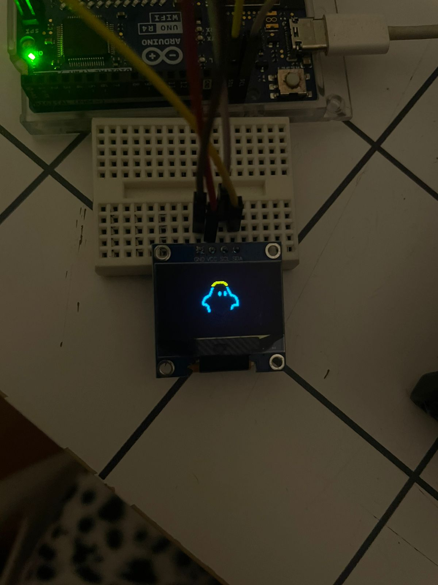
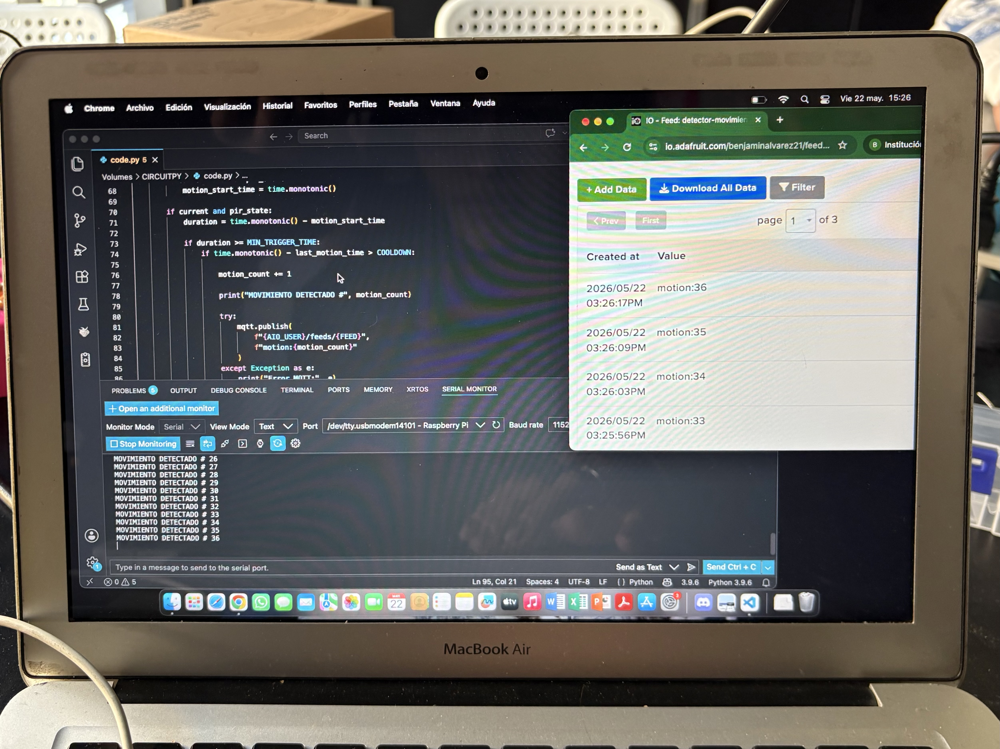
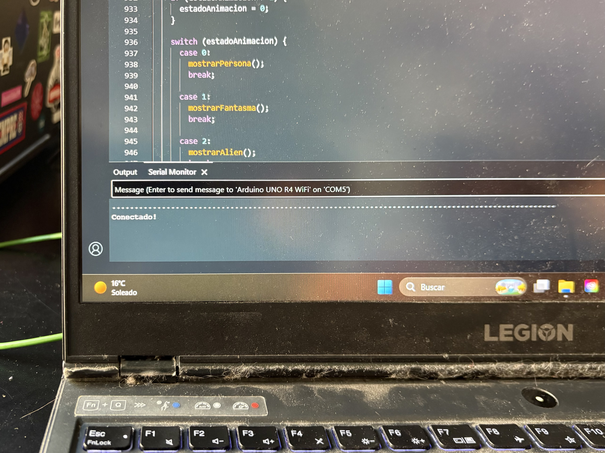
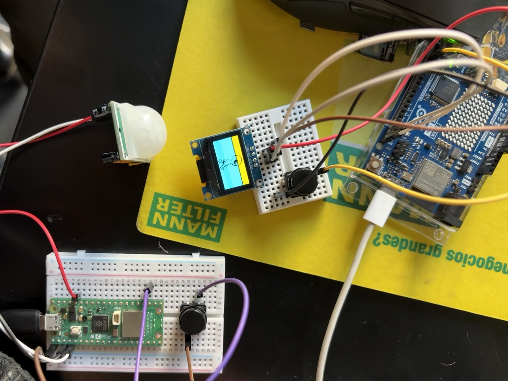

#### Grupo 04 - Antonia Fuentealba

Definir proyecto 

Interacción entre Arduino y Raspberry Pi Pico 2 W

### Idea Principal
Arduino fuera el emisor de datos y Raspberry Pi Pico 2 W como receptor. El Arduino iba  conectado a un potenciómetro, el cual entregaría valores dependiendo de su posición hacia la izquierda o derecha. Estos datos serían enviados a la Raspberry Pi Pico 2 W, que los interpreta para controlar el movimiento de un servomotor.

### Idea principal Nueva
Aaron nos recomendó hacerlo al revés - donde arduino receptor y raspberry emisor

Donde sigue la misma idea de que este conectado a un potenciómetro que entregue valores y se vean en movimiento en un servomotor

### Proceso
Al momento de instalar Python en la Raspberry, no se quería mover el archivo a la placa.

Cambiamos de placa y era un problema de la anterior, pero la nueva placa no tenía el python con el archivo y al momento de pasarlo a la placa salía que no tenía el espacio necesario.

#### Nuevo grupo 07 - Antonia Fuentealba, Benjamín Álvarez, Anays Cornejo

### Idea Principal
El proyecto trata de un sistema capaz de detectar movimiento y enviar esa información de manera inalámbrica, se va a utilizar un sensor PIR que se activa al presionar un botón. Cuando el sistema está encendido, el sensor identifica movimiento en el entorno y la Raspberry Pi Pico 2 W se encarga de enviar esos datos a la plataforma Adafruit IO para su visualización y monitoreo.

## Proceso solemne
El sistema opera a partir de la detección de movimiento realizada por el sensor, lo que desencadena el envío y procesamiento de información entre los distintos dispositivos conectados. Como resultado, este estímulo físico se interpreta digitalmente y se refleja mediante una respuesta visual en la pantalla OLED.

**Objetivo:** Poner en práctica la conexión entre sensores, actuadores y tecnologías de comunicación inalámbrica, creando una interacción en la que el usuario pueda percibir de forma inmediata cómo los datos captados por el sistema son transmitidos y transformados en una visualización animada.

Al principio se quería trabajar con tres personajes distintos, cada uno con sus propias animaciones y frames. Sin embargo, esto hizo que el proceso fuera más complicado, ya que comenzaron a aparecer errores al ordenar y mostrar las animaciones correctamente.
Nos sucedió también que en un momento las animaciones cambiaban gracias al botón y no gracias al sensor,   tuvimos que partir de nuevo con la base de una animación para poder simplificarlo y que el sensor si pudiera ser el que hacia el cambio de movimiento.
### Pruebas

### Solemne

