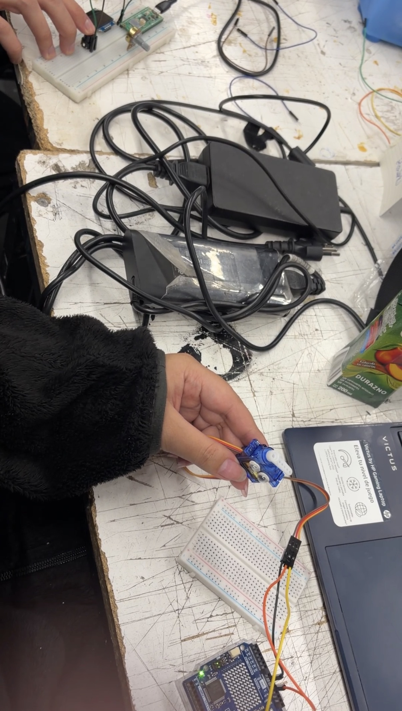

# sesion-10

lunes 18 mayo 2026

## trabajo en clase solemne 2

definimos como queriamos que fuese el proyecto y los materiales que vamos a ocupar:

- la Raspberry tendrá un potenciómetro y una mini pantalla OLED
- el Arduino tendrá un servomotor que se moverá según movamos el potenciómetro
- y la pantalla OLED nos debe mostrar en tiempo real los valores de ambos

fuimos probando el código de ejemplo subido por mateo y todo funciona bien, además creamos el feed en nuestra nube de Adafruit para poder hacer pruebas,
nos falta aún modificar el diseño final que se mostrará en la pantallita pero así va funcionando

### fotos en clase

