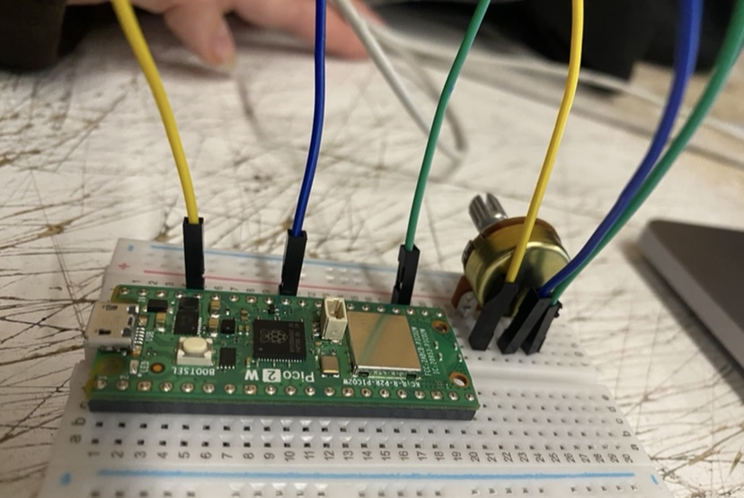

# sesion-10

lunes 18 mayo 2026

 Solemne 02 
 
## Investigación, prueba y error

Durante esta clase seguimos avanzando en la Solemne 02, enfocándonos principalmente en la etapa de investigación, prueba y error del sistema. La idea general era lograr una comunicación entre **Raspberry Pi**, **Adafruit IO** y **Arduino**. Para esto, queríamos que la Raspberry leyera los valores de un potenciómetro, enviara esa información a un feed de Adafruit IO, y que luego el Arduino recibiera esos datos para mover un servo motor según el valor recibido.

**Paso número 01**: Hacer las conexiones bien
                nuestro primer error fue que no lograbamos hacer la conexión del potenciómetro a la raspberry pi, gracias Aarón por guiarnos                  en esta parte:  
 
   
 
En la primera parte de la clase revisamos con mayor detalle el uso de la Raspberry Pi junto con Visual Studio Code y PuTTY. Al inicio la Raspberry no nos estaba funcionando correctamente, por lo que comenzamos a revisar distintas posibles causas: el código, la conexión a internet, la configuración de Adafruit IO y la comunicación con el computador. Después de varias pruebas nos dimos cuenta de que el problema estaba relacionado con PuTTY, ya que no lo habíamos iniciado correctamente. Esto nos permitió entender que, para que el sistema funcione, no basta con tener el código listo, sino que también es necesario activar bien todos los pasos de conexión.  

         

Tuvimos que revisar varias veces las conexiones físicas del circuito. Algunos cables estaban mal conectados o no hacían buen contacto, por lo que el problema no siempre estaba en la programación. Esto fue importante porque nos hizo entender que en este tipo de proyectos el error puede venir tanto del código como del montaje electrónico. Por eso revisamos los pines, la alimentación, la tierra y la conexión de cada componente antes de seguir avanzando. 

**Paso número 02**: usar método universal de Aarón para resolver los problemas 

      

La clase se basó mucho en analizar el problema paso a paso. Cada vez que algo no funcionaba, intentábamos pensar en una posible causa y probar una solución. Si esa solución no era correcta, volvíamos al paso anterior, revisábamos nuevamente y buscábamos otra alternativa. Este proceso de avanzar, equivocarnos, retroceder y volver a probar fue parte importante del aprendizaje, porque nos permitió entender mejor cómo se relacionan todas las partes del sistema.

**MUCHAS COSAS NO QUERÍAN FUNCIONAR**

**Paso número 03**: darse el tiempo de receso para eliminar frustración y volver a intentar. 

   

Durante una de las pruebas tuvimos problemas al trabajar con el potenciómetro, porque este comenzó a enviar demasiados datos a Adafruit IO en muy poco tiempo. Como el potenciómetro entrega valores constantemente mientras se mueve, el código estaba publicando información casi sin pausa. Esto hizo que Adafruit IO nos bloqueara temporalmente el envío de datos, porque la plataforma tiene un límite de frecuencia para evitar que se manden demasiadas actualizaciones seguidas.

El problema fue que no habíamos agregado un delay o una condición que controlara cada cuánto se enviaba la información. Entonces, aunque el cambio del potenciómetro fuera mínimo, el sistema lo leía como un nuevo dato y lo mandaba inmediatamente a la nube. En vez de enviar solo valores importantes, estaba enviando muchas variaciones pequeñas, saturando el feed. Para resolverlo, entendimos que no basta con leer el sensor, sino que también hay que controlar el ritmo de envío. En este caso, el código necesitaba una pausa entre publicaciones, para que Adafruit IO tuviera tiempo de recibir los datos sin bloquear la conexión. Una solución básica es agregar un delay después de publicar el valor:  
 
```
int valorPot = analogRead(A0);

potenciometroFeed->save(valorPot);

delay(1000);
```

 

Luego, pasado la clase, seguimos probando hasta lograrlo!!! 

Finalmente, esta sesión nos ayudó a visualizar el proyecto como una comunicación completa entre dispositivos. La Raspberry funcionaba como entrada, leyendo el movimiento del potenciómetro; Adafruit IO actuaba como puente de conexión entre ambos dispositivos; y el Arduino funcionaba como salida, transformando la información recibida en el movimiento del servo. En ese sentido, la clase fue importante para comprender cómo una acción física simple puede convertirse en un dato digital y luego generar una respuesta física en otro dispositivo.
