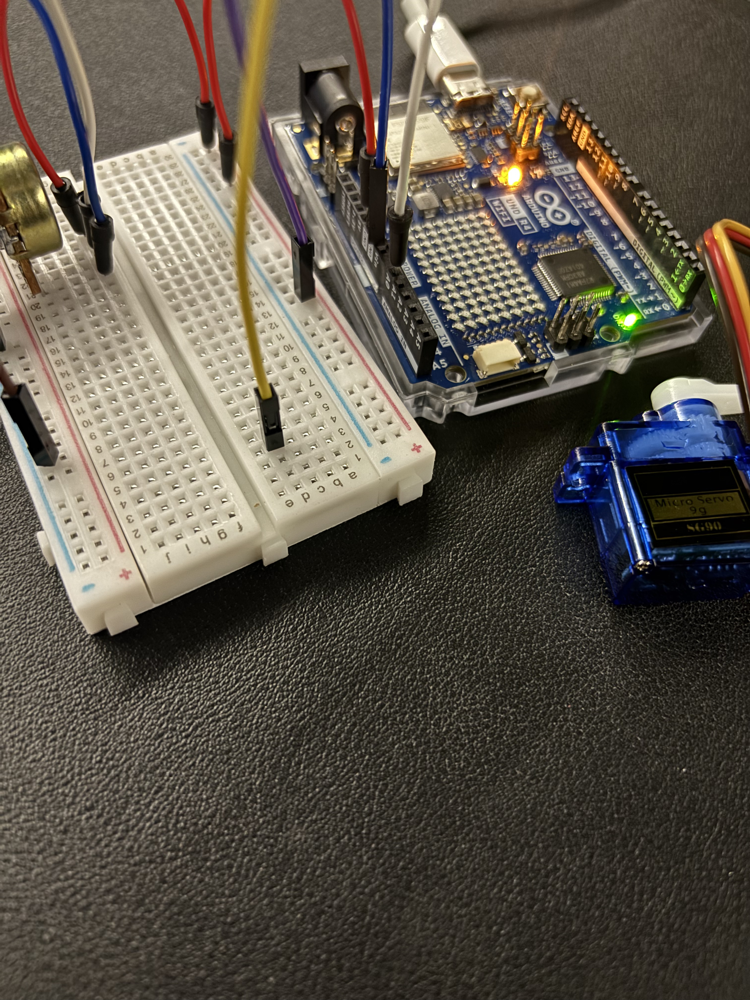
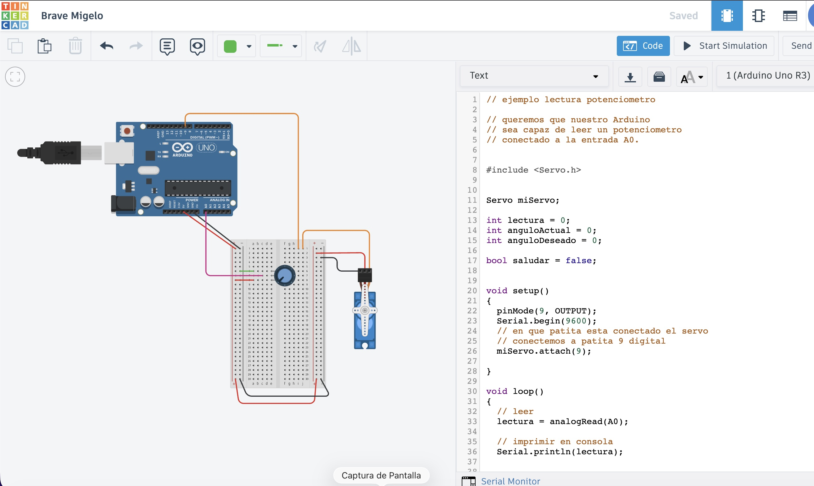

# sesion-07

lunes 20 abril 2026

Solemne 2: 

Grupo 8

Integrantes:
- Monserrat Paredes
- Valentina Ruz
- Sofía Cartes

## Apuntes

Aarón y Mati están haciendo un libro sobre todos los conocimientos que pasan el ramo de taller de Máquinas Electrónicas.

Materiales a utiizar en clases: 

- Protoboard tiene dos emiferios, son sectores independientes tiene vcc y gnd para guiarnos 
- servomotor tiene 3 terminales vcc, señal (amarilla) posición a dónde va.
- LDR (sensor) pasa por todos los valores intermedios 
- Potenciómetro tiene 3 patitas, la 1 y la 2 o la 2 y la 3 se conectará, así detectaremos nuestro giro
-  Cables 

**veremos datos, estrategias para mandarle a la nube**

### Tinkercad 

Ejemplo visto en clases: <https://www.tinkercad.com/things/8DYKKECMAMm/editel?returnTo=%2Fdashboard>

```cpp
// C++ code
//


// queremos que nuestro Arduino
// sea capaz de leer un potenciometro
// conectado a la entrada A0.

int lectura = 0;


void setup()
{
  pinMode(LED_BUILTIN, OUTPUT);
  Serial.begin(9600);
}

void loop()
{
  lectura = analogRead(A0);
  Serial.println(lectura);
}
```

arduino

```cpp
// ejemplo lectura potenciometro

// queremos que nuestro Arduino
// sea capaz de leer un potenciometro
// conectado a la entrada A0.

int lectura = 0;


void setup()
{
  pinMode(LED_BUILTIN, OUTPUT);
  Serial.begin(9600);
}

void loop()
{
  lectura = analogRead(A0);
  Serial.println(lectura);
}
```

include servo 

```cpp
// ejemplo lectura potenciometro

// queremos que nuestro Arduino
// sea capaz de leer un potenciometro
// conectado a la entrada A0.


#include <Servo.h>


Servo miServo;

int lectura = 0;
int angulo = 0;


void setup()
{
  pinMode(9, OUTPUT);
  Serial.begin(9600);
  // en que patita esta conectado el servo
  // conectemos a patita 9 digital
  miServo.attach(9);
  
}

void loop()
{
  // leer
  lectura = analogRead(A0);
  
  // imprimir en consola
  Serial.println(lectura);
  
  
  // toma el valor de lectura
  // que va originalmente entre 0 y 1023
  // y mapealo al rango 0 a 180
  angulo = map(lectura, 0, 1023, 0, 180);
    
  // pidele por favor al servo
  // que vaya a ese angulo
  miServo.write(angulo);
  
  // servo descansa un poquito
  // 15 milisegundos
  // la vida es dura
  delay(15);
    
}
```

llevar los potenciometros con calma a la nube

```cpp
#include <Servo.h>
#include <WiFiS3.h>
#include "Adafruit_MQTT.h"
#include "Adafruit_MQTT_Client.h"

// ── Credenciales ───────────────────────────────────────────
#define WIFI_SSID    "bla"
#define WIFI_PASS    "bla"
#define AIO_SERVER   "io.adafruit.com"
#define AIO_PORT     1883
#define AIO_USERNAME "udpmontoyamoraga"
#define AIO_KEY      "..."
#define AIO_FEED     AIO_USERNAME "/feeds/potenciometro-mateo"

#define INTERVALO_PUBLISH 500

Servo miServo;
WiFiClient wifiClient;
Adafruit_MQTT_Client mqtt(&wifiClient, AIO_SERVER, AIO_PORT, AIO_USERNAME, AIO_KEY);
Adafruit_MQTT_Publish feedPot(&mqtt, AIO_FEED);

int lecturaAnterior = -1;
unsigned long ultimoPublish = 0;

void conectarMQTT() {
  while (!mqtt.connected()) {
    Serial.print("Conectando a Adafruit IO...");
    int8_t ret = mqtt.connect();
    if (ret == 0) {
      Serial.println(" OK");
    } else {
      Serial.print(" Error: ");
      Serial.println(mqtt.connectErrorString(ret));
      mqtt.disconnect();
      delay(3000);
    }
  }
}

void setup() {
  Serial.begin(115200);
  miServo.attach(9);

  Serial.print("Conectando WiFi");
  WiFi.begin(WIFI_SSID, WIFI_PASS);
  while (WiFi.status() != WL_CONNECTED) {
    delay(500);
    Serial.print(".");
  }
  Serial.print(" IP: ");
  Serial.println(WiFi.localIP());
}

void loop() {
  conectarMQTT();
  mqtt.ping();

  int lectura = analogRead(A0);
  int angulo  = map(lectura, 0, 1023, 0, 180);
  miServo.write(angulo);

  unsigned long ahora = millis();
  if (lectura != lecturaAnterior && (ahora - ultimoPublish >= INTERVALO_PUBLISH)) {
    Serial.print("Publicando lectura: ");
    Serial.println(lectura);

    if (feedPot.publish((int32_t)lectura)) {
      Serial.println("  ✓ OK");
      lecturaAnterior = lectura;
      ultimoPublish   = ahora;
    } else {
      Serial.println("  ✗ Fallo");
    }
  }

  delay(15);
}
```

### ¿Cómo pasar este dato a la nube?

Al momento de tener el código en el arduino debemos cambiar la línea 13

```cpp
#define AIO_FEED     AIO_USERNAME “/blabalbla
```

No cambiar el usuario ni la clave del profe ya que funciona como receptor

cambiar de 500 a 5000 (línea 15)

```cpp
#define INTERVALO_PUBLISH 500
```

### Cómo cambiar el potencíometro por el sensor LDR

Potenciómetro: tiene tres pines: corriente, señal y tierra).
LDR: resistencia que varía.


#### Pasos a seguir:

Para sustituir el potenciómetro, conecta los componentes de la siguiente manera:

- 5V de Arduino va a un pin de la LDR.

- El otro pin de la LDR va al pin analógico (por ejemplo, A0).

- Desde ese mismo pin A0, conectas una resistencia de 10kΩ que vaya a GND (tierra).

Una patita a 5V y la otra desde ground a una resistencia de 10K, y desde la otra patita de la resistencia la conexión al pin A y a la otra patita del LDR

## Registro







