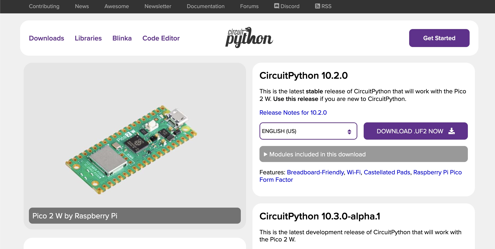
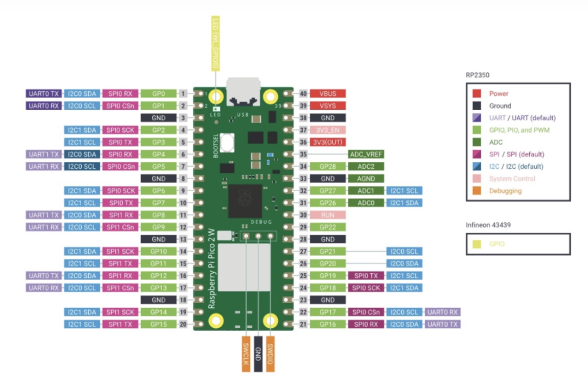

# sesion-08

lunes 27 abril 2026

## Apuntes 

- Ver comunicación bidireccional, que los dos emitan y reciban
- Python: app para programar. En esta app si imprtan los espacios , así visualiza la jerarquía de las cosas.
- Scipy/ Numpy
- microPynthon: para los microcontroladores.
- circitPython: es un fork del original de micropython.

## Circuit python

<https://circuitpython.org/>

CircuitPython es un lenguaje de programación diseñado para simplificar la experimentación y el aprendizaje de la programación en placas de microcontroladores de bajo costo.

- Tiene 652 placas para utilizar
- Las bibliotecas mpy, son archivos muy pequeños
- volate_cc > V_CC
- 3.3 V
- 5.0 V
- ADCO > es como la pin 0 del arduino/ pasa de algo análogo a algo digital

imágen de: <https://circuitpython.org/board/raspberry_pi_pico2_w/>

imágen de: <https://cursos.mcielectronics.cl/2025/08/12/introduccion-a-raspberry-pi-pico-2-y-pico-2-w/>

### Pasos a seguir

1. Primero descargamos en (Circuit Python) <https://circuitpython.org/board/raspberry_pi_pico2_w/>
2. Luego, conectamos la raspberry pi en el computador
3. Abrimos las carpetas de la raspberry pi pico2 w en el finder
4. Pasamos el archivo que descargamos, a la carperta rasberry pi
5. Cambiamos en visual code la línea 9, por el wifi nuestro y el nombre del feeds
6. Luego, añadimos las carpetas a la librería en la raspberry pi adafruit_connection_manager.mpy / adafruit_minimqtt / adafruit_ticks.mpy
7. En la terminal, buscamos usbmodem* *donde nos mostrará donde está conectado el usb*
8. En este caso: usbmodem11301
9. Luego, actualizamos y nos aparece los valores del potenciómetro, que deberían llegar al feed de aarón
