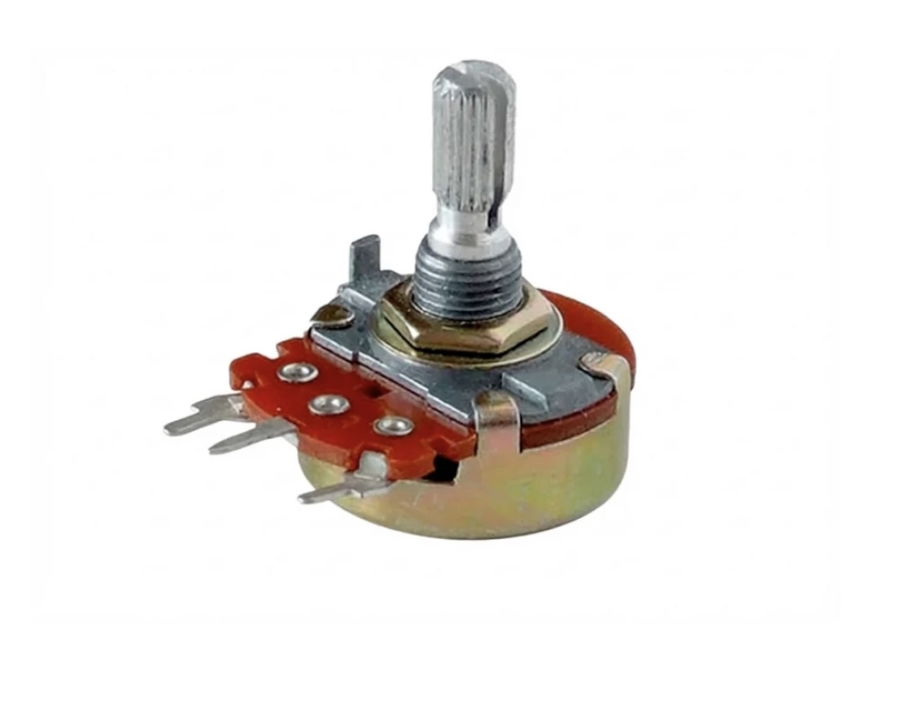

# sesion-10

lunes 18 mayo 2026

solemne 2

## Investigación

- Sensores: Dispositivo diseñado para detectar cambios en el entorno.
- Actuadores: Dispositivo que recibe una orden o señal.

Lo que queremos realizar en la solemne 2 es que desde la Raspberry pi envíe datos de un botón on/off  hacia el Arduino
y que este encienda una luz o emita algún sonido.

### Pseudocódigo

|Raspberry Pi Pico 2 W|Adafruit IO|Arduino UNO R4 wifi|
|--|--|--|
|Botón|MQTT|LED|
|ON/OFF|feed:estado|verde/rojo|

1. Presionar elbotón en la raspberry > alterna entre ON y OFF
2. La Raspberry publica "ON" "OFF" en el feed de Adafruit IO
3. El Arduino recibe el mensaje y enciende el LED correspondiente

#### Raspberry Pi Pico 2W

- Cada vez que presionas el botón, alterna entre ON y OFF (no es necesario mantenerlo)
- El LED integrado de la placa te muestra el estado actual (encendido=ON, apagado=OFF)
- Publica el texto "ON" u "OFF" en el feed estado de Adafruit IO
  
#### Arduino UNO R4 Wifi

- Recibe "ON" -> Enciende LED verde (D2), apaga el rojo
- Recibe "OFF" -> enciende LED rojo (D3), apaga el verde
- Al arrancar, ambos  LEDS parpadean 3 veces para confirmar que la conexión fue exitosa
  
#### Arduino UNO R4 Wifi

- Recibe "ON" -> Enciende LED verde (D2), apaga rojo
- Recibe "OFF" -> enciende LED rojo (D3), apaga verde
- Al arrancar, ambos LEDS parpadean 3 veces para confirmar que l aconexión fue existosa

NO OLVIDAR!

1. TU_NOMBRE_WIFI / TU_CLAVE_WIFI
2. TU_USUARIO_ADAFRUIT / TU_AIO_KEY
3. En el .ino, también reemplaza TU_USUARIO_ADAFRUIT en la línea del feed
4. Crear el feed llamado estado en tu cuenta de Adafruit IO antes de ejecutar

Después de hablar como grupo, decidimos cambiarlo 

## Investigación 2

Lo que queremos realizar en la solemne 2 es que desde la Raspberry pi envíe datos mediante un potenciómetro hacía el Arduino y que este encienda una luz y mueva un servomotor. Los datos enviados se verán reflejados en el feed de Adafruit.

|Raspberry Pi Pico 2 W|Adafruit IO|Arduino UNO R4 wifi|
|---|---|---|
|Potenciómetro|MQTT|Led + servomotor|
|ángulo|Feed: estado|enciende led y mueve servo|

1. Girar el potenciómetro en la Raspberry -> va cambiandi el ángulo
2. La Raspberry publica e ángulo en el feed de Adafruit IO
3. El Arduino recibe el mensaje y mueve el servomotor. Al llegar a cierto ángulo se enciende el LED

### Raspberry Pi Pico 2W

- La Raspberry Pi  Pico 2W será utilizada para leer los datos del potenciómetro B500k conectandose a una entrada analógica.
- A medida de se gire el potenciómetro, esta interpreta las variaciones de recistencia como valores digitales. Estos datos  serán enviados mediante conexión Wifi hacia la plataforma Adafruit IO con el protocolo MQTT.
- El objetivo es visualizar en tiempo real los cambios del potenciómetro dentro del feed llamado "moluscos", permitiendo monitorear el comportamiento del sensor desde internet.

### Adafruit IO 

- Funcionará como intermediario de comunicación entre ambas placas.
- Los datos enviados desde la Raspberry Pi Pico 2 W serán publicados en el feed “moluscos”, quedando disponibles en tiempo real para ser leídos posteriormente por el Arduino UNO R4 WiFi.

### Arduino IDE 

- Arduino UNO R4 WiFi se conectará a Adafruit IO para recibir los datos publicados en el feed “moluscos”.
- Una vez recibidos los valores del potenciómetro, el Arduino interpretará la información para controlar el movimiento de un servomotor SG90. Dependiendo de los datos enviados, el servomotor modificará su ángulo de posición.
- Cuando el servo alcance un ángulo previamente definido dentro del código, el Arduino activará un LED amarillo como indicador del ángulo alcanzado.

NO OLVIDAR!

1. TU_NOMBRE_WIFI / TU_CLAVE_WIFI
2. TU_USUARIO_ADAFRUIT / TU_AIO_KEY
3. En el .ino, también reemplaza TU_USUARIO_ADAFRUIT en la línea del feed

### Investigación del sensor: Potenciómetro B500K



Imagen de: <https://afel.cl/products/potenciometro-500k-ohm?_pos=4&_psq=pote&_ss=e&_v=1.0>

Es un componente electrónico pasivo compuesto por una resistencia de valor fijo y un contacto móvil. Al mover la perilla, modificamos la longitud de la pista resistiva por la que pasa la corriente, lo que nos permite variar mecánicamente la cantidad de resistencia en un circuito.

Tipos de resistencia de variación mecánica para su uso como potenciómetros:

- Impresas: hechas con una pista de carbón o cermet sobre una base rígida (baquelita, fibra de vidrio). Tienen contactos en los extremos y un cursor con un patín que se desliza por la pista.
- Bobinadas: formadas por un hilo resistivo enrollado en anillo, sobre el cual se mueve un cursor con un patín.
- Potencia: soportan distintos vatios, generalmente a partir de 1 W (indicado al reverso). Los de gran potencia se llaman reóstatos.

Como sensor de posición rotacional o lineal, su funcionamiento se basa en el principio de un divisor de voltaje, actuando como un transductor que transforma de manera directa un movimiento mecánico en una señal eléctrica analógica. Al alimentar los extremos de su pista con un voltaje fijo, el pin central entrega una tensión de salida que varía de forma continua y proporcional a la ubicación física del eje.

### Investigación del actuador: Servomotor SG90


Imagen de: <https://afel.cl/products/micro-servomotor-sg90?_pos=1&_psq=servomotor&_ss=e&_v=1.0>

Es un actuador de precisión que, a diferencia de un motor común, no gira continuamente, sino que se mueve hasta una posición angular exacta y la mantiene. Su estructura interna incluye un motor de corriente continua, engranajes para aumentar la fuerza, un potenciómetro que detecta la posición del eje y un circuito integrado.

Tipos de Servomotores:

Los servomotores se clasifican principalmente según su capacidad de movimiento y los materiales de sus componentes internos. Dependiendo del tipo de proyecto, se elige el modelo que mejor se adapte a las necesidades de giro o a la fuerza requerida por el sistema.

|Límite de GiroMaterial|InternoAplicación|
|Estándar 0° a 180°|Plástico/Nylon|
|Rotación Continua 360°| Metálico (Aluminio/Latón)|

Según el rango de giro:

`Estándar:` Tienen un tope mecánico interno que restringe su movimiento, permitiendo posicionar el eje en ángulos específicos (generalmente entre 0°y 180°.

`Rotación continua:` Eliminan el tope físico para girar 360°, sin fin. No controlan una posición fija, sino que la señal determina su velocidad y sentido de giro.Según el material de sus engranajes:Engranajes de plástico: Son ligeros, silenciosos y muy económicos.

`Engranajes metálicos:` Son más pesados y ruidosos, pero ofrecen un torque elevado y gran resistencia al desgaste por impactos.

Como actuador de precisión, su funcionamiento se basa en el principio de lazo cerrado, utilizando la Modulación por Ancho de Pulsos (PWM) para traducir de manera directa una señal digital del microcontrolador en un ángulo físico exacto.


### Código que envía, en Raspberry PI Pico 2 W

Mediante un potenciómetro, este define datos de ángulos, para luego mandarlo a Adafruit IO, así visualizamos en el feed los datos.

```cpp
#  LIBRERIA necesaria en /lib:
#    - adafruit_minimqtt
# ============================================================

import time
import board # type: ignore
import analogio # type: ignore
import digitalio # type: ignore
import wifi # type: ignore
import socketpool # type: ignore
import adafruit_minimqtt.adafruit_minimqtt as MQTT # type: ignore

#  cambiar claves wifi
WIFI_SSID     = "blablabla"
WIFI_PASSWORD = "blablabla"

AIO_USERNAME  = "blablabla"
AIO_KEY       = "blablabla"

FEED_ANGULO   = f"{AIO_USERNAME}/feeds/moluscos"

# definir potenciometro + led
potenciometro = analogio.AnalogIn(board.GP27)

led = digitalio.DigitalInOut(board.LED)
led.direction = digitalio.Direction.OUTPUT
led.value = False

# lee los valores en angulo, del potenciometro
def leer_angulo():
    # ADC devuelve 0-65535, convertimos a 0-180
    return int(potenciometro.value * 180 / 65535)

# verificar conexion wifi
print("Conectando a WiFi...")
try:
    wifi.radio.connect(WIFI_SSID, WIFI_PASSWORD)
    print("  ✓ IP:", wifi.radio.ipv4_address)
except Exception as e:
    print("  ✗ Error WiFi:", e)
    while True:
        pass

# verificar conexion mqtt
pool = socketpool.SocketPool(wifi.radio)

mqtt = MQTT.MQTT(
    broker="io.adafruit.com",
    port=1883,
    username=AIO_USERNAME,
    password=AIO_KEY,
    socket_pool=pool,
)

try:
    mqtt.connect()
    print("  ✓ Conectado a Adafruit IO")
    print("  Feed:", FEED_ANGULO)
    print("\nListo. Gira el potenciómetro...\n")
except Exception as e:
    print("  ✗ Error MQTT:", e)
    while True:
        pass

# aqui se define todo 
angulo_anterior = -1

while True:
    try:
        mqtt.loop()

        angulo = leer_angulo()

        # Publica solo si cambi0 mas de 2 grados (filtra ruido del ADC)
        if abs(angulo - angulo_anterior) > 2:
            print("Angulo:", angulo, "° → publicando...")
            mqtt.publish(FEED_ANGULO, str(angulo))
            angulo_anterior = angulo

            # Parpadeo del LED al publicar
            led.value = True
            time.sleep(0.05)
            led.value = False

    except Exception as e:
        print("Error:", e, "— reconectando...")
        try:
            mqtt.reconnect()
        except Exception:
            pass

    time.sleep(0.1)

```

### Código que recibe, en Arduino IDE

Luego, en el código que recibe. El arduino lee estos valores y procede a mover el servomotor, cuando llegue a un ángulo límite, se prende una luz amarilla.

```cpp
// Grupo 08
// Arduino UNO R4 WiFi — Adafruit IO → Servo SG90 + LED rojo

//  Recibe ángulo (0-180°) desde Adafruit IO
//  → Mueve el servo SG90 a ese ángulo
//  → Si ángulo >= 150°: LED rojo enciende (señal de término)
//  → Si ángulo <  150°: LED rojo apagado
#include <WiFiS3.h>
#include <ArduinoMqttClient.h>
#include <Servo.h>

// configuracion de los datos
const char* WIFI_SSID     = "blablabla";
const char* WIFI_PASSWORD = "blablabla";

const char* AIO_SERVER    = "io.adafruit.com";
const int   AIO_PORT      = 1883;
const char* AIO_USERNAME  = "blablabla";
const char* AIO_KEY       = "blablabla";

const char* FEED_ANGULO   = "blablabla/feeds/moluscos";

// definir pines del servo y led
const int PIN_SERVO    = 9;
const int PIN_LED_ROJO = 3;

// angulo a partir del cual enciende el LED (señal de termino)
const int ANGULO_TERMINO = 125;

// wifi + servo
WiFiClient   wifiClient;
MqttClient   mqttClient(wifiClient);
Servo        miServo;

// se ejecuta al recibir el mensaje
void onMqttMessage(int messageSize) {
  String payload = "";
  while (mqttClient.available()) {
    payload += (char)mqttClient.read();
  }

  int angulo = payload.toInt();
  angulo = constrain(angulo, 0, 180);  // seguridad: limita al rango del servo

  Serial.print("Ángulo recibido: ");
  Serial.print(angulo);
  Serial.println("°");

  // mueve el servo
  miServo.write(angulo);

  // LED rojo: enciende si llego al angulo de termino
  if (angulo >= ANGULO_TERMINO) {
    digitalWrite(PIN_LED_ROJO, HIGH);
    Serial.println("  → LED ROJO encendido ✓ (término alcanzado)");
  } else {
    digitalWrite(PIN_LED_ROJO, LOW);
    Serial.print("  → Servo en ");
    Serial.print(angulo);
    Serial.print("° (falta ");
    Serial.print(ANGULO_TERMINO - angulo);
    Serial.println("° para término)");
  }
}

// setup
void setup() {
  Serial.begin(115200);
  delay(1500);

  // pines
  pinMode(PIN_LED_ROJO, OUTPUT);
  digitalWrite(PIN_LED_ROJO, LOW);

  miServo.attach(PIN_SERVO);
  miServo.write(0);   // posicion inicial: 0°

  Serial.println("=== Arduino UNO R4 WiFi — Servo SG90 + LED ===\n");

  // wifi
  Serial.print("Conectando a WiFi");
  while (WiFi.begin(WIFI_SSID, WIFI_PASSWORD) != WL_CONNECTED) {
    Serial.print(".");
    delay(1000);
  }
  Serial.println();
  Serial.print("  ✓ IP: ");
  Serial.println(WiFi.localIP());

  // mqtt
  mqttClient.setId("ArduinoUNOR4_servo");
  mqttClient.setUsernamePassword(AIO_USERNAME, AIO_KEY);
  mqttClient.onMessage(onMqttMessage);

  Serial.print("Conectando a Adafruit IO...");
  while (!mqttClient.connect(AIO_SERVER, AIO_PORT)) {
    Serial.print(".");
    delay(1000);
  }
  Serial.println();
  Serial.println("  ✓ Conectado a Adafruit IO");

  mqttClient.subscribe(FEED_ANGULO);
  Serial.println("  ✓ Suscrito al feed: moluscos");
  Serial.print("\nEsperando datos... LED enciende al llegar a ");
  Serial.print(ANGULO_TERMINO);
  Serial.println("°\n");

  // parpadeo de confirmacion
  for (int i = 0; i < 3; i++) {
    digitalWrite(PIN_LED_ROJO, HIGH); delay(150);
    digitalWrite(PIN_LED_ROJO, LOW);  delay(150);
  }
}

// loop
void loop() {
  // reconexion automatica
  if (!mqttClient.connected()) {
    Serial.println("[MQTT] Desconectado. Reconectando...");
    digitalWrite(PIN_LED_ROJO, LOW);
    miServo.write(0);

    while (!mqttClient.connect(AIO_SERVER, AIO_PORT)) {
      Serial.print(".");
      delay(2000);
    }
    mqttClient.subscribe(FEED_ANGULO);
    Serial.println("\n  ✓ Reconectado");
  }

  mqttClient.poll();
}

```

#### Biografía
- Arduino.cl. (s.f.). Micro Servo Motor SG90 9g. Arduino.cl. <https://arduino.cl/producto/micro-servo-motor-sg90-9g>
- Arduino.cl. (s.f.). Ejemplo análogo con potenciómetro. Arduino.cl. <https://arduino.cl/ejemplo-analogo-con-potenciometro/?srsltid=AfmBOopNZdWYQtTXaZWpSAN4Bjrw3WSeNnmfDP10xmWbFMU7vnoCf1vW>
- Adafruit.com.(s.f.).Adafruit.com. <https://learn.adafruit.com/welcome-to-adafruit-io?view=all>
- Circuitpython.org.(s.f).Raspberry_pi_pico2_w. Circuitpython.org <https://circuitpython.org/board/raspberry_pi_pico2_w/>
- Afel.cl.(s.f).micro servomotor sg90. Afel.cl.<https://afel.cl/products/micro-servomotor-sg90?_pos=1&_psq=servomotor&_ss=e&_v=1.0>
- Afel.cl.(s.f).potenciometro 500k-ohm. Afel.cl. <https://afel.cl/products/potenciometro-500k-ohm?_pos=4&_psq=pote&_ss=e&_v=1.0>
