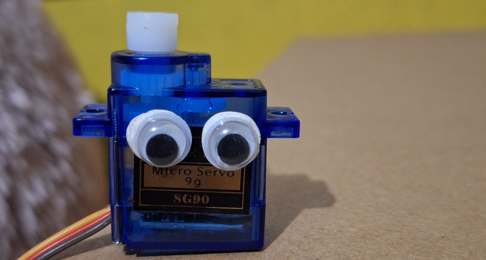
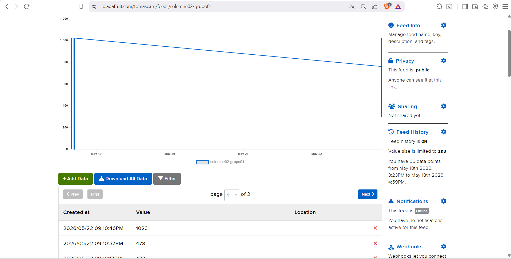

# sesion-10

lunes 18 mayo 2026

solemne 2

## avance solemne

En esta clase avanzamos para finalizar la solemne 2, nosotros ya habíamos probado el Raspberry Pi Pico 2 W antes de la clase y lo hicimos corriéndolo de manera local, sin llamar al feed y con otra visualización en la pantalla OLED Ya que yo tenía la placa, me puse a probar cómo funcionaba la pantalla con el potenciómetro.

No tuvimos problema alguno al realizar esta parte. Hicimos unos dibujos de prueba y se lo pedimos a la IA que sí podría animarlo en base al movimiento del potenciómetro, el resultado no nos gustó, por lo que más adelante en el proyecto lo cambiamos por un gatito espacial simplemente.

Anteriormente, era el servo que tenemos con ojos, pero simplificado a un cuadrado.

*Actualmente solo es el dibujo del gato, pero, como dije, esto pasó después de esta clase, pero lo aclaro ahora.*

**Con este tema listo**, ya avanzamos con los temas más técnicos; el trabajo grupal se dividió en:
* **Tomas** = Ve el tema de conexiones y código de la Raspberry Pi Pico 2 W.
* **Kiara** = Ve el tema de conexiones y código del Arduino R4 WiFi y el servomotor.
* **Angel** = Documenta todo el proceso y ayuda en caso de que alguno se atore.

Antes que todo, probamos el código que envió Mateo en la Raspberry y en el Arduino para comprobar que funcionara todo y, por suerte, todo sin problema. El código constaba de un botón a la Raspberry Pi que mandaba una señal al Adafruit y que esa señal a su vez la leía el Arduino desde la página y le daba la orden de activar el servomotor, el cual daba una vuelta completa hasta donde pudiera.

Por mi parte, no tuve problemas al realizar todas las conexiones del botón, potenciómetro con la Raspberry Pi; solo tuve un problema con las conexiones de la pantalla, ya que no me funcionaba. Intenté hasta ponerlo en otra protoboard y al final el problema fue que me equivoqué colocando los pines SCL y SDA. Pero en sí ya mandaba la señal al Adafruit.

*Usamos nuestro propio feed para no saturar el del profe y, ya que gracias a que usamos el botón para enviar la información, tampoco se nos saturó a nosotros.*

Para finalizar, Kiara logró hacer funcionar el servo junto al Arduino; tuvimos un problema con las bibliotecas, pero todo terminó funcionando.

En resumen, con el potenciómetro controlamos a dónde queremos que se mueva el servo, gracias a la pantalla sabemos hacia dónde se moverá también y, una vez elegido el movimiento, se presiona y manda el mensaje al Adafruit, el cual recibe la señal del potenciómetro y, a través de la web de Adafruit IO, lo lee el Arduino, el cual manda la señal leída del potenciómetro y lo convierte en movimiento para el servomotor.

