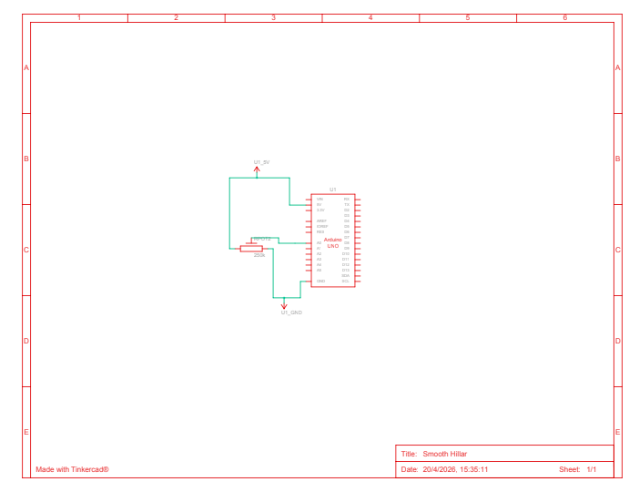
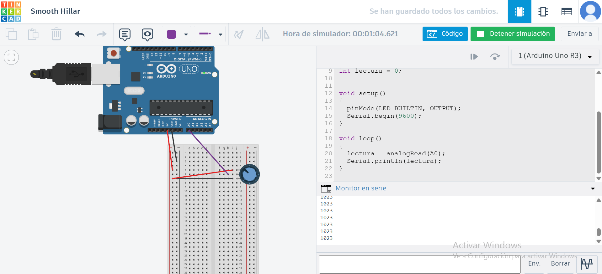
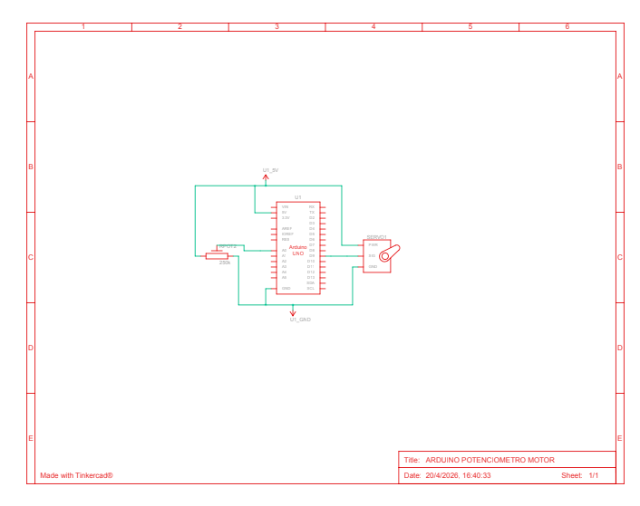
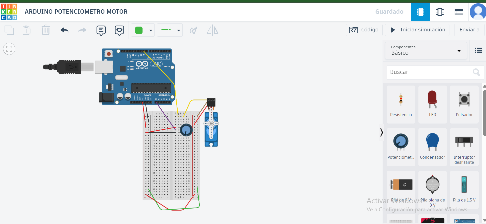
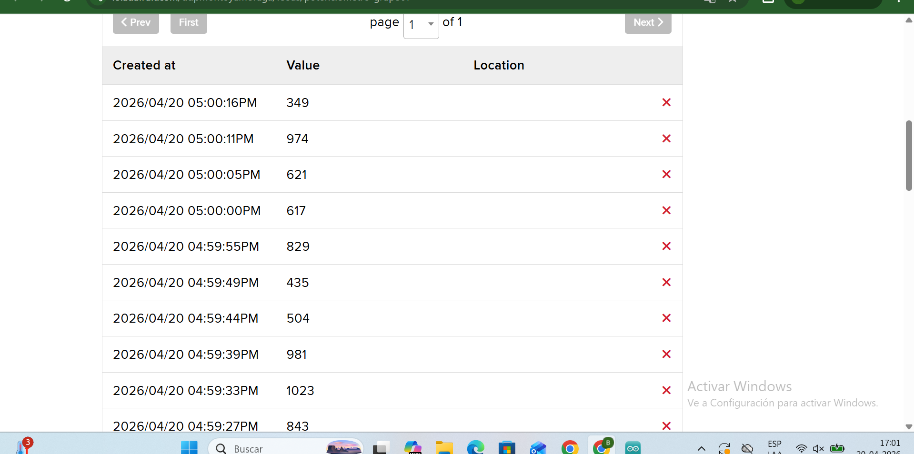
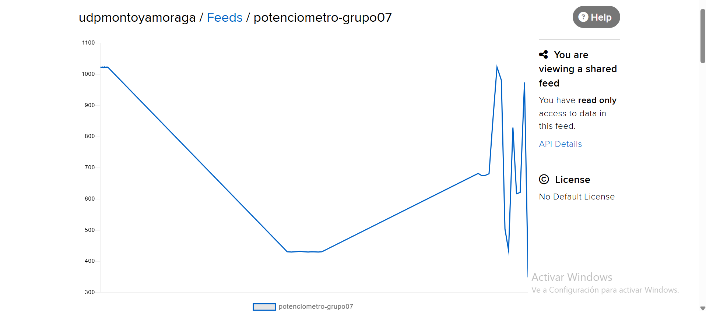

# sesion-07

lunes 20 abril 2026

(Elección de grupo)

### Grupo 07 - Benjamín Álvarez / Anays Cornejo

En esta clase trabajamos con sensores y motores usando Arduino. La idea era entender cómo tomar información del entorno (como luz o posición) y transformarla en alguna respuesta, como movimiento.

Se trabajó con entradas analógicas como el LDR y el potenciómetro. El LDR reacciona a la luz, mientras que el potenciómetro permite controlar valores manualmente girándolo.

### Potenciómetro:

Es un controlador manual de posición.

Tiene 3 patitas:

- Una a VCC
- Una a GND
- Una central de señal
- Se usa como entrada analógica.
- Para lectura se usa la patita central + una de los extremos (no ambos extremos juntos).

#### Extremos juntos - no varía

#### Medio + extremo - sí varía 

También usamos un servomotor, que responde a señales y permite controlar su movimiento en distintos ángulos.

### Servomotor:
- Rojo - alimentación
- Café/negro - tierra
- Amarillo - señal

Durante la clase se nos entregaron materiales nuevos que usamos en las pruebas:

- Potenciómetro B20k
- LDR
- Protoboard nueva
- Motor Micro Servo 9g

El trabajo se hizo tanto en físico como en simulación con Tinkercad, lo que ayudó a entender mejor cómo funcionaban los circuitos antes de armarlos.

### Trabajo en clases

1.

En este ejercicio usamos Tinkercad para probar un código y verificar el funcionamiento de un potenciómetro.




```cpp

// ejemplo lectura potenciometro

// queremos que nuestro Arduino
// sea capaz de leer un potenciometro
// conectado a la entrada A0.

int lectura = 0;


void setup()
{
  pinMode(LED_BUILTIN, OUTPUT);
  Serial.begin(9600);
}

void loop()
{
  lectura = analogRead(A0);
  Serial.println(lectura);
}
```
2.

En este ejercicio también trabajamos en Tinkercad, pero añadimos un servomotor para probar su funcionamiento junto al código.




```cpp

// ejemplo lectura potenciometro

// queremos que nuestro Arduino
// sea capaz de leer un potenciometro
// conectado a la entrada A0.


#include <Servo.h>


Servo miServo;

int lectura = 0;
int anguloActual = 0;
int anguloDeseado = 0;

bool saludar = false;


void setup()
{
  pinMode(9, OUTPUT);
  Serial.begin(9600);
  // en que patita esta conectado el servo
  // conectemos a patita 9 digital
  miServo.attach(9);
  
}

void loop()
{
  // leer
  lectura = analogRead(A0);
  
  // imprimir en consola
  Serial.println(lectura);
  
  
  // toma el valor de lectura
  // que va originalmente entre 0 y 1023
  // y mapealo al rango 0 a 180
  // anguloActual = map(lectura, 0, 1023, 0, 180);
  
  
  if (lectura > 700) {
    saludar = true;
  }
  else {
    saludar = false;
  }
  
  
  if (saludar) {
    // lo que pasa cuando hay que saludar
    moverLaManitoTimidamente();
  }
  else {
    // lo que pasa cuando NO :(
    meCohibi();
  } 
    
}


void moverLaManitoTimidamente() {
  
  if (anguloActual < 90 )
  {
    miServo.write(anguloActual);
    anguloActual++;
     // servo descansa un poquito
     // 15 milisegundos
     // la vida es dura
    delay(15);
  }
  

}


void meCohibi() {
  anguloActual--;
  miServo.write(anguloActual);
  delay(15);
}
```

3.

En este ejercicio pasamos al trabajo físico, enviando datos desde el circuito a Adafruit IO del profesor para visualizar la información en línea.






```cpp

#include <Servo.h>
#include <WiFiS3.h>
#include "Adafruit_MQTT.h"
#include "Adafruit_MQTT_Client.h"

// ── Credenciales ───────────────────────────────────────────
#define WIFI_SSID    "bla"
#define WIFI_PASS    "bla"
#define AIO_SERVER   "io.adafruit.com"
#define AIO_PORT     1883
#define AIO_USERNAME "udpmontoyamoraga"
#define AIO_KEY      "blabla"
#define AIO_FEED     AIO_USERNAME "/feeds/potenciometro-mateo"

#define INTERVALO_PUBLISH 500

Servo miServo;
WiFiClient wifiClient;
Adafruit_MQTT_Client mqtt(&wifiClient, AIO_SERVER, AIO_PORT, AIO_USERNAME, AIO_KEY);
Adafruit_MQTT_Publish feedPot(&mqtt, AIO_FEED);

int lecturaAnterior = -1;
unsigned long ultimoPublish = 0;

void conectarMQTT() {
  while (!mqtt.connected()) {
    Serial.print("Conectando a Adafruit IO...");
    int8_t ret = mqtt.connect();
    if (ret == 0) {
      Serial.println(" OK");
    } else {
      Serial.print(" Error: ");
      Serial.println(mqtt.connectErrorString(ret));
      mqtt.disconnect();
      delay(3000);
    }
  }
}

void setup() {
  Serial.begin(115200);
  miServo.attach(9);

  Serial.print("Conectando WiFi");
  WiFi.begin(WIFI_SSID, WIFI_PASS);
  while (WiFi.status() != WL_CONNECTED) {
    delay(500);
    Serial.print(".");
  }
  Serial.print(" IP: ");
  Serial.println(WiFi.localIP());
}

void loop() {
  conectarMQTT();
  mqtt.ping();

  int lectura = analogRead(A0);
  int angulo  = map(lectura, 0, 1023, 0, 180);
  miServo.write(angulo);

  unsigned long ahora = millis();
  if (lectura != lecturaAnterior && (ahora - ultimoPublish >= INTERVALO_PUBLISH)) {
    Serial.print("Publicando lectura: ");
    Serial.println(lectura);

    if (feedPot.publish((int32_t)lectura)) {
      Serial.println("  ✓ OK");
      lecturaAnterior = lectura;
      ultimoPublish   = ahora;
    } else {
      Serial.println("  ✗ Fallo");
    }
  }

  delay(15);
}

```

También agregamos un LDR para medir cambios de luz y enviar esa información al sistema.


