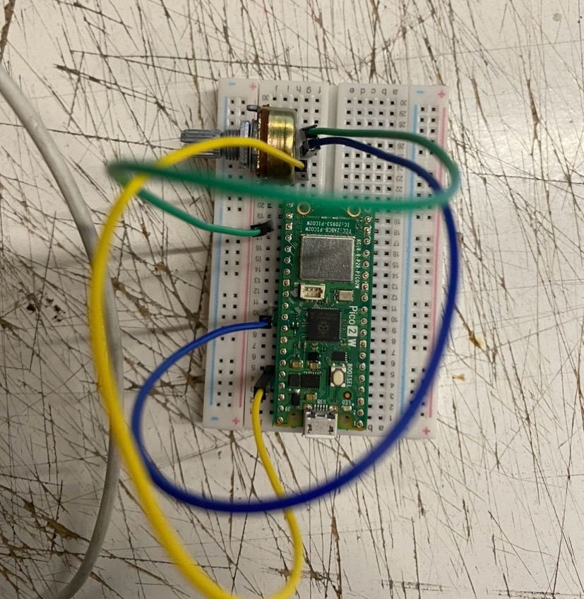

# sesion-10

lunes 18 mayo 2026

solemne 2

## Prueba, error y vuelta a empezar

Durante esta clase fue básicamente esto: intentar, que no funcionara, entender el por qué y volver a intentarlo. El objetivo era conectar la Raspberry Pi con Adafruit IO y que el Arduino recibiera esa información para hacer algo con ella. En nuestro caso, queríamos que un potenciómetro enviara datos desde la Raspberry al feed, y que el Arduino los usara para mover un servo.

Suena simple, pero no lo fue así del todo.

---

### Lo primero que falló: la conexión física

Antes de tocar el código, ya teníamos inconvenientes. El potenciómetro no estaba respondiendo como debía y tardamos un rato en darnos cuenta de que el problema no era el programa sino el circuito. Algunos cables no hacían buen contacto en la protoboard y los pines no estaban donde creíamos. Aarón nos ayudó a revisar las conexiones y ahí empezó a tener más sentido.



---

### Lo segundo que falló: PuTTY

La Raspberry tampoco estaba funcionando al inicio. Revisamos el código, revisamos Adafruit IO, revisamos la red — todo parecía estar bien. El problema resultó ser que no habíamos iniciado PuTTY correctamente. Una vez que lo configuramos bien, la conexión apareció.

Eso me hizo entender que este tipo de sistemas tienen muchas capas y todas tienen que estar activas al mismo tiempo para que algo funcione. No basta con que el código esté bien.

---

### Lo tercero que falló: saturamos Adafruit IO

Cuando por fin logramos que la Raspberry leyera el potenciómetro y publicara datos, nos bloquearon el feed. El potenciómetro entrega valores constantemente, y el código los estaba mandando todos sin ningún filtro ni pausa. Adafruit IO tiene un límite de frecuencia de envío, y lo alcanzamos rápido.

La solución era simple una vez que la entendimos: agregar un `delay` después de cada publicación para controlar el ritmo de envío.

```cpp
int valorPot = analogRead(A0);
potenciometroFeed->save(valorPot);
delay(1000);
```

Pero llegar a eso nos tomó un buen rato la verdad, porque primero había que entender qué estaba pasando y por qué.
---

### Lo que más ayudó: parar y darnos un mini break muy necesario

En algún momento durante la clase simplemente dejamos de insistir. Nos alejamos un momento, hablamos de otra cosa, nos reimos un rato y volvimos a seguir intendo. Casi siempre después de eso algo que antes no veíamos, aparece.

El método universal de Aarón también fue parte de esto: analizar el problema por partes, probar una cosa a la vez, no asumir que el error está donde uno cree. (gracias Aarón)


---

### Cierre

Al final de la clase logramos ver el sistema funcionando como un todo: la Raspberry leyendo el potenciómetro, Adafruit IO recibiendo los datos, y el Arduino transformando esa información en movimiento del servo. Verlo completo, aunque costó, si valió la pena. :)

Esta sesión fue frustrante en varios momentos sinceramente, pero creo que es donde más aprendí, sobre todo en compañia, porque cada error tuvo una explicación concreta y no solo "no funcionó". 
