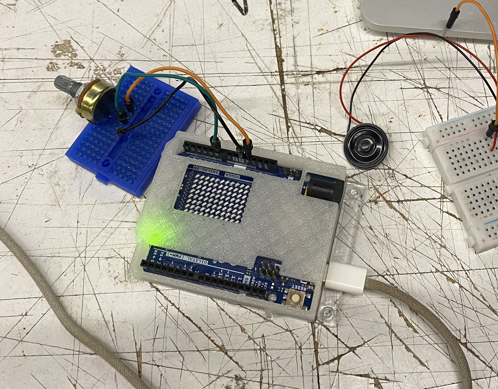
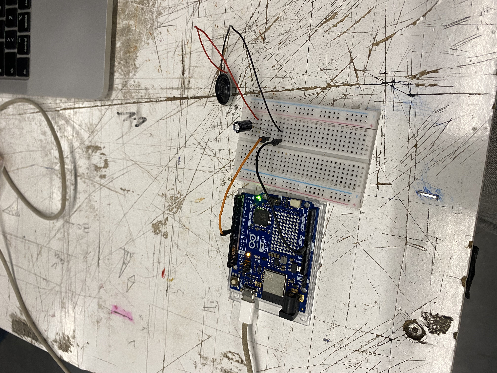

# sesion-05

lunes 06 abril 2026

solemne 1

---

Esta clase fue un poco caótica de mi parte porque mi placa estaba en coma, así que gran parte de la sesión la pasé intentando que funcionara, que Aaron la actualizara, Mateo también intentó y después Cami la arregló y arregló el de todos (genia).


## Adafruit IO

La clase estuvo centrada en conectar el Arduino a **Adafruit IO**, que es la plataforma en la nube que vamos a usar para enviar y recibir datos entre dispositivos. Básicamente es el intermediario entre el emisor y el receptor de nuestro proyecto.

Lo primero fue instalar la librería **Adafruit IO Arduino** desde el IDE y abrir el ejemplo `adafruitio_00_publish`, que sirve para enviar datos a la nube. El ejemplo hace lo más básico: conectarse a WiFi, conectarse a Adafruit IO, y mandar un número que va aumentando cada 3 segundos.

Aprendí que en Adafruit IO los datos se organizan en **feeds**, que son como variables online. Cada origen de datos tiene que tener su propio feed. Y para identificarte en la plataforma se usa una **AIO Key**, que es como una contraseña del proyecto y que no se puede subir a GitHub!!!!!!!! (va en un archivo `config.h` aparte).

Dos líneas que siempre van en el código:

```cpp
#define IO_USERNAME  "paredesvania"
#define IO_KEY       "secreto"
```

Y estas dos que van dentro del loop:

```cpp
io.run();          // mantiene la conexión activa
io.feed("nombredelfeed"); // referencia al feed donde se envían los datos
```

### Lo que logramos en grupo

Decidimos que queríamos hacer para nuestra solemne!!! Enviar un sonido y que un potenciómetro inalámbricamente pudiera cambiar el volumen de este.

Una vez que Cami arregló las placas, pudimos probar algunos códigos base para la solemne. Estuvimos experimentando con un potenciómetro conectado al Arduino y también con un pequeño parlante, queríamos aprender como conectarlo bien.





En esta clase nuestro compañero Felipe nos comentaba que no entendía como usar github, asi que le expliqué algunas cosas básicas del funcionamiento de este.
