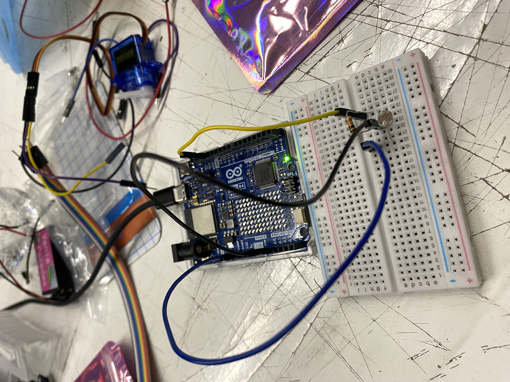

# sesion-07

lunes 20 abril 2026

solemne 2

---

`Grupo 06: Las papa — Parada y Paredes`

Hoy recibimos unboxing de regalos: una protoboard, un servomotor, un potenciómetro y un LDR. La idea era aprender a leer sensores analógicos y después mandar esa información a Adafruit IO.

---

## Materiales nuevos

### Servomotor

Tiene tres patitas y cada una cumple una función específica:

- Roja -> voltaje (5V)
- Negra -> GND
- Amarilla -> señal (por aquí le llega la instrucción de a qué ángulo moverse)

El servo solo necesita saber el ángulo. A diferencia de un motor normal que recibe velocidad, al servo le dices "ve a 90 grados" y va.

### Protoboard

Tiene muchos orificios organizados con letras, números, y líneas de positivo y negativo en los costados. Importante: el hemisferio derecho e izquierdo no se intercomunican entre sí. Lo que conectas en una columna, se repite en toda esa columna, pero no cruza al otro lado.

`En la Raspberry Pi se trabaja con 3.3V, no 5V como en Arduino.`

### Potenciómetro

Tiene 3 patitas. Siempre se usa la patita del centro y uno de los extremos, el centro es la salida analógica que lee el Arduino.

### LDR

Es un sensor cuya resistencia cambia según la cantidad de luz que recibe. Más luz -> menos resistencia. Menos luz -> más resistencia. El problema es que sus lecturas pueden fluctuar bastante con pequeñas variaciones del ambiente, lo que puede generar datos inestables si no se filtra antes de usarlos.

---

## En clase

### Código 1: leer el potenciómetro

Lo primero fue simplemente leer el valor del potenciómetro y mostrarlo en el monitor serial. El rango que entrega es de 0 a 1023.

```cpp
// queremos que nuestro Arduino
// sea capaz de leer un potenciometro
// conectado a la entrada A0.

int lectura = 0;

void setup()
{
  pinMode(LED_BUILTIN, OUTPUT);
  Serial.begin(9600);
}

void loop()
{
  lectura = analogRead(A0);
  Serial.println(lectura);
}
```

### Código 2: potenciómetro + servo

El problema acá era que el potenciómetro entrega valores entre 0 y 1023, pero el servo solo entiende ángulos de 0° a 180°. Para convertir un rango al otro se usa la función `map()`:

```cpp
angulo = map(lectura, 0, 1023, 0, 180);
```

Código completo:

```cpp
#include <Servo.h>

Servo miServo;

int lectura = 0;
int angulo = 0;

void setup()
{
  pinMode(9, OUTPUT);
  Serial.begin(9600);
  miServo.attach(9);
}

void loop()
{
  lectura = analogRead(A0);
  Serial.println(lectura);

  angulo = map(lectura, 0, 1023, 0, 180);
  miServo.write(angulo);

  delay(15);
}
```

Al mover el potenciómetro, el servo se movía a la par. El `delay(15)` es necesario para darle tiempo al motor a reaccionar, sin eso el movimiento no se ve fluido.


### Código 3

Mateo nos pasó una versión más elaborada donde en vez de mapear directo, el servo tiene dos comportamientos según si el valor del potenciómetro supera 700 o no: si supera 700, el servo sube lentamente hasta 90°, si no, vuelve hacia atrás.

```cpp
#include <Servo.h>

Servo miServo;

int lectura = 0;
int anguloActual = 0;
int anguloDeseado = 0;
bool saludar = false;

void setup()
{
  pinMode(9, OUTPUT);
  Serial.begin(9600);
  miServo.attach(9);
}

void loop()
{
  lectura = analogRead(A0);
  Serial.println(lectura);

  if (lectura > 700) {
    saludar = true;
  } else {
    saludar = false;
  }

  if (saludar) {
    moverLaManitoTimidamente();
  } else {
    meCohibi();
  }
}

void moverLaManitoTimidamente() {
  if (anguloActual < 90) {
    miServo.write(anguloActual);
    anguloActual++;
    delay(15);
  }
}

void meCohibi() {
  anguloActual--;
  miServo.write(anguloActual);
  delay(15);
}
```

---

## Adafruit IO

Una vez que el servo funcionaba localmente, el siguiente paso fue mandar los datos del potenciómetro a Adafruit IO para verlos en el feed. Mateo nos pasó el código base y le cambiamos las credenciales:

```cpp
#include <Servo.h>
#include <WiFiS3.h>
#include "Adafruit_MQTT.h"
#include "Adafruit_MQTT_Client.h"

#define WIFI_SSID    "iPhone de Vania"
#define WIFI_PASS    "dilt1234"
#define AIO_SERVER   "io.adafruit.com"
#define AIO_PORT     1883
#define AIO_USERNAME "udpmontoyamoraga"
#define AIO_KEY      "secreto"
#define AIO_FEED     AIO_USERNAME "/feeds/potenciometro-06"

#define INTERVALO_PUBLISH 5000

Servo miServo;
WiFiClient wifiClient;
Adafruit_MQTT_Client mqtt(&wifiClient, AIO_SERVER, AIO_PORT, AIO_USERNAME, AIO_KEY);
Adafruit_MQTT_Publish feedPot(&mqtt, AIO_FEED);

int lecturaAnterior = -1;
unsigned long ultimoPublish = 0;

void conectarMQTT() {
  while (!mqtt.connected()) {
    Serial.print("Conectando a Adafruit IO...");
    int8_t ret = mqtt.connect();
    if (ret == 0) {
      Serial.println(" OK");
    } else {
      Serial.print(" Error: ");
      Serial.println(mqtt.connectErrorString(ret));
      mqtt.disconnect();
      delay(3000);
    }
  }
}

void setup() {
  Serial.begin(115200);
  miServo.attach(9);

  Serial.print("Conectando WiFi");
  WiFi.begin(WIFI_SSID, WIFI_PASS);
  while (WiFi.status() != WL_CONNECTED) {
    delay(500);
    Serial.print(".");
  }
  Serial.println(WiFi.localIP());
}

void loop() {
  conectarMQTT();
  mqtt.ping();

  int lectura = analogRead(A0);
  int angulo  = map(lectura, 0, 1023, 0, 180);
  miServo.write(angulo);

  unsigned long ahora = millis();
  if (lectura != lecturaAnterior && (ahora - ultimoPublish >= INTERVALO_PUBLISH)) {
    Serial.print("Publicando lectura: ");
    Serial.println(lectura);
    if (feedPot.publish((int32_t)lectura)) {
      Serial.println("  ✓ OK");
      lecturaAnterior = lectura;
      ultimoPublish   = ahora;
    } else {
      Serial.println("  ✗ Fallo");
    }
  }
  delay(15);
}
```

El `INTERVALO_PUBLISH` lo pusimos en 5000 (5 segundos) en vez de 500, para no saturar el feed de Aaron. El plan gratuito de Adafruit solo permite 30 datos por minuto, así que hay que tener cuidado con eso.


---

## LDR reemplazando el potenciómetro

Al final de la clase probamos reemplazar el potenciómetro por el LDR. La
conexión cambia porque el LDR no tiene la misma estructura de 3 pines:

- Una patita del LDR -> 5V
- La otra patita del LDR -> pin A0 **y** a una resistencia de 10kΩ
- El otro extremo de la resistencia -> GND

Sin la resistencia de 10kΩ el pin A0 queda flotando cuando hay mucha luz y los valores no tienen sentido.




---

## Apunte sobre Tinkercad

Aaron también nos mostró **Tinkercad**, que es un simulador de circuitos online donde puedes probar conexiones y código sin necesidad de tener los componentes físicos. 

<https://www.tinkercad.com/>

---

## Referencias

- Arduino – Referencia Servo: <https://www.arduino.cc/en/Reference/Servo>
- Arduino – Servo motors: <https://docs.arduino.cc/learn/electronics/servo-motors/>
- Adafruit – Cómo conectar un LDR: <https://learn.adafruit.com/photocells/using-a-photocell>
- Adafruit IO – MQTT: <https://io.adafruit.com/api/docs/mqtt.html>
- Tinkercad: <https://www.tinkercad.com/>
