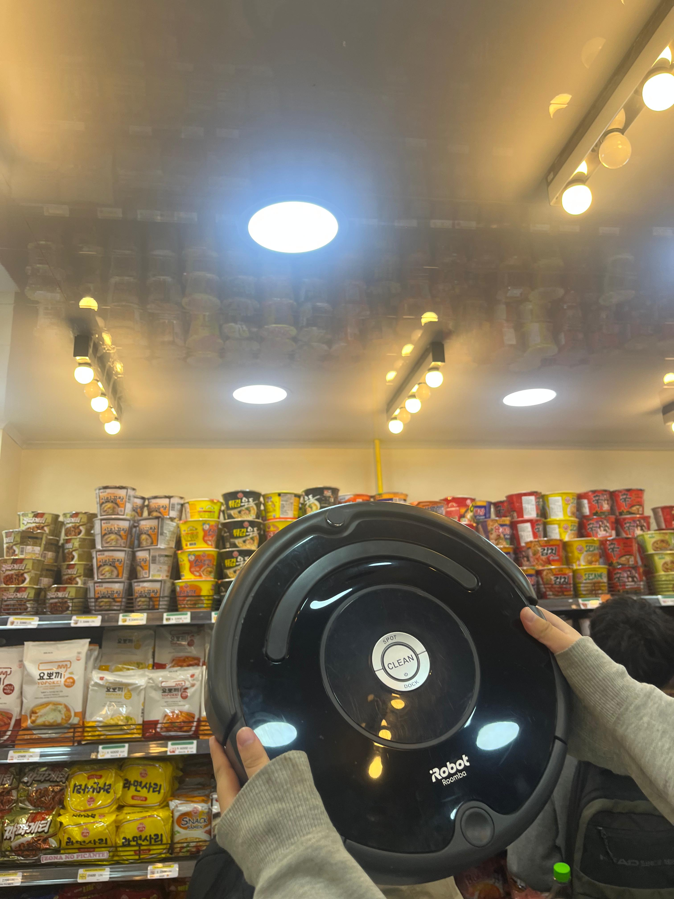
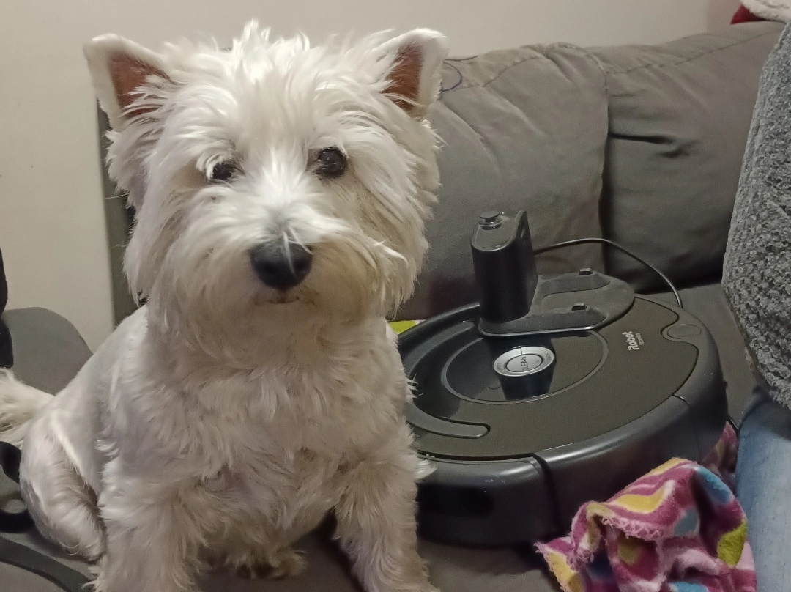

# sesion-10

# Apuntes clase 18/05

> Toda la información que está acá se puede ver más a detalle en la carpeta de solemne 02, grupo 05.

Esta clase fue dedicada a trabajo en clases para la solemne 2, en donde con mi grupo probamos códigos que hice en mi casa e hicimos cambios ya que no pude probarlos yo solo en mi hogar por la falta de otro computador para poder controlar las dos placas. Cuando probamos los códigos, la verdad no fue sorpresa que no funcionaran.

En esta clase estuvimos tratando de hacer funcionar el filtrado de información mediante un botón, el cual queríamos que solo cuando lo mantengamos presionado envíe la información que provoca el potenciómetro, para así no saturar el Adafruit de Aarón durante la presentación. Para poder lograr esto, durante clases estuvimos pidiendo ayuda tanto a Aarón como a Mateo para que nos ayuden a solucionar que funcione el botón como "push down", razón por la cual Mateo estuvo con nosotros de manera constante ayudando con los códigos que tenían cosas dudosas (por mi culpa, por mi gran culpa) y finalmente decidimos el reiniciar la Raspberry y probar el código que mandó Mateo por discord para lograr identificar si un botón realmente está enviando información.

El código fue el siguiente:

```cpp
import time
import board
import digitalio
import wifi
import socketpool
import adafruit_minimqtt.adafruit_minimqtt as MQTT

print("Iniciando programa...")

# -------------------------
# WiFi
# -------------------------
SSID = "wifi"
PASSWORD = "contraseñawifi"

print("Conectando WiFi...")

try:
    wifi.radio.connect(SSID, PASSWORD)
    print("WiFi conectado")
    print("IP:", wifi.radio.ipv4_address)

except Exception as e:
    print("Error WiFi:")
    print(e)

    while True:
        pass


# -------------------------
# Adafruit IO
# -------------------------
AIO_USERNAME = "udpmontoyamoraga"
AIO_KEY = "keydeaarón"

FEED_BOTON = AIO_USERNAME + "/feeds/potenciometro-05"

print("Creando conexión MQTT...")

pool = socketpool.SocketPool(wifi.radio)

mqtt = MQTT.MQTT(
    broker="io.adafruit.com",
    username=AIO_USERNAME,
    password=AIO_KEY,
    socket_pool=pool,
)

print("Conectando a Adafruit IO...")

try:
    mqtt.connect()
    print("Conectado a Adafruit IO")

except Exception as e:
    print("Error MQTT:")
    print(e)

    while True:
        pass


# -------------------------
# Botón GP0
# -------------------------
boton = digitalio.DigitalInOut(board.GP0)
boton.direction = digitalio.Direction.INPUT
boton.pull = digitalio.Pull.UP

estado_anterior = True

print("Sistema listo")

# -------------------------
# Loop principal
# -------------------------
while True:

    try:
        mqtt.loop()

        estado_actual = boton.value

        # Detecta transición:
        # sin presionar -> presionado
        if estado_anterior and not estado_actual:

            print("Botón presionado")
            print("Enviando impulso...")

            mqtt.publish(FEED_BOTON, "1")

            print("Impulso enviado")

            # anti-rebote
            time.sleep(0.25)

        estado_anterior = estado_actual

    except Exception as e:
        print("Error:")
        print(e)

    time.sleep(0.02)
```

Luego de probar el código, nos dimos cuenta de que en realidad el botón no estaba funcionando hasta que llegó Aarón e intercambió los pins a los que estaba conectado el botón (de ``GP0`` y ``3V3`` a ``GP0`` y ``GND``) y finalmente funcionó el botón (yeyyy).

Luego de lograr superar la lucha con los botones, probamos nuevamente el código original en donde se inicluye el potenciómetro, logramos que se moviera el servo!! fue un muy buen día (aunque no teníamos idea de que un día después iba a dejar de funcionar LOL).

---

# UPDATE ROBOTINA!!!

Hace unas semanas atras, me entregaron la custodia de la Robotina y quiero informar que está a salvo en su nuevo hogar junto con su nuevo hermano Mailo. El día en el que me llevé la Robotina fue justo un día en el que me tuve que ir tarde de la universidad, razón por la que salí con mucha hambre y con mi amiga Josefa Araya decidimos pasar al Hansik de República, ya que es uno de los pocos lugares en donde venden comida vegana. Gracias a ésto, Robotina tuvo su primera visita a un Hansik!!



Cuando ya terminamos de comer, con Robotina nos tuvimos que pasear por L1, L5 y L4 para lograr llegar a su nuevo hogar en donde conoció por primera vez a su hermano Mailo. Me alegra decir que se llevar realmente bien, y que cuando Robotina pasa cerca del Mailo él le mueve la cola y la empieza a seguir lentamente por detrás hasta que Robotina se da la vuelta y Mailo sale corriendo.

Aquí una foto de su primer encuentro.



Una vez más, quiero agradecer a Aarón ya que Robotina ha sido una gran ayuda en nuestro hogar. La primera reacción de mi mamá cuando la vio fue reírse y decir que ahora somos comos las casas en donde ella trabaja (asumo que en esas casas tienen sus propias robotinas) lo cual me causó mucha gracia. Muchas gracias a Aarón tanto por parte de mí como de mi madre (y del Mailo también probablemente).
