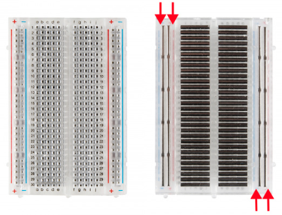
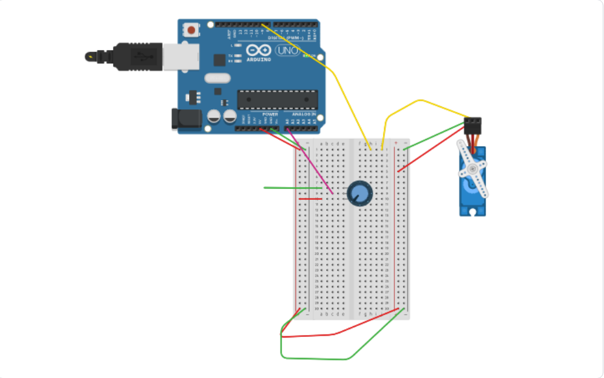

# sesion-07

lunes 20 abril 2026

Se definieron los gruppos de la solemne dos
Debora
Josefa
Cristobal

Luego se entregaron los siguientes materiales para trabajar la base de la solemne:
Servo
Protoboard
Cables
Potenciometro 
Ldr

---
Luego vimos una parte de teoría, partiendo con como funciona una protoboard o breadboard (leí que le decían así por qué antiguamente se utilizaban tablas para cortar pan como bases para los circuitos de forma casera) que tiene como gracia armar circuitos temporales sin que sea necesario soldar.
En el centro de la protoboard, donde se ponen los componentes, los agujeros están conectados en filas horizontales, de 5 en 5. Por ejemplo, el 1a, 1c, y 1e, estan en la misma línea interna por lo que el componente que se conectará eléctricamente a cualquier otro colocado en esa fila

Además en los bordes están los rieles de alimentación, uno negativo y otro positivo, estas por dentro tienen las mismas barritas que las del centro pero en vertical. Te permiten acceder fácilmente a la energía en cualquier lugar del circuito, pero los que están a la izquierda no se conectan con los de la derecha, pero se pueden conectar con un cable 



Negativo suele usar un cable negro
Positivo suele usar un cable rojo

----
Despues se hicieron ejercicios aplicando los nuevos materiales que nos brindaron


## Ejepmplos
```
// ejemplo lectura potenciometro

// queremos que nuestro Arduino
// sea capaz de leer un potenciometro
// conectado a la entrada A0.

int lectura = 0;


void setup()
{
  pinMode(LED_BUILTIN, OUTPUT);
  Serial.begin(9600);
}

void loop()
{
  lectura = analogRead(A0);
  Serial.println(lectura);
}

```

----

Con Servo
```

// ejemplo lectura potenciometro

// queremos que nuestro Arduino
// sea capaz de leer un potenciometro
// conectado a la entrada A0.


#include <Servo.h>


Servo miServo;

int lectura = 0;
int angulo = 0;


void setup()
{
  pinMode(9, OUTPUT);
  Serial.begin(9600);
  // en que patita esta conectado el servo
  // conectemos a patita 9 digital
  miServo.attach(9);
  
}

void loop()
{
  // leer
  lectura = analogRead(A0);
  
  // imprimir en consola
  Serial.println(lectura);
  
  
  // toma el valor de lectura
  // que va originalmente entre 0 y 1023
  // y mapealo al rango 0 a 180
  angulo = map(lectura, 0, 1023, 0, 180);
    
  // pidele por favor al servo
  // que vaya a ese angulo
  miServo.write(angulo);
  
  // servo descansa un poquito
  // 15 milisegundos
  // la vida es dura
  delay(15);
    
}

```
----

```
// ejemplo lectura potenciometro

// queremos que nuestro Arduino
// sea capaz de leer un potenciometro
// conectado a la entrada A0.


#include <Servo.h>


Servo miServo;

int lectura = 0;
int anguloActual = 0;
int anguloDeseado = 0;

bool saludar = false;


void setup()
{
  pinMode(9, OUTPUT);
  Serial.begin(9600);
  // en que patita esta conectado el servo
  // conectemos a patita 9 digital
  miServo.attach(9);
  
}

void loop()
{
  // leer
  lectura = analogRead(A0);
  
  // imprimir en consola
  Serial.println(lectura);
  
  
  // toma el valor de lectura
  // que va originalmente entre 0 y 1023
  // y mapealo al rango 0 a 180
  // anguloActual = map(lectura, 0, 1023, 0, 180);
  
  
  if (lectura > 700) {
    saludar = true;
  }
  else {
    saludar = false;
  }
  
  
  if (saludar) {
    // lo que pasa cuando hay que saludar
    moverLaManitoTimidamente();
  }
  else {
    // lo que pasa cuando NO :(
    meCohibi();
  } 
    
}


void moverLaManitoTimidamente() {
  
  if (anguloActual < 90 )
  {
    miServo.write(anguloActual);
    anguloActual++;
     // servo descansa un poquito
     // 15 milisegundos
     // la vida es dura
    delay(15);
  }
  

}


void meCohibi() {
  anguloActual--;
  miServo.write(anguloActual);
  delay(15);
}
```
----
Subir a la nube servo y potenciometro con raspberry
```
#include <Servo.h>
#include <WiFiS3.h>
#include "Adafruit_MQTT.h"
#include "Adafruit_MQTT_Client.h"

// ── Credenciales ───────────────────────────────────────────
#define WIFI_SSID    "bla"
#define WIFI_PASS    "bla"
#define AIO_SERVER   "io.adafruit.com"
#define AIO_PORT     1883
#define AIO_USERNAME ""
#define AIO_KEY      ""
#define AIO_FEED     AIO_USERNAME "/feeds/potenciometro-mateo"

#define INTERVALO_PUBLISH 500

Servo miServo;
WiFiClient wifiClient;
Adafruit_MQTT_Client mqtt(&wifiClient, AIO_SERVER, AIO_PORT, AIO_USERNAME, AIO_KEY);
Adafruit_MQTT_Publish feedPot(&mqtt, AIO_FEED);

int lecturaAnterior = -1;
unsigned long ultimoPublish = 0;

void conectarMQTT() {
  while (!mqtt.connected()) {
    Serial.print("Conectando a Adafruit IO...");
    int8_t ret = mqtt.connect();
    if (ret == 0) {
      Serial.println(" OK");
    } else {
      Serial.print(" Error: ");
      Serial.println(mqtt.connectErrorString(ret));
      mqtt.disconnect();
      delay(3000);
    }
  }
}

void setup() {
  Serial.begin(115200);
  miServo.attach(9);

  Serial.print("Conectando WiFi");
  WiFi.begin(WIFI_SSID, WIFI_PASS);
  while (WiFi.status() != WL_CONNECTED) {
    delay(500);
    Serial.print(".");
  }
  Serial.print(" IP: ");
  Serial.println(WiFi.localIP());
}

void loop() {
  conectarMQTT();
  mqtt.ping();

  int lectura = analogRead(A0);
  int angulo  = map(lectura, 0, 1023, 0, 180);
  miServo.write(angulo);

  unsigned long ahora = millis();
  if (lectura != lecturaAnterior && (ahora - ultimoPublish >= INTERVALO_PUBLISH)) {
    Serial.print("Publicando lectura: ");
    Serial.println(lectura);

    if (feedPot.publish((int32_t)lectura)) {
      Serial.println("  ✓ OK");
      lecturaAnterior = lectura;
      ultimoPublish   = ahora;
    } else {
      Serial.println("  ✗ Fallo");
    }
  }

  delay(15);
}
```

Resultado del ultimo ejemplo


