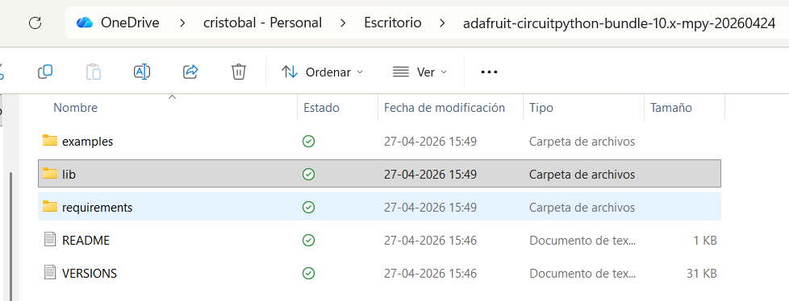
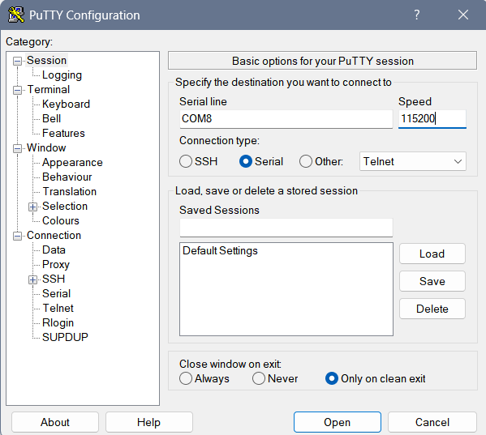
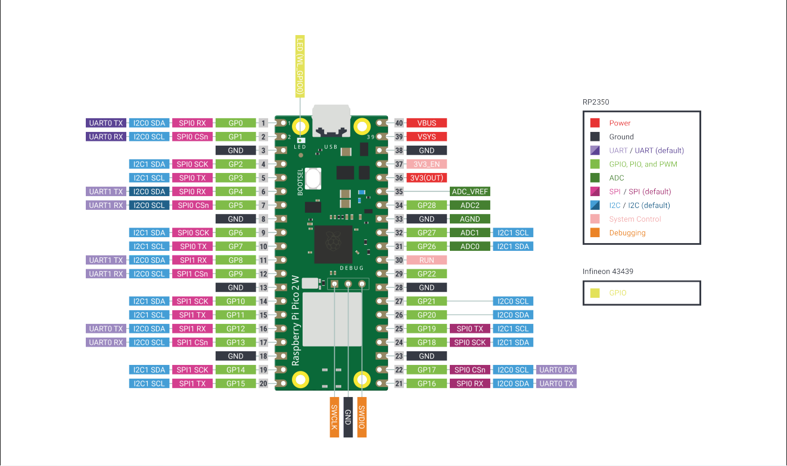
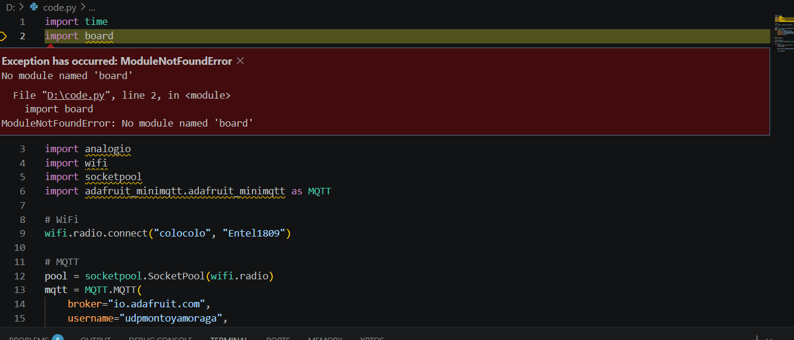
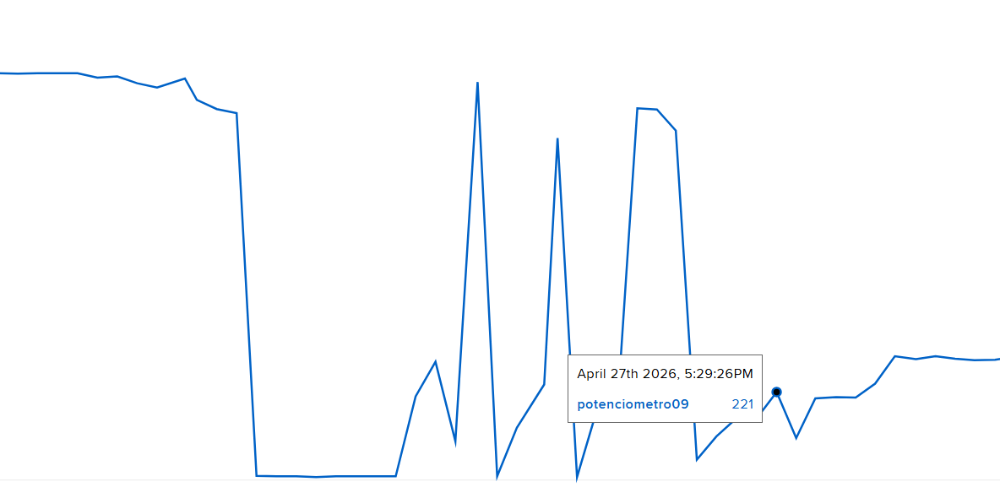

# sesion-08

lunes 27 abril 2026

Nos vemos a la vuelta del receso.


### Python
Es un lenguaje de programación ampliamente utilizado en las aplicaciones web, el desarrollo de software, la ciencia de datos y el machine learning (ML). Se puede descargar gratis, se integra bien a todos los tipos de sistemas y aumenta la velocidad del desarrollo.

### MicroPython
Python, pero optimizado para correr en microcontroladores pequeños, como el ESP32 o la Raspberry Pi Pico. Es casi igual, pero no tiene todas las librerías, se instala en el chip y listo.

### CircuitPython
Creado por Adafruit. Está pensado específicamente para sus placas y la idea es que sea de fácil uso. Como se usa? Hay que borrar el Firmware cuando conectás la placa a tu PC, aparece como una carpeta USB, y ahí guardás el archivo code.py ahí adentro y va a correr. 
(Solo corre el que dice code.pi)

En nuestro caso vamos a utilizar CircuitPhyton en la Raspberry Pi Pico 2W, por lo que primero buscamos a la raspberry en archivos luego de conectarla y se remplaza el firmware por el archivo que descargamos, CircuitPython 10.2.0



Luego utilizaremos Putty que se conecta a la placa vía puerto serial (COM) y te da acceso al REPL.



Circuit Playground  sirve para textil.

---

### Voltajes
v_cc: "Voltaje de alimentación positivo".
3.3v: El voltaje que usan la mayoría de los microcontroladores modernos.
5.0v: Es el voltaje clásico.

---

### Potenciómetro
Resistencia ajustable a través de una perilla, se conecta a un pin analógico.
El potenciómetro necesita 3 cables.

Raspberry pi pico 2w pinout. 



3v3 
v voltaje, pero como está entre dos números cuenta como decimal

ADC0
c= conversor
A =análogo
d=digital

---

### Proceso
Conectamos la Raspberry Pi Pico 2W a Adafruit luego de remplazarle el firmware.

```
import time
import board
import analogio
import wifi
import socketpool
import adafruit_minimqtt.adafruit_minimqtt as MQTT

# WiFi
wifi.radio.connect("NOMBREWIFI", "CLAVEWIFI")

# MQTT
pool = socketpool.SocketPool(wifi.radio)
mqtt = MQTT.MQTT(
    broker="io.adafruit.com",
    username="",
    password="",
    socket_pool=pool,
)

mqtt.connect()

# Potentiometer
pot = analogio.AnalogIn(board.A0)

while True:
    value = pot.value * 1023 // 65535
    print(value)

    mqtt.publish("udpmontoyamoraga/feeds/potenciometro", str(value))

    time.sleep(5)
```






